# Design Document: Agent Schema Update

## Overview

This design describes the migration of 10 Kiro agent configuration files from the legacy schema to the new schema format. The migration involves:

1. Adding JSON schema references for IDE validation
2. Replacing deprecated `includeMcpJson` with `useLegacyMcpJson`
3. Adding keyboard shortcuts for quick agent switching
4. Adding welcome messages for context when activating agents
5. Updating MCP server configurations with OAuth cache directories

The migration is a batch update operation that transforms each agent configuration file while preserving all existing functionality.

## Architecture

```mermaid
flowchart TD
    subgraph Input["Current Agent Configs"]
        A1[backend-engineer.json]
        A2[frontend-engineer.json]
        A3[fullstack-engineer.json]
        A4[devops-engineer.json]
        A5[qa-engineer.json]
        A6[security-engineer.json]
        A7[data-analyst.json]
        A8[i18n-engineer.json]
        A9[livestock-specialist.json]
        A10[product-architect.json]
    end

    subgraph Transform["Migration Operations"]
        T1[Add $schema field]
        T2[Rename includeMcpJson → useLegacyMcpJson]
        T3[Add keyboardShortcut]
        T4[Add welcomeMessage]
        T5[Update MCP cache dirs]
    end

    subgraph Output["Updated Agent Configs"]
        O1[backend-engineer.json ✓]
        O2[frontend-engineer.json ✓]
        O3[fullstack-engineer.json ✓]
        O4[devops-engineer.json ✓]
        O5[qa-engineer.json ✓]
        O6[security-engineer.json ✓]
        O7[data-analyst.json ✓]
        O8[i18n-engineer.json ✓]
        O9[livestock-specialist.json ✓]
        O10[product-architect.json ✓]
    end

    Input --> Transform --> Output
```



## Components and Interfaces

### Agent Configuration Schema

The new agent configuration schema includes these fields:

```typescript
interface AgentConfiguration {
  // Schema reference (NEW - required)
  $schema?: string

  // Core fields (existing)
  name: string
  description: string
  prompt: string

  // Tool configuration (existing)
  tools?: string[]
  allowedTools?: string[]
  toolAliases?: Record<string, string>
  toolsSettings?: Record<string, ToolSettings>

  // Resources (existing)
  resources?: string[]

  // MCP configuration (existing + updated)
  mcpServers?: Record<string, McpServerConfig>
  useLegacyMcpJson?: boolean // Replaces includeMcpJson

  // Hooks (existing)
  hooks?: HooksConfiguration

  // Model selection (existing)
  model?: string

  // UX features (NEW)
  keyboardShortcut?: string
  welcomeMessage?: string
}

interface McpServerConfig {
  command: string
  args: string[]
  disabled?: boolean
  autoApprove?: string[]
}

interface HooksConfiguration {
  agentSpawn?: HookCommand[]
  postToolUse?: PostToolUseHook[]
}

interface HookCommand {
  command: string
  timeout_ms: number
}

interface PostToolUseHook extends HookCommand {
  matcher: string
}
```

### Migration Mapping

| Agent                | Keyboard Shortcut | Welcome Message                                                                                              |
| -------------------- | ----------------- | ------------------------------------------------------------------------------------------------------------ |
| backend-engineer     | ctrl+shift+1      | 🔧 Backend Engineer ready. I handle server functions, Kysely queries, and Cloudflare Workers patterns.       |
| frontend-engineer    | ctrl+shift+2      | 🎨 Frontend Engineer ready. I build React components, TanStack Router pages, and PWA features.               |
| fullstack-engineer   | ctrl+shift+3      | 🚀 Fullstack Engineer ready. I handle end-to-end features from database to UI.                               |
| devops-engineer      | ctrl+shift+4      | 🛠️ DevOps Engineer ready. I manage Cloudflare deployments, secrets, and infrastructure.                      |
| qa-engineer          | ctrl+shift+5      | 🧪 QA Engineer ready. I write property tests, unit tests, and integration tests.                             |
| security-engineer    | ctrl+shift+6      | 🔐 Security Engineer ready. I audit auth, validate inputs, and protect user data.                            |
| data-analyst         | ctrl+shift+7      | 📊 Data Analyst ready. I analyze batch performance, forecast growth, and generate reports.                   |
| i18n-engineer        | ctrl+shift+8      | 🌍 i18n Engineer ready. I maintain translations across 15 languages.                                         |
| livestock-specialist | ctrl+shift+9      | 🐔 Livestock Specialist ready. I provide domain expertise for poultry, fish, cattle, goats, sheep, and bees. |
| product-architect    | ctrl+shift+0      | 📐 Product Architect ready. I organize routes, features, and enforce batch-centric design.                   |

### MCP Server Cache Directory Pattern

For OAuth-based MCP servers, the cache directory pattern is:

```
${HOME}/.mcp-cache/{server-name}
```

Example configurations:

```json
{
  "neon": {
    "command": "bunx",
    "args": [
      "mcp-remote",
      "https://mcp.neon.tech/mcp",
      "3334",
      "--cache-dir",
      "${HOME}/.mcp-cache/neon"
    ]
  },
  "cloudflare-bindings": {
    "command": "bunx",
    "args": [
      "mcp-remote",
      "https://bindings.mcp.cloudflare.com/mcp",
      "3335",
      "--cache-dir",
      "${HOME}/.mcp-cache/cloudflare-bindings"
    ]
  }
}
```

## Data Models

### Current Agent State Analysis

| Agent                | Has includeMcpJson | Value | Has Inline MCP | MCP Servers             |
| -------------------- | ------------------ | ----- | -------------- | ----------------------- |
| backend-engineer     | ✓                  | false | ✓              | neon                    |
| data-analyst         | ✓                  | false | ✓              | neon                    |
| devops-engineer      | ✓                  | false | ✓              | neon, cloudflare-\* (4) |
| frontend-engineer    | ✗                  | -     | ✗              | -                       |
| fullstack-engineer   | ✓                  | true  | ✗              | -                       |
| i18n-engineer        | ✗                  | -     | ✗              | -                       |
| livestock-specialist | ✓                  | false | ✓              | neon                    |
| product-architect    | ✓                  | true  | ✗              | -                       |
| qa-engineer          | ✓                  | true  | ✗              | -                       |
| security-engineer    | ✗                  | -     | ✗              | -                       |

### Field Ordering Convention

The updated agent configuration files will follow this field order:

1. `$schema` - Schema reference
2. `name` - Agent identifier
3. `description` - User-facing description
4. `keyboardShortcut` - Quick switch shortcut
5. `welcomeMessage` - Activation greeting
6. `prompt` - System prompt
7. `tools` - Available tools
8. `allowedTools` - Explicitly allowed tools
9. `toolsSettings` - Tool-specific settings
10. `resources` - Files/knowledge bases
11. `hooks` - Event hooks
12. `useLegacyMcpJson` - Legacy MCP inheritance (if applicable)
13. `mcpServers` - Inline MCP configurations (if applicable)
14. `model` - Model selection

## Correctness Properties

_A property is a characteristic or behavior that should hold true across all valid executions of a system—essentially, a formal statement about what the system should do. Properties serve as the bridge between human-readable specifications and machine-verifiable correctness guarantees._

### Property 1: Schema Field Presence and Validity

_For any_ updated agent configuration file, the `$schema` field SHALL exist and contain a valid URL string referencing the Kiro agent schema.

**Validates: Requirements 1.1, 1.2**

### Property 2: Deprecated Field Migration Correctness

_For any_ agent configuration that had an `includeMcpJson` field before migration, after migration:

- The `includeMcpJson` field SHALL NOT exist
- The `useLegacyMcpJson` field SHALL exist with the same boolean value as the original `includeMcpJson`

_For any_ agent configuration that did NOT have an `includeMcpJson` field before migration, after migration the `useLegacyMcpJson` field SHALL NOT exist.

**Validates: Requirements 2.1, 2.2, 2.3, 2.4**

### Property 3: Keyboard Shortcut Validity and Uniqueness

_For any_ set of updated agent configurations:

- Each configuration SHALL have a `keyboardShortcut` field
- Each shortcut SHALL match the pattern `ctrl+shift+[0-9]`
- No two agents SHALL have the same keyboard shortcut value

**Validates: Requirements 3.1, 3.2, 3.3**

### Property 4: Welcome Message Format Validity

_For any_ updated agent configuration:

- The `welcomeMessage` field SHALL exist
- The message SHALL start with an emoji character (Unicode emoji range)
- The message length SHALL be less than 200 characters (conciseness constraint)

**Validates: Requirements 4.1, 4.3, 4.4**

### Property 5: Configuration Completeness and Validity

_For any_ updated agent configuration file:

- The file SHALL be valid JSON (parseable without errors)
- The configuration SHALL contain required fields: `name`, `description`, `prompt`
- The configuration SHALL NOT contain the deprecated `includeMcpJson` field

**Validates: Requirements 5.1, 5.2, 5.3**

### Property 6: Field Preservation Invariant

_For any_ agent configuration, the following fields SHALL be identical before and after migration:

- `name`
- `description`
- `prompt`
- `tools`
- `allowedTools`
- `toolsSettings`
- `resources`
- `hooks`
- `model`

**Validates: Requirements 6.1, 6.2, 6.3, 6.4, 6.5, 6.6, 6.7, 6.8**

### Property 7: MCP Server Configuration Correctness

_For any_ agent configuration with inline `mcpServers`:

- Each MCP server SHALL use `bunx` as the command
- Each MCP server's args SHALL include `mcp-remote`
- Each MCP server's args SHALL include `--cache-dir` with a valid path pattern
- OAuth-based servers SHALL use their correct endpoint URLs

**Validates: Requirements 7.1, 7.2, 7.4, 7.5**

## Error Handling

### Invalid JSON

If an agent configuration file contains invalid JSON:

- Log the file path and parse error
- Skip the file and continue with other agents
- Report the error in the final summary

### Missing Required Fields

If an agent configuration is missing required fields after migration:

- Log the missing field names
- The migration should not remove required fields, so this indicates a bug

### Duplicate Keyboard Shortcuts

If two agents would have the same keyboard shortcut:

- This is a configuration error in the migration mapping
- Should be caught during implementation review

### MCP Server Configuration Errors

If an MCP server configuration is malformed:

- Preserve the original configuration
- Log a warning about the malformed config
- Do not add cache-dir to malformed configs

## Testing Strategy

### Unit Tests

Unit tests verify individual transformation functions:

1. **Schema field insertion**: Test that $schema is added correctly
2. **Field renaming**: Test includeMcpJson → useLegacyMcpJson transformation
3. **Keyboard shortcut assignment**: Test correct shortcut per agent name
4. **Welcome message assignment**: Test correct message per agent name
5. **MCP cache-dir addition**: Test args array modification

### Property-Based Tests

Property tests verify invariants across all configurations using fast-check:

1. **Property 1 test**: Generate agent configs, verify schema field after migration
2. **Property 2 test**: Generate configs with/without includeMcpJson, verify correct transformation
3. **Property 3 test**: Verify all shortcuts are unique and match pattern
4. **Property 4 test**: Verify all welcome messages meet format requirements
5. **Property 5 test**: Parse all migrated configs, verify validity
6. **Property 6 test**: Compare preserved fields before/after migration
7. **Property 7 test**: Verify MCP server configs have required structure

### Integration Tests

Integration tests verify the complete migration:

1. **Full migration test**: Run migration on all 10 agents, verify all pass validation
2. **Idempotency test**: Run migration twice, verify second run produces identical output
3. **File system test**: Verify files are written correctly to `.kiro/agents/`

### Test Configuration

- Property tests: Minimum 100 iterations per property
- Test framework: Vitest with fast-check
- Tag format: **Feature: agent-schema-update, Property {number}: {property_text}**
