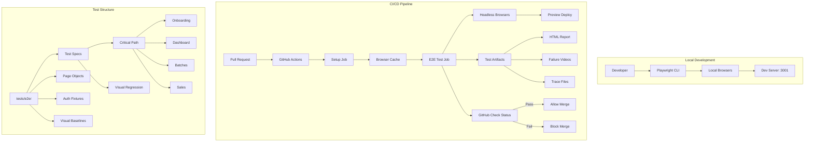
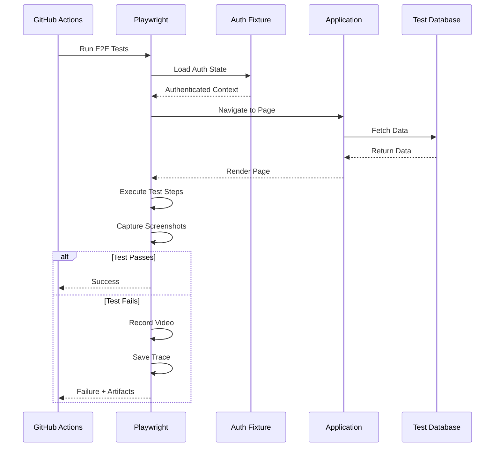

# Design Document: Automated QA Pipeline

## Overview

The Automated QA Pipeline implements a comprehensive End-to-End testing infrastructure using Playwright for browser automation, integrated with GitHub Actions for continuous integration. The system provides visual regression testing, authentication fixtures, and page object patterns to ensure critical user flows remain functional across all code changes.

The design prioritizes:

- **Fast feedback loops** - Parallel test execution and browser caching
- **Maintainability** - Page Object Model for centralized selectors
- **Debugging ease** - Videos, traces, and HTML reports on failures
- **CI/CD integration** - PR blocking on critical path failures

## Architecture



### Test Execution Flow



## Components and Interfaces

### 1. Playwright Configuration

```typescript
// playwright.config.ts
import { defineConfig, devices } from '@playwright/test'

export default defineConfig({
  testDir: './tests/e2e',
  fullyParallel: true,
  forbidOnly: !!process.env.CI,
  retries: process.env.CI ? 2 : 0,
  workers: process.env.CI ? 4 : undefined,
  reporter: [
    ['html', { open: 'never' }],
    ['json', { outputFile: 'test-results/results.json' }],
    process.env.CI ? ['github'] : ['list'],
  ],

  use: {
    baseURL: process.env.E2E_BASE_URL || 'http://localhost:3001',
    trace: 'on-first-retry',
    video: 'on-first-retry',
    screenshot: 'only-on-failure',
  },

  projects: [
    // Desktop browsers
    { name: 'chromium', use: { ...devices['Desktop Chrome'] } },
    { name: 'firefox', use: { ...devices['Desktop Firefox'] } },
    { name: 'webkit', use: { ...devices['Desktop Safari'] } },

    // Mobile viewports
    { name: 'mobile-chrome', use: { ...devices['Pixel 5'] } },
    { name: 'mobile-safari', use: { ...devices['iPhone 12'] } },
  ],

  webServer: {
    command: 'bun run dev',
    url: 'http://localhost:3001',
    reuseExistingServer: !process.env.CI,
    timeout: 120000,
  },
})
```

### 2. Authentication Fixture

```typescript
// tests/e2e/fixtures/auth.fixture.ts
import { test as base, Page } from '@playwright/test'
import path from 'path'

// User roles for testing
export interface TestUser {
  email: string
  password: string
  role: 'admin' | 'owner' | 'worker'
}

export const testUsers: Record<string, TestUser> = {
  admin: {
    email: 'admin@test.openlivestock.com',
    password: 'TestAdmin123!',
    role: 'admin',
  },
  owner: {
    email: 'owner@test.openlivestock.com',
    password: 'TestOwner123!',
    role: 'owner',
  },
  worker: {
    email: 'worker@test.openlivestock.com',
    password: 'TestWorker123!',
    role: 'worker',
  },
}

// Storage state paths
const authDir = path.join(__dirname, '../.auth')

export const test = base.extend<{
  authenticatedPage: Page
  adminPage: Page
  ownerPage: Page
}>({
  authenticatedPage: async ({ browser }, use) => {
    const context = await browser.newContext({
      storageState: path.join(authDir, 'owner.json'),
    })
    const page = await context.newPage()
    await use(page)
    await context.close()
  },

  adminPage: async ({ browser }, use) => {
    const context = await browser.newContext({
      storageState: path.join(authDir, 'admin.json'),
    })
    const page = await context.newPage()
    await use(page)
    await context.close()
  },

  ownerPage: async ({ browser }, use) => {
    const context = await browser.newContext({
      storageState: path.join(authDir, 'owner.json'),
    })
    const page = await context.newPage()
    await use(page)
    await context.close()
  },
})

export { expect } from '@playwright/test'
```

### 3. Auth Setup Script

```typescript
// tests/e2e/global-setup.ts
import { chromium, FullConfig } from '@playwright/test'
import { testUsers } from './fixtures/auth.fixture'
import path from 'path'
import fs from 'fs'

const authDir = path.join(__dirname, '.auth')

async function globalSetup(config: FullConfig) {
  // Ensure auth directory exists
  if (!fs.existsSync(authDir)) {
    fs.mkdirSync(authDir, { recursive: true })
  }

  const browser = await chromium.launch()

  // Generate auth state for each user role
  for (const [role, user] of Object.entries(testUsers)) {
    const context = await browser.newContext()
    const page = await context.newPage()

    // Navigate to login
    await page.goto(`${config.projects[0].use?.baseURL}/login`)

    // Perform login
    await page.fill('[data-testid="email-input"]', user.email)
    await page.fill('[data-testid="password-input"]', user.password)
    await page.click('[data-testid="login-button"]')

    // Wait for successful login
    await page.waitForURL('**/dashboard/**')

    // Save storage state
    await context.storageState({ path: path.join(authDir, `${role}.json`) })
    await context.close()
  }

  await browser.close()
}

export default globalSetup
```

### 4. Page Object Model

```typescript
// tests/e2e/pages/base.page.ts
import { Page, Locator } from '@playwright/test'

export abstract class BasePage {
  readonly page: Page

  constructor(page: Page) {
    this.page = page
  }

  // Common navigation
  async goto(path: string) {
    await this.page.goto(path)
  }

  // Common assertions
  async waitForPageLoad() {
    await this.page.waitForLoadState('networkidle')
  }

  // Common selectors
  getByTestId(testId: string): Locator {
    return this.page.locator(`[data-testid="${testId}"]`)
  }

  // Toast notifications
  async waitForToast(message: string) {
    await this.page.locator(`text=${message}`).waitFor()
  }
}
```

```typescript
// tests/e2e/pages/dashboard.page.ts
import { Page, Locator, expect } from '@playwright/test'
import { BasePage } from './base.page'

export class DashboardPage extends BasePage {
  // Selectors
  readonly batchSummaryCards: Locator
  readonly healthPulseCard: Locator
  readonly actionGrid: Locator
  readonly feedButton: Locator
  readonly deathButton: Locator
  readonly saleButton: Locator
  readonly weighButton: Locator

  constructor(page: Page) {
    super(page)
    this.batchSummaryCards = this.getByTestId('batch-summary-cards')
    this.healthPulseCard = this.getByTestId('health-pulse-card')
    this.actionGrid = this.getByTestId('action-grid')
    this.feedButton = this.getByTestId('action-feed')
    this.deathButton = this.getByTestId('action-death')
    this.saleButton = this.getByTestId('action-sale')
    this.weighButton = this.getByTestId('action-weigh')
  }

  async navigate() {
    await this.goto('/dashboard')
    await this.waitForPageLoad()
  }

  async getBatchCount(): Promise<number> {
    const countText = await this.getByTestId('total-batches').textContent()
    return parseInt(countText || '0', 10)
  }

  async getHealthStatus(): Promise<'green' | 'amber' | 'red'> {
    const card = this.healthPulseCard
    if (await card.locator('.bg-green-500, .text-green-500').isVisible())
      return 'green'
    if (await card.locator('.bg-amber-500, .text-amber-500').isVisible())
      return 'amber'
    return 'red'
  }

  async clickFeedAction() {
    await this.feedButton.click()
  }

  async clickSaleAction() {
    await this.saleButton.click()
  }

  async verifyActionGridVisible() {
    await expect(this.actionGrid).toBeVisible()
    await expect(this.feedButton).toBeVisible()
    await expect(this.deathButton).toBeVisible()
    await expect(this.saleButton).toBeVisible()
  }
}
```

```typescript
// tests/e2e/pages/batch.page.ts
import { Page, Locator, expect } from '@playwright/test'
import { BasePage } from './base.page'

export interface BatchFormData {
  species: string
  initialQuantity: number
  acquisitionDate: string
  costPerUnit: number
  notes?: string
}

export class BatchPage extends BasePage {
  // List page selectors
  readonly batchList: Locator
  readonly createBatchButton: Locator
  readonly searchInput: Locator
  readonly filterDropdown: Locator

  // Form selectors
  readonly speciesSelect: Locator
  readonly quantityInput: Locator
  readonly dateInput: Locator
  readonly costInput: Locator
  readonly notesInput: Locator
  readonly submitButton: Locator
  readonly cancelButton: Locator

  constructor(page: Page) {
    super(page)
    this.batchList = this.getByTestId('batch-list')
    this.createBatchButton = this.getByTestId('create-batch-button')
    this.searchInput = this.getByTestId('batch-search')
    this.filterDropdown = this.getByTestId('batch-filter')

    this.speciesSelect = this.getByTestId('species-select')
    this.quantityInput = this.getByTestId('quantity-input')
    this.dateInput = this.getByTestId('date-input')
    this.costInput = this.getByTestId('cost-input')
    this.notesInput = this.getByTestId('notes-input')
    this.submitButton = this.getByTestId('submit-batch')
    this.cancelButton = this.getByTestId('cancel-batch')
  }

  async navigateToList() {
    await this.goto('/batches')
    await this.waitForPageLoad()
  }

  async navigateToDetail(batchId: string) {
    await this.goto(`/batches/${batchId}`)
    await this.waitForPageLoad()
  }

  async openCreateDialog() {
    await this.createBatchButton.click()
    await this.page.waitForSelector('[data-testid="batch-dialog"]')
  }

  async fillBatchForm(data: BatchFormData) {
    await this.speciesSelect.selectOption(data.species)
    await this.quantityInput.fill(data.initialQuantity.toString())
    await this.dateInput.fill(data.acquisitionDate)
    await this.costInput.fill(data.costPerUnit.toString())
    if (data.notes) {
      await this.notesInput.fill(data.notes)
    }
  }

  async submitForm() {
    await this.submitButton.click()
    await this.waitForToast('Batch created successfully')
  }

  async createBatch(data: BatchFormData) {
    await this.openCreateDialog()
    await this.fillBatchForm(data)
    await this.submitForm()
  }

  async getBatchCount(): Promise<number> {
    const rows = this.batchList.locator('[data-testid="batch-row"]')
    return await rows.count()
  }

  async searchBatches(query: string) {
    await this.searchInput.fill(query)
    await this.page.waitForTimeout(300) // Debounce
  }

  async deleteBatch(batchId: string) {
    await this.page.locator(`[data-testid="delete-batch-${batchId}"]`).click()
    await this.page.locator('[data-testid="confirm-delete"]').click()
    await this.waitForToast('Batch deleted')
  }
}
```

```typescript
// tests/e2e/pages/sales.page.ts
import { Page, Locator } from '@playwright/test'
import { BasePage } from './base.page'

export interface SaleFormData {
  batchId: string
  quantity: number
  pricePerUnit: number
  customerId?: string
  date: string
}

export class SalesPage extends BasePage {
  readonly salesList: Locator
  readonly createSaleButton: Locator
  readonly totalRevenue: Locator

  // Form selectors
  readonly batchSelect: Locator
  readonly quantityInput: Locator
  readonly priceInput: Locator
  readonly customerSelect: Locator
  readonly dateInput: Locator
  readonly submitButton: Locator

  constructor(page: Page) {
    super(page)
    this.salesList = this.getByTestId('sales-list')
    this.createSaleButton = this.getByTestId('create-sale-button')
    this.totalRevenue = this.getByTestId('total-revenue')

    this.batchSelect = this.getByTestId('batch-select')
    this.quantityInput = this.getByTestId('sale-quantity')
    this.priceInput = this.getByTestId('sale-price')
    this.customerSelect = this.getByTestId('customer-select')
    this.dateInput = this.getByTestId('sale-date')
    this.submitButton = this.getByTestId('submit-sale')
  }

  async navigateToList() {
    await this.goto('/sales')
    await this.waitForPageLoad()
  }

  async openCreateDialog() {
    await this.createSaleButton.click()
    await this.page.waitForSelector('[data-testid="sale-dialog"]')
  }

  async fillSaleForm(data: SaleFormData) {
    await this.batchSelect.selectOption(data.batchId)
    await this.quantityInput.fill(data.quantity.toString())
    await this.priceInput.fill(data.pricePerUnit.toString())
    if (data.customerId) {
      await this.customerSelect.selectOption(data.customerId)
    }
    await this.dateInput.fill(data.date)
  }

  async submitForm() {
    await this.submitButton.click()
    await this.waitForToast('Sale recorded successfully')
  }

  async createSale(data: SaleFormData) {
    await this.openCreateDialog()
    await this.fillSaleForm(data)
    await this.submitForm()
  }

  async getTotalRevenue(): Promise<string> {
    return (await this.totalRevenue.textContent()) || '0'
  }

  async getSaleCount(): Promise<number> {
    const rows = this.salesList.locator('[data-testid="sale-row"]')
    return await rows.count()
  }
}
```

### 5. Visual Regression Configuration

```typescript
// tests/e2e/visual/visual.config.ts
export const visualConfig = {
  // Viewports for responsive testing
  viewports: {
    mobile: { width: 375, height: 667 },
    tablet: { width: 768, height: 1024 },
    desktop: { width: 1280, height: 720 },
  },

  // Screenshot comparison options
  comparison: {
    threshold: 0.1, // 10% pixel difference allowed
    maxDiffPixels: 100,
    maxDiffPixelRatio: 0.01,
  },

  // Pages to capture
  pages: [
    { name: 'dashboard', path: '/dashboard' },
    { name: 'batches', path: '/batches' },
    { name: 'batch-detail', path: '/batches/:id' },
    { name: 'sales', path: '/sales' },
    { name: 'feed', path: '/feed' },
  ],
}
```

```typescript
// tests/e2e/visual/visual.spec.ts
import { test, expect } from '../fixtures/auth.fixture'
import { visualConfig } from './visual.config'

for (const [viewportName, viewport] of Object.entries(visualConfig.viewports)) {
  test.describe(`Visual Regression - ${viewportName}`, () => {
    test.use({ viewport })

    test('dashboard matches baseline', async ({ authenticatedPage }) => {
      await authenticatedPage.goto('/dashboard')
      await authenticatedPage.waitForLoadState('networkidle')

      await expect(authenticatedPage).toHaveScreenshot(
        `dashboard-${viewportName}.png`,
        visualConfig.comparison,
      )
    })

    test('batches page matches baseline', async ({ authenticatedPage }) => {
      await authenticatedPage.goto('/batches')
      await authenticatedPage.waitForLoadState('networkidle')

      await expect(authenticatedPage).toHaveScreenshot(
        `batches-${viewportName}.png`,
        visualConfig.comparison,
      )
    })

    test('sales page matches baseline', async ({ authenticatedPage }) => {
      await authenticatedPage.goto('/sales')
      await authenticatedPage.waitForLoadState('networkidle')

      await expect(authenticatedPage).toHaveScreenshot(
        `sales-${viewportName}.png`,
        visualConfig.comparison,
      )
    })
  })
}
```

### 6. GitHub Actions Workflow

```yaml
# .github/workflows/e2e.yml
name: E2E Tests

on:
  push:
    branches: [main]
  pull_request:
    branches: [main]

jobs:
  e2e:
    name: E2E Tests
    runs-on: ubuntu-latest
    timeout-minutes: 30

    steps:
      - name: Checkout code
        uses: actions/checkout@v4

      - name: Setup Bun
        uses: oven-sh/setup-bun@v1
        with:
          bun-version: latest

      - name: Install dependencies
        run: bun install

      - name: Cache Playwright browsers
        uses: actions/cache@v4
        id: playwright-cache
        with:
          path: ~/.cache/ms-playwright
          key: playwright-${{ runner.os }}-${{ hashFiles('**/bun.lock') }}
          restore-keys: |
            playwright-${{ runner.os }}-

      - name: Install Playwright browsers
        if: steps.playwright-cache.outputs.cache-hit != 'true'
        run: bunx playwright install --with-deps chromium firefox webkit

      - name: Install Playwright system deps
        if: steps.playwright-cache.outputs.cache-hit == 'true'
        run: bunx playwright install-deps

      - name: Run E2E tests
        run: bunx playwright test
        env:
          E2E_BASE_URL: http://localhost:3001
          CI: true

      - name: Upload test results
        if: always()
        uses: actions/upload-artifact@v4
        with:
          name: playwright-report
          path: playwright-report/
          retention-days: 7

      - name: Upload test artifacts
        if: failure()
        uses: actions/upload-artifact@v4
        with:
          name: test-artifacts
          path: |
            test-results/
            playwright-report/
          retention-days: 7

  critical-path:
    name: Critical Path Tests
    runs-on: ubuntu-latest
    timeout-minutes: 15

    steps:
      - name: Checkout code
        uses: actions/checkout@v4

      - name: Setup Bun
        uses: oven-sh/setup-bun@v1

      - name: Install dependencies
        run: bun install

      - name: Cache Playwright browsers
        uses: actions/cache@v4
        with:
          path: ~/.cache/ms-playwright
          key: playwright-${{ runner.os }}-${{ hashFiles('**/bun.lock') }}

      - name: Install Playwright
        run: bunx playwright install --with-deps chromium

      - name: Run Critical Path tests
        run: bunx playwright test --grep @critical
        env:
          CI: true

      - name: Upload failure artifacts
        if: failure()
        uses: actions/upload-artifact@v4
        with:
          name: critical-path-failures
          path: test-results/
          retention-days: 7
```

## Data Models

### Test Configuration Types

```typescript
// tests/e2e/types/config.types.ts

export interface PlaywrightConfig {
  testDir: string
  fullyParallel: boolean
  forbidOnly: boolean
  retries: number
  workers: number
  reporter: ReporterConfig[]
  use: UseConfig
  projects: ProjectConfig[]
  webServer?: WebServerConfig
}

export interface UseConfig {
  baseURL: string
  trace: 'on' | 'off' | 'on-first-retry' | 'retain-on-failure'
  video: 'on' | 'off' | 'on-first-retry' | 'retain-on-failure'
  screenshot: 'on' | 'off' | 'only-on-failure'
}

export interface ProjectConfig {
  name: string
  use: {
    viewport?: { width: number; height: number }
    deviceScaleFactor?: number
    isMobile?: boolean
    hasTouch?: boolean
  }
}

export interface WebServerConfig {
  command: string
  url: string
  reuseExistingServer: boolean
  timeout: number
}
```

### Test Data Types

```typescript
// tests/e2e/types/test-data.types.ts

export interface TestUser {
  email: string
  password: string
  role: 'admin' | 'owner' | 'worker'
  farmId?: string
}

export interface TestBatch {
  id?: string
  species: 'broiler' | 'layer' | 'catfish' | 'tilapia'
  initialQuantity: number
  currentQuantity?: number
  acquisitionDate: string
  costPerUnit: number
  status?: 'active' | 'depleted' | 'sold'
}

export interface TestSale {
  id?: string
  batchId: string
  quantity: number
  pricePerUnit: number
  totalAmount?: number
  customerId?: string
  date: string
}

export interface TestFeedRecord {
  id?: string
  batchId: string
  quantity: number
  feedType: string
  date: string
  cost?: number
}

export interface TestMortalityRecord {
  id?: string
  batchId: string
  quantity: number
  cause: string
  date: string
  notes?: string
}
```

### Visual Regression Types

```typescript
// tests/e2e/types/visual.types.ts

export interface Viewport {
  width: number
  height: number
}

export interface ScreenshotComparison {
  threshold: number
  maxDiffPixels: number
  maxDiffPixelRatio: number
}

export interface VisualTestPage {
  name: string
  path: string
  waitForSelector?: string
  maskSelectors?: string[]
}

export interface VisualTestResult {
  page: string
  viewport: string
  passed: boolean
  diffPixels?: number
  diffPercentage?: number
  baselinePath: string
  actualPath: string
  diffPath?: string
}
```

### Test Report Types

```typescript
// tests/e2e/types/report.types.ts

export interface TestResult {
  title: string
  status: 'passed' | 'failed' | 'skipped' | 'timedOut'
  duration: number
  error?: TestError
  attachments: Attachment[]
  retry: number
}

export interface TestError {
  message: string
  stack?: string
  snippet?: string
}

export interface Attachment {
  name: string
  contentType: string
  path: string
}

export interface TestSuite {
  title: string
  file: string
  tests: TestResult[]
  duration: number
  passed: number
  failed: number
  skipped: number
}

export interface TestReport {
  suites: TestSuite[]
  totalDuration: number
  totalPassed: number
  totalFailed: number
  totalSkipped: number
  startTime: string
  endTime: string
}
```

## Correctness Properties

_A property is a characteristic or behavior that should hold true across all valid executions of a system—essentially, a formal statement about what the system should do. Properties serve as the bridge between human-readable specifications and machine-verifiable correctness guarantees._

Based on the prework analysis, most acceptance criteria for this feature fall into two categories:

1. **Configuration examples** - Verifying that settings, files, and dependencies exist
2. **E2E test scenarios** - The tests themselves that verify application behavior

The testable properties focus on the test infrastructure's behavior:

### Property 1: Authentication Fixture Role Coverage

_For any_ defined user role (admin, owner, worker), the authentication fixture system SHALL provide a valid authenticated browser state that allows accessing protected routes without performing UI login.

**Validates: Requirements 2.1, 2.2, 2.3**

### Property 2: Visual Regression Viewport Coverage

_For any_ defined viewport (mobile, tablet, desktop) and _for any_ page configured for visual testing, the Visual Regression System SHALL capture and compare screenshots against baselines.

**Validates: Requirements 9.4, 9.7**

### Property 3: Page Object Selector Consistency

_For any_ page object class in the test suite, all element selectors SHALL use `data-testid` attributes for element identification.

**Validates: Requirements 12.5**

### Non-Testable Criteria

The majority of acceptance criteria (Requirements 3-8, 13.2-13.5) describe E2E test scenarios rather than properties of the test infrastructure. These criteria ARE the tests—they define what the E2E tests should verify about the application. The tests themselves serve as the verification mechanism.

Configuration-related criteria (1.1-1.6, 9.1-9.3, 10.1-10.7, 11.1-11.3, 12.1-12.4, 13.1) are best verified through example-based tests that check for the existence of specific configuration values, files, and settings.

## Error Handling

### Test Failure Handling

| Failure Type         | Handling Strategy               | Recovery Action              |
| -------------------- | ------------------------------- | ---------------------------- |
| Element not found    | Retry with configurable timeout | Fail with selector info      |
| Network timeout      | Retry up to 2 times in CI       | Capture network logs         |
| Visual diff exceeded | Generate diff image             | Fail with comparison details |
| Auth state expired   | Regenerate auth fixtures        | Re-run global setup          |
| Browser crash        | Restart browser context         | Retry test                   |

### CI Pipeline Error Handling

```yaml
# Error handling in GitHub Actions
- name: Run E2E tests
  id: e2e
  continue-on-error: false
  run: bunx playwright test

- name: Handle test failures
  if: failure() && steps.e2e.outcome == 'failure'
  run: |
    echo "E2E tests failed - uploading artifacts"
    # Artifacts uploaded in subsequent step
```

### Visual Regression Error Handling

```typescript
// Handle visual comparison failures gracefully
test('dashboard visual', async ({ page }) => {
  try {
    await expect(page).toHaveScreenshot('dashboard.png', {
      threshold: 0.1,
      maxDiffPixels: 100,
    })
  } catch (error) {
    // Capture additional context on failure
    await page.screenshot({ path: 'failure-context.png', fullPage: true })
    throw error
  }
})
```

### Authentication Error Handling

```typescript
// Global setup with error recovery
async function globalSetup(config: FullConfig) {
  try {
    await generateAuthStates(config)
  } catch (error) {
    console.error('Auth setup failed:', error)
    // Clear stale auth files
    await fs.rm(authDir, { recursive: true, force: true })
    // Retry once
    await generateAuthStates(config)
  }
}
```

## Testing Strategy

### Test Organization

```
tests/e2e/
├── fixtures/                    # Test fixtures and setup
│   ├── auth.fixture.ts          # Authentication fixtures
│   └── test-data.fixture.ts     # Test data generators
├── pages/                       # Page Object Models
│   ├── base.page.ts             # Base page class
│   ├── login.page.ts            # Login page
│   ├── dashboard.page.ts        # Dashboard page
│   ├── batch.page.ts            # Batch management pages
│   ├── sales.page.ts            # Sales pages
│   └── feed.page.ts             # Feed logging pages
├── specs/                       # Test specifications
│   ├── critical/                # Critical path tests (@critical tag)
│   │   ├── onboarding.spec.ts
│   │   ├── batch-crud.spec.ts
│   │   └── sales-flow.spec.ts
│   ├── features/                # Feature-specific tests
│   │   ├── dashboard.spec.ts
│   │   ├── feed-logging.spec.ts
│   │   └── mortality.spec.ts
│   └── visual/                  # Visual regression tests
│       └── visual.spec.ts
├── types/                       # TypeScript types
│   ├── config.types.ts
│   ├── test-data.types.ts
│   └── visual.types.ts
├── global-setup.ts              # Global setup (auth generation)
├── global-teardown.ts           # Global teardown (cleanup)
└── .auth/                       # Generated auth states (gitignored)
```

### Test Tagging Strategy

```typescript
// Critical path tests - must pass for PR merge
test('@critical user can complete onboarding', async ({ page }) => {
  // ...
})

// Visual regression tests
test('@visual dashboard matches baseline', async ({ page }) => {
  // ...
})

// Mobile-specific tests
test('@mobile action grid is usable on phone', async ({ page }) => {
  // ...
})
```

### Running Tests

```bash
# Run all E2E tests
bun run test:e2e

# Run critical path tests only
bun run test:e2e:critical

# Run visual regression tests
bun run test:e2e:visual

# Run tests in headed mode (debugging)
bun run test:e2e:headed

# Update visual baselines
bun run test:e2e:update-snapshots

# Run specific test file
bunx playwright test specs/critical/batch-crud.spec.ts

# Run with UI mode for debugging
bunx playwright test --ui
```

### Package.json Scripts

```json
{
  "scripts": {
    "test:e2e": "playwright test",
    "test:e2e:critical": "playwright test --grep @critical",
    "test:e2e:visual": "playwright test --grep @visual",
    "test:e2e:headed": "playwright test --headed",
    "test:e2e:debug": "playwright test --debug",
    "test:e2e:update-snapshots": "playwright test --update-snapshots",
    "test:e2e:report": "playwright show-report"
  }
}
```

### Dual Testing Approach

This feature implements E2E tests that complement the existing unit and property-based tests:

| Test Type         | Purpose                 | Tools         | Location             |
| ----------------- | ----------------------- | ------------- | -------------------- |
| Unit tests        | Business logic          | Vitest        | `tests/features/`    |
| Property tests    | Mathematical invariants | fast-check    | `tests/features/`    |
| Integration tests | Database operations     | Vitest + Neon | `tests/integration/` |
| **E2E tests**     | User flows              | Playwright    | `tests/e2e/`         |
| **Visual tests**  | UI consistency          | Playwright    | `tests/e2e/visual/`  |

### Property Test Configuration

For the testable properties of the test infrastructure itself:

```typescript
// tests/e2e/infrastructure.test.ts
import { describe, it, expect } from 'vitest'
import * as fc from 'fast-check'
import { testUsers } from './fixtures/auth.fixture'
import { visualConfig } from './visual/visual.config'

describe('E2E Infrastructure Properties', () => {
  /**
   * Feature: automated-qa-pipeline, Property 1: Auth Fixture Role Coverage
   * For any defined user role, the fixture system should provide valid auth state
   */
  it('should have auth fixtures for all defined roles', () => {
    const roles = ['admin', 'owner', 'worker'] as const

    fc.assert(
      fc.property(fc.constantFrom(...roles), (role) => {
        expect(testUsers[role]).toBeDefined()
        expect(testUsers[role].email).toContain('@')
        expect(testUsers[role].password.length).toBeGreaterThan(8)
        expect(testUsers[role].role).toBe(role)
      }),
      { numRuns: 100 },
    )
  })

  /**
   * Feature: automated-qa-pipeline, Property 2: Visual Regression Viewport Coverage
   * For any defined viewport, visual tests should be configured
   */
  it('should have visual config for all viewports', () => {
    const viewports = ['mobile', 'tablet', 'desktop'] as const

    fc.assert(
      fc.property(fc.constantFrom(...viewports), (viewport) => {
        expect(visualConfig.viewports[viewport]).toBeDefined()
        expect(visualConfig.viewports[viewport].width).toBeGreaterThan(0)
        expect(visualConfig.viewports[viewport].height).toBeGreaterThan(0)
      }),
      { numRuns: 100 },
    )
  })
})
```

### CI Integration

The E2E tests integrate with the existing CI pipeline:

1. **Quality job** (existing): Lint, format, unit tests
2. **E2E job** (new): Full E2E test suite
3. **Critical Path job** (new): Fast critical tests for PR blocking

```yaml
# Required checks for PR merge
required_status_checks:
  - 'Check Quality (Lint & Test)'
  - 'Critical Path Tests'
```

### Test Data Management

```typescript
// tests/e2e/fixtures/test-data.fixture.ts
import { TestBatch, TestSale } from '../types/test-data.types'

export function generateTestBatch(overrides?: Partial<TestBatch>): TestBatch {
  return {
    species: 'broiler',
    initialQuantity: 100,
    acquisitionDate: new Date().toISOString().split('T')[0],
    costPerUnit: 500,
    ...overrides,
  }
}

export function generateTestSale(
  batchId: string,
  overrides?: Partial<TestSale>,
): TestSale {
  return {
    batchId,
    quantity: 50,
    pricePerUnit: 1500,
    date: new Date().toISOString().split('T')[0],
    ...overrides,
  }
}
```

### Debugging Failed Tests

1. **View HTML Report**: `bun run test:e2e:report`
2. **Watch Video**: Check `test-results/` for `.webm` files
3. **Trace Viewer**: `bunx playwright show-trace trace.zip`
4. **Debug Mode**: `bun run test:e2e:debug`
5. **UI Mode**: `bunx playwright test --ui`
