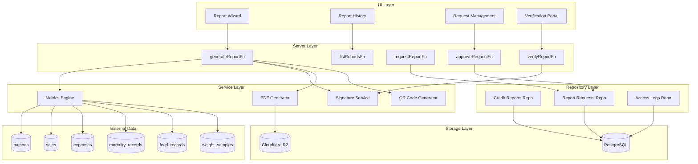
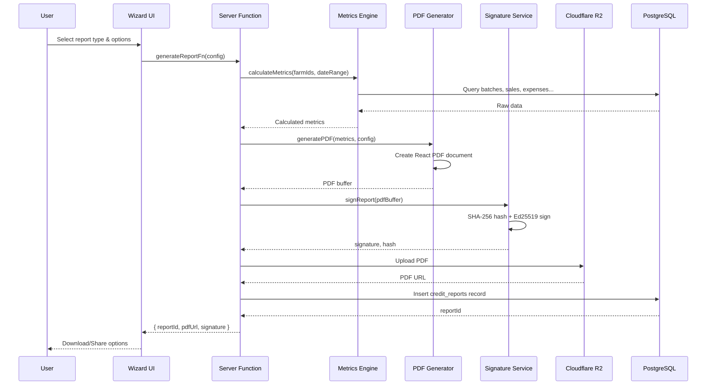
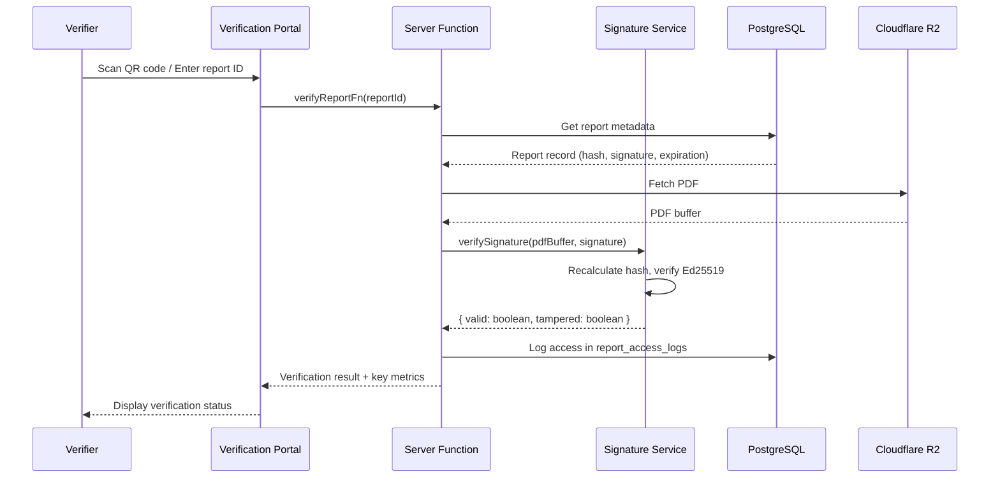

# Design Document: Credit Passport

## Overview

The Credit Passport feature transforms LivestockAI from a farm management tool into a financial verification platform. By aggregating farm data into cryptographically signed reports, farmers can prove their creditworthiness to banks, demonstrate production to government agencies, and show impact to NGOs—all without intermediaries.

The system follows LivestockAI's three-layer architecture (Server → Service → Repository) and integrates with existing features (batches, sales, expenses, notifications). PDF generation uses `@react-pdf/renderer` for Cloudflare Workers compatibility, and digital signatures use `@noble/ed25519` for cryptographic verification.

Key design decisions:

- **Metrics calculation in service layer**: Pure functions for testability and reusability
- **PDF storage in R2**: Scalable, cost-effective storage with CDN distribution
- **Public verification portal**: No authentication required for third-party verification
- **Offline-first**: Reports can be generated offline and signed when online

## Codebase Integration Points

### Existing Systems to Leverage

| System              | Location                                 | Integration                                         |
| ------------------- | ---------------------------------------- | --------------------------------------------------- |
| Currency formatting | `app/features/settings/hooks.ts`         | Use `useFormatCurrency()` for all monetary displays |
| Batches data        | `app/features/batches/server.ts`         | Query batch performance metrics                     |
| Sales data          | `app/features/sales/server.ts`           | Query revenue data                                  |
| Expenses data       | `app/features/expenses/server.ts`        | Query expense data                                  |
| Error handling      | `app/lib/errors/index.ts`                | Use `AppError` class for all errors                 |
| Database types      | `app/lib/db/types.ts`                    | Add new table interfaces                            |
| Auth middleware     | `app/features/auth/server-middleware.ts` | Use `requireAuth()` for authentication              |
| Farm access         | `app/features/auth/utils.ts`             | Use `verifyFarmAccess()` for authorization          |
| Notifications       | `app/features/notifications/server.ts`   | Create notifications for report requests            |

### Server Function Pattern (Three-Layer Architecture)

```typescript
// app/features/credit-passport/server.ts
import { createServerFn } from '@tanstack/react-start'
import { z } from 'zod'
import { AppError } from '~/lib/errors'

export const generateReportFn = createServerFn({ method: 'POST' })
  .inputValidator(
    z.object({
      reportType: z.enum([
        'credit_assessment',
        'production_certificate',
        'impact_report',
      ]),
      farmIds: z.array(z.string().uuid()).min(1),
      dateRange: z.object({
        startDate: z.coerce.date(),
        endDate: z.coerce.date(),
      }),
    }),
  )
  .handler(async ({ data }) => {
    try {
      // 1. Auth middleware (dynamic import for Cloudflare Workers)
      const { requireAuth } = await import('~/features/auth/server-middleware')
      const session = await requireAuth()

      // 2. Database access (MUST use getDb() for Cloudflare Workers)
      const { getDb } = await import('~/lib/db')
      const db = await getDb()

      // 3. Repository layer for database operations
      const { getFinancialData, getOperationalData } =
        await import('./repository')

      // 4. Service layer for business logic
      const { calculateFinancialMetrics, calculateCreditScore } =
        await import('./metrics-service')

      // ... implementation
    } catch (error) {
      if (error instanceof AppError) throw error
      throw new AppError('DATABASE_ERROR', {
        message: 'Failed to generate report',
        cause: error,
      })
    }
  })
```

### Repository Layer Pattern

```typescript
// app/features/credit-passport/repository.ts
import type { Kysely } from 'kysely'
import type { Database } from '~/lib/db/types'

export async function insertCreditReport(
  db: Kysely<Database>,
  report: CreditReportInsert,
): Promise<string> {
  const result = await db
    .insertInto('credit_reports')
    .values(report)
    .returning('id')
    .executeTakeFirstOrThrow()
  return result.id
}

export async function getFinancialData(
  db: Kysely<Database>,
  farmIds: string[],
  dateRange: { startDate: Date; endDate: Date },
) {
  const sales = await db
    .selectFrom('sales')
    .selectAll()
    .where('farmId', 'in', farmIds)
    .where('saleDate', '>=', dateRange.startDate)
    .where('saleDate', '<=', dateRange.endDate)
    .execute()

  // ... more queries
  return { sales, expenses }
}
```

### UI Component Pattern with Currency Formatting

```typescript
// app/components/credit-passport/financial-summary.tsx
import { useFormatCurrency } from '~/features/settings'

interface FinancialSummaryProps {
  totalRevenue: number
  totalExpenses: number
  profit: number
}

export function FinancialSummary({ totalRevenue, totalExpenses, profit }: FinancialSummaryProps) {
  const { format } = useFormatCurrency()

  return (
    <div className="grid gap-4 md:grid-cols-3">
      <div>
        <span className="text-muted-foreground">Total Revenue</span>
        <span className="text-2xl font-bold">{format(totalRevenue)}</span>
      </div>
      <div>
        <span className="text-muted-foreground">Total Expenses</span>
        <span className="text-2xl font-bold">{format(totalExpenses)}</span>
      </div>
      <div>
        <span className="text-muted-foreground">Profit</span>
        <span className="text-2xl font-bold">{format(profit)}</span>
      </div>
    </div>
  )
}
```

### Error Codes to Add to `app/lib/errors/error-map.ts`

```typescript
// Credit Passport error codes (404xx range for NOT_FOUND, 400xx for validation, 429xx for rate limiting)
CREDIT_REPORT_NOT_FOUND: {
  code: 40420,
  httpStatus: 404,
  category: 'NOT_FOUND',
  message: 'Credit report not found',
},
REPORT_REQUEST_NOT_FOUND: {
  code: 40421,
  httpStatus: 404,
  category: 'NOT_FOUND',
  message: 'Report request not found',
},
REPORT_EXPIRED: {
  code: 40003,
  httpStatus: 400,
  category: 'VALIDATION',
  message: 'Report has expired',
},
INVALID_DATE_RANGE: {
  code: 40004,
  httpStatus: 400,
  category: 'VALIDATION',
  message: 'Start date must be before end date',
},
INSUFFICIENT_DATA: {
  code: 40005,
  httpStatus: 400,
  category: 'VALIDATION',
  message: 'Insufficient data to generate report',
},
SIGNATURE_VERIFICATION_FAILED: {
  code: 40006,
  httpStatus: 400,
  category: 'VALIDATION',
  message: 'Report signature verification failed',
},
RATE_LIMIT_EXCEEDED: {
  code: 42901,
  httpStatus: 429,
  category: 'RATE_LIMIT',
  message: 'Rate limit exceeded. Please try again later.',
},
```

## Architecture

### High-Level System Architecture



### Report Generation Flow



### Verification Flow



## Components and Interfaces

### 1. Metrics Engine (`app/features/credit-passport/metrics-service.ts`)

Pure functions for calculating all report metrics. No side effects, easily testable.

```typescript
// Financial Health Metrics
interface FinancialMetrics {
  totalRevenue: number
  totalExpenses: number
  profit: number
  profitMargin: number // percentage
  averageMonthlyRevenue: number
  cashFlowTrend: Array<{ month: string; revenue: number; expenses: number }>
  revenueByType: Array<{ type: string; amount: number }>
  expensesByCategory: Array<{ category: string; amount: number }>
}

// Operational Efficiency Metrics
interface OperationalMetrics {
  averageFCR: number | null // null if no data
  averageMortalityRate: number
  growthPerformanceIndex: number // percentage vs standards
  batchSuccessRate: number // percentage reaching target
  completedBatches: number
  activeBatches: number
}

// Asset Summary
interface AssetSummary {
  activeBatchCount: number
  totalLivestockCount: number
  estimatedInventoryValue: number
  structureCount: number
  batchesByType: Array<{ type: string; count: number; quantity: number }>
}

// Track Record
interface TrackRecord {
  monthsOperating: number
  totalBatchesCompleted: number
  totalProductionVolume: number
  uniqueCustomersServed: number
  averageBatchSuccessRate: number
}

// Service Functions
function calculateFinancialMetrics(
  sales: SaleRecord[],
  expenses: ExpenseRecord[],
  dateRange: DateRange,
): FinancialMetrics

function calculateOperationalMetrics(
  batches: BatchWithRecords[],
  growthStandards: GrowthStandard[],
): OperationalMetrics

function calculateAssetSummary(
  batches: BatchRecord[],
  structures: StructureRecord[],
  marketPrices: MarketPrice[],
): AssetSummary

function calculateTrackRecord(
  batches: BatchRecord[],
  customers: CustomerRecord[],
  earliestBatchDate: Date,
): TrackRecord

function calculateCreditScore(
  financial: FinancialMetrics,
  operational: OperationalMetrics,
  assets: AssetSummary,
  trackRecord: TrackRecord,
): { score: number; grade: 'A' | 'B' | 'C' | 'D' | 'F'; factors: ScoreFactor[] }
```

### 2. Signature Service (`app/features/credit-passport/signature-service.ts`)

Cryptographic operations for report signing and verification.

```typescript
import { ed25519 } from '@noble/ed25519'

interface SignatureResult {
  hash: string // SHA-256 hex string
  signature: string // Ed25519 signature hex string
  publicKey: string // Public key for verification
  timestamp: Date
}

interface VerificationResult {
  valid: boolean
  tampered: boolean
  hashMatch: boolean
  signatureValid: boolean
  expired: boolean
  expirationDate: Date | null
}

// Sign a report (server-side only)
async function signReport(
  pdfBuffer: ArrayBuffer,
  privateKey: Uint8Array,
): Promise<SignatureResult>

// Verify a report signature
async function verifyReport(
  pdfBuffer: ArrayBuffer,
  storedHash: string,
  signature: string,
  publicKey: string,
  expirationDate: Date | null,
): Promise<VerificationResult>

// Generate hash for content
async function hashContent(content: ArrayBuffer): Promise<string>
```

### 3. PDF Generator (`app/features/credit-passport/pdf-generator.tsx`)

React PDF components for report generation.

```typescript
import { Document, Page, Text, View, Image } from '@react-pdf/renderer'

interface ReportPDFProps {
  reportType: 'credit_assessment' | 'production_certificate' | 'impact_report'
  metrics: ReportMetrics
  config: ReportConfig
  qrCodeDataUrl: string
  language: 'en' | 'fr' | 'sw' | 'ha'
  branding: 'livestockai' | 'whitelabel'
}

// Main PDF document component
function CreditPassportPDF(props: ReportPDFProps): JSX.Element

// Sub-components
function ReportHeader(props: HeaderProps): JSX.Element
function FinancialSection(props: FinancialSectionProps): JSX.Element
function OperationalSection(props: OperationalSectionProps): JSX.Element
function AssetSection(props: AssetSectionProps): JSX.Element
function TrackRecordSection(props: TrackRecordSectionProps): JSX.Element
function VerificationFooter(props: FooterProps): JSX.Element

// Generate PDF buffer
async function generateReportPDF(props: ReportPDFProps): Promise<ArrayBuffer>
```

### 4. QR Code Generator (`app/features/credit-passport/qr-service.ts`)

QR code generation for verification URLs.

```typescript
import QRCode from 'qrcode'

interface QRCodeOptions {
  reportId: string
  baseUrl: string
  size?: number // default 150
  errorCorrectionLevel?: 'L' | 'M' | 'Q' | 'H' // default 'M'
}

// Generate QR code as data URL for embedding in PDF
async function generateVerificationQR(options: QRCodeOptions): Promise<string>

// Generate verification URL
function buildVerificationUrl(reportId: string, baseUrl: string): string
```

### 5. Server Functions (`app/features/credit-passport/server.ts`)

Server functions following the three-layer architecture pattern.

```typescript
// Generate a new credit report
export const generateReportFn = createServerFn({ method: 'POST' })
  .inputValidator(
    z.object({
      reportType: z.enum([
        'credit_assessment',
        'production_certificate',
        'impact_report',
      ]),
      farmIds: z.array(z.string().uuid()).min(1),
      batchIds: z.array(z.string().uuid()).optional(),
      dateRange: z.object({
        startDate: z.coerce.date(),
        endDate: z.coerce.date(),
      }),
      validityDays: z.enum(['30', '60', '90']).default('30'),
      language: z.enum(['en', 'fr', 'sw', 'ha']).default('en'),
      branding: z.enum(['livestockai', 'whitelabel']).default('livestockai'),
      notes: z.string().max(1000).optional(),
    }),
  )
  .handler(async ({ data }) => {
    const { requireAuth } = await import('../auth/server-middleware')
    const session = await requireAuth()
    // ... implementation
  })

// Verify a report (public, no auth required)
export const verifyReportFn = createServerFn({ method: 'GET' })
  .inputValidator(
    z.object({
      reportId: z.string().uuid(),
    }),
  )
  .handler(async ({ data }) => {
    // No auth required - public verification
    // ... implementation
  })

// List user's reports
export const listReportsFn = createServerFn({ method: 'GET' })
  .inputValidator(
    z.object({
      page: z.number().int().positive().default(1),
      pageSize: z.number().int().positive().max(50).default(10),
      reportType: z
        .enum(['credit_assessment', 'production_certificate', 'impact_report'])
        .optional(),
      status: z.enum(['active', 'expired', 'pending']).optional(),
    }),
  )
  .handler(async ({ data }) => {
    const { requireAuth } = await import('../auth/server-middleware')
    const session = await requireAuth()
    // ... implementation
  })

// Request access to a farmer's report (for third parties)
export const requestReportFn = createServerFn({ method: 'POST' })
  .inputValidator(
    z.object({
      farmerId: z.string().uuid(),
      reportType: z.enum([
        'credit_assessment',
        'production_certificate',
        'impact_report',
      ]),
      requesterName: z.string().min(1).max(200),
      requesterOrganization: z.string().min(1).max(200),
      requesterEmail: z.string().email(),
      purpose: z.string().min(10).max(500),
    }),
  )
  .handler(async ({ data }) => {
    // ... implementation
  })

// Approve or deny a report request
export const respondToRequestFn = createServerFn({ method: 'POST' })
  .inputValidator(
    z.object({
      requestId: z.string().uuid(),
      approved: z.boolean(),
      denialReason: z.string().max(500).optional(),
    }),
  )
  .handler(async ({ data }) => {
    const { requireAuth } = await import('../auth/server-middleware')
    const session = await requireAuth()
    // ... implementation
  })

// Download report PDF
export const downloadReportFn = createServerFn({ method: 'GET' })
  .inputValidator(
    z.object({
      reportId: z.string().uuid(),
    }),
  )
  .handler(async ({ data }) => {
    const { requireAuth } = await import('../auth/server-middleware')
    const session = await requireAuth()
    // ... implementation
  })
```

### 6. Repository Layer (`app/features/credit-passport/repository.ts`)

Database operations for credit passport data.

```typescript
import type { Kysely } from 'kysely'
import type { Database } from '~/lib/db/types'

// Credit Reports
async function insertCreditReport(
  db: Kysely<Database>,
  report: CreditReportInsert,
): Promise<string>

async function getCreditReportById(
  db: Kysely<Database>,
  reportId: string,
): Promise<CreditReport | null>

async function getCreditReportsByUser(
  db: Kysely<Database>,
  userId: string,
  options: ListOptions,
): Promise<PaginatedResult<CreditReport>>

async function updateCreditReportStatus(
  db: Kysely<Database>,
  reportId: string,
  status: 'active' | 'expired' | 'deleted',
): Promise<void>

// Report Requests
async function insertReportRequest(
  db: Kysely<Database>,
  request: ReportRequestInsert,
): Promise<string>

async function getReportRequestById(
  db: Kysely<Database>,
  requestId: string,
): Promise<ReportRequest | null>

async function getPendingRequestsForUser(
  db: Kysely<Database>,
  userId: string,
): Promise<ReportRequest[]>

async function updateReportRequestStatus(
  db: Kysely<Database>,
  requestId: string,
  status: 'approved' | 'denied',
  responseNote?: string,
): Promise<void>

// Access Logs
async function logReportAccess(
  db: Kysely<Database>,
  log: ReportAccessLogInsert,
): Promise<void>

async function getAccessLogsForReport(
  db: Kysely<Database>,
  reportId: string,
): Promise<ReportAccessLog[]>

// Metrics Data Queries
async function getFinancialData(
  db: Kysely<Database>,
  farmIds: string[],
  dateRange: DateRange,
): Promise<{ sales: SaleRecord[]; expenses: ExpenseRecord[] }>

async function getOperationalData(
  db: Kysely<Database>,
  farmIds: string[],
  batchIds?: string[],
): Promise<BatchWithRecords[]>

async function getAssetData(
  db: Kysely<Database>,
  farmIds: string[],
): Promise<{ batches: BatchRecord[]; structures: StructureRecord[] }>
```

## Data Models

### New Database Tables

#### credit_reports

```sql
CREATE TABLE credit_reports (
  id UUID PRIMARY KEY DEFAULT gen_random_uuid(),
  user_id UUID NOT NULL REFERENCES users(id),
  farm_ids TEXT[] NOT NULL, -- Array of farm IDs included
  batch_ids TEXT[], -- Optional array of specific batch IDs
  report_type VARCHAR(50) NOT NULL, -- 'credit_assessment', 'production_certificate', 'impact_report'

  -- Date range for the report
  start_date DATE NOT NULL,
  end_date DATE NOT NULL,

  -- Verification data
  content_hash VARCHAR(64) NOT NULL, -- SHA-256 hash
  signature VARCHAR(128) NOT NULL, -- Ed25519 signature
  public_key VARCHAR(64) NOT NULL, -- Public key used for signing

  -- Storage
  pdf_url TEXT NOT NULL, -- R2 URL
  pdf_size_bytes INTEGER NOT NULL,

  -- Configuration
  language VARCHAR(5) NOT NULL DEFAULT 'en',
  branding VARCHAR(20) NOT NULL DEFAULT 'livestockai',
  notes TEXT,

  -- Status and expiration
  status VARCHAR(20) NOT NULL DEFAULT 'active', -- 'active', 'expired', 'pending', 'deleted'
  validity_days INTEGER NOT NULL DEFAULT 30,
  expires_at TIMESTAMP WITH TIME ZONE NOT NULL,

  -- Metrics snapshot (denormalized for quick access)
  metrics_snapshot JSONB NOT NULL,

  -- Timestamps
  created_at TIMESTAMP WITH TIME ZONE DEFAULT NOW(),
  updated_at TIMESTAMP WITH TIME ZONE DEFAULT NOW(),
  deleted_at TIMESTAMP WITH TIME ZONE
);

CREATE INDEX idx_credit_reports_user_id ON credit_reports(user_id);
CREATE INDEX idx_credit_reports_status ON credit_reports(status);
CREATE INDEX idx_credit_reports_expires_at ON credit_reports(expires_at);
-- Performance indexes for common queries
CREATE INDEX idx_credit_reports_user_status ON credit_reports(user_id, status);
CREATE INDEX idx_credit_reports_user_created ON credit_reports(user_id, created_at DESC);
CREATE INDEX idx_credit_reports_type_status ON credit_reports(report_type, status);
```

#### report_requests

```sql
CREATE TABLE report_requests (
  id UUID PRIMARY KEY DEFAULT gen_random_uuid(),
  farmer_id UUID NOT NULL REFERENCES users(id),
  report_type VARCHAR(50) NOT NULL,

  -- Requester information
  requester_name VARCHAR(200) NOT NULL,
  requester_organization VARCHAR(200) NOT NULL,
  requester_email VARCHAR(255) NOT NULL,
  purpose TEXT NOT NULL,

  -- Status
  status VARCHAR(20) NOT NULL DEFAULT 'pending', -- 'pending', 'approved', 'denied'
  response_note TEXT,
  responded_at TIMESTAMP WITH TIME ZONE,

  -- If approved, link to generated report
  report_id UUID REFERENCES credit_reports(id),

  -- Timestamps
  created_at TIMESTAMP WITH TIME ZONE DEFAULT NOW(),
  updated_at TIMESTAMP WITH TIME ZONE DEFAULT NOW()
);

CREATE INDEX idx_report_requests_farmer_id ON report_requests(farmer_id);
CREATE INDEX idx_report_requests_status ON report_requests(status);
-- Performance indexes for common queries
CREATE INDEX idx_report_requests_farmer_status ON report_requests(farmer_id, status);
CREATE INDEX idx_report_requests_farmer_created ON report_requests(farmer_id, created_at DESC);
CREATE INDEX idx_report_requests_requester_email ON report_requests(requester_email);
```

#### report_access_logs

```sql
CREATE TABLE report_access_logs (
  id UUID PRIMARY KEY DEFAULT gen_random_uuid(),
  report_id UUID NOT NULL REFERENCES credit_reports(id),

  -- Access information
  access_type VARCHAR(20) NOT NULL, -- 'verification', 'download', 'view'
  accessor_user_id UUID REFERENCES users(id), -- NULL for anonymous verification
  accessor_ip VARCHAR(45), -- IPv4 or IPv6
  accessor_user_agent TEXT,

  -- Verification result (for verification access type)
  verification_result JSONB,

  -- Timestamp
  accessed_at TIMESTAMP WITH TIME ZONE DEFAULT NOW()
);

CREATE INDEX idx_report_access_logs_report_id ON report_access_logs(report_id);
CREATE INDEX idx_report_access_logs_accessed_at ON report_access_logs(accessed_at);
-- Performance indexes for common queries
CREATE INDEX idx_report_access_logs_report_accessed ON report_access_logs(report_id, accessed_at DESC);
CREATE INDEX idx_report_access_logs_type ON report_access_logs(access_type);

CREATE INDEX idx_report_access_logs_report_id ON report_access_logs(report_id);
CREATE INDEX idx_report_access_logs_accessed_at ON report_access_logs(accessed_at);
```

### TypeScript Types

```typescript
// Credit Report
interface CreditReportTable {
  id: Generated<string>
  userId: string
  farmIds: string[]
  batchIds: string[] | null
  reportType: 'credit_assessment' | 'production_certificate' | 'impact_report'
  startDate: Date
  endDate: Date
  contentHash: string
  signature: string
  publicKey: string
  pdfUrl: string
  pdfSizeBytes: number
  language: 'en' | 'fr' | 'sw' | 'ha'
  branding: 'livestockai' | 'whitelabel'
  notes: string | null
  status: 'active' | 'expired' | 'pending' | 'deleted'
  validityDays: number
  expiresAt: Date
  metricsSnapshot: ReportMetricsSnapshot
  createdAt: Generated<Date>
  updatedAt: Generated<Date>
  deletedAt: Date | null
}

// Report Request
interface ReportRequestTable {
  id: Generated<string>
  farmerId: string
  reportType: 'credit_assessment' | 'production_certificate' | 'impact_report'
  requesterName: string
  requesterOrganization: string
  requesterEmail: string
  purpose: string
  status: 'pending' | 'approved' | 'denied'
  responseNote: string | null
  respondedAt: Date | null
  reportId: string | null
  createdAt: Generated<Date>
  updatedAt: Generated<Date>
}

// Report Access Log
interface ReportAccessLogTable {
  id: Generated<string>
  reportId: string
  accessType: 'verification' | 'download' | 'view'
  accessorUserId: string | null
  accessorIp: string | null
  accessorUserAgent: string | null
  verificationResult: VerificationResult | null
  accessedAt: Generated<Date>
}

// Metrics Snapshot (stored as JSONB)
interface ReportMetricsSnapshot {
  financial: FinancialMetrics
  operational: OperationalMetrics
  assets: AssetSummary
  trackRecord: TrackRecord
  creditScore?: CreditScoreResult
  dataFreshnessDate: string // ISO date of most recent data
}
```

## Correctness Properties

_A property is a characteristic or behavior that should hold true across all valid executions of a system—essentially, a formal statement about what the system should do. Properties serve as the bridge between human-readable specifications and machine-verifiable correctness guarantees._

### Property 1: Financial Metrics Calculation Correctness

_For any_ set of sales records and expense records within a date range, the calculated financial metrics SHALL satisfy:

- `totalRevenue` equals the sum of all `totalAmount` values from sales
- `totalExpenses` equals the sum of all `amount` values from expenses
- `profit` equals `totalRevenue - totalExpenses`
- `revenueByType` sums equal `totalRevenue`
- `expensesByCategory` sums equal `totalExpenses`

**Validates: Requirements 1.1, 1.2**

### Property 2: Profit Margin Formula Correctness

_For any_ revenue value greater than zero and any expense value, the profit margin SHALL equal `((revenue - expenses) / revenue) * 100`. _For any_ revenue value equal to zero, the profit margin SHALL equal zero (no division error).

**Validates: Requirements 1.3, 1.5**

### Property 3: Average Monthly Revenue Correctness

_For any_ total revenue and date range spanning N months (where N > 0), the average monthly revenue SHALL equal `totalRevenue / N`.

**Validates: Requirements 1.6**

### Property 4: Cash Flow Trend Aggregation

_For any_ set of sales and expenses with dates, the cash flow trend SHALL group transactions by month, and the sum of all monthly revenues SHALL equal total revenue, and the sum of all monthly expenses SHALL equal total expenses.

**Validates: Requirements 1.4**

### Property 5: FCR Calculation Correctness

_For any_ batch with total feed consumed (kg) and total weight gain (kg) where weight gain is greater than zero, the FCR SHALL equal `totalFeedKg / totalWeightGainKg`. _For any_ batch with zero or negative weight gain, FCR SHALL be null.

**Validates: Requirements 2.1, 2.6**

### Property 6: Mortality Rate Calculation Correctness

_For any_ batch with initial quantity greater than zero and current quantity, the mortality rate SHALL equal `((initialQuantity - currentQuantity) / initialQuantity) * 100`. The result SHALL be between 0 and 100 inclusive.

**Validates: Requirements 2.2**

### Property 7: Growth Performance Index Correctness

_For any_ batch with actual weight and expected weight from growth standards (both positive), the growth performance index SHALL equal `(actualWeight / expectedWeight) * 100`.

**Validates: Requirements 2.3**

### Property 8: Operational Metrics Aggregation

_For any_ set of batches, the aggregated operational metrics SHALL satisfy:

- `averageFCR` equals the weighted average of individual batch FCRs (weighted by feed consumed)
- `averageMortalityRate` equals the weighted average of individual batch mortality rates (weighted by initial quantity)
- `completedBatches` equals count of batches with status 'sold' or 'depleted'
- `activeBatches` equals count of batches with status 'active'

**Validates: Requirements 2.5**

### Property 9: Asset Summary Calculation Correctness

_For any_ set of active batches, structures, and market prices:

- `activeBatchCount` equals count of batches with status 'active'
- `totalLivestockCount` equals sum of `currentQuantity` across all active batches
- `structureCount` equals count of structures
- `batchesByType` counts and quantities sum to totals

**Validates: Requirements 3.1, 3.4, 3.5**

### Property 10: Inventory Value Calculation

_For any_ set of active batches with market prices, the estimated inventory value SHALL equal the sum of `(currentQuantity * marketPrice)` for each batch. When market price is unavailable, `targetPricePerUnit` SHALL be used as fallback.

**Validates: Requirements 3.2, 3.3**

### Property 11: Track Record Calculation Correctness

_For any_ set of batches and customers:

- `monthsOperating` equals the number of months between earliest batch acquisition date and report date
- `totalBatchesCompleted` equals count of batches with status 'sold' or 'depleted'
- `totalProductionVolume` equals sum of `initialQuantity` across completed batches
- `uniqueCustomersServed` equals count of distinct customer IDs from sales

**Validates: Requirements 4.1, 4.2, 4.3, 4.5**

### Property 12: Batch Success Rate Calculation

_For any_ set of completed batches, the average batch success rate SHALL equal `(batchesReachingTargetWeight / totalCompletedBatches) * 100`. A batch reaches target weight if its final average weight >= target_weight_g.

**Validates: Requirements 4.4**

### Property 13: Credit Score Calculation Consistency

_For any_ set of financial, operational, asset, and track record metrics, the credit score SHALL be calculated using the weighted formula:

- Profit margin contribution: 30%
- Track record contribution: 25%
- Operational efficiency contribution: 25%
- Asset value contribution: 20%

The resulting score SHALL be between 0 and 100, and the grade SHALL be assigned as: A (80-100), B (60-79), C (40-59), D (20-39), F (0-19).

**Validates: Requirements 5.5**

### Property 14: Report Structure Completeness

_For any_ generated report:

- Credit Assessment reports SHALL contain: financial metrics, operational metrics, asset summary, track record, credit score, repayment capacity
- Production Certificate reports SHALL contain: production volume, sales records, batch completions, farm details, compliance indicators
- Impact Report reports SHALL contain: baseline metrics, current metrics, growth percentages, efficiency improvements, narrative summary

**Validates: Requirements 5.1-5.6, 6.1-6.5, 7.1-7.6**

### Property 15: Report Configuration Validation

_For any_ report generation request, the system SHALL reject requests where:

- `farmIds` array is empty
- `startDate` is after `endDate`
- `validityDays` is not one of [30, 60, 90]

**Validates: Requirements 8.5**

### Property 16: Cryptographic Hash Determinism

_For any_ PDF content, computing the SHA-256 hash twice SHALL produce identical results. _For any_ two different PDF contents, the probability of hash collision SHALL be negligible (< 2^-128).

**Validates: Requirements 9.1, 9.5**

### Property 17: Signature Round-Trip Verification

_For any_ PDF content signed with a private key, verifying the signature with the corresponding public key SHALL return valid=true. _For any_ modified PDF content, verification SHALL return tampered=true.

**Validates: Requirements 9.2, 9.5, 9.6**

### Property 18: Expiration Date Calculation

_For any_ report generation date and validity period (30, 60, or 90 days), the expiration date SHALL equal `generationDate + validityDays`. A report accessed before expiration SHALL have expired=false, and a report accessed after expiration SHALL have expired=true.

**Validates: Requirements 11.2, 11.3**

### Property 19: Impact Report Period Comparison

_For any_ Impact Report with baseline period and current period:

- Revenue growth percentage SHALL equal `((currentRevenue - baselineRevenue) / baselineRevenue) * 100`
- Production growth percentage SHALL equal `((currentProduction - baselineProduction) / baselineProduction) * 100`
- FCR improvement SHALL equal `baselineFCR - currentFCR` (positive = improvement)
- Mortality improvement SHALL equal `baselineMortalityRate - currentMortalityRate` (positive = improvement)

**Validates: Requirements 7.2, 7.3, 7.4**

## Error Handling

### Metrics Calculation Errors

| Error Scenario                                             | Handling Strategy                     |
| ---------------------------------------------------------- | ------------------------------------- |
| Division by zero in profit margin (zero revenue)           | Return 0% profit margin               |
| Division by zero in FCR (zero weight gain)                 | Return null FCR with indicator        |
| Division by zero in mortality rate (zero initial quantity) | Return 0% mortality rate              |
| No sales data for period                                   | Return zero revenue, empty breakdown  |
| No expense data for period                                 | Return zero expenses, empty breakdown |
| No batches for farm                                        | Return empty operational metrics      |
| No growth standards for species                            | Skip growth performance calculation   |

### Cryptographic Errors

| Error Scenario               | Handling Strategy                                    |
| ---------------------------- | ---------------------------------------------------- |
| Private key not configured   | Throw configuration error, prevent report generation |
| Invalid signature format     | Return verification failed with error details        |
| Hash mismatch detected       | Return tampered=true in verification result          |
| PDF corrupted during storage | Return verification failed, log error                |

### Storage Errors

| Error Scenario          | Handling Strategy                                 |
| ----------------------- | ------------------------------------------------- |
| R2 upload failure       | Retry 3 times with exponential backoff, then fail |
| R2 download failure     | Return error to user, suggest retry               |
| Database insert failure | Rollback transaction, return error                |
| Report not found        | Return 404 with clear message                     |

### Request/Response Errors

| Error Scenario               | Handling Strategy                            |
| ---------------------------- | -------------------------------------------- |
| Invalid report ID format     | Return 400 Bad Request                       |
| Unauthorized access attempt  | Return 403 Forbidden                         |
| Report expired               | Allow access but mark as expired in response |
| Request already responded to | Return 409 Conflict                          |

## Testing Strategy

### Dual Testing Approach

This feature requires both unit tests and property-based tests:

- **Property tests**: Verify universal properties across randomly generated inputs (metrics calculations, cryptographic operations)
- **Unit tests**: Verify specific examples, edge cases, and integration points

### Property-Based Testing Configuration

- **Library**: fast-check (already in project dependencies)
- **Minimum iterations**: 100 per property test
- **Tag format**: `Feature: credit-passport, Property {number}: {property_text}`

### Test File Structure

```
tests/features/credit-passport/
├── metrics-service.property.test.ts    # Property tests for metrics calculations
├── metrics-service.test.ts             # Unit tests for edge cases
├── signature-service.property.test.ts  # Property tests for crypto operations
├── signature-service.test.ts           # Unit tests for crypto edge cases
├── credit-passport.integration.test.ts # Integration tests with database
└── pdf-generator.test.ts               # Unit tests for PDF structure
```

### Property Test Examples

```typescript
// Property 2: Profit Margin Formula
describe('Profit Margin Calculation', () => {
  it('Property 2: Profit margin equals ((revenue - expenses) / revenue) * 100', () => {
    fc.assert(
      fc.property(
        fc.float({ min: 0.01, max: 1000000 }), // revenue > 0
        fc.float({ min: 0, max: 1000000 }), // expenses >= 0
        (revenue, expenses) => {
          const result = calculateProfitMargin(revenue, expenses)
          const expected = ((revenue - expenses) / revenue) * 100
          expect(result).toBeCloseTo(expected, 5)
        },
      ),
      { numRuns: 100 },
    )
  })

  it('Property 2: Zero revenue returns zero profit margin', () => {
    fc.assert(
      fc.property(
        fc.float({ min: 0, max: 1000000 }), // any expenses
        (expenses) => {
          const result = calculateProfitMargin(0, expenses)
          expect(result).toBe(0)
        },
      ),
      { numRuns: 100 },
    )
  })
})

// Property 5: FCR Calculation
describe('FCR Calculation', () => {
  it('Property 5: FCR equals totalFeed / weightGain for positive weight gain', () => {
    fc.assert(
      fc.property(
        fc.float({ min: 0.1, max: 10000 }), // totalFeedKg
        fc.float({ min: 0.01, max: 5000 }), // weightGainKg > 0
        (totalFeedKg, weightGainKg) => {
          const result = calculateFCR(totalFeedKg, weightGainKg)
          expect(result).toBeCloseTo(totalFeedKg / weightGainKg, 5)
        },
      ),
      { numRuns: 100 },
    )
  })

  it('Property 5: Zero weight gain returns null FCR', () => {
    fc.assert(
      fc.property(
        fc.float({ min: 0, max: 10000 }), // any feed amount
        (totalFeedKg) => {
          const result = calculateFCR(totalFeedKg, 0)
          expect(result).toBeNull()
        },
      ),
      { numRuns: 100 },
    )
  })
})

// Property 17: Signature Round-Trip
describe('Signature Verification', () => {
  it('Property 17: Sign then verify returns valid for unmodified content', () => {
    fc.assert(
      fc.property(
        fc.uint8Array({ minLength: 100, maxLength: 10000 }), // PDF content
        async (content) => {
          const { privateKey, publicKey } = generateKeyPair()
          const { signature, hash } = await signReport(
            content.buffer,
            privateKey,
          )
          const result = await verifyReport(
            content.buffer,
            hash,
            signature,
            publicKey,
            null,
          )
          expect(result.valid).toBe(true)
          expect(result.tampered).toBe(false)
        },
      ),
      { numRuns: 100 },
    )
  })

  it('Property 17: Modified content returns tampered=true', () => {
    fc.assert(
      fc.property(
        fc.uint8Array({ minLength: 100, maxLength: 10000 }),
        fc.nat({ max: 99 }), // index to modify
        async (content, modifyIndex) => {
          const { privateKey, publicKey } = generateKeyPair()
          const { signature, hash } = await signReport(
            content.buffer,
            privateKey,
          )

          // Modify content
          const modified = new Uint8Array(content)
          modified[modifyIndex] = (modified[modifyIndex] + 1) % 256

          const result = await verifyReport(
            modified.buffer,
            hash,
            signature,
            publicKey,
            null,
          )
          expect(result.tampered).toBe(true)
        },
      ),
      { numRuns: 100 },
    )
  })
})
```

### Unit Test Coverage

| Component         | Test Focus                                                  |
| ----------------- | ----------------------------------------------------------- |
| Metrics Service   | Edge cases (zero values, empty arrays), boundary conditions |
| Signature Service | Key generation, invalid inputs, encoding/decoding           |
| PDF Generator     | Document structure, language switching, branding options    |
| Repository        | Query correctness, pagination, soft delete                  |
| Server Functions  | Authorization, input validation, error responses            |

### Integration Test Coverage

| Test Scenario                        | Database Required |
| ------------------------------------ | ----------------- |
| Full report generation flow          | Yes               |
| Report verification with stored data | Yes               |
| Request approval workflow            | Yes               |
| Expiration handling                  | Yes               |
| Audit log creation                   | Yes               |

### Formalized Integration Test Scenarios

The following integration test scenarios SHALL be implemented to validate end-to-end functionality:

| ID    | Scenario                                                  | Expected Outcome                                           | Requirements        |
| ----- | --------------------------------------------------------- | ---------------------------------------------------------- | ------------------- |
| IT-1  | Generate Credit Assessment for farm with complete data    | PDF generated, signed, stored in R2, metadata in DB        | 5.1-5.6, 9.1-9.4    |
| IT-2  | Generate report for farm with no sales/expenses           | Report generated with zero financial metrics               | 1.5, Error Handling |
| IT-3  | Generate report for farm with no batches                  | Report generated with empty operational metrics            | 2.6, Error Handling |
| IT-4  | Verify valid, unexpired report                            | Verification returns valid=true, expired=false             | 10.2-10.5           |
| IT-5  | Verify expired report                                     | Verification returns valid=true, expired=true with warning | 10.6, 11.3          |
| IT-6  | Verify tampered PDF                                       | Verification returns tampered=true                         | 9.5, 9.6            |
| IT-7  | Verify non-existent report ID                             | Returns 404 "Report not found"                             | 10.7                |
| IT-8  | Third-party request → farmer approval → report generation | Full workflow completes, notifications sent                | 12.1-12.6           |
| IT-9  | Third-party request → farmer denial                       | Request denied, requester notified                         | 12.4                |
| IT-10 | Rate limit exceeded (>10 reports/hour)                    | Returns 429 with retry-after header                        | 8.7, 8.9            |
| IT-11 | Generate report spanning exactly 1 month                  | Monthly aggregation correct                                | 1.4, 1.6            |
| IT-12 | Generate report spanning 12 months                        | All monthly data aggregated correctly                      | 1.4                 |
| IT-13 | Generate report for multiple farms                        | Metrics aggregated across all farms                        | 8.2                 |
| IT-14 | Soft delete report then verify                            | Verification fails with appropriate message                | 15.4, 15.5          |
| IT-15 | Audit log immutability                                    | Attempting to update/delete audit_logs fails               | 16.5                |

### Edge Cases to Test

1. Farm with no sales or expenses (empty financial metrics)
2. Farm with no batches (empty operational metrics)
3. Batch with zero initial quantity
4. Batch with negative weight gain (weight loss)
5. Report spanning exactly 1 month vs multiple months
6. Report with single farm vs multiple farms
7. Verification of expired report
8. Verification of tampered PDF
9. Request for non-existent farmer
10. Duplicate request from same requester
11. Report generation with all optional fields null
12. Very large report (many batches, long date range)
