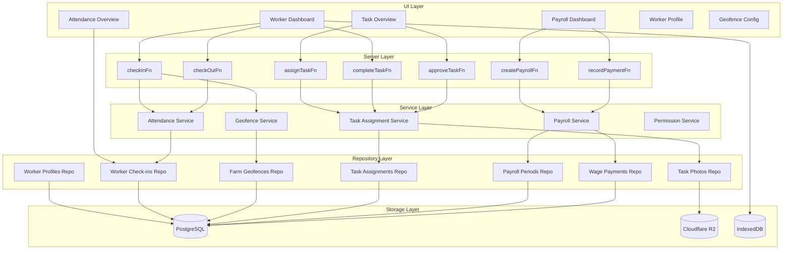
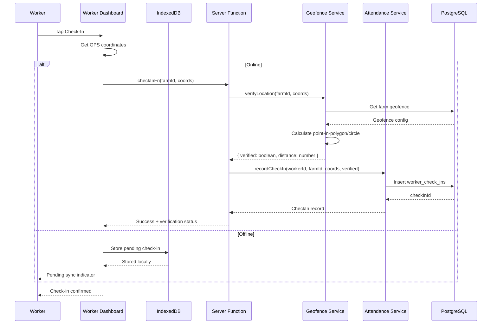
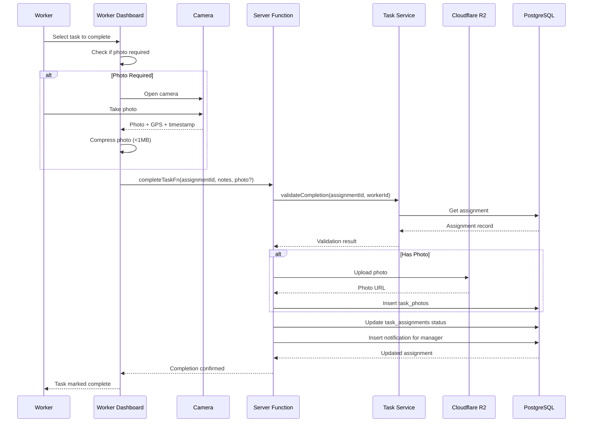

# Design Document: Digital Foreman

## Overview

The Digital Foreman transforms OpenLivestock from a farm management tool into a comprehensive workforce management platform. By extending the existing user/farm/task systems, it enables farm owners to manage workers with GPS-verified attendance, granular module permissions, task assignments with photo proof, and integrated payroll tracking.

The system follows OpenLivestock's three-layer architecture (Server → Service → Repository) and integrates with existing features (users, farms, tasks, notifications, audit_logs). GPS verification uses the browser's Geolocation API with offline buffering via IndexedDB. Photo storage uses Cloudflare R2 for scalability.

Key design decisions:

- **Extend existing FarmRole type**: Add 'worker' role to existing user_farms table
- **Module-specific permissions**: Granular access control stored as JSONB for flexibility
- **Geofence verification in service layer**: Pure functions for testability
- **Offline-first attendance**: IndexedDB persistence with automatic sync
- **Photo compression client-side**: Reduce bandwidth for rural areas with poor connectivity

## Codebase Integration Points

### Existing Systems to Leverage

| System              | Location                                 | Integration                                         |
| ------------------- | ---------------------------------------- | --------------------------------------------------- |
| Currency formatting | `app/features/settings/hooks.ts`         | Use `useFormatCurrency()` for wage/payment displays |
| Users               | `app/features/users/server.ts`           | Extend user system with worker role                 |
| Tasks               | `app/features/tasks/server.ts`           | Extend task system with assignments                 |
| Farms               | `app/features/farms/server.ts`           | Add geofence configuration                          |
| Structures          | `app/features/structures/server.ts`      | Link workers to structures                          |
| Error handling      | `app/lib/errors/index.ts`                | Use `AppError` class for all errors                 |
| Database types      | `app/lib/db/types.ts`                    | Add new table interfaces                            |
| Auth middleware     | `app/features/auth/server-middleware.ts` | Use `requireAuth()` for authentication              |
| Farm access         | `app/features/auth/utils.ts`             | Use `verifyFarmAccess()` for authorization          |
| Notifications       | `app/features/notifications/server.ts`   | Create notifications for task assignments           |
| Audit logs          | `app/features/monitoring/server.ts`      | Log worker actions                                  |

### Server Function Pattern (Three-Layer Architecture)

```typescript
// app/features/digital-foreman/server.ts
import { createServerFn } from '@tanstack/react-start'
import { z } from 'zod'
import { AppError } from '~/lib/errors'

export const checkInFn = createServerFn({ method: 'POST' })
  .inputValidator(
    z.object({
      farmId: z.string().uuid(),
      latitude: z.number().min(-90).max(90),
      longitude: z.number().min(-180).max(180),
      accuracy: z.number().positive().optional(),
    }),
  )
  .handler(async ({ data }) => {
    try {
      // 1. Auth middleware (dynamic import for Cloudflare Workers)
      const { requireAuth } = await import('~/features/auth/server-middleware')
      const session = await requireAuth()

      // 2. Database access (MUST use getDb() for Cloudflare Workers)
      const { getDb } = await import('~/lib/db')
      const db = await getDb()

      // 3. Repository layer for database operations
      const { getGeofenceByFarm, insertCheckIn } = await import('./repository')

      // 4. Service layer for business logic
      const { verifyLocationInGeofence, isDuplicateCheckIn } =
        await import('./geofence-service')

      // ... implementation
    } catch (error) {
      if (error instanceof AppError) throw error
      throw new AppError('DATABASE_ERROR', {
        message: 'Failed to record check-in',
        cause: error,
      })
    }
  })
```

### Repository Layer Pattern

```typescript
// app/features/digital-foreman/repository.ts
import type { Kysely } from 'kysely'
import type { Database } from '~/lib/db/types'

export async function insertCheckIn(
  db: Kysely<Database>,
  checkIn: CheckInInsert,
): Promise<string> {
  const result = await db
    .insertInto('worker_check_ins')
    .values(checkIn)
    .returning('id')
    .executeTakeFirstOrThrow()
  return result.id
}

export async function getGeofenceByFarm(db: Kysely<Database>, farmId: string) {
  return db
    .selectFrom('farm_geofences')
    .selectAll()
    .where('farmId', '=', farmId)
    .executeTakeFirst()
}
```

### UI Component Pattern with Currency Formatting

```typescript
// app/components/digital-foreman/payroll-summary.tsx
import { useFormatCurrency } from '~/features/settings'

interface PayrollSummaryProps {
  grossWages: number
  paymentsMade: number
  outstandingBalance: number
}

export function PayrollSummary({ grossWages, paymentsMade, outstandingBalance }: PayrollSummaryProps) {
  const { format } = useFormatCurrency()

  return (
    <div className="grid gap-4 md:grid-cols-3">
      <div>
        <span className="text-muted-foreground">Gross Wages</span>
        <span className="text-2xl font-bold">{format(grossWages)}</span>
      </div>
      <div>
        <span className="text-muted-foreground">Payments Made</span>
        <span className="text-2xl font-bold">{format(paymentsMade)}</span>
      </div>
      <div>
        <span className="text-muted-foreground">Outstanding</span>
        <span className="text-2xl font-bold text-amber-600">{format(outstandingBalance)}</span>
      </div>
    </div>
  )
}
```

### Error Codes to Add to `app/lib/errors/error-map.ts`

```typescript
// Digital Foreman error codes
WORKER_PROFILE_NOT_FOUND: {
  code: 40422,
  httpStatus: 404,
  category: 'NOT_FOUND',
  message: 'Worker profile not found',
},
GEOFENCE_NOT_FOUND: {
  code: 40423,
  httpStatus: 404,
  category: 'NOT_FOUND',
  message: 'Farm geofence not configured',
},
TASK_ASSIGNMENT_NOT_FOUND: {
  code: 40424,
  httpStatus: 404,
  category: 'NOT_FOUND',
  message: 'Task assignment not found',
},
PAYROLL_PERIOD_NOT_FOUND: {
  code: 40425,
  httpStatus: 404,
  category: 'NOT_FOUND',
  message: 'Payroll period not found',
},
CHECK_IN_NOT_FOUND: {
  code: 40426,
  httpStatus: 404,
  category: 'NOT_FOUND',
  message: 'Check-in record not found',
},
DUPLICATE_CHECK_IN: {
  code: 40902,
  httpStatus: 409,
  category: 'VALIDATION',
  message: 'Check-in already recorded within 5 minutes',
},
NO_OPEN_CHECK_IN: {
  code: 40007,
  httpStatus: 400,
  category: 'VALIDATION',
  message: 'No open check-in found for check-out',
},
OUTSIDE_GEOFENCE: {
  code: 40008,
  httpStatus: 400,
  category: 'VALIDATION',
  message: 'Location is outside farm geofence',
},
PHOTO_REQUIRED: {
  code: 40009,
  httpStatus: 400,
  category: 'VALIDATION',
  message: 'Photo proof is required for this task',
},
NOT_TASK_ASSIGNEE: {
  code: 40302,
  httpStatus: 403,
  category: 'FORBIDDEN',
  message: 'Only the assigned worker can complete this task',
},
OVERLAPPING_PAYROLL_PERIOD: {
  code: 40903,
  httpStatus: 409,
  category: 'VALIDATION',
  message: 'Payroll period overlaps with existing period',
},
```

## Architecture

### High-Level System Architecture



### Check-In Flow



### Task Completion with Photo Proof Flow



## Components and Interfaces

### 1. Geofence Service (`app/features/digital-foreman/geofence-service.ts`)

Pure functions for geofence verification. No side effects, easily testable.

```typescript
// Geofence types
interface CircularGeofence {
  type: 'circle'
  centerLat: number
  centerLng: number
  radiusMeters: number
  toleranceMeters: number
}

interface PolygonGeofence {
  type: 'polygon'
  vertices: Array<{ lat: number; lng: number }>
  toleranceMeters: number
}

type Geofence = CircularGeofence | PolygonGeofence

interface LocationVerificationResult {
  verified: boolean
  distanceMeters: number
  withinTolerance: boolean
  status: 'verified' | 'outside_geofence' | 'within_tolerance'
}

// Service functions
function verifyLocationInGeofence(
  coords: { lat: number; lng: number },
  geofence: Geofence,
): LocationVerificationResult

function calculateHaversineDistance(
  point1: { lat: number; lng: number },
  point2: { lat: number; lng: number },
): number

function isPointInPolygon(
  point: { lat: number; lng: number },
  polygon: Array<{ lat: number; lng: number }>,
): boolean

function calculateDistanceToPolygon(
  point: { lat: number; lng: number },
  polygon: Array<{ lat: number; lng: number }>,
): number
```

### 2. Attendance Service (`app/features/digital-foreman/attendance-service.ts`)

Business logic for attendance tracking and hours calculation.

```typescript
interface CheckInRecord {
  id: string
  workerId: string
  farmId: string
  checkInTime: Date
  checkInLat: number
  checkInLng: number
  checkInAccuracy: number
  verificationStatus:
    | 'verified'
    | 'outside_geofence'
    | 'manual'
    | 'pending_sync'
  checkOutTime: Date | null
  checkOutLat: number | null
  checkOutLng: number | null
  hoursWorked: number | null
}

interface AttendanceSummary {
  workerId: string
  workerName: string
  totalHours: number
  totalDays: number
  onTimeCheckIns: number
  lateCheckIns: number
  flaggedCheckIns: number
  averageHoursPerDay: number
}

// Service functions
function calculateHoursWorked(checkIn: Date, checkOut: Date): number

function calculateAttendanceSummary(
  checkIns: CheckInRecord[],
  periodStart: Date,
  periodEnd: Date,
): AttendanceSummary

function isDuplicateCheckIn(
  existingCheckIns: CheckInRecord[],
  newCheckInTime: Date,
  thresholdMinutes: number,
): boolean

function shouldAutoCheckOut(checkIn: CheckInRecord, currentTime: Date): boolean

function validateCheckInCoordinates(
  lat: number,
  lng: number,
): { valid: boolean; error?: string }
```

### 3. Task Assignment Service (`app/features/digital-foreman/task-service.ts`)

Business logic for task assignments and completion workflow.

```typescript
interface TaskAssignment {
  id: string
  taskId: string
  workerId: string
  assignedBy: string
  farmId: string
  dueDate: Date | null
  priority: 'low' | 'medium' | 'high' | 'urgent'
  status:
    | 'pending'
    | 'in_progress'
    | 'completed'
    | 'pending_approval'
    | 'verified'
    | 'rejected'
  requiresPhoto: boolean
  requiresApproval: boolean
  notes: string | null
  completedAt: Date | null
  completionNotes: string | null
  approvedBy: string | null
  approvedAt: Date | null
  rejectionReason: string | null
}

interface TaskPhoto {
  id: string
  assignmentId: string
  photoUrl: string
  capturedLat: number
  capturedLng: number
  capturedAt: Date
  uploadedAt: Date
}

// Service functions
function validateTaskCompletion(
  assignment: TaskAssignment,
  workerId: string,
  hasPhoto: boolean,
): { valid: boolean; error?: string }

function determineCompletionStatus(
  requiresApproval: boolean,
): 'completed' | 'pending_approval'

function calculateTaskMetrics(assignments: TaskAssignment[]): {
  total: number
  completed: number
  pending: number
  overdue: number
  completionRate: number
}

function isTaskOverdue(assignment: TaskAssignment, currentTime: Date): boolean

function calculateAverageCompletionTime(
  assignments: TaskAssignment[],
): number | null
```

### 4. Payroll Service (`app/features/digital-foreman/payroll-service.ts`)

Business logic for wage calculations and payroll management.

```typescript
interface WorkerWageConfig {
  rateAmount: number
  rateType: 'hourly' | 'daily' | 'monthly'
  currency: string
}

interface PayrollPeriod {
  id: string
  farmId: string
  periodType: 'weekly' | 'bi-weekly' | 'monthly'
  startDate: Date
  endDate: Date
  status: 'open' | 'closed'
}

interface WorkerPayrollSummary {
  workerId: string
  workerName: string
  hoursWorked: number
  daysWorked: number
  grossWages: number
  paymentsMade: number
  outstandingBalance: number
  currency: string
}

interface WagePayment {
  id: string
  workerId: string
  payrollPeriodId: string
  amount: number
  paymentDate: Date
  paymentMethod: 'cash' | 'bank_transfer' | 'mobile_money'
  notes: string | null
}

// Service functions
function calculateGrossWages(
  hoursWorked: number,
  daysWorked: number,
  wageConfig: WorkerWageConfig,
): number

function calculateOutstandingBalance(
  grossWages: number,
  paymentsMade: number,
): number

function generatePayrollSummary(
  workers: Array<{ id: string; name: string; wageConfig: WorkerWageConfig }>,
  attendance: AttendanceSummary[],
  payments: WagePayment[],
): WorkerPayrollSummary[]

function validatePayrollPeriod(
  startDate: Date,
  endDate: Date,
  existingPeriods: PayrollPeriod[],
): { valid: boolean; error?: string }

function calculateDaysWorked(
  checkIns: CheckInRecord[],
  periodStart: Date,
  periodEnd: Date,
): number
```

### 5. Permission Service (`app/features/digital-foreman/permission-service.ts`)

Module-specific permission checking for workers.

```typescript
type ModulePermission =
  | 'feed:log'
  | 'mortality:log'
  | 'weight:log'
  | 'vaccination:log'
  | 'water_quality:log'
  | 'egg:log'
  | 'sales:view'
  | 'task:complete'
  | 'batch:view'

interface WorkerPermissions {
  workerId: string
  farmId: string
  permissions: ModulePermission[]
}

const PERMISSION_TEMPLATES = {
  feed_handler: ['feed:log', 'batch:view', 'task:complete'],
  health_monitor: [
    'mortality:log',
    'vaccination:log',
    'water_quality:log',
    'batch:view',
    'task:complete',
  ],
  full_access: [
    'feed:log',
    'mortality:log',
    'weight:log',
    'vaccination:log',
    'water_quality:log',
    'egg:log',
    'sales:view',
    'task:complete',
    'batch:view',
  ],
} as const

// Service functions
function hasPermission(
  workerPermissions: WorkerPermissions,
  requiredPermission: ModulePermission,
): boolean

function getPermissionsFromTemplate(
  template: keyof typeof PERMISSION_TEMPLATES,
): ModulePermission[]

function validatePermissions(permissions: string[]): {
  valid: boolean
  invalidPermissions: string[]
}
```

### 6. Server Functions (`app/features/digital-foreman/server.ts`)

Server functions following the three-layer architecture pattern.

```typescript
// Worker Profile Management
export const createWorkerProfileFn = createServerFn({ method: 'POST' })
  .inputValidator(
    z.object({
      userId: z.string().uuid(),
      farmId: z.string().uuid(),
      phone: z.string().min(10).max(20),
      wageRateAmount: z.number().positive(),
      wageRateType: z.enum(['hourly', 'daily', 'monthly']),
      wageCurrency: z.string().length(3),
      emergencyContactName: z.string().max(100).optional(),
      emergencyContactPhone: z.string().max(20).optional(),
      structureIds: z.array(z.string().uuid()).optional(),
      permissions: z.array(z.string()).optional(),
    }),
  )
  .handler(async ({ data }) => {
    /* ... */
  })

// Attendance
export const checkInFn = createServerFn({ method: 'POST' })
  .inputValidator(
    z.object({
      farmId: z.string().uuid(),
      latitude: z.number().min(-90).max(90),
      longitude: z.number().min(-180).max(180),
      accuracy: z.number().positive().optional(),
      isOffline: z.boolean().default(false),
      offlineTimestamp: z.coerce.date().optional(),
    }),
  )
  .handler(async ({ data }) => {
    /* ... */
  })

export const checkOutFn = createServerFn({ method: 'POST' })
  .inputValidator(
    z.object({
      checkInId: z.string().uuid(),
      latitude: z.number().min(-90).max(90),
      longitude: z.number().min(-180).max(180),
      accuracy: z.number().positive().optional(),
    }),
  )
  .handler(async ({ data }) => {
    /* ... */
  })

// Task Assignment
export const assignTaskFn = createServerFn({ method: 'POST' })
  .inputValidator(
    z.object({
      taskId: z.string().uuid(),
      workerId: z.string().uuid(),
      farmId: z.string().uuid(),
      dueDate: z.coerce.date().optional(),
      priority: z.enum(['low', 'medium', 'high', 'urgent']).default('medium'),
      requiresPhoto: z.boolean().default(false),
      requiresApproval: z.boolean().default(false),
      notes: z.string().max(500).optional(),
    }),
  )
  .handler(async ({ data }) => {
    /* ... */
  })

export const completeTaskFn = createServerFn({ method: 'POST' })
  .inputValidator(
    z.object({
      assignmentId: z.string().uuid(),
      completionNotes: z.string().max(500).optional(),
      photoData: z
        .object({
          base64: z.string(),
          latitude: z.number().min(-90).max(90),
          longitude: z.number().min(-180).max(180),
          capturedAt: z.coerce.date(),
        })
        .optional(),
    }),
  )
  .handler(async ({ data }) => {
    /* ... */
  })

export const approveTaskFn = createServerFn({ method: 'POST' })
  .inputValidator(
    z.object({
      assignmentId: z.string().uuid(),
      approved: z.boolean(),
      rejectionReason: z.string().max(500).optional(),
    }),
  )
  .handler(async ({ data }) => {
    /* ... */
  })

// Payroll
export const createPayrollPeriodFn = createServerFn({ method: 'POST' })
  .inputValidator(
    z.object({
      farmId: z.string().uuid(),
      periodType: z.enum(['weekly', 'bi-weekly', 'monthly']),
      startDate: z.coerce.date(),
      endDate: z.coerce.date(),
    }),
  )
  .handler(async ({ data }) => {
    /* ... */
  })

export const recordPaymentFn = createServerFn({ method: 'POST' })
  .inputValidator(
    z.object({
      workerId: z.string().uuid(),
      payrollPeriodId: z.string().uuid(),
      amount: z.number().positive(),
      paymentMethod: z.enum(['cash', 'bank_transfer', 'mobile_money']),
      paymentDate: z.coerce.date(),
      notes: z.string().max(500).optional(),
    }),
  )
  .handler(async ({ data }) => {
    /* ... */
  })

// Geofence
export const saveGeofenceFn = createServerFn({ method: 'POST' })
  .inputValidator(
    z.object({
      farmId: z.string().uuid(),
      geofenceType: z.enum(['circle', 'polygon']),
      centerLat: z.number().min(-90).max(90).optional(),
      centerLng: z.number().min(-180).max(180).optional(),
      radiusMeters: z.number().positive().optional(),
      vertices: z
        .array(
          z.object({
            lat: z.number().min(-90).max(90),
            lng: z.number().min(-180).max(180),
          }),
        )
        .max(20)
        .optional(),
      toleranceMeters: z.number().positive().default(100),
    }),
  )
  .handler(async ({ data }) => {
    /* ... */
  })
```

### 7. Repository Layer (`app/features/digital-foreman/repository.ts`)

Database operations for Digital Foreman data.

```typescript
import type { Kysely } from 'kysely'
import type { Database } from '~/lib/db/types'

// Worker Profiles
async function insertWorkerProfile(
  db: Kysely<Database>,
  profile: WorkerProfileInsert,
): Promise<string>
async function getWorkerProfileById(
  db: Kysely<Database>,
  profileId: string,
): Promise<WorkerProfile | null>
async function getWorkerProfileByUserId(
  db: Kysely<Database>,
  userId: string,
  farmId: string,
): Promise<WorkerProfile | null>
async function getWorkersByFarm(
  db: Kysely<Database>,
  farmId: string,
): Promise<WorkerProfile[]>
async function updateWorkerProfile(
  db: Kysely<Database>,
  profileId: string,
  updates: Partial<WorkerProfile>,
): Promise<void>

// Check-ins
async function insertCheckIn(
  db: Kysely<Database>,
  checkIn: CheckInInsert,
): Promise<string>
async function getCheckInById(
  db: Kysely<Database>,
  checkInId: string,
): Promise<CheckInRecord | null>
async function getOpenCheckIn(
  db: Kysely<Database>,
  workerId: string,
  farmId: string,
): Promise<CheckInRecord | null>
async function updateCheckOut(
  db: Kysely<Database>,
  checkInId: string,
  checkOut: CheckOutData,
): Promise<void>
async function getCheckInsByWorker(
  db: Kysely<Database>,
  workerId: string,
  startDate: Date,
  endDate: Date,
): Promise<CheckInRecord[]>
async function getCheckInsByFarm(
  db: Kysely<Database>,
  farmId: string,
  date: Date,
): Promise<CheckInRecord[]>

// Geofences
async function upsertGeofence(
  db: Kysely<Database>,
  geofence: GeofenceInsert,
): Promise<string>
async function getGeofenceByFarm(
  db: Kysely<Database>,
  farmId: string,
): Promise<Geofence | null>

// Task Assignments
async function insertTaskAssignment(
  db: Kysely<Database>,
  assignment: TaskAssignmentInsert,
): Promise<string>
async function getTaskAssignmentById(
  db: Kysely<Database>,
  assignmentId: string,
): Promise<TaskAssignment | null>
async function getAssignmentsByWorker(
  db: Kysely<Database>,
  workerId: string,
  status?: string,
): Promise<TaskAssignment[]>
async function getAssignmentsByFarm(
  db: Kysely<Database>,
  farmId: string,
  filters?: AssignmentFilters,
): Promise<TaskAssignment[]>
async function updateTaskAssignment(
  db: Kysely<Database>,
  assignmentId: string,
  updates: Partial<TaskAssignment>,
): Promise<void>
async function getPendingApprovals(
  db: Kysely<Database>,
  farmId: string,
): Promise<TaskAssignment[]>

// Task Photos
async function insertTaskPhoto(
  db: Kysely<Database>,
  photo: TaskPhotoInsert,
): Promise<string>
async function getPhotosByAssignment(
  db: Kysely<Database>,
  assignmentId: string,
): Promise<TaskPhoto[]>

// Payroll
async function insertPayrollPeriod(
  db: Kysely<Database>,
  period: PayrollPeriodInsert,
): Promise<string>
async function getPayrollPeriodById(
  db: Kysely<Database>,
  periodId: string,
): Promise<PayrollPeriod | null>
async function getPayrollPeriodsByFarm(
  db: Kysely<Database>,
  farmId: string,
): Promise<PayrollPeriod[]>
async function getOverlappingPeriods(
  db: Kysely<Database>,
  farmId: string,
  startDate: Date,
  endDate: Date,
): Promise<PayrollPeriod[]>

// Wage Payments
async function insertWagePayment(
  db: Kysely<Database>,
  payment: WagePaymentInsert,
): Promise<string>
async function getPaymentsByPeriod(
  db: Kysely<Database>,
  periodId: string,
): Promise<WagePayment[]>
async function getPaymentsByWorker(
  db: Kysely<Database>,
  workerId: string,
  periodId?: string,
): Promise<WagePayment[]>
async function getTotalPaymentsByWorkerAndPeriod(
  db: Kysely<Database>,
  workerId: string,
  periodId: string,
): Promise<number>

// Worker Permissions
async function upsertWorkerPermissions(
  db: Kysely<Database>,
  workerId: string,
  farmId: string,
  permissions: string[],
): Promise<void>
async function getWorkerPermissions(
  db: Kysely<Database>,
  workerId: string,
  farmId: string,
): Promise<string[]>
```

## Data Models

### New Database Tables

#### worker_profiles

```sql
CREATE TABLE worker_profiles (
  id UUID PRIMARY KEY DEFAULT gen_random_uuid(),
  user_id UUID NOT NULL REFERENCES users(id),
  farm_id UUID NOT NULL REFERENCES farms(id),

  -- Contact
  phone VARCHAR(20) NOT NULL,
  emergency_contact_name VARCHAR(100),
  emergency_contact_phone VARCHAR(20),
  profile_photo_url TEXT,

  -- Employment
  employment_status VARCHAR(20) NOT NULL DEFAULT 'active', -- 'active', 'inactive', 'terminated'
  start_date DATE NOT NULL DEFAULT CURRENT_DATE,
  end_date DATE,

  -- Wage configuration
  wage_rate_amount DECIMAL(19,2) NOT NULL,
  wage_rate_type VARCHAR(20) NOT NULL, -- 'hourly', 'daily', 'monthly'
  wage_currency VARCHAR(3) NOT NULL DEFAULT 'NGN',

  -- Assigned structures (JSONB array of structure IDs)
  assigned_structure_ids JSONB DEFAULT '[]',

  -- Module permissions (JSONB array of permission strings)
  permissions JSONB DEFAULT '[]',

  -- Timestamps
  created_at TIMESTAMP WITH TIME ZONE DEFAULT NOW(),
  updated_at TIMESTAMP WITH TIME ZONE DEFAULT NOW(),

  UNIQUE(user_id, farm_id)
);

CREATE INDEX idx_worker_profiles_user_id ON worker_profiles(user_id);
CREATE INDEX idx_worker_profiles_farm_id ON worker_profiles(farm_id);
CREATE INDEX idx_worker_profiles_status ON worker_profiles(employment_status);
```

#### worker_check_ins

```sql
CREATE TABLE worker_check_ins (
  id UUID PRIMARY KEY DEFAULT gen_random_uuid(),
  worker_id UUID NOT NULL REFERENCES users(id),
  farm_id UUID NOT NULL REFERENCES farms(id),

  -- Check-in data
  check_in_time TIMESTAMP WITH TIME ZONE NOT NULL,
  check_in_lat DECIMAL(10,8) NOT NULL,
  check_in_lng DECIMAL(11,8) NOT NULL,
  check_in_accuracy DECIMAL(10,2), -- GPS accuracy in meters
  verification_status VARCHAR(20) NOT NULL, -- 'verified', 'outside_geofence', 'manual', 'pending_sync'
  distance_from_geofence DECIMAL(10,2), -- Distance in meters (null if inside)

  -- Check-out data (null until checked out)
  check_out_time TIMESTAMP WITH TIME ZONE,
  check_out_lat DECIMAL(10,8),
  check_out_lng DECIMAL(11,8),
  hours_worked DECIMAL(5,2), -- Calculated on check-out

  -- Sync status for offline support
  sync_status VARCHAR(20) DEFAULT 'synced', -- 'synced', 'pending_sync', 'sync_failed'

  -- Timestamps
  created_at TIMESTAMP WITH TIME ZONE DEFAULT NOW(),
  updated_at TIMESTAMP WITH TIME ZONE DEFAULT NOW()
);

CREATE INDEX idx_worker_check_ins_worker_id ON worker_check_ins(worker_id);
CREATE INDEX idx_worker_check_ins_farm_id ON worker_check_ins(farm_id);
CREATE INDEX idx_worker_check_ins_check_in_time ON worker_check_ins(check_in_time);
CREATE INDEX idx_worker_check_ins_open ON worker_check_ins(worker_id, farm_id) WHERE check_out_time IS NULL;
```

#### farm_geofences

```sql
CREATE TABLE farm_geofences (
  id UUID PRIMARY KEY DEFAULT gen_random_uuid(),
  farm_id UUID NOT NULL REFERENCES farms(id) UNIQUE,

  -- Geofence type
  geofence_type VARCHAR(20) NOT NULL, -- 'circle', 'polygon'

  -- Circle geofence (used when type = 'circle')
  center_lat DECIMAL(10,8),
  center_lng DECIMAL(11,8),
  radius_meters DECIMAL(10,2),

  -- Polygon geofence (used when type = 'polygon')
  vertices JSONB, -- Array of {lat, lng} objects

  -- Tolerance
  tolerance_meters DECIMAL(10,2) NOT NULL DEFAULT 100,

  -- Timestamps
  created_at TIMESTAMP WITH TIME ZONE DEFAULT NOW(),
  updated_at TIMESTAMP WITH TIME ZONE DEFAULT NOW()
);

CREATE INDEX idx_farm_geofences_farm_id ON farm_geofences(farm_id);
```

#### task_assignments

```sql
CREATE TABLE task_assignments (
  id UUID PRIMARY KEY DEFAULT gen_random_uuid(),
  task_id UUID NOT NULL REFERENCES tasks(id),
  worker_id UUID NOT NULL REFERENCES users(id),
  assigned_by UUID NOT NULL REFERENCES users(id),
  farm_id UUID NOT NULL REFERENCES farms(id),

  -- Assignment details
  due_date TIMESTAMP WITH TIME ZONE,
  priority VARCHAR(10) NOT NULL DEFAULT 'medium', -- 'low', 'medium', 'high', 'urgent'
  status VARCHAR(20) NOT NULL DEFAULT 'pending', -- 'pending', 'in_progress', 'completed', 'pending_approval', 'verified', 'rejected'
  notes TEXT,

  -- Requirements
  requires_photo BOOLEAN NOT NULL DEFAULT false,
  requires_approval BOOLEAN NOT NULL DEFAULT false,

  -- Completion data
  completed_at TIMESTAMP WITH TIME ZONE,
  completion_notes TEXT,

  -- Approval data
  approved_by UUID REFERENCES users(id),
  approved_at TIMESTAMP WITH TIME ZONE,
  rejection_reason TEXT,

  -- Timestamps
  created_at TIMESTAMP WITH TIME ZONE DEFAULT NOW(),
  updated_at TIMESTAMP WITH TIME ZONE DEFAULT NOW()
);

CREATE INDEX idx_task_assignments_worker_id ON task_assignments(worker_id);
CREATE INDEX idx_task_assignments_farm_id ON task_assignments(farm_id);
CREATE INDEX idx_task_assignments_status ON task_assignments(status);
CREATE INDEX idx_task_assignments_due_date ON task_assignments(due_date);
CREATE INDEX idx_task_assignments_pending_approval ON task_assignments(farm_id) WHERE status = 'pending_approval';
```

#### task_photos

```sql
CREATE TABLE task_photos (
  id UUID PRIMARY KEY DEFAULT gen_random_uuid(),
  assignment_id UUID NOT NULL REFERENCES task_assignments(id),

  -- Photo data
  photo_url TEXT NOT NULL, -- R2 URL
  photo_size_bytes INTEGER NOT NULL,

  -- Capture metadata
  captured_lat DECIMAL(10,8) NOT NULL,
  captured_lng DECIMAL(11,8) NOT NULL,
  captured_at TIMESTAMP WITH TIME ZONE NOT NULL,

  -- Timestamps
  uploaded_at TIMESTAMP WITH TIME ZONE DEFAULT NOW()
);

CREATE INDEX idx_task_photos_assignment_id ON task_photos(assignment_id);
```

#### payroll_periods

```sql
CREATE TABLE payroll_periods (
  id UUID PRIMARY KEY DEFAULT gen_random_uuid(),
  farm_id UUID NOT NULL REFERENCES farms(id),

  -- Period details
  period_type VARCHAR(20) NOT NULL, -- 'weekly', 'bi-weekly', 'monthly'
  start_date DATE NOT NULL,
  end_date DATE NOT NULL,
  status VARCHAR(20) NOT NULL DEFAULT 'open', -- 'open', 'closed'

  -- Timestamps
  created_at TIMESTAMP WITH TIME ZONE DEFAULT NOW(),
  updated_at TIMESTAMP WITH TIME ZONE DEFAULT NOW(),

  CONSTRAINT no_overlapping_periods EXCLUDE USING gist (
    farm_id WITH =,
    daterange(start_date, end_date, '[]') WITH &&
  )
);

CREATE INDEX idx_payroll_periods_farm_id ON payroll_periods(farm_id);
CREATE INDEX idx_payroll_periods_dates ON payroll_periods(start_date, end_date);
```

#### wage_payments

```sql
CREATE TABLE wage_payments (
  id UUID PRIMARY KEY DEFAULT gen_random_uuid(),
  worker_id UUID NOT NULL REFERENCES users(id),
  payroll_period_id UUID NOT NULL REFERENCES payroll_periods(id),
  farm_id UUID NOT NULL REFERENCES farms(id),

  -- Payment details
  amount DECIMAL(19,2) NOT NULL,
  currency VARCHAR(3) NOT NULL DEFAULT 'NGN',
  payment_date DATE NOT NULL,
  payment_method VARCHAR(20) NOT NULL, -- 'cash', 'bank_transfer', 'mobile_money'
  notes TEXT,

  -- Timestamps
  created_at TIMESTAMP WITH TIME ZONE DEFAULT NOW()
);

CREATE INDEX idx_wage_payments_worker_id ON wage_payments(worker_id);
CREATE INDEX idx_wage_payments_period_id ON wage_payments(payroll_period_id);
CREATE INDEX idx_wage_payments_farm_id ON wage_payments(farm_id);
```

### TypeScript Types

```typescript
// Worker Profile
interface WorkerProfileTable {
  id: Generated<string>
  userId: string
  farmId: string
  phone: string
  emergencyContactName: string | null
  emergencyContactPhone: string | null
  profilePhotoUrl: string | null
  employmentStatus: 'active' | 'inactive' | 'terminated'
  startDate: Date
  endDate: Date | null
  wageRateAmount: string // DECIMAL
  wageRateType: 'hourly' | 'daily' | 'monthly'
  wageCurrency: string
  assignedStructureIds: string[] // JSONB
  permissions: string[] // JSONB
  createdAt: Generated<Date>
  updatedAt: Generated<Date>
}

// Worker Check-in
interface WorkerCheckInTable {
  id: Generated<string>
  workerId: string
  farmId: string
  checkInTime: Date
  checkInLat: string // DECIMAL
  checkInLng: string // DECIMAL
  checkInAccuracy: string | null // DECIMAL
  verificationStatus:
    | 'verified'
    | 'outside_geofence'
    | 'manual'
    | 'pending_sync'
  distanceFromGeofence: string | null // DECIMAL
  checkOutTime: Date | null
  checkOutLat: string | null // DECIMAL
  checkOutLng: string | null // DECIMAL
  hoursWorked: string | null // DECIMAL
  syncStatus: 'synced' | 'pending_sync' | 'sync_failed'
  createdAt: Generated<Date>
  updatedAt: Generated<Date>
}

// Farm Geofence
interface FarmGeofenceTable {
  id: Generated<string>
  farmId: string
  geofenceType: 'circle' | 'polygon'
  centerLat: string | null // DECIMAL
  centerLng: string | null // DECIMAL
  radiusMeters: string | null // DECIMAL
  vertices: Array<{ lat: number; lng: number }> | null // JSONB
  toleranceMeters: string // DECIMAL
  createdAt: Generated<Date>
  updatedAt: Generated<Date>
}

// Task Assignment
interface TaskAssignmentTable {
  id: Generated<string>
  taskId: string
  workerId: string
  assignedBy: string
  farmId: string
  dueDate: Date | null
  priority: 'low' | 'medium' | 'high' | 'urgent'
  status:
    | 'pending'
    | 'in_progress'
    | 'completed'
    | 'pending_approval'
    | 'verified'
    | 'rejected'
  notes: string | null
  requiresPhoto: boolean
  requiresApproval: boolean
  completedAt: Date | null
  completionNotes: string | null
  approvedBy: string | null
  approvedAt: Date | null
  rejectionReason: string | null
  createdAt: Generated<Date>
  updatedAt: Generated<Date>
}

// Task Photo
interface TaskPhotoTable {
  id: Generated<string>
  assignmentId: string
  photoUrl: string
  photoSizeBytes: number
  capturedLat: string // DECIMAL
  capturedLng: string // DECIMAL
  capturedAt: Date
  uploadedAt: Generated<Date>
}

// Payroll Period
interface PayrollPeriodTable {
  id: Generated<string>
  farmId: string
  periodType: 'weekly' | 'bi-weekly' | 'monthly'
  startDate: Date
  endDate: Date
  status: 'open' | 'closed'
  createdAt: Generated<Date>
  updatedAt: Generated<Date>
}

// Wage Payment
interface WagePaymentTable {
  id: Generated<string>
  workerId: string
  payrollPeriodId: string
  farmId: string
  amount: string // DECIMAL
  currency: string
  paymentDate: Date
  paymentMethod: 'cash' | 'bank_transfer' | 'mobile_money'
  notes: string | null
  createdAt: Generated<Date>
}
```

### Extend Existing Types

Update `app/lib/db/types.ts`:

```typescript
// Update FarmRole to include 'worker'
export type FarmRole = 'owner' | 'manager' | 'viewer' | 'worker'

// Add new tables to Database interface
export interface Database {
  // ... existing tables ...
  worker_profiles: WorkerProfileTable
  worker_check_ins: WorkerCheckInTable
  farm_geofences: FarmGeofenceTable
  task_assignments: TaskAssignmentTable
  task_photos: TaskPhotoTable
  payroll_periods: PayrollPeriodTable
  wage_payments: WagePaymentTable
}
```

## Correctness Properties

_A property is a characteristic or behavior that should hold true across all valid executions of a system—essentially, a formal statement about what the system should do. Properties serve as the bridge between human-readable specifications and machine-verifiable correctness guarantees._

### Property 1: Geofence Point-in-Circle Verification

_For any_ GPS coordinate point and circular geofence with center (lat, lng) and radius R, the verification result SHALL be 'verified' if and only if the Haversine distance from the point to the center is less than or equal to (R + tolerance). Otherwise, the result SHALL be 'outside_geofence' with the calculated distance.

**Validates: Requirements 5.2, 5.3, 5.4**

### Property 2: Geofence Point-in-Polygon Verification

_For any_ GPS coordinate point and polygon geofence with N vertices (where 3 ≤ N ≤ 20), the verification result SHALL be 'verified' if the point is inside the polygon using the ray-casting algorithm, or within tolerance distance of any polygon edge. Otherwise, the result SHALL be 'outside_geofence'.

**Validates: Requirements 4.2, 5.2, 5.3, 5.4**

### Property 3: Haversine Distance Calculation

_For any_ two GPS coordinate points, the calculated Haversine distance SHALL be symmetric (distance(A,B) = distance(B,A)), non-negative, and zero if and only if the points are identical. The distance SHALL be in meters.

**Validates: Requirements 5.2**

### Property 4: Hours Worked Calculation

_For any_ check-in time T1 and check-out time T2 where T2 > T1, the hours worked SHALL equal (T2 - T1) in hours, rounded to 2 decimal places. _For any_ check-out time T2 ≤ T1, the calculation SHALL return an error.

**Validates: Requirements 6.3**

### Property 5: Check-Out Linking

_For any_ worker with multiple check-in records for a farm, a check-out operation SHALL update only the most recent check-in record that has no check-out time. All other check-in records SHALL remain unchanged.

**Validates: Requirements 6.2**

### Property 6: Duplicate Check-In Prevention

_For any_ worker and farm, if a check-in exists within the last 5 minutes, a new check-in attempt SHALL be rejected. If no check-in exists within 5 minutes, the check-in SHALL be allowed.

**Validates: Requirements 5.7**

### Property 7: Gross Wage Calculation - Hourly Rate

_For any_ worker with hourly rate R and hours worked H, the gross wages SHALL equal R × H.

**Validates: Requirements 12.5**

### Property 8: Gross Wage Calculation - Daily Rate

_For any_ worker with daily rate R and days worked D, the gross wages SHALL equal R × D.

**Validates: Requirements 12.5**

### Property 9: Gross Wage Calculation - Monthly Rate

_For any_ worker with monthly rate R and a payroll period, the gross wages SHALL equal R for a full month, or (R × days_worked / days_in_month) for partial months.

**Validates: Requirements 12.5**

### Property 10: Outstanding Balance Calculation

_For any_ worker with gross wages G and total payments P, the outstanding balance SHALL equal G - P. The balance SHALL be non-negative (payments cannot exceed gross wages).

**Validates: Requirements 13.4, 13.5**

### Property 11: Payroll Period Non-Overlap

_For any_ farm, no two payroll periods SHALL have overlapping date ranges. If period A has dates [A1, A2] and period B has dates [B1, B2], then either A2 < B1 or B2 < A1.

**Validates: Requirements 12.3**

### Property 12: Task Completion Status Transition

_For any_ task assignment with requires*approval = false, completing the task SHALL set status to 'completed'. \_For any* task assignment with requires_approval = true, completing the task SHALL set status to 'pending_approval'.

**Validates: Requirements 9.1, 11.2**

### Property 13: Task Photo Requirement Enforcement

_For any_ task assignment with requires*photo = true, the completion operation SHALL fail if no photo is provided. \_For any* task assignment with requires_photo = false, the completion operation SHALL succeed regardless of photo presence.

**Validates: Requirements 9.3, 10.1**

### Property 14: Task Assignee Authorization

_For any_ task completion attempt, the operation SHALL succeed only if the requesting user is the assigned worker. Attempts by other users SHALL be rejected with an authorization error.

**Validates: Requirements 9.4**

### Property 15: Task Approval Status Transition

_For any_ task with status 'pending_approval', approving SHALL set status to 'verified' and record approver ID and timestamp. Rejecting SHALL set status to 'rejected' and record rejection reason.

**Validates: Requirements 11.4, 11.5**

### Property 16: Task Overdue Detection

_For any_ task assignment with due_date D and current time T, the task SHALL be marked overdue if and only if T > D and status is not in ['completed', 'verified'].

**Validates: Requirements 16.2**

### Property 17: Task Completion Rate Calculation

_For any_ set of task assignments for a worker, the completion rate SHALL equal (count of status in ['completed', 'verified']) / (total count) × 100. If total count is zero, the rate SHALL be null.

**Validates: Requirements 18.1**

### Property 18: Attendance Reliability Calculation

_For any_ set of check-in records for a worker, the attendance reliability SHALL equal (count of verification_status = 'verified') / (total count) × 100. If total count is zero, the rate SHALL be null.

**Validates: Requirements 18.3**

### Property 19: Worker Permission Check

_For any_ worker with permissions array P and required permission R, hasPermission SHALL return true if and only if R is in P.

**Validates: Requirements 3.3, 3.4**

### Property 20: Coordinate Validation

_For any_ latitude value, it SHALL be valid if and only if -90 ≤ latitude ≤ 90. _For any_ longitude value, it SHALL be valid if and only if -180 ≤ longitude ≤ 180.

**Validates: Requirements 4.4**

### Property 21: Attendance Summary Aggregation

_For any_ set of check-in records within a date range, the attendance summary SHALL satisfy:

- totalHours equals sum of all hours_worked values
- totalDays equals count of distinct dates with check-ins
- flaggedCheckIns equals count of records with verification_status in ['outside_geofence', 'manual']

**Validates: Requirements 12.4, 15.5**

### Property 22: Payroll Summary Completeness

_For any_ payroll period and set of workers, the payroll summary SHALL include an entry for every worker with at least one check-in during the period. Each entry SHALL contain correct hoursWorked, grossWages, paymentsMade, and outstandingBalance.

**Validates: Requirements 12.6, 17.2**

### Property 23: Photo Count Limit

_For any_ task assignment, the number of attached photos SHALL not exceed 3. Attempts to attach more than 3 photos SHALL be rejected.

**Validates: Requirements 10.6**

### Property 24: Worker Multi-Farm Assignment

_For any_ worker user, they SHALL be able to have user_farms records for multiple distinct farms. Each assignment SHALL be independent with its own role and permissions.

**Validates: Requirements 1.2**

## Error Handling

### Geofence Errors

| Error Scenario                   | Handling Strategy                           |
| -------------------------------- | ------------------------------------------- |
| GPS unavailable                  | Allow manual check-in with 'manual' status  |
| Invalid coordinates              | Return validation error with specific field |
| Geofence not configured for farm | Return error prompting geofence setup       |
| Polygon with < 3 vertices        | Return validation error                     |
| Polygon with > 20 vertices       | Return validation error                     |

### Attendance Errors

| Error Scenario                      | Handling Strategy                  |
| ----------------------------------- | ---------------------------------- |
| Duplicate check-in within 5 minutes | Return error with time remaining   |
| Check-out without open check-in     | Return error with clear message    |
| Check-in for unassigned farm        | Return authorization error         |
| Offline sync conflict               | Use server timestamp, log conflict |

### Task Assignment Errors

| Error Scenario                       | Handling Strategy          |
| ------------------------------------ | -------------------------- |
| Complete task without required photo | Return validation error    |
| Complete task by non-assignee        | Return authorization error |
| Approve already-approved task        | Return conflict error      |
| Assign to inactive worker            | Return validation error    |

### Payroll Errors

| Error Scenario                        | Handling Strategy                            |
| ------------------------------------- | -------------------------------------------- |
| Overlapping payroll periods           | Return validation error with overlap details |
| Payment exceeds outstanding balance   | Allow but warn user                          |
| Invalid date range (end before start) | Return validation error                      |
| No attendance data for period         | Return empty summary with warning            |

### Permission Errors

| Error Scenario                   | Handling Strategy                                   |
| -------------------------------- | --------------------------------------------------- |
| Worker lacks required permission | Return 403 with permission name                     |
| Invalid permission string        | Return validation error                             |
| Permission check for non-worker  | Return error (only workers have module permissions) |

## Testing Strategy

### Dual Testing Approach

This feature requires both unit tests and property-based tests:

- **Property tests**: Verify universal properties across randomly generated inputs (geofence calculations, wage calculations, status transitions)
- **Unit tests**: Verify specific examples, edge cases, and integration points

### Property-Based Testing Configuration

- **Library**: fast-check (already in project dependencies)
- **Minimum iterations**: 100 per property test
- **Tag format**: `Feature: digital-foreman, Property {number}: {property_text}`

### Test File Structure

```
tests/features/digital-foreman/
├── geofence-service.property.test.ts    # Properties 1-3, 20
├── attendance-service.property.test.ts  # Properties 4-6, 18, 21
├── payroll-service.property.test.ts     # Properties 7-11, 22
├── task-service.property.test.ts        # Properties 12-17, 23
├── permission-service.property.test.ts  # Property 19
├── worker-profile.property.test.ts      # Property 24
├── geofence-service.test.ts             # Unit tests for edge cases
├── attendance-service.test.ts           # Unit tests for edge cases
├── payroll-service.test.ts              # Unit tests for edge cases
├── task-service.test.ts                 # Unit tests for edge cases
└── repository.integration.test.ts       # Database integration tests
```

### Key Test Scenarios

**Geofence Service:**

- Points exactly on circle boundary
- Points exactly on polygon edges
- Degenerate polygons (collinear points)
- Coordinates at extreme values (poles, date line)

**Attendance Service:**

- Check-in exactly at 5-minute boundary
- Midnight auto-checkout edge cases
- Multiple open check-ins (should not happen, but test handling)

**Payroll Service:**

- Workers with mixed rate types
- Partial month calculations
- Zero hours worked
- Multiple payments in same period

**Task Service:**

- Task completion with exactly 3 photos
- Approval of already-verified task
- Rejection with empty reason
- Overdue detection at exact due time
