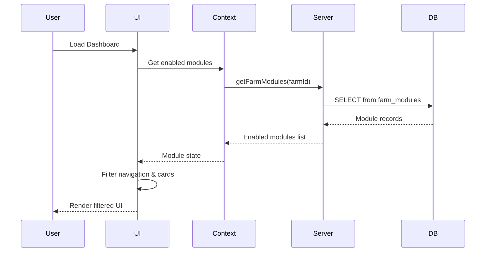

# Design Document: Feature Modules System

## Overview

The Feature Modules System introduces a flexible architecture that allows farms to enable or disable livestock management features based on their operational needs. This design extends LivestockAI from supporting only poultry and fish to supporting cattle, goats, sheep, and bees while maintaining a clean, relevant interface for each user.

The system uses a database-backed module configuration that controls:

- Navigation visibility
- Batch creation options
- Dashboard inventory cards
- Species and feed type options

## Architecture

### High-Level Architecture

```
┌─────────────────────────────────────────────────────────────────┐
│                        UI Layer                                  │
│  ┌──────────┐  ┌──────────┐  ┌──────────┐  ┌──────────────────┐ │
│  │Navigation│  │Dashboard │  │BatchForm │  │ModuleSettings    │ │
│  └────┬─────┘  └────┬─────┘  └────┬─────┘  └────────┬─────────┘ │
│       │             │             │                  │           │
│       └─────────────┴─────────────┴──────────────────┘           │
│                              │                                   │
│                    ┌─────────▼─────────┐                        │
│                    │  ModuleContext    │                        │
│                    │  (React Context)  │                        │
│                    └─────────┬─────────┘                        │
└──────────────────────────────┼──────────────────────────────────┘
                               │
┌──────────────────────────────┼──────────────────────────────────┐
│                        Server Layer                              │
│                    ┌─────────▼─────────┐                        │
│                    │  Module Server    │                        │
│                    │  Functions        │                        │
│                    └─────────┬─────────┘                        │
│                              │                                   │
│                    ┌─────────▼─────────┐                        │
│                    │  Module Constants │                        │
│                    │  (Metadata)       │                        │
│                    └─────────┬─────────┘                        │
└──────────────────────────────┼──────────────────────────────────┘
                               │
┌──────────────────────────────┼──────────────────────────────────┐
│                        Database Layer                            │
│                    ┌─────────▼─────────┐                        │
│                    │   farm_modules    │                        │
│                    │   (new table)     │                        │
│                    └───────────────────┘                        │
│                                                                  │
│     Expanded Constraints: batches, sales, structures, etc.      │
└──────────────────────────────────────────────────────────────────┘
```

### Module Flow



## Components and Interfaces

### 1. Module Types (`app/lib/modules/types.ts`)

```typescript
// Module key type - all supported modules
export type ModuleKey =
  | 'poultry'
  | 'aquaculture'
  | 'cattle'
  | 'goats'
  | 'sheep'
  | 'bees'

// Livestock types mapped from modules
export type LivestockType =
  | 'poultry'
  | 'fish'
  | 'cattle'
  | 'goats'
  | 'sheep'
  | 'bees'

// Product types for sales
export type ProductType =
  | 'poultry'
  | 'fish'
  | 'eggs'
  | 'cattle'
  | 'goats'
  | 'sheep'
  | 'honey'
  | 'milk'
  | 'wool'

// Structure types
export type StructureType =
  | 'house'
  | 'pond'
  | 'pen'
  | 'cage'
  | 'barn'
  | 'pasture'
  | 'hive'
  | 'milking_parlor'
  | 'shearing_shed'

// Feed types
export type FeedType =
  | 'starter'
  | 'grower'
  | 'finisher'
  | 'layer_mash'
  | 'fish_feed'
  | 'cattle_feed'
  | 'goat_feed'
  | 'sheep_feed'
  | 'hay'
  | 'silage'
  | 'bee_feed'

// Module metadata interface
export interface ModuleMetadata {
  key: ModuleKey
  label: string
  description: string
  icon: string // Lucide icon name
  livestockType: LivestockType
  speciesOptions: string[]
  sourceSizeOptions: Array<{ value: string; label: string }>
  feedTypes: FeedType[]
  structureTypes: StructureType[]
  productTypes: ProductType[]
}

// Farm module record
export interface FarmModule {
  id: string
  farmId: string
  moduleKey: ModuleKey
  enabled: boolean
  createdAt: Date
}

// Module context state
export interface ModuleContextState {
  enabledModules: ModuleKey[]
  isLoading: boolean
  toggleModule: (moduleKey: ModuleKey, enabled: boolean) => Promise<void>
  canDisableModule: (moduleKey: ModuleKey) => Promise<boolean>
}
```

### 2. Module Constants (`app/lib/modules/constants.ts`)

```typescript
import type { ModuleMetadata, ModuleKey } from './types'

export const MODULE_METADATA: Record<ModuleKey, ModuleMetadata> = {
  poultry: {
    key: 'poultry',
    label: 'Poultry',
    description: 'Manage chickens, turkeys, ducks, and other birds',
    icon: 'Bird',
    livestockType: 'poultry',
    speciesOptions: [
      'Broiler',
      'Layer',
      'Cockerel',
      'Turkey',
      'Duck',
      'Goose',
      'Guinea Fowl',
      'Quail',
    ],
    sourceSizeOptions: [
      { value: 'day-old', label: 'Day-old Chicks' },
      { value: 'point-of-lay', label: 'Point of Lay' },
      { value: '2-weeks', label: '2 Weeks Old' },
      { value: '4-weeks', label: '4 Weeks Old' },
    ],
    feedTypes: ['starter', 'grower', 'finisher', 'layer_mash'],
    structureTypes: ['house', 'pen', 'cage'],
    productTypes: ['poultry', 'eggs'],
  },
  aquaculture: {
    key: 'aquaculture',
    label: 'Aquaculture',
    description: 'Manage fish and shrimp farming operations',
    icon: 'Fish',
    livestockType: 'fish',
    speciesOptions: [
      'Catfish',
      'Tilapia',
      'Carp',
      'Salmon',
      'Mackerel',
      'Croaker',
      'Snapper',
      'Shrimp',
    ],
    sourceSizeOptions: [
      { value: 'fingerling', label: 'Fingerling (3-5cm)' },
      { value: 'post-fingerling', label: 'Post-fingerling (5-8cm)' },
      { value: 'jumbo', label: 'Jumbo (10-12cm)' },
      { value: 'table-size', label: 'Table Size (15cm+)' },
    ],
    feedTypes: ['fish_feed', 'starter', 'grower', 'finisher'],
    structureTypes: ['pond', 'cage'],
    productTypes: ['fish'],
  },
  cattle: {
    key: 'cattle',
    label: 'Cattle',
    description: 'Manage beef and dairy cattle operations',
    icon: 'Beef', // or custom icon
    livestockType: 'cattle',
    speciesOptions: ['Beef Cattle', 'Dairy Cattle', 'Dual-Purpose'],
    sourceSizeOptions: [
      { value: 'calf', label: 'Calf (0-6 months)' },
      { value: 'weaner', label: 'Weaner (6-12 months)' },
      { value: 'yearling', label: 'Yearling (1-2 years)' },
      { value: 'adult', label: 'Adult (2+ years)' },
    ],
    feedTypes: ['cattle_feed', 'hay', 'silage', 'grower', 'finisher'],
    structureTypes: ['barn', 'pasture', 'pen', 'milking_parlor'],
    productTypes: ['cattle', 'milk'],
  },
  goats: {
    key: 'goats',
    label: 'Goats',
    description: 'Manage meat and dairy goat operations',
    icon: 'Rabbit', // placeholder, will use custom
    livestockType: 'goats',
    speciesOptions: [
      'Boer',
      'Kiko',
      'Nubian',
      'Alpine',
      'Saanen',
      'Nigerian Dwarf',
    ],
    sourceSizeOptions: [
      { value: 'kid', label: 'Kid (0-3 months)' },
      { value: 'weaner', label: 'Weaner (3-6 months)' },
      { value: 'grower', label: 'Grower (6-12 months)' },
      { value: 'adult', label: 'Adult (1+ year)' },
    ],
    feedTypes: ['goat_feed', 'hay', 'grower', 'finisher'],
    structureTypes: ['barn', 'pasture', 'pen'],
    productTypes: ['goats', 'milk'],
  },
  sheep: {
    key: 'sheep',
    label: 'Sheep',
    description: 'Manage meat and wool sheep operations',
    icon: 'Cloud', // placeholder
    livestockType: 'sheep',
    speciesOptions: ['Dorper', 'Merino', 'Suffolk', 'Hampshire', 'Katahdin'],
    sourceSizeOptions: [
      { value: 'lamb', label: 'Lamb (0-6 months)' },
      { value: 'weaner', label: 'Weaner (6-12 months)' },
      { value: 'yearling', label: 'Yearling (1-2 years)' },
      { value: 'adult', label: 'Adult (2+ years)' },
    ],
    feedTypes: ['sheep_feed', 'hay', 'grower', 'finisher'],
    structureTypes: ['barn', 'pasture', 'pen', 'shearing_shed'],
    productTypes: ['sheep', 'wool'],
  },
  bees: {
    key: 'bees',
    label: 'Apiculture',
    description: 'Manage beekeeping and honey production',
    icon: 'Hexagon', // placeholder for honeycomb
    livestockType: 'bees',
    speciesOptions: ['Italian', 'Carniolan', 'Buckfast', 'Russian'],
    sourceSizeOptions: [
      { value: 'package', label: 'Package (3 lbs)' },
      { value: 'nuc', label: 'Nucleus Colony (5 frames)' },
      { value: 'full-hive', label: 'Full Hive' },
      { value: 'swarm', label: 'Captured Swarm' },
    ],
    feedTypes: ['bee_feed'],
    structureTypes: ['hive'],
    productTypes: ['honey'],
  },
}

// Helper functions
export function getEnabledModuleMetadata(
  enabledModules: ModuleKey[],
): ModuleMetadata[] {
  return enabledModules.map((key) => MODULE_METADATA[key])
}

export function getSpeciesForModules(enabledModules: ModuleKey[]): string[] {
  return enabledModules.flatMap((key) => MODULE_METADATA[key].speciesOptions)
}

export function getLivestockTypesForModules(
  enabledModules: ModuleKey[],
): LivestockType[] {
  return enabledModules.map((key) => MODULE_METADATA[key].livestockType)
}

export function getFeedTypesForModules(
  enabledModules: ModuleKey[],
): FeedType[] {
  const feedTypes = new Set<FeedType>()
  enabledModules.forEach((key) => {
    MODULE_METADATA[key].feedTypes.forEach((ft) => feedTypes.add(ft))
  })
  return Array.from(feedTypes)
}

export function getStructureTypesForModules(
  enabledModules: ModuleKey[],
): StructureType[] {
  const structureTypes = new Set<StructureType>()
  enabledModules.forEach((key) => {
    MODULE_METADATA[key].structureTypes.forEach((st) => structureTypes.add(st))
  })
  return Array.from(structureTypes)
}

// Default modules for farm types
export const DEFAULT_MODULES_BY_FARM_TYPE: Record<string, ModuleKey[]> = {
  poultry: ['poultry'],
  fishery: ['aquaculture'],
  mixed: ['poultry', 'aquaculture'],
  cattle: ['cattle'],
  goats: ['goats'],
  sheep: ['sheep'],
  bees: ['bees'],
  multi: ['poultry', 'aquaculture', 'cattle', 'goats', 'sheep', 'bees'],
}

// Core navigation items (always visible)
export const CORE_NAVIGATION = [
  'Dashboard',
  'Farms',
  'Settings',
  'Reports',
  'Customers',
  'Suppliers',
  'Invoices',
  'Expenses',
]

// Module-specific navigation items
export const MODULE_NAVIGATION: Record<ModuleKey, string[]> = {
  poultry: [
    'Batches',
    'Mortality',
    'Feed',
    'Weight',
    'Sales',
    'Health',
    'Inventory',
  ],
  aquaculture: [
    'Batches',
    'Mortality',
    'Feed',
    'Weight',
    'Sales',
    'Health',
    'Water',
    'Inventory',
  ],
  cattle: [
    'Batches',
    'Mortality',
    'Feed',
    'Weight',
    'Sales',
    'Health',
    'Inventory',
  ],
  goats: [
    'Batches',
    'Mortality',
    'Feed',
    'Weight',
    'Sales',
    'Health',
    'Inventory',
  ],
  sheep: [
    'Batches',
    'Mortality',
    'Feed',
    'Weight',
    'Sales',
    'Health',
    'Inventory',
  ],
  bees: ['Batches', 'Sales', 'Inventory'],
}
```

### 3. Server Functions (`app/lib/modules/server.ts`)

```typescript
import { createServerFn } from '@tanstack/react-start'
import type { ModuleKey, FarmModule } from './types'
import { DEFAULT_MODULES_BY_FARM_TYPE } from './constants'

// Get modules for a farm
export async function getFarmModules(farmId: string): Promise<FarmModule[]> {
  const { db } = await import('../db')

  return db
    .selectFrom('farm_modules')
    .selectAll()
    .where('farmId', '=', farmId)
    .execute()
}

// Get enabled module keys for a farm
export async function getEnabledModules(farmId: string): Promise<ModuleKey[]> {
  const modules = await getFarmModules(farmId)
  return modules.filter((m) => m.enabled).map((m) => m.moduleKey as ModuleKey)
}

// Create default modules for a new farm
export async function createDefaultModules(
  farmId: string,
  farmType: string,
): Promise<void> {
  const { db } = await import('../db')

  const defaultModules = DEFAULT_MODULES_BY_FARM_TYPE[farmType] || ['poultry']

  const values = defaultModules.map((moduleKey) => ({
    farmId,
    moduleKey,
    enabled: true,
  }))

  await db.insertInto('farm_modules').values(values).execute()
}

// Toggle a module
export async function toggleModule(
  farmId: string,
  moduleKey: ModuleKey,
  enabled: boolean,
): Promise<void> {
  const { db } = await import('../db')

  // Check if module record exists
  const existing = await db
    .selectFrom('farm_modules')
    .select('id')
    .where('farmId', '=', farmId)
    .where('moduleKey', '=', moduleKey)
    .executeTakeFirst()

  if (existing) {
    await db
      .updateTable('farm_modules')
      .set({ enabled })
      .where('farmId', '=', farmId)
      .where('moduleKey', '=', moduleKey)
      .execute()
  } else {
    await db
      .insertInto('farm_modules')
      .values({ farmId, moduleKey, enabled })
      .execute()
  }
}

// Check if module can be disabled (no active batches)
export async function canDisableModule(
  farmId: string,
  moduleKey: ModuleKey,
): Promise<{ canDisable: boolean; reason?: string }> {
  const { db } = await import('../db')
  const { MODULE_METADATA } = await import('./constants')

  const metadata = MODULE_METADATA[moduleKey]
  const livestockType = metadata.livestockType

  const activeBatches = await db
    .selectFrom('batches')
    .select('id')
    .where('farmId', '=', farmId)
    .where('livestockType', '=', livestockType)
    .where('status', '=', 'active')
    .executeTakeFirst()

  if (activeBatches) {
    return {
      canDisable: false,
      reason: `Cannot disable ${metadata.label} module: active batches exist`,
    }
  }

  return { canDisable: true }
}

// Server function exports
export const getFarmModulesFn = createServerFn({ method: 'GET' })
  .inputValidator((data: { farmId: string }) => data)
  .handler(async ({ data }) => {
    const { requireAuth } = await import('../auth/server-middleware')
    await requireAuth()
    return getEnabledModules(data.farmId)
  })

export const toggleModuleFn = createServerFn({ method: 'POST' })
  .inputValidator(
    (data: { farmId: string; moduleKey: ModuleKey; enabled: boolean }) => data,
  )
  .handler(async ({ data }) => {
    const { requireAuth } = await import('../auth/server-middleware')
    await requireAuth()

    if (!data.enabled) {
      const check = await canDisableModule(data.farmId, data.moduleKey)
      if (!check.canDisable) {
        throw new Error(check.reason)
      }
    }

    await toggleModule(data.farmId, data.moduleKey, data.enabled)
    return { success: true }
  })

export const canDisableModuleFn = createServerFn({ method: 'GET' })
  .inputValidator((data: { farmId: string; moduleKey: ModuleKey }) => data)
  .handler(async ({ data }) => {
    const { requireAuth } = await import('../auth/server-middleware')
    await requireAuth()
    return canDisableModule(data.farmId, data.moduleKey)
  })
```

## Data Models

### Database Schema Changes

The following changes will be made to the existing migration file (`app/lib/db/migrations/2025-01-08-001-initial-schema.ts`):

#### 1. New Table: `farm_modules`

```sql
CREATE TABLE farm_modules (
  id UUID PRIMARY KEY DEFAULT uuid_generate_v4(),
  farmId UUID NOT NULL REFERENCES farms(id) ON DELETE CASCADE,
  moduleKey VARCHAR(20) NOT NULL,
  enabled BOOLEAN NOT NULL DEFAULT true,
  createdAt TIMESTAMPTZ DEFAULT now(),
  UNIQUE(farmId, moduleKey)
);

ALTER TABLE farm_modules ADD CONSTRAINT farm_modules_key_check
  CHECK (moduleKey IN ('poultry', 'aquaculture', 'cattle', 'goats', 'sheep', 'bees'));

CREATE INDEX idx_farm_modules_farm_id ON farm_modules(farmId);
```

#### 2. Expanded Constraints

```sql
-- farms.type
ALTER TABLE farms DROP CONSTRAINT farms_type_check;
ALTER TABLE farms ADD CONSTRAINT farms_type_check
  CHECK (type IN ('poultry', 'fishery', 'mixed', 'cattle', 'goats', 'sheep', 'bees', 'multi'));

-- batches.livestockType
ALTER TABLE batches DROP CONSTRAINT batches_livestock_type_check;
ALTER TABLE batches ADD CONSTRAINT batches_livestock_type_check
  CHECK ("livestockType" IN ('poultry', 'fish', 'cattle', 'goats', 'sheep', 'bees'));

-- sales.livestockType
ALTER TABLE sales DROP CONSTRAINT sales_livestock_type_check;
ALTER TABLE sales ADD CONSTRAINT sales_livestock_type_check
  CHECK ("livestockType" IN ('poultry', 'fish', 'eggs', 'cattle', 'goats', 'sheep', 'honey', 'milk', 'wool'));

-- structures.type
ALTER TABLE structures DROP CONSTRAINT structures_type_check;
ALTER TABLE structures ADD CONSTRAINT structures_type_check
  CHECK (type IN ('house', 'pond', 'pen', 'cage', 'barn', 'pasture', 'hive', 'milking_parlor', 'shearing_shed'));

-- feed_records.feedType
ALTER TABLE feed_records DROP CONSTRAINT feed_records_feed_type_check;
ALTER TABLE feed_records ADD CONSTRAINT feed_records_feed_type_check
  CHECK ("feedType" IN ('starter', 'grower', 'finisher', 'layer_mash', 'fish_feed', 'cattle_feed', 'goat_feed', 'sheep_feed', 'hay', 'silage', 'bee_feed'));

-- feed_inventory.feedType
ALTER TABLE feed_inventory DROP CONSTRAINT feed_inventory_feed_type_check;
ALTER TABLE feed_inventory ADD CONSTRAINT feed_inventory_feed_type_check
  CHECK ("feedType" IN ('starter', 'grower', 'finisher', 'layer_mash', 'fish_feed', 'cattle_feed', 'goat_feed', 'sheep_feed', 'hay', 'silage', 'bee_feed'));

-- suppliers.supplierType
ALTER TABLE suppliers DROP CONSTRAINT suppliers_type_check;
ALTER TABLE suppliers ADD CONSTRAINT suppliers_type_check
  CHECK ("supplierType" IS NULL OR "supplierType" IN ('hatchery', 'feed_mill', 'pharmacy', 'equipment', 'fingerlings', 'cattle_dealer', 'goat_dealer', 'sheep_dealer', 'bee_supplier', 'other'));

-- expenses.category
ALTER TABLE expenses DROP CONSTRAINT expenses_category_check;
ALTER TABLE expenses ADD CONSTRAINT expenses_category_check
  CHECK (category IN ('feed', 'medicine', 'equipment', 'utilities', 'labor', 'transport', 'livestock', 'livestock_chicken', 'livestock_fish', 'livestock_cattle', 'livestock_goats', 'livestock_sheep', 'livestock_bees', 'maintenance', 'marketing', 'other'));
```

### TypeScript Type Updates (`app/lib/db/types.ts`)

```typescript
// Add to Database interface
farm_modules: FarmModuleTable

// New table interface
export interface FarmModuleTable {
  id: Generated<string>
  farmId: string
  moduleKey: 'poultry' | 'aquaculture' | 'cattle' | 'goats' | 'sheep' | 'bees'
  enabled: boolean
  createdAt: Generated<Date>
}

// Update FarmTable.type
type: 'poultry' |
  'fishery' |
  'mixed' |
  'cattle' |
  'goats' |
  'sheep' |
  'bees' |
  'multi'

// Update BatchTable.livestockType
livestockType: 'poultry' | 'fish' | 'cattle' | 'goats' | 'sheep' | 'bees'

// Update SaleTable.livestockType
livestockType: 'poultry' |
  'fish' |
  'eggs' |
  'cattle' |
  'goats' |
  'sheep' |
  'honey' |
  'milk' |
  'wool'

// Update StructureTable.type
type: 'house' |
  'pond' |
  'pen' |
  'cage' |
  'barn' |
  'pasture' |
  'hive' |
  'milking_parlor' |
  'shearing_shed'

// Update FeedTable.feedType and FeedInventoryTable.feedType
feedType: 'starter' |
  'grower' |
  'finisher' |
  'layer_mash' |
  'fish_feed' |
  'cattle_feed' |
  'goat_feed' |
  'sheep_feed' |
  'hay' |
  'silage' |
  'bee_feed'

// Update SupplierTable.supplierType
supplierType: 'hatchery' |
  'feed_mill' |
  'pharmacy' |
  'equipment' |
  'fingerlings' |
  'cattle_dealer' |
  'goat_dealer' |
  'sheep_dealer' |
  'bee_supplier' |
  'other' |
  null

// Update ExpenseTable.category
category: 'feed' |
  'medicine' |
  'equipment' |
  'utilities' |
  'labor' |
  'transport' |
  'livestock' |
  'livestock_chicken' |
  'livestock_fish' |
  'livestock_cattle' |
  'livestock_goats' |
  'livestock_sheep' |
  'livestock_bees' |
  'maintenance' |
  'marketing' |
  'other'
```

## Correctness Properties

_A property is a characteristic or behavior that should hold true across all valid executions of a system—essentially, a formal statement about what the system should do. Properties serve as the bridge between human-readable specifications and machine-verifiable correctness guarantees._

### Property 1: Module Persistence Round-Trip

_For any_ farm and any module key, if a module is toggled to a state (enabled/disabled), then querying the module state should return that same state.

**Validates: Requirements 1.1, 1.3**

### Property 2: Default Modules Match Farm Type

_For any_ farm type, when a new farm is created, the default modules created should match the expected defaults for that farm type.

**Validates: Requirements 1.2**

### Property 3: Module Toggle Affects Feature Visibility

_For any_ module, when it is enabled, its associated navigation items should be visible; when disabled, they should be hidden.

**Validates: Requirements 2.2, 2.3, 3.1, 3.2**

### Property 4: Active Batches Prevent Module Disable

_For any_ farm with active batches of a livestock type, attempting to disable the corresponding module should fail with an appropriate error.

**Validates: Requirements 2.4**

### Property 5: Module Metadata Completeness

_For any_ module key in the system, the module metadata should contain all required fields: key, label, description, icon, livestockType, speciesOptions, sourceSizeOptions, feedTypes, structureTypes, productTypes.

**Validates: Requirements 2.5, 9.2**

### Property 6: Core Navigation Always Visible

_For any_ set of enabled modules (including empty set), core navigation items (Dashboard, Farms, Settings, Reports) should always be present in the navigation.

**Validates: Requirements 3.3**

### Property 7: Batch Creation Shows Only Enabled Livestock Types

_For any_ set of enabled modules, the batch creation form should only show livestock types corresponding to those enabled modules.

**Validates: Requirements 4.2**

### Property 8: Species Options Appropriate Per Livestock Type

_For any_ livestock type, the species options returned should be non-empty and all species should be valid for that livestock type.

**Validates: Requirements 4.3, 5.1-5.6**

### Property 9: Source Size Options Appropriate Per Livestock Type

_For any_ livestock type, the source size options returned should be non-empty and all options should be valid for that livestock type.

**Validates: Requirements 4.4**

### Property 10: Feed Types Filtered By Livestock Type

_For any_ livestock type, the feed types returned should include at least one feed type appropriate for that livestock.

**Validates: Requirements 7.2**

### Property 11: Dashboard Renders Only Enabled Module Cards

_For any_ set of enabled modules, the dashboard inventory cards should only include cards for those enabled modules.

**Validates: Requirements 8.1, 8.3**

### Property 12: Helper Functions Filter By Enabled Modules

_For any_ set of enabled modules, helper functions (getSpeciesForModules, getLivestockTypesForModules, etc.) should return only options from those enabled modules.

**Validates: Requirements 9.4**

## Error Handling

### Module Toggle Errors

| Error Condition             | Error Message                                          | HTTP Status |
| --------------------------- | ------------------------------------------------------ | ----------- |
| Disable with active batches | "Cannot disable {module} module: active batches exist" | 400         |
| Invalid module key          | "Invalid module key: {key}"                            | 400         |
| Farm not found              | "Farm not found"                                       | 404         |
| Unauthorized                | "Access denied to this farm"                           | 403         |

### Validation Errors

| Error Condition                  | Error Message                                |
| -------------------------------- | -------------------------------------------- |
| No modules enabled               | "At least one module must be enabled"        |
| Invalid livestock type for batch | "Livestock type not available for this farm" |

## Testing Strategy

### Unit Tests

Unit tests will verify specific examples and edge cases:

1. Module metadata structure validation
2. Default module creation for each farm type
3. Helper function output for specific module combinations
4. Error message formatting

### Property-Based Tests

Property-based tests will use `fast-check` to verify universal properties across all inputs:

1. **Module persistence**: Toggle → Query → Verify state matches
2. **Default modules**: Create farm → Verify modules match farm type
3. **Navigation filtering**: Enable modules → Verify navigation items
4. **Batch type filtering**: Enable modules → Verify batch options
5. **Helper function filtering**: Enable modules → Verify filtered output

### Test Configuration

- Minimum 100 iterations per property test
- Use `fast-check` for property-based testing
- Tag format: **Feature: feature-modules, Property {number}: {property_text}**

### Integration Tests

1. Full flow: Create farm → Enable modules → Create batch → Verify constraints
2. Module disable prevention with active batches
3. Navigation rendering with various module combinations
