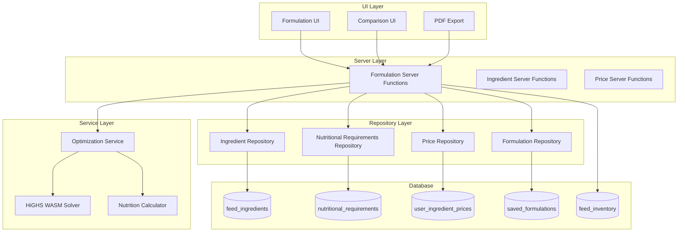
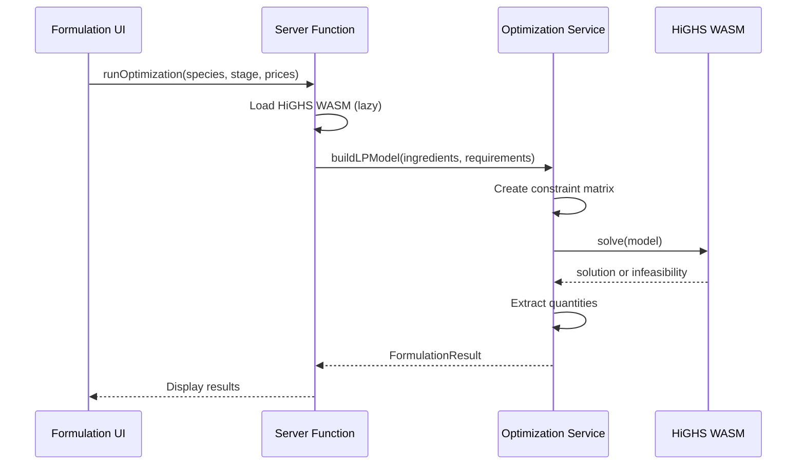

# Design Document: Feed Formulation Calculator

## Overview

The Feed Formulation Calculator is a sophisticated optimization tool that leverages linear programming to create cost-optimal feed recipes. The system uses the HiGHS solver compiled to WebAssembly, enabling high-performance optimization directly in Cloudflare Workers without external dependencies.

The design follows OpenLivestock's three-layer architecture (Server → Service → Repository) and integrates with existing systems:

- **Feed inventory** (`feed_inventory` table) for stock levels
- **Breeds** (`breeds` table) for species-specific data
- **User settings** (`user_settings` table) for currency formatting via `useFormatCurrency` hook
- **Batches** (`batches` table) for formulation-batch linking

## Codebase Integration Points

### Existing Systems to Leverage

| System              | Location                                 | Integration                                      |
| ------------------- | ---------------------------------------- | ------------------------------------------------ |
| Currency formatting | `app/features/settings/hooks.ts`         | Use `useFormatCurrency()` for all price displays |
| Feed inventory      | `app/features/feed/server.ts`            | Query `feed_inventory` for stock levels          |
| Breeds reference    | `app/features/breeds/server.ts`          | Get species list from breeds table               |
| Error handling      | `app/lib/errors/index.ts`                | Use `AppError` class for all errors              |
| Database types      | `app/lib/db/types.ts`                    | Add new table interfaces                         |
| Auth middleware     | `app/features/auth/server-middleware.ts` | Use `requireAuth()` for authentication           |
| Farm access         | `app/features/auth/utils.ts`             | Use `verifyFarmAccess()` for authorization       |

### Species Names (Must Match Existing Data)

Species names in `nutritional_requirements` must use **Title Case** to match existing `growth_standards.species` values:

- Poultry: `Broiler`, `Layer`, `Turkey`
- Aquaculture: `Catfish`, `Tilapia`
- Ruminants: `Beef_Cattle`, `Dairy_Cattle`, `Meat_Goat`, `Dairy_Goat`, `Meat_Sheep`

### Server Function Pattern (Three-Layer Architecture)

```typescript
// app/features/formulation/server.ts
import { createServerFn } from '@tanstack/react-start'
import { z } from 'zod'
import { AppError } from '~/lib/errors'

export const getIngredientsWithPricesFn = createServerFn({ method: 'GET' })
    .inputValidator(z.object({ farmId: z.string().uuid().optional() }))
    .handler(async ({ data }) => {
        try {
            // 1. Auth middleware (dynamic import for Cloudflare Workers)
            const { requireAuth } =
                await import('~/features/auth/server-middleware')
            const session = await requireAuth()

            // 2. Database access (MUST use getDb() for Cloudflare Workers)
            const { getDb } = await import('~/lib/db')
            const db = await getDb()

            // 3. Repository layer for database operations
            const { getAllIngredients, getUserPrices } =
                await import('./repository')

            const [ingredients, prices] = await Promise.all([
                getAllIngredients(db),
                getUserPrices(db, session.user.id),
            ])

            // 4. Service layer for business logic (if needed)
            const { mergeIngredientsWithPrices } = await import('./service')
            return mergeIngredientsWithPrices(ingredients, prices)
        } catch (error) {
            if (error instanceof AppError) throw error
            throw new AppError('DATABASE_ERROR', {
                message: 'Failed to fetch ingredients',
                cause: error,
            })
        }
    })
```

### Repository Layer Pattern

```typescript
// app/features/formulation/repository.ts
import type { Kysely } from 'kysely'
import type { Database } from '~/lib/db/types'

export async function getAllIngredients(db: Kysely<Database>) {
    return db
        .selectFrom('feed_ingredients')
        .selectAll()
        .where('isActive', '=', true)
        .orderBy('category')
        .orderBy('name')
        .execute()
}

export async function getUserPrices(db: Kysely<Database>, userId: string) {
    return db
        .selectFrom('user_ingredient_prices')
        .selectAll()
        .where('userId', '=', userId)
        .execute()
}

export async function upsertUserPrice(
    db: Kysely<Database>,
    userId: string,
    ingredientId: string,
    pricePerKg: string,
) {
    return db
        .insertInto('user_ingredient_prices')
        .values({
            userId,
            ingredientId,
            pricePerKg,
            isAvailable: true,
        })
        .onConflict((oc) =>
            oc.columns(['userId', 'ingredientId']).doUpdateSet({
                pricePerKg,
                lastUpdated: new Date(),
            }),
        )
        .execute()
}
```

### Service Layer Pattern (Pure Functions)

```typescript
// app/features/formulation/service.ts

// Pure function - no database access, easy to test
export function calculateNutritionalValues(
    ingredients: FormulationIngredient[],
    allIngredients: FeedIngredient[],
): NutritionalValues {
    const ingredientMap = new Map(allIngredients.map((i) => [i.id, i]))

    let totalProtein = 0
    let totalEnergy = 0
    // ... calculate weighted averages

    return {
        proteinPercent: totalProtein,
        energyKcalKg: totalEnergy,
        // ...
    }
}

// Validation function - returns error message or null
export function validateOptimizationInput(
    ingredients: IngredientWithPrice[],
    requirements: NutritionalRequirement,
): string | null {
    if (ingredients.length === 0) {
        return 'No ingredients with prices available'
    }
    if (!requirements) {
        return 'Nutritional requirements not found for species/stage'
    }
    return null
}
```

### UI Component Pattern with Currency Formatting

```typescript
// app/components/formulation/price-display.tsx
import { useFormatCurrency } from '~/features/settings'

interface PriceDisplayProps {
  amount: number | string
  perUnit?: string
}

export function PriceDisplay({ amount, perUnit }: PriceDisplayProps) {
  const { format } = useFormatCurrency()
  const numericAmount = typeof amount === 'string' ? parseFloat(amount) : amount

  return (
    <span className="font-medium">
      {format(numericAmount)}
      {perUnit && <span className="text-muted-foreground">/{perUnit}</span>}
    </span>
  )
}

// Usage in ingredient table
function IngredientPriceCell({ pricePerKg }: { pricePerKg: string }) {
  return <PriceDisplay amount={pricePerKg} perUnit="kg" />
}
```

### Error Handling Pattern

Use existing `AppError` class with appropriate reason codes:

```typescript
import { AppError } from '~/lib/errors'

// Available reason codes for formulation feature:
// - VALIDATION_ERROR (40000) - Invalid input data
// - NOT_FOUND (40400) - Generic resource not found
// - INSUFFICIENT_STOCK (40002) - Not enough inventory
// - DATABASE_ERROR (50001) - Database operation failed

// New codes to add to error-map.ts:
// - INGREDIENT_NOT_FOUND (404xx) - Feed ingredient not found
// - REQUIREMENTS_NOT_FOUND (404xx) - Nutritional requirements not found
// - FORMULATION_NOT_FOUND (404xx) - Saved formulation not found
// - SOLVER_TIMEOUT (500xx) - Optimization took too long
// - SOLVER_UNAVAILABLE (500xx) - HiGHS WASM failed to load
// - NO_PRICED_INGREDIENTS (400xx) - No ingredients have prices set

// Example usage:
if (!requirements) {
    throw new AppError('NOT_FOUND', {
        message: 'Nutritional requirements not found for this species/stage',
        metadata: { species, productionStage },
    })
}
```

### Feed Inventory Integration

Query existing `feed_inventory` table for stock levels:

```typescript
// In repository.ts
export async function getIngredientStockLevels(
    db: Kysely<Database>,
    farmId: string,
) {
    // Map feed_inventory.feedType to ingredient categories
    return db
        .selectFrom('feed_inventory')
        .select(['feedType', 'quantityKg'])
        .where('farmId', '=', farmId)
        .execute()
}

// In server.ts - combine with ingredients
const inventory = await getIngredientStockLevels(db, farmId)
const ingredientsWithStock = ingredients.map((ing) => ({
    ...ing,
    stockKg:
        inventory.find((i) => i.feedType === ing.category)?.quantityKg ?? '0',
}))
```

## Architecture

### High-Level System Flow



### Linear Programming Model

The optimization problem is formulated as:

**Objective:** Minimize Σ(price_i × quantity_i) for all ingredients i

**Subject to:**

- Σ(quantity_i) = 100 (total must equal 100kg batch)
- Σ(protein_i × quantity_i) ≥ min_protein × 100
- Σ(energy_i × quantity_i) ≥ min_energy × 100
- Σ(fiber_i × quantity_i) ≤ max_fiber × 100
- Σ(calcium_i × quantity_i) ≥ min_calcium × 100
- Σ(phosphorus_i × quantity_i) ≥ min_phosphorus × 100
- Σ(lysine_i × quantity_i) ≥ min_lysine × 100
- Σ(methionine_i × quantity_i) ≥ min_methionine × 100
- 0 ≤ quantity_i ≤ max_inclusion_i × 100 for each ingredient

### HiGHS WASM Integration



## Components and Interfaces

### 1. Ingredient Repository (`app/features/formulation/repository.ts`)

```typescript
interface FeedIngredient {
    id: string
    name: string
    category: 'grain' | 'protein' | 'mineral' | 'vitamin' | 'additive'
    proteinPercent: string // DECIMAL
    energyKcalKg: number
    fatPercent: string
    fiberPercent: string
    calciumPercent: string
    phosphorusPercent: string
    lysinePercent: string
    methioninePercent: string
    maxInclusionPercent: string
    isActive: boolean
    createdAt: Date
}

// Repository functions
async function getAllIngredients(
    db: Kysely<Database>,
): Promise<FeedIngredient[]>
async function getIngredientsByCategory(
    db: Kysely<Database>,
    category: string,
): Promise<FeedIngredient[]>
async function getIngredientById(
    db: Kysely<Database>,
    id: string,
): Promise<FeedIngredient | undefined>
```

### 2. Nutritional Requirements Repository

```typescript
interface NutritionalRequirement {
    id: string
    species: string
    productionStage: string
    minProteinPercent: string
    minEnergyKcalKg: number
    maxFiberPercent: string
    minCalciumPercent: string
    minPhosphorusPercent: string
    minLysinePercent: string
    minMethioninePercent: string
    createdAt: Date
}

// Repository functions
async function getRequirements(
    db: Kysely<Database>,
    species: string,
    stage: string,
): Promise<NutritionalRequirement | undefined>

async function getAllRequirements(
    db: Kysely<Database>,
): Promise<NutritionalRequirement[]>
```

### 3. User Prices Repository

```typescript
interface UserIngredientPrice {
    id: string
    userId: string
    ingredientId: string
    pricePerKg: string // DECIMAL
    isAvailable: boolean
    lastUpdated: Date
}

// Repository functions
async function getUserPrices(
    db: Kysely<Database>,
    userId: string,
): Promise<UserIngredientPrice[]>
async function upsertUserPrice(
    db: Kysely<Database>,
    userId: string,
    ingredientId: string,
    pricePerKg: string,
): Promise<void>
async function setIngredientAvailability(
    db: Kysely<Database>,
    userId: string,
    ingredientId: string,
    isAvailable: boolean,
): Promise<void>
```

### 4. Formulation Repository

```typescript
interface SavedFormulation {
    id: string
    userId: string
    name: string
    species: string
    productionStage: string
    ingredients: FormulationIngredient[] // JSONB
    totalCostPerKg: string
    nutritionalValues: NutritionalValues // JSONB
    shareCode: string | null
    createdAt: Date
    updatedAt: Date
}

interface FormulationIngredient {
    ingredientId: string
    ingredientName: string
    quantityKg: number
    pricePerKg: number
    totalCost: number
}

interface NutritionalValues {
    proteinPercent: number
    energyKcalKg: number
    fatPercent: number
    fiberPercent: number
    calciumPercent: number
    phosphorusPercent: number
    lysinePercent: number
    methioninePercent: number
}

// Repository functions
async function saveFormulation(
    db: Kysely<Database>,
    formulation: SavedFormulation,
): Promise<string>
async function getUserFormulations(
    db: Kysely<Database>,
    userId: string,
): Promise<SavedFormulation[]>
async function getFormulationById(
    db: Kysely<Database>,
    id: string,
): Promise<SavedFormulation | undefined>
async function getFormulationByShareCode(
    db: Kysely<Database>,
    code: string,
): Promise<SavedFormulation | undefined>
async function deleteFormulation(
    db: Kysely<Database>,
    id: string,
): Promise<void>
```

### 5. Optimization Service (`app/features/formulation/service.ts`)

```typescript
interface OptimizationInput {
    ingredients: IngredientWithPrice[]
    requirements: NutritionalRequirement
    excludeIngredients?: string[]
    maxQuantities?: Record<string, number> // ingredient ID -> max kg
}

interface OptimizationResult {
    success: boolean
    ingredients: FormulationIngredient[]
    totalCostPerKg: number
    nutritionalValues: NutritionalValues
    infeasibilityReport?: InfeasibilityReport
}

interface InfeasibilityReport {
    constraintsViolated: string[]
    suggestions: string[]
}

// Service functions
async function runOptimization(
    input: OptimizationInput,
): Promise<OptimizationResult>
function buildLPModel(input: OptimizationInput): LPModel
function parseOptimizationResult(
    solution: HighsSolution,
    ingredients: IngredientWithPrice[],
): OptimizationResult
function calculateNutritionalValues(
    ingredients: FormulationIngredient[],
    allIngredients: FeedIngredient[],
): NutritionalValues
function generateInfeasibilityReport(
    model: LPModel,
    requirements: NutritionalRequirement,
): InfeasibilityReport
```

### 6. Server Functions (`app/features/formulation/server.ts`)

```typescript
// Get all ingredients with user prices
export const getIngredientsWithPricesFn = createServerFn({ method: 'GET' })
    .validator(z.object({}))
    .handler(async () => {
        /* ... */
    })

// Get nutritional requirements for species/stage
export const getRequirementsFn = createServerFn({ method: 'GET' })
    .validator(
        z.object({
            species: z.string(),
            productionStage: z.string(),
        }),
    )
    .handler(async ({ data }) => {
        /* ... */
    })

// Update user ingredient price
export const updateIngredientPriceFn = createServerFn({ method: 'POST' })
    .validator(
        z.object({
            ingredientId: z.string().uuid(),
            pricePerKg: z.number().nonnegative(),
        }),
    )
    .handler(async ({ data }) => {
        /* ... */
    })

// Run optimization
export const runOptimizationFn = createServerFn({ method: 'POST' })
    .validator(
        z.object({
            species: z.string(),
            productionStage: z.string(),
            excludeIngredients: z.array(z.string().uuid()).optional(),
            useInventoryLimits: z.boolean().optional(),
        }),
    )
    .handler(async ({ data }) => {
        /* ... */
    })

// Save formulation
export const saveFormulationFn = createServerFn({ method: 'POST' })
    .validator(
        z.object({
            name: z.string().min(1).max(100),
            species: z.string(),
            productionStage: z.string(),
            ingredients: z.array(
                z.object({
                    ingredientId: z.string().uuid(),
                    ingredientName: z.string(),
                    quantityKg: z.number(),
                    pricePerKg: z.number(),
                    totalCost: z.number(),
                }),
            ),
            totalCostPerKg: z.number(),
            nutritionalValues: z.object({
                proteinPercent: z.number(),
                energyKcalKg: z.number(),
                fatPercent: z.number(),
                fiberPercent: z.number(),
                calciumPercent: z.number(),
                phosphorusPercent: z.number(),
                lysinePercent: z.number(),
                methioninePercent: z.number(),
            }),
        }),
    )
    .handler(async ({ data }) => {
        /* ... */
    })

// Get user's saved formulations
export const getUserFormulationsFn = createServerFn({ method: 'GET' })
    .validator(z.object({}))
    .handler(async () => {
        /* ... */
    })

// Generate share code
export const generateShareCodeFn = createServerFn({ method: 'POST' })
    .validator(z.object({ formulationId: z.string().uuid() }))
    .handler(async ({ data }) => {
        /* ... */
    })

// Load formulation by share code
export const loadSharedFormulationFn = createServerFn({ method: 'GET' })
    .validator(z.object({ shareCode: z.string() }))
    .handler(async ({ data }) => {
        /* ... */
    })
```

## Data Models

### Feed Ingredients Table

```sql
CREATE TABLE feed_ingredients (
  id UUID PRIMARY KEY DEFAULT gen_random_uuid(),
  name VARCHAR(100) NOT NULL UNIQUE,
  category VARCHAR(20) NOT NULL CHECK (category IN ('grain', 'protein', 'mineral', 'vitamin', 'additive')),
  protein_percent DECIMAL(5,2) NOT NULL DEFAULT 0,
  energy_kcal_kg INTEGER NOT NULL DEFAULT 0,
  fat_percent DECIMAL(5,2) NOT NULL DEFAULT 0,
  fiber_percent DECIMAL(5,2) NOT NULL DEFAULT 0,
  calcium_percent DECIMAL(5,3) NOT NULL DEFAULT 0,
  phosphorus_percent DECIMAL(5,3) NOT NULL DEFAULT 0,
  lysine_percent DECIMAL(5,3) NOT NULL DEFAULT 0,
  methionine_percent DECIMAL(5,3) NOT NULL DEFAULT 0,
  max_inclusion_percent DECIMAL(5,2) NOT NULL DEFAULT 100,
  is_active BOOLEAN NOT NULL DEFAULT true,
  created_at TIMESTAMP WITH TIME ZONE DEFAULT NOW()
);

CREATE INDEX idx_feed_ingredients_category ON feed_ingredients(category);
CREATE INDEX idx_feed_ingredients_active ON feed_ingredients(is_active) WHERE is_active = true;
```

### Nutritional Requirements Table

```sql
CREATE TABLE nutritional_requirements (
  id UUID PRIMARY KEY DEFAULT gen_random_uuid(),
  species VARCHAR(50) NOT NULL,
  production_stage VARCHAR(20) NOT NULL CHECK (production_stage IN ('starter', 'grower', 'finisher', 'layer', 'maintenance', 'lactating', 'dry')),
  min_protein_percent DECIMAL(5,2) NOT NULL,
  min_energy_kcal_kg INTEGER NOT NULL,
  max_fiber_percent DECIMAL(5,2) NOT NULL,
  min_calcium_percent DECIMAL(5,3) NOT NULL,
  min_phosphorus_percent DECIMAL(5,3) NOT NULL,
  min_lysine_percent DECIMAL(5,3) NOT NULL,
  min_methionine_percent DECIMAL(5,3) NOT NULL,
  created_at TIMESTAMP WITH TIME ZONE DEFAULT NOW(),

  UNIQUE(species, production_stage)
);

CREATE INDEX idx_nutritional_requirements_species ON nutritional_requirements(species);
```

### User Ingredient Prices Table

```sql
CREATE TABLE user_ingredient_prices (
  id UUID PRIMARY KEY DEFAULT gen_random_uuid(),
  user_id UUID NOT NULL REFERENCES users(id) ON DELETE CASCADE,
  ingredient_id UUID NOT NULL REFERENCES feed_ingredients(id) ON DELETE CASCADE,
  price_per_kg DECIMAL(10,2) NOT NULL,
  is_available BOOLEAN NOT NULL DEFAULT true,
  last_updated TIMESTAMP WITH TIME ZONE DEFAULT NOW(),

  UNIQUE(user_id, ingredient_id)
);

CREATE INDEX idx_user_ingredient_prices_user ON user_ingredient_prices(user_id);
```

### Ingredient Price History Table

```sql
CREATE TABLE ingredient_price_history (
  id UUID PRIMARY KEY DEFAULT gen_random_uuid(),
  user_id UUID NOT NULL REFERENCES users(id) ON DELETE CASCADE,
  ingredient_id UUID NOT NULL REFERENCES feed_ingredients(id) ON DELETE CASCADE,
  price_per_kg DECIMAL(10,2) NOT NULL,
  recorded_at TIMESTAMP WITH TIME ZONE DEFAULT NOW()
);

CREATE INDEX idx_ingredient_price_history_user_ingredient ON ingredient_price_history(user_id, ingredient_id);
CREATE INDEX idx_ingredient_price_history_date ON ingredient_price_history(recorded_at);
```

### Formulation Usage Table

```sql
CREATE TABLE formulation_usage (
  id UUID PRIMARY KEY DEFAULT gen_random_uuid(),
  formulation_id UUID NOT NULL REFERENCES saved_formulations(id) ON DELETE CASCADE,
  batch_id UUID NOT NULL REFERENCES batches(id) ON DELETE CASCADE,
  used_at TIMESTAMP WITH TIME ZONE DEFAULT NOW(),
  notes TEXT,

  UNIQUE(formulation_id, batch_id)
);

CREATE INDEX idx_formulation_usage_formulation ON formulation_usage(formulation_id);
CREATE INDEX idx_formulation_usage_batch ON formulation_usage(batch_id);
```

### Saved Formulations Table

```sql
CREATE TABLE saved_formulations (
  id UUID PRIMARY KEY DEFAULT gen_random_uuid(),
  user_id UUID NOT NULL REFERENCES users(id) ON DELETE CASCADE,
  name VARCHAR(100) NOT NULL,
  species VARCHAR(50) NOT NULL,
  production_stage VARCHAR(20) NOT NULL,
  batch_size_kg INTEGER NOT NULL DEFAULT 100,
  safety_margin_percent DECIMAL(4,2) NOT NULL DEFAULT 2.0,
  ingredients JSONB NOT NULL,
  total_cost_per_kg DECIMAL(10,2) NOT NULL,
  nutritional_values JSONB NOT NULL,
  mixing_notes TEXT,
  share_code VARCHAR(20) UNIQUE,
  usage_count INTEGER NOT NULL DEFAULT 0,
  created_at TIMESTAMP WITH TIME ZONE DEFAULT NOW(),
  updated_at TIMESTAMP WITH TIME ZONE DEFAULT NOW()
);

CREATE INDEX idx_saved_formulations_user ON saved_formulations(user_id);
CREATE INDEX idx_saved_formulations_share_code ON saved_formulations(share_code) WHERE share_code IS NOT NULL;
```

### TypeScript Types

```typescript
// app/lib/db/types.ts additions

export interface FeedIngredientTable {
    id: Generated<string>
    name: string
    category: 'grain' | 'protein' | 'mineral' | 'vitamin' | 'additive'
    proteinPercent: string // DECIMAL(5,2)
    energyKcalKg: number
    fatPercent: string
    fiberPercent: string
    calciumPercent: string
    phosphorusPercent: string
    lysinePercent: string
    methioninePercent: string
    maxInclusionPercent: string
    isActive: Generated<boolean>
    createdAt: Generated<Date>
}

export interface NutritionalRequirementTable {
    id: Generated<string>
    species: string
    productionStage:
        | 'starter'
        | 'grower'
        | 'finisher'
        | 'layer'
        | 'maintenance'
        | 'lactating'
        | 'dry'
    minProteinPercent: string
    minEnergyKcalKg: number
    maxFiberPercent: string
    minCalciumPercent: string
    minPhosphorusPercent: string
    minLysinePercent: string
    minMethioninePercent: string
    createdAt: Generated<Date>
}

export interface UserIngredientPriceTable {
    id: Generated<string>
    userId: string
    ingredientId: string
    pricePerKg: string
    isAvailable: Generated<boolean>
    lastUpdated: Generated<Date>
}

export interface IngredientPriceHistoryTable {
    id: Generated<string>
    userId: string
    ingredientId: string
    pricePerKg: string
    recordedAt: Generated<Date>
}

export interface SavedFormulationTable {
    id: Generated<string>
    userId: string
    name: string
    species: string
    productionStage: string
    batchSizeKg: Generated<number>
    safetyMarginPercent: Generated<string>
    ingredients: FormulationIngredient[] // JSONB
    totalCostPerKg: string
    nutritionalValues: NutritionalValues // JSONB
    mixingNotes: string | null
    shareCode: string | null
    usageCount: Generated<number>
    createdAt: Generated<Date>
    updatedAt: Generated<Date>
}

export interface FormulationUsageTable {
    id: Generated<string>
    formulationId: string
    batchId: string
    usedAt: Generated<Date>
    notes: string | null
}
```

### Seed Data Structure

```typescript
// Example ingredient seed data
const GRAIN_INGREDIENTS: IngredientSeedData[] = [
    {
        name: 'Yellow Maize',
        category: 'grain',
        proteinPercent: '8.5',
        energyKcalKg: 3350,
        fatPercent: '3.8',
        fiberPercent: '2.2',
        calciumPercent: '0.02',
        phosphorusPercent: '0.28',
        lysinePercent: '0.25',
        methioninePercent: '0.18',
        maxInclusionPercent: '70',
    },
    {
        name: 'Wheat',
        category: 'grain',
        proteinPercent: '12.0',
        energyKcalKg: 3150,
        fatPercent: '1.8',
        fiberPercent: '2.5',
        calciumPercent: '0.05',
        phosphorusPercent: '0.35',
        lysinePercent: '0.35',
        methioninePercent: '0.17',
        maxInclusionPercent: '50',
    },
    // ... more ingredients
]

// Example nutritional requirements seed data
const BROILER_REQUIREMENTS: RequirementSeedData[] = [
    {
        species: 'Broiler',
        productionStage: 'starter',
        minProteinPercent: '23.0',
        minEnergyKcalKg: 3000,
        maxFiberPercent: '5.0',
        minCalciumPercent: '1.0',
        minPhosphorusPercent: '0.45',
        minLysinePercent: '1.35',
        minMethioninePercent: '0.50',
    },
    {
        species: 'Broiler',
        productionStage: 'grower',
        minProteinPercent: '21.0',
        minEnergyKcalKg: 3100,
        maxFiberPercent: '5.5',
        minCalciumPercent: '0.90',
        minPhosphorusPercent: '0.40',
        minLysinePercent: '1.20',
        minMethioninePercent: '0.45',
    },
    // ... more requirements
]
```

## Correctness Properties

_A property is a characteristic or behavior that should hold true across all valid executions of a system—essentially, a formal statement about what the system should do. Properties serve as the bridge between human-readable specifications and machine-verifiable correctness guarantees._

### Property 1: Ingredient Data Round-Trip

_For any_ valid feed ingredient data (with name, category, nutritional profile including protein, energy, fat, fiber, calcium, phosphorus, lysine, methionine, max inclusion, and active flag), inserting it into the feed_ingredients table and then retrieving it by ID SHALL return an equivalent record with all fields preserved.

**Validates: Requirements 1.1, 1.2, 1.3, 1.6**

### Property 2: Ingredient Category Validation

_For any_ ingredient insertion attempt, the system SHALL only accept categories from the set {grain, protein, mineral, vitamin, additive} and reject all other values.

**Validates: Requirements 1.4**

### Property 3: Ingredient UUID Uniqueness

_For any_ set of N ingredients created, all N generated UUIDs SHALL be unique.

**Validates: Requirements 1.7**

### Property 4: Requirements Data Round-Trip

_For any_ valid nutritional requirement data (with species, production stage, and all nutrient constraints), inserting it into the nutritional_requirements table and then retrieving it by species and stage SHALL return an equivalent record with all fields preserved.

**Validates: Requirements 2.1, 2.4**

### Property 5: Requirements Query Completeness

_For any_ valid species-stage combination that exists in the database, querying getRequirements(species, stage) SHALL return a complete record containing all required nutrient fields (min_protein, min_energy, max_fiber, min_calcium, min_phosphorus, min_lysine, min_methionine).

**Validates: Requirements 2.6**

### Property 6: User Prices Round-Trip

_For any_ valid user ingredient price (with user_id, ingredient_id, price_per_kg), inserting it and then retrieving it SHALL return an equivalent record with the price preserved and last_updated timestamp set.

**Validates: Requirements 3.1, 3.3**

### Property 7: User Prices Upsert Behavior

_For any_ user and ingredient, calling upsertUserPrice twice with different prices SHALL result in exactly one record with the second price value, not two records.

**Validates: Requirements 3.2**

### Property 8: Unavailable Ingredients Exclusion

_For any_ optimization run, ingredients marked as unavailable (is_available=false) or without user prices SHALL NOT appear in the optimization result.

**Validates: Requirements 3.5, 3.6**

### Property 9: Optimization Constraint Satisfaction

_For any_ feasible optimization input, the resulting formulation SHALL satisfy all nutritional constraints: protein ≥ min_protein, energy ≥ min_energy, fiber ≤ max_fiber, calcium ≥ min_calcium, phosphorus ≥ min_phosphorus, lysine ≥ min_lysine, methionine ≥ min_methionine.

**Validates: Requirements 4.2**

### Property 10: Optimization Max Inclusion Limits

_For any_ optimization result, no ingredient quantity SHALL exceed its max_inclusion_percent of the total batch (100kg).

**Validates: Requirements 4.3**

### Property 11: Optimization Total Sum Constraint

_For any_ successful optimization result, the sum of all ingredient quantities SHALL equal exactly 100kg (within floating-point tolerance of 0.01kg).

**Validates: Requirements 4.4**

### Property 12: Infeasibility Report Generation

_For any_ optimization input where no feasible solution exists, the solver SHALL return an infeasibility report with at least one constraint identified as violated.

**Validates: Requirements 4.6**

### Property 13: Inventory Integration

_For any_ ingredient query with inventory data, the returned data SHALL include the correct current stock level from the feed_inventory table for the user's farm.

**Validates: Requirements 6.1**

### Property 14: Inventory Limit Enforcement

_For any_ optimization run with useInventoryLimits=true, no ingredient quantity in the result SHALL exceed the available stock for that ingredient.

**Validates: Requirements 6.4**

### Property 15: Formulation Comparison Calculation

_For any_ two formulations being compared, the cost difference SHALL equal formulation1.totalCostPerKg - formulation2.totalCostPerKg, and each nutritional difference SHALL equal the corresponding nutrient values subtracted.

**Validates: Requirements 7.2, 7.3**

### Property 16: Saved Formulation Round-Trip

_For any_ valid formulation data (with name, species, production_stage, ingredients, total_cost, nutritional_values), saving it and then retrieving it by ID SHALL return an equivalent record with all fields preserved including creation and update timestamps.

**Validates: Requirements 8.1, 8.2, 8.5**

### Property 17: Saved Formulations List

_For any_ user with N saved formulations, calling getUserFormulations SHALL return exactly N formulations, all belonging to that user.

**Validates: Requirements 8.3**

### Property 18: Formulation Deletion

_For any_ saved formulation, after calling deleteFormulation, the formulation SHALL NOT be retrievable by ID or appear in the user's formulation list.

**Validates: Requirements 8.6**

### Property 19: Share Code Round-Trip

_For any_ formulation with a generated share code, calling loadSharedFormulation with that code SHALL return the original formulation data.

**Validates: Requirements 9.3, 9.4**

### Property 20: Batch Size Scaling

_For any_ optimization result and batch size B, scaling the result to batch size B SHALL produce ingredient quantities that sum to exactly B kg, and the cost per kg SHALL remain unchanged.

**Validates: Requirements 12.2, 12.4**

### Property 21: Safety Margin Application

_For any_ nutritional requirement R and safety margin M%, the effective requirement SHALL equal R × (1 + M/100). The optimization SHALL satisfy the effective requirement, not the base requirement.

**Validates: Requirements 16.2, 16.3**

### Property 22: Price History Recording

_For any_ price update, the system SHALL create a price history record with the new price and timestamp. The history SHALL be append-only (no updates or deletes).

**Validates: Requirements 15.1**

### Property 23: Formulation Usage Tracking

_For any_ formulation linked to a batch, the usage count SHALL increment by 1. Unlinking SHALL decrement by 1. The count SHALL never be negative.

**Validates: Requirements 14.4**

### Property 24: Currency Formatting Consistency

_For any_ price display, the currency symbol and formatting SHALL match the user's currencyCode setting from user_settings.

**Validates: Requirements 11.1, 11.2**

## Error Handling

### Database Errors

| Error Scenario                      | Handling Strategy                                         |
| ----------------------------------- | --------------------------------------------------------- |
| Duplicate ingredient name           | Return structured error with code 'DUPLICATE_INGREDIENT'  |
| Duplicate species-stage requirement | Return structured error with code 'DUPLICATE_REQUIREMENT' |
| Invalid ingredient_id reference     | Return structured error with code 'INGREDIENT_NOT_FOUND'  |
| Invalid user_id reference           | Return structured error with code 'USER_NOT_FOUND'        |
| Database connection failure         | Log error, return generic 'DATABASE_ERROR' to client      |

### Validation Errors

| Error Scenario                 | Handling Strategy                     |
| ------------------------------ | ------------------------------------- |
| Invalid category value         | Zod validation rejects before handler |
| Invalid production_stage value | Zod validation rejects before handler |
| Negative price value           | Zod validation rejects before handler |
| Invalid UUID format            | Zod validation rejects before handler |
| Empty formulation name         | Zod validation rejects before handler |

### Optimization Errors

| Error Scenario                    | Handling Strategy                               |
| --------------------------------- | ----------------------------------------------- |
| No ingredients with prices        | Return error with code 'NO_PRICED_INGREDIENTS'  |
| No requirements for species-stage | Return error with code 'REQUIREMENTS_NOT_FOUND' |
| Infeasible solution               | Return infeasibility report with suggestions    |
| Solver timeout (>5s)              | Return error with code 'SOLVER_TIMEOUT'         |
| WASM load failure                 | Return error with code 'SOLVER_UNAVAILABLE'     |

### Infeasibility Suggestions

When optimization fails, the system provides actionable suggestions:

| Constraint Violated | Suggestion                                                                                           |
| ------------------- | ---------------------------------------------------------------------------------------------------- |
| Protein too low     | "Add more protein sources (soybean meal, fish meal) or increase their prices to make them available" |
| Energy too low      | "Add more energy sources (maize, wheat) or check if grain ingredients have prices set"               |
| Fiber too high      | "Reduce high-fiber ingredients (wheat bran, rice bran) or set lower max inclusion limits"            |
| Calcium too low     | "Add calcium sources (limestone, oyster shell) to your available ingredients"                        |
| Phosphorus too low  | "Add phosphorus sources (dicalcium phosphate, bone meal) to your available ingredients"              |
| Amino acids too low | "Add synthetic amino acids (L-lysine, DL-methionine) or increase protein meal inclusion"             |

### Share Code Errors

| Error Scenario                      | Handling Strategy                              |
| ----------------------------------- | ---------------------------------------------- |
| Invalid share code format           | Return error with code 'INVALID_SHARE_CODE'    |
| Share code not found                | Return error with code 'FORMULATION_NOT_FOUND' |
| Share code expired (if implemented) | Return error with code 'SHARE_CODE_EXPIRED'    |

## Testing Strategy

### Dual Testing Approach

This feature requires both unit tests and property-based tests:

- **Property tests**: Verify universal properties across randomly generated inputs (optimization constraints, data round-trips)
- **Unit tests**: Verify specific examples, edge cases, and integration points

### Property-Based Testing Configuration

- **Library**: fast-check (already in project dependencies)
- **Minimum iterations**: 100 per property test
- **Tag format**: `Feature: feed-formulation-calculator, Property {number}: {property_text}`

### Test File Structure

```
tests/features/formulation/
├── formulation.property.test.ts    # Property-based tests for optimization
├── ingredients.property.test.ts    # Property-based tests for ingredient operations
├── formulation.test.ts             # Unit tests for service functions
└── formulation.integration.test.ts # Integration tests with database
```

### Property Test Examples

```typescript
// Property 9: Optimization Constraint Satisfaction
describe('Optimization Service', () => {
    it('Property 9: optimization results satisfy all nutritional constraints', () => {
        fc.assert(
            fc.property(arbitraryFeasibleOptimizationInput(), async (input) => {
                const result = await runOptimization(input)
                if (result.success) {
                    const { nutritionalValues } = result
                    const { requirements } = input

                    expect(
                        nutritionalValues.proteinPercent,
                    ).toBeGreaterThanOrEqual(
                        parseFloat(requirements.minProteinPercent),
                    )
                    expect(
                        nutritionalValues.energyKcalKg,
                    ).toBeGreaterThanOrEqual(requirements.minEnergyKcalKg)
                    expect(nutritionalValues.fiberPercent).toBeLessThanOrEqual(
                        parseFloat(requirements.maxFiberPercent),
                    )
                    // ... other constraints
                }
            }),
            { numRuns: 100 },
        )
    })
})

// Property 11: Optimization Total Sum Constraint
describe('Optimization Service', () => {
    it('Property 11: ingredient quantities sum to 100kg', () => {
        fc.assert(
            fc.property(arbitraryFeasibleOptimizationInput(), async (input) => {
                const result = await runOptimization(input)
                if (result.success) {
                    const totalQuantity = result.ingredients.reduce(
                        (sum, ing) => sum + ing.quantityKg,
                        0,
                    )
                    expect(totalQuantity).toBeCloseTo(100, 2)
                }
            }),
            { numRuns: 100 },
        )
    })
})
```

### Unit Test Coverage

| Component               | Test Focus                              |
| ----------------------- | --------------------------------------- |
| Ingredient Repository   | CRUD operations, category filtering     |
| Requirements Repository | Species-stage queries, completeness     |
| Price Repository        | Upsert behavior, availability filtering |
| Formulation Repository  | Save/load, share codes, deletion        |
| Optimization Service    | LP model building, result parsing       |
| Nutrition Calculator    | Nutrient aggregation accuracy           |

### Integration Test Coverage

| Test Scenario                              | Database Required |
| ------------------------------------------ | ----------------- |
| Ingredient unique constraint enforcement   | Yes               |
| Requirements unique constraint enforcement | Yes               |
| User price foreign key constraints         | Yes               |
| Formulation cascade delete behavior        | Yes               |
| Share code uniqueness                      | Yes               |
| Seed data completeness                     | Yes               |

### Edge Cases to Test

1. Empty ingredients list (no priced ingredients)
2. Single ingredient that satisfies all constraints
3. All ingredients at max inclusion still infeasible
4. Very tight constraints (barely feasible)
5. Very loose constraints (many solutions)
6. Ingredients with zero max inclusion
7. Requirements with zero minimums
8. User with no saved formulations
9. Formulation with empty ingredients array
10. Share code collision handling
11. Concurrent price updates for same ingredient
12. Optimization with inventory limits below requirements

### HiGHS WASM Testing

- Mock HiGHS solver for unit tests to avoid WASM loading overhead
- Integration tests with actual HiGHS WASM for solver accuracy
- Performance tests to verify <5 second optimization time
- Memory usage tests for large ingredient sets
