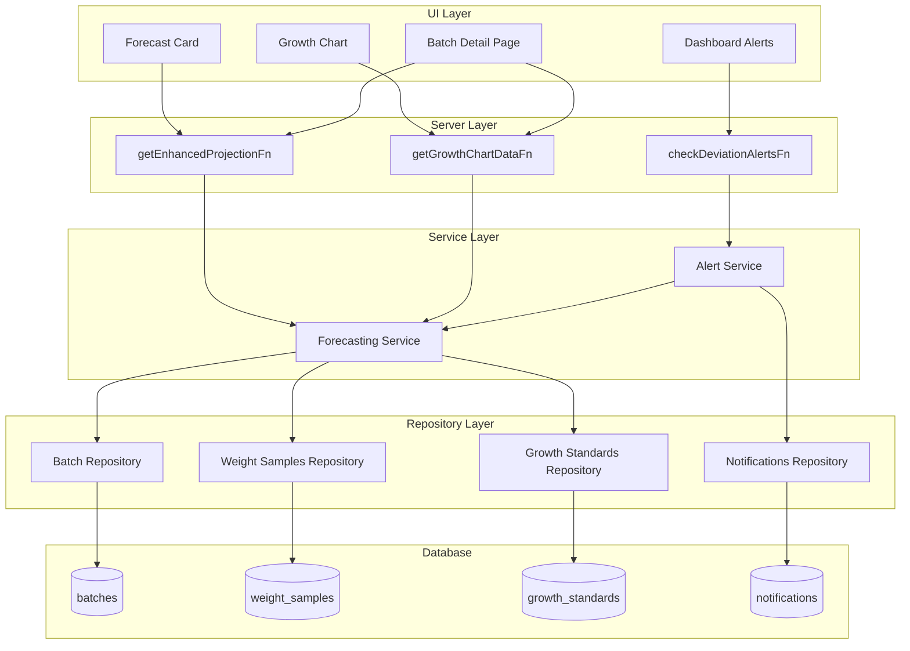
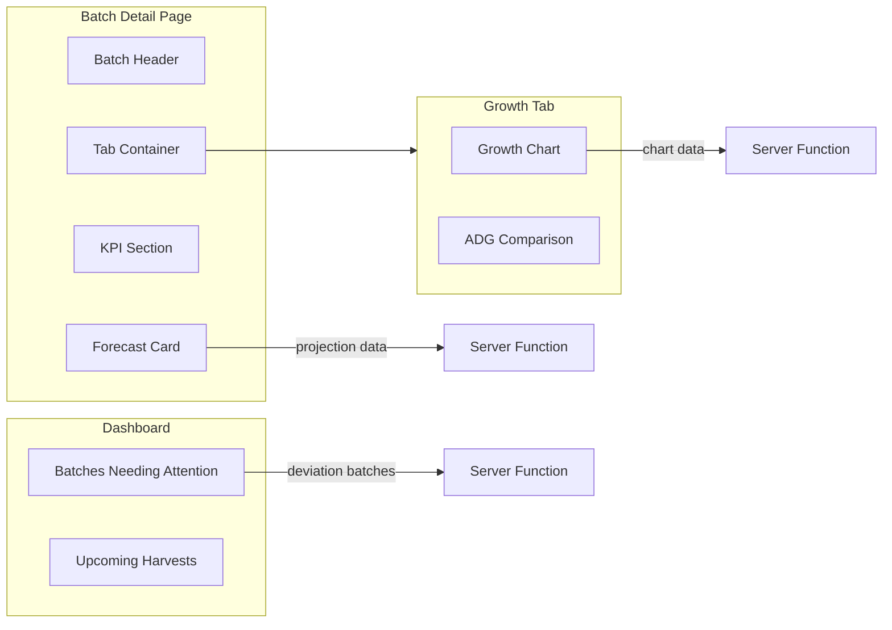

# Design Document: Intelligent Forecasting

## Overview

The Intelligent Forecasting feature transforms LivestockAI from a simple record-keeping tool into a predictive farming assistant. By analyzing weight samples against breed-specific growth curves (provided by the Reference Data Foundation), the system calculates Average Daily Gain (ADG), Performance Index, and projected harvest dates. Visual components (Forecast Card and Growth Chart) make this data actionable, while deviation alerts proactively notify farmers when batches need attention.

The design follows LivestockAI's three-layer architecture (Server → Service → Repository) and integrates with existing batch detail pages, dashboard, and notification systems.

## Existing Codebase Context

**Key files to extend (not duplicate):**

- `app/features/batches/forecasting.ts` - **Existing** `calculateBatchProjection()` function with basic projection logic. Extend this, don't create new file.
- `app/components/batches/projections-card.tsx` - **Existing** ProjectionsCard component. Enhance this with ADG, Performance Index, etc.
- `app/features/notifications/types.ts` - **Existing** NotificationType union. Add `'growthDeviation'` and `'earlyHarvest'` types.
- `app/lib/db/types.ts` - `weight_samples.averageWeightKg` stores weight in **kg** (not grams). Service layer must convert.

**Existing projection logic in `forecasting.ts`:**

```typescript
// Already implemented:
// - Fetches batch with target_weight_g
// - Gets latest weight sample (averageWeightKg - in kg!)
// - Queries growth_standards by species
// - Calculates currentStatus: 'on_track' | 'behind' | 'ahead' using 0.95/1.05 ratio
// - Projects harvest date based on growth curve
// - Calculates financial projections (revenue, feed cost, profit)

// Needs enhancement:
// - ADG calculation from weight samples
// - Performance Index as percentage
// - Breed-specific growth curve support (after Reference Data Foundation)
// - More granular status thresholds for alerts
```

**Weight unit handling:**

- Database stores `weight_samples.averageWeightKg` in **kilograms**
- Growth standards store `expected_weight_g` in **grams**
- Service layer must handle conversion: `currentWeightG = averageWeightKg * 1000`

## Architecture

### High-Level Data Flow



### Component Architecture



## Components and Interfaces

### 1. Forecasting Service (`app/features/batches/forecasting-service.ts`)

Pure business logic for growth calculations. **Note: This is a NEW file for pure functions. The existing `forecasting.ts` contains server functions and will import from this service.**

```typescript
interface EnhancedProjection {
  // Weight data
  currentWeightG: number
  expectedWeightG: number
  performanceIndex: number // (actual/expected) * 100

  // ADG data
  currentADG: number // grams per day
  expectedADG: number // grams per day from growth curve

  // Harvest projection
  projectedHarvestDate: Date
  daysRemaining: number
  targetWeightG: number

  // Status
  status: 'on_track' | 'behind' | 'ahead'
  deviationPercent: number

  // Financial
  projectedRevenue: number
  projectedFeedCost: number
  estimatedProfit: number

  // Metadata
  hasWeightSamples: boolean
  lastSampleDate: Date | null
  dataSource: 'weight_samples' | 'growth_curve_estimate'
}

// ... rest of interface definitions

// Service functions (pure, no side effects)
// IMPORTANT: Input weights from DB are in kg, convert to grams internally
function calculateADG(
  samples: WeightSample[], // samples have averageWeightKg in kg
  acquisitionDate: Date,
  initialWeightG: number,
): { currentADG: number; method: 'two_samples' | 'single_sample' | 'estimated' }

function calculatePerformanceIndex(
  actualWeightG: number,
  expectedWeightG: number,
): number

function classifyStatus(
  performanceIndex: number,
): 'on_track' | 'behind' | 'ahead'

function projectHarvestDate(
  currentWeightG: number,
  targetWeightG: number,
  currentADG: number,
  today: Date,
): { harvestDate: Date; daysRemaining: number }

function calculateExpectedADG(
  growthStandards: GrowthStandard[],
  currentDay: number,
): number

function generateChartData(
  growthStandards: GrowthStandard[],
  weightSamples: WeightSample[],
  acquisitionDate: Date,
  currentDay: number,
): GrowthChartDataPoint[]
```

### 2. Server Functions (`app/features/batches/forecasting.ts`)

**Extend the existing file** - do not create a new one. The file already has `calculateBatchProjection()` and `getBatchProjectionFn`. Add new enhanced functions:

```typescript
// EXISTING (keep as-is for backward compatibility):
export const getBatchProjectionFn = createServerFn({ method: 'GET' })
  .inputValidator(z.object({ batchId: z.string().uuid() }))
  .handler(async ({ data }) => {
    return calculateBatchProjection(data.batchId)
  })

// NEW - Enhanced projection with ADG and Performance Index
export const getEnhancedProjectionFn = createServerFn({ method: 'GET' })
  .validator(z.object({ batchId: z.string().uuid() }))
  .handler(async ({ data }) => {
    const { requireAuth } = await import('../auth/server-middleware')
    await requireAuth()

    const { db } = await import('~/lib/db')

    // 1. Fetch batch with breed info (after Reference Data Foundation)
    const batch = await getBatchWithBreed(db, data.batchId)
    if (!batch || batch.status === 'sold') return null

    // 2. Fetch weight samples
    const samples = await getWeightSamples(db, data.batchId)

    // 3. Fetch growth standards (breed-specific or species fallback)
    const standards = await getGrowthStandards(db, batch.species, batch.breedId)
    if (standards.length === 0) return null

    // 4. Calculate projection using service functions
    return calculateEnhancedProjection(batch, samples, standards)
  })

export const getGrowthChartDataFn = createServerFn({ method: 'GET' })
  .validator(z.object({ batchId: z.string().uuid() }))
  .handler(async ({ data }) => {
    const { requireAuth } = await import('../auth/server-middleware')
    await requireAuth()

    const { db } = await import('~/lib/db')

    const batch = await getBatchById(db, data.batchId)
    if (!batch) return null

    const samples = await getWeightSamples(db, data.batchId)
    const standards = await getGrowthStandards(db, batch.species, batch.breedId)

    return generateChartData(standards, samples, batch.acquisitionDate, getCurrentDay(batch))
  })

export const checkDeviationAlertsFn = createServerFn({ method: 'POST' })
  .validator(z.object({ farmId: z.string().uuid().optional() }))
  .handler(async ({ data }) => {
    const { requireAuth } = await import('../auth/server-middleware')
    const session = await requireAuth()

    const { db } = await import('~/lib/db')

    // Get active batches for user's farms
    const batches = await getActiveBatchesForUser(db, session.user.id, data.farmId)

    const alerts: DeviationAlert[] = []
    for (const batch of batches) {
      const projection = await calculateEnhancedProjection(batch, ...)
      if (projection && shouldCreateAlert(projection)) {
        const alert = await createDeviationAlert(db, batch, projection, session.user.id)
        if (alert) alerts.push(alert)
      }
    }

    return alerts
  })

export const getBatchesNeedingAttentionFn = createServerFn({ method: 'GET' })
  .validator(z.object({ limit: z.number().int().positive().default(5) }))
  .handler(async ({ data }) => {
    const { requireAuth } = await import('../auth/server-middleware')
    const session = await requireAuth()

    const { db } = await import('~/lib/db')

    // Get batches with significant deviations
    return getDeviatingBatches(db, session.user.id, data.limit)
  })
```

### 3. Forecast Card Component (`app/components/batches/projections-card.tsx`)

**Enhance the existing component** - do not create a new file. The current component already displays:

- Projected harvest date and days remaining
- Status badge (On Track / Behind / Ahead)
- Estimated revenue, profit, and feed cost

**Add to existing component:**

- Current weight vs Expected weight comparison
- Performance Index percentage with color coding
- ADG comparison (current vs expected)
- Data source indicator (weight samples vs estimate)

```typescript
// EXISTING component structure - enhance, don't replace
export function ProjectionsCard({ batchId }: ProjectionsCardProps) {
  // CHANGE: Use new enhanced projection endpoint
  const { data: projection, isLoading } = useQuery({
    queryKey: ['batch', batchId, 'enhanced-projection'],
    queryFn: () => getEnhancedProjectionFn({ data: { batchId } }),
  })

  // ... existing loading and null states ...

  // ADD: New sections for weight comparison, Performance Index, ADG
}
```

### 4. Growth Chart Component (`app/components/batches/growth-chart.tsx`)

Visual growth comparison using Recharts:

```typescript
interface GrowthChartProps {
  batchId: string
}

export function GrowthChart({ batchId }: GrowthChartProps) {
  const { data: chartData, isLoading } = useQuery({
    queryKey: ['batch', batchId, 'growth-chart'],
    queryFn: () => getGrowthChartDataFn({ data: { batchId } }),
  })

  // Render LineChart with:
  //   - X-axis: Days from acquisition
  //   - Y-axis: Weight (converted to user's unit preference)
  //   - Expected growth curve line (dashed, gray)
  //   - Actual weight samples line (solid, primary color)
  //   - Deviation zone shading (±10%)
  //   - Interactive tooltips
  //   - Legend
}
```

### 5. Dashboard Attention Section (`app/components/dashboard/batches-attention.tsx`)

```typescript
interface BatchesAttentionProps {
  limit?: number
}

export function BatchesAttention({ limit = 5 }: BatchesAttentionProps) {
  const { data: batches, isLoading } = useQuery({
    queryKey: ['batches', 'needing-attention'],
    queryFn: () => getBatchesNeedingAttentionFn({ data: { limit } }),
  })

  // Render list of batches with:
  //   - Batch name and species
  //   - Performance Index with color
  //   - Deviation indicator (behind/ahead)
  //   - Link to batch detail
}
```

## Data Models

### Enhanced Projection Result

```typescript
interface EnhancedProjection {
  // Core metrics
  currentWeightG: number
  expectedWeightG: number
  performanceIndex: number

  // ADG metrics
  currentADG: number
  expectedADG: number
  adgDeviation: number // (current - expected) / expected * 100

  // Harvest projection
  projectedHarvestDate: Date
  daysRemaining: number
  targetWeightG: number

  // Status classification
  status: 'on_track' | 'behind' | 'ahead'
  deviationPercent: number
  severity: 'normal' | 'warning' | 'critical'

  // Financial projections
  projectedRevenue: number
  projectedFeedCost: number
  estimatedProfit: number

  // Data quality indicators
  hasWeightSamples: boolean
  sampleCount: number
  lastSampleDate: Date | null
  dataSource: 'weight_samples' | 'growth_curve_estimate'
}
```

### Growth Chart Data Point

```typescript
interface GrowthChartDataPoint {
  day: number // Days from acquisition
  date: Date // Actual date
  expectedWeightG: number // From growth standards
  actualWeightG: number | null // From weight samples (null if no sample)
  deviationPercent: number | null // Calculated deviation
  isProjected: boolean // True for future days
}
```

### Deviation Alert

```typescript
interface DeviationAlert {
  batchId: string
  batchName: string
  farmId: string
  performanceIndex: number
  deviationType: 'behind' | 'ahead'
  severity: 'warning' | 'critical' | 'info'
  recommendation: string
  createdAt: Date
}
```

### Notification Type Extension

Add new notification types to support growth alerts:

```typescript
// Extend NotificationType in app/features/notifications/types.ts
export type NotificationType =
  | 'lowStock'
  | 'highMortality'
  | 'invoiceDue'
  | 'batchHarvest'
  | 'growthDeviation' // NEW: Batch behind schedule
  | 'earlyHarvest' // NEW: Batch ahead of schedule
```

## Correctness Properties

_A property is a characteristic or behavior that should hold true across all valid executions of a system—essentially, a formal statement about what the system should do. Properties serve as the bridge between human-readable specifications and machine-verifiable correctness guarantees._

### Property 1: ADG Calculation from Multiple Samples

_For any_ batch with two or more weight samples, the ADG calculation SHALL use exactly the two most recent samples and compute ADG as (weight2 - weight1) / (days2 - days1), where sample2 is more recent than sample1.

**Validates: Requirements 1.1, 4.1**

### Property 2: ADG Calculation from Single Sample

_For any_ batch with exactly one weight sample, the ADG calculation SHALL compute ADG as (sampleWeight - initialWeight) / daysSinceAcquisition, where initialWeight is derived from the growth curve at day 0.

**Validates: Requirements 1.2, 4.2**

### Property 3: ADG Estimation Without Samples

_For any_ batch with no weight samples, the current weight estimation SHALL equal the expected weight from the growth curve at the batch's current age (days since acquisition).

**Validates: Requirements 1.3**

### Property 4: Performance Index Formula

_For any_ actual weight and expected weight (both positive), the Performance Index SHALL equal (actualWeight / expectedWeight) \* 100, with the result being a positive number.

**Validates: Requirements 1.4**

### Property 5: Status Classification Consistency

_For any_ Performance Index value:

- If performanceIndex < 95, status SHALL be "behind"
- If 95 <= performanceIndex <= 105, status SHALL be "on_track"
- If performanceIndex > 105, status SHALL be "ahead"

**Validates: Requirements 1.5, 1.6, 1.7**

### Property 6: Harvest Date Projection

_For any_ batch with positive ADG, the projected harvest date SHALL be calculated as today + ceil((targetWeight - currentWeight) / ADG) days. If currentWeight >= targetWeight, daysRemaining SHALL be 0 or negative.

**Validates: Requirements 1.8**

### Property 7: Weight Unit Conversion

_For any_ weight value in grams, when the user's weight unit preference is "lbs", the displayed value SHALL equal the original value \* 0.00220462 (grams to pounds conversion). When preference is "kg", the displayed value SHALL equal the original value / 1000.

**Validates: Requirements 3.2**

### Property 8: ADG Unit Consistency

_For any_ ADG calculation, the result SHALL be expressed in grams per day, regardless of the input weight units used in weight samples.

**Validates: Requirements 4.4**

### Property 9: Negative ADG Anomaly Detection

_For any_ set of weight samples where the more recent sample has a lower weight than the earlier sample, the ADG calculation SHALL flag this as an anomaly (negative ADG).

**Validates: Requirements 4.5**

### Property 10: Alert Severity Classification

_For any_ batch with Performance Index:

- If performanceIndex < 80, alert severity SHALL be "critical" with type "growthDeviation"
- If 80 <= performanceIndex < 90, alert severity SHALL be "warning" with type "growthDeviation"
- If performanceIndex > 110, alert severity SHALL be "info" with type "earlyHarvest"
- If 90 <= performanceIndex <= 110, no alert SHALL be created

**Validates: Requirements 5.1, 5.2, 5.3**

### Property 11: Alert Recommendation Inclusion

_For any_ deviation alert created, the notification message SHALL contain a non-empty recommendation string appropriate to the deviation type ("behind" alerts suggest feed/health actions, "ahead" alerts suggest early harvest).

**Validates: Requirements 5.4, 5.5, 5.6**

### Property 12: Alert Deduplication

_For any_ batch, if an alert of the same type was created within the last 24 hours, calling the alert creation function SHALL NOT create a new notification.

**Validates: Requirements 5.8**

### Property 13: Attention Batches Filtering and Sorting

_For any_ set of active batches, the "batches needing attention" query SHALL return only batches with Performance Index < 90 OR > 110, sorted by absolute deviation from 100 (descending), limited to the specified maximum count.

**Validates: Requirements 7.1, 7.4**

### Property 14: Enhanced Projection Completeness

_For any_ valid batch with growth standards available, the getEnhancedProjectionFn return value SHALL contain all required fields: currentWeightG, expectedWeightG, performanceIndex, currentADG, expectedADG, projectedHarvestDate, daysRemaining, and status.

**Validates: Requirements 8.1**

### Property 15: Growth Chart Data Structure

_For any_ batch with growth standards, the getGrowthChartDataFn return value SHALL be an array where each element contains day (number), expectedWeightG (number), and actualWeightG (number or null).

**Validates: Requirements 8.2**

### Property 16: Graceful Degradation Without Growth Standards

_For any_ batch whose species has no growth standards in the database, all forecasting functions SHALL return null without throwing an error.

**Validates: Requirements 8.5**

## Error Handling

### Calculation Errors

| Error Scenario                                   | Handling Strategy                                   |
| ------------------------------------------------ | --------------------------------------------------- |
| Division by zero in ADG (0 days between samples) | Return null ADG with error flag                     |
| Negative expected weight from growth curve       | Log error, return null projection                   |
| Missing target weight on batch                   | Return partial projection without harvest date      |
| Weight samples with invalid dates                | Filter out invalid samples, proceed with valid ones |

### Data Availability Errors

| Error Scenario                           | Handling Strategy                                                   |
| ---------------------------------------- | ------------------------------------------------------------------- |
| No growth standards for species          | Return null projection with message "No growth standards available" |
| No growth standards for breed (fallback) | Use species-level standards as fallback                             |
| Batch not found                          | Return null                                                         |
| Batch status is "sold" or "depleted"     | Return null (no forecasting for completed batches)                  |

### Alert System Errors

| Error Scenario                  | Handling Strategy                            |
| ------------------------------- | -------------------------------------------- |
| Failed to create notification   | Log error, continue processing other batches |
| Duplicate alert within 24 hours | Skip creation silently (not an error)        |
| Invalid batch reference         | Skip batch, log warning                      |

### UI Component Errors

| Error Scenario              | Handling Strategy                                  |
| --------------------------- | -------------------------------------------------- |
| Projection data is null     | Show "insufficient data" message with guidance     |
| Chart data is empty         | Show empty state with "No weight samples recorded" |
| Network error fetching data | Show error state with retry button                 |

## Testing Strategy

### Dual Testing Approach

This feature requires both unit tests and property-based tests:

- **Property tests**: Verify universal properties across randomly generated inputs (ADG calculations, status classification, alert thresholds)
- **Unit tests**: Verify specific examples, edge cases, and UI component behavior

### Property-Based Testing Configuration

- **Library**: fast-check (already in project dependencies)
- **Minimum iterations**: 100 per property test
- **Tag format**: `Feature: intelligent-forecasting, Property {number}: {property_text}`

### Test File Structure

```
tests/features/forecasting/
├── forecasting-service.property.test.ts  # Property tests for calculation logic
├── forecasting-service.test.ts           # Unit tests for edge cases
├── alert-service.property.test.ts        # Property tests for alert logic
└── forecasting.integration.test.ts       # Integration tests with database
```

### Property Test Examples

```typescript
// Property 4: Performance Index Formula
describe('Performance Index Calculation', () => {
  it('Property 4: Performance Index equals (actual/expected) * 100', () => {
    fc.assert(
      fc.property(
        fc.float({ min: 1, max: 100000 }), // actualWeightG
        fc.float({ min: 1, max: 100000 }), // expectedWeightG
        (actualWeightG, expectedWeightG) => {
          const result = calculatePerformanceIndex(
            actualWeightG,
            expectedWeightG,
          )
          const expected = (actualWeightG / expectedWeightG) * 100
          expect(result).toBeCloseTo(expected, 5)
        },
      ),
      { numRuns: 100 },
    )
  })
})

// Property 5: Status Classification Consistency
describe('Status Classification', () => {
  it('Property 5: Status classification is consistent with thresholds', () => {
    fc.assert(
      fc.property(
        fc.float({ min: 0, max: 200 }), // performanceIndex
        (performanceIndex) => {
          const status = classifyStatus(performanceIndex)
          if (performanceIndex < 95) {
            expect(status).toBe('behind')
          } else if (performanceIndex > 105) {
            expect(status).toBe('ahead')
          } else {
            expect(status).toBe('on_track')
          }
        },
      ),
      { numRuns: 100 },
    )
  })
})

// Property 10: Alert Severity Classification
describe('Alert Severity', () => {
  it('Property 10: Alert severity matches Performance Index thresholds', () => {
    fc.assert(
      fc.property(fc.float({ min: 0, max: 200 }), (performanceIndex) => {
        const alert = determineAlertSeverity(performanceIndex)
        if (performanceIndex < 80) {
          expect(alert).toEqual({
            severity: 'critical',
            type: 'growthDeviation',
          })
        } else if (performanceIndex < 90) {
          expect(alert).toEqual({
            severity: 'warning',
            type: 'growthDeviation',
          })
        } else if (performanceIndex > 110) {
          expect(alert).toEqual({
            severity: 'info',
            type: 'earlyHarvest',
          })
        } else {
          expect(alert).toBeNull()
        }
      }),
      { numRuns: 100 },
    )
  })
})
```

### Unit Test Coverage

| Component           | Test Focus                                                     |
| ------------------- | -------------------------------------------------------------- |
| Forecasting Service | ADG edge cases (0 days, negative weights), boundary conditions |
| Alert Service       | Deduplication logic, recommendation text content               |
| Forecast Card       | Rendering states (loading, error, no data, full data)          |
| Growth Chart        | Data transformation, unit conversion                           |
| Dashboard Attention | Sorting, limiting, empty states                                |

### Integration Test Coverage

| Test Scenario                                    | Database Required |
| ------------------------------------------------ | ----------------- |
| Full projection calculation with real batch data | Yes               |
| Alert creation and deduplication                 | Yes               |
| Growth standards fallback (breed → species)      | Yes               |
| Dashboard attention query performance            | Yes               |

### Edge Cases to Test

1. Batch with exactly 0 weight samples
2. Batch with exactly 1 weight sample
3. Batch with weight samples on the same day
4. Batch where current weight exceeds target weight
5. Batch with negative ADG (weight loss)
6. Species with no growth standards
7. Breed with no specific standards (fallback to species)
8. Alert deduplication at exactly 24-hour boundary
9. Performance Index at exact threshold values (95, 105, 90, 80, 110)
10. Very old batch (age > growth curve data range)
