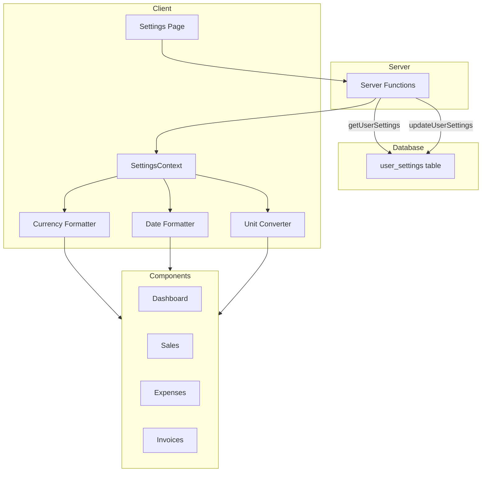

# Design Document: Internationalization Settings

## Overview

This design document describes the technical architecture for implementing internationalization settings in OpenLivestock Manager. The feature enables users to configure currency, date/time formats, and units of measurement to match their regional preferences.

The implementation follows a context-based approach where settings are loaded once on login and made available throughout the application via React Context. All formatting functions will read from this context to apply user preferences consistently.

## Architecture



### Data Flow

1. User logs in → Server loads settings from `user_settings` table
2. Settings are passed to `SettingsContext` provider
3. Formatting utilities read from context to apply preferences
4. User updates settings → Server persists to database → Context updates

## Components and Interfaces

### Server Functions

```typescript
// app/lib/settings/server.ts

export const getUserSettings = createServerFn({ method: 'GET' }).handler(
    async () => {
        const { db } = await import('../db')
        const session = await getSession()

        const settings = await db
            .selectFrom('user_settings')
            .selectAll()
            .where('userId', '=', session.user.id)
            .executeTakeFirst()

        return settings ?? DEFAULT_SETTINGS
    },
)

export const updateUserSettings = createServerFn({ method: 'POST' })
    .validator(userSettingsSchema)
    .handler(async ({ data }) => {
        const { db } = await import('../db')
        const session = await getSession()

        await db
            .insertInto('user_settings')
            .values({ userId: session.user.id, ...data })
            .onConflict((oc) => oc.column('userId').doUpdateSet(data))
            .execute()

        return { success: true }
    })
```

### Settings Context

```typescript
// app/lib/settings/context.tsx

interface SettingsContextValue {
    settings: UserSettings
    updateSettings: (settings: Partial<UserSettings>) => Promise<void>
    isLoading: boolean
}

interface UserSettings {
    // Currency
    currencyCode: string // 'USD', 'NGN', 'EUR', etc.
    currencySymbol: string // '$', '₦', '€', etc.
    currencyDecimals: number // 0, 2, 3
    currencySymbolPosition: 'before' | 'after'
    thousandSeparator: ',' | '.' | ' ' | ''
    decimalSeparator: '.' | ','

    // Date/Time
    dateFormat: 'MM/DD/YYYY' | 'DD/MM/YYYY' | 'YYYY-MM-DD'
    timeFormat: '12h' | '24h'
    firstDayOfWeek: 0 | 1 | 6 // Sunday, Monday, Saturday

    // Units
    weightUnit: 'kg' | 'lbs'
    areaUnit: 'sqm' | 'sqft'
    temperatureUnit: 'celsius' | 'fahrenheit'
}
```

### Currency Formatter

```typescript
// app/lib/settings/currency-formatter.ts

export function formatCurrency(
    amount: MoneyInput,
    settings: UserSettings,
): string {
    const value = toNumber(amount)
    const formatted = formatNumber(value, {
        decimals: settings.currencyDecimals,
        thousandSeparator: settings.thousandSeparator,
        decimalSeparator: settings.decimalSeparator,
    })

    return settings.currencySymbolPosition === 'before'
        ? `${settings.currencySymbol}${formatted}`
        : `${formatted}${settings.currencySymbol}`
}

export function formatCompactCurrency(
    amount: MoneyInput,
    settings: UserSettings,
): string {
    const value = toNumber(amount)
    const symbol = settings.currencySymbol

    if (value >= 1_000_000) {
        return `${symbol}${(value / 1_000_000).toFixed(1)}M`
    } else if (value >= 1_000) {
        return `${symbol}${(value / 1_000).toFixed(1)}K`
    }
    return formatCurrency(amount, settings)
}
```

### Date Formatter

```typescript
// app/lib/settings/date-formatter.ts

const DATE_FORMAT_MAP = {
    'MM/DD/YYYY': 'MM/dd/yyyy',
    'DD/MM/YYYY': 'dd/MM/yyyy',
    'YYYY-MM-DD': 'yyyy-MM-dd',
}

export function formatDate(
    date: Date | string,
    settings: UserSettings,
): string {
    const d = typeof date === 'string' ? new Date(date) : date
    return format(d, DATE_FORMAT_MAP[settings.dateFormat])
}

export function formatTime(
    date: Date | string,
    settings: UserSettings,
): string {
    const d = typeof date === 'string' ? new Date(date) : date
    return format(d, settings.timeFormat === '12h' ? 'h:mm a' : 'HH:mm')
}

export function formatDateTime(
    date: Date | string,
    settings: UserSettings,
): string {
    return `${formatDate(date, settings)} ${formatTime(date, settings)}`
}
```

### Unit Converter

```typescript
// app/lib/settings/unit-converter.ts

const CONVERSION_FACTORS = {
    weight: { kg: 1, lbs: 2.20462 },
    area: { sqm: 1, sqft: 10.7639 },
    temperature: {
        toFahrenheit: (c: number) => (c * 9) / 5 + 32,
        toCelsius: (f: number) => ((f - 32) * 5) / 9,
    },
}

export function formatWeight(valueKg: number, settings: UserSettings): string {
    const converted = valueKg * CONVERSION_FACTORS.weight[settings.weightUnit]
    return `${converted.toFixed(2)} ${settings.weightUnit}`
}

export function formatArea(valueSqm: number, settings: UserSettings): string {
    const converted = valueSqm * CONVERSION_FACTORS.area[settings.areaUnit]
    return `${converted.toFixed(2)} ${settings.areaUnit === 'sqm' ? 'm²' : 'ft²'}`
}

export function formatTemperature(
    valueCelsius: number,
    settings: UserSettings,
): string {
    if (settings.temperatureUnit === 'fahrenheit') {
        const f = CONVERSION_FACTORS.temperature.toFahrenheit(valueCelsius)
        return `${f.toFixed(1)}°F`
    }
    return `${valueCelsius.toFixed(1)}°C`
}

// Convert from display unit to storage unit (metric)
export function toMetricWeight(value: number, unit: 'kg' | 'lbs'): number {
    return unit === 'lbs' ? value / CONVERSION_FACTORS.weight.lbs : value
}

export function toMetricArea(value: number, unit: 'sqm' | 'sqft'): number {
    return unit === 'sqft' ? value / CONVERSION_FACTORS.area.sqft : value
}

export function toCelsius(
    value: number,
    unit: 'celsius' | 'fahrenheit',
): number {
    return unit === 'fahrenheit'
        ? CONVERSION_FACTORS.temperature.toCelsius(value)
        : value
}
```

## Data Models

### Database Schema

```sql
-- Migration: 2025-01-11-001-user-settings.ts

CREATE TABLE user_settings (
  id UUID PRIMARY KEY DEFAULT gen_random_uuid(),
  user_id UUID NOT NULL UNIQUE REFERENCES users(id) ON DELETE CASCADE,

  -- Currency settings
  currency_code VARCHAR(3) NOT NULL DEFAULT 'USD',
  currency_symbol VARCHAR(5) NOT NULL DEFAULT '$',
  currency_decimals INTEGER NOT NULL DEFAULT 2,
  currency_symbol_position VARCHAR(10) NOT NULL DEFAULT 'before',
  thousand_separator VARCHAR(1) NOT NULL DEFAULT ',',
  decimal_separator VARCHAR(1) NOT NULL DEFAULT '.',

  -- Date/Time settings
  date_format VARCHAR(20) NOT NULL DEFAULT 'YYYY-MM-DD',
  time_format VARCHAR(5) NOT NULL DEFAULT '24h',
  first_day_of_week INTEGER NOT NULL DEFAULT 1,

  -- Unit settings
  weight_unit VARCHAR(5) NOT NULL DEFAULT 'kg',
  area_unit VARCHAR(5) NOT NULL DEFAULT 'sqm',
  temperature_unit VARCHAR(15) NOT NULL DEFAULT 'celsius',

  created_at TIMESTAMP WITH TIME ZONE DEFAULT NOW(),
  updated_at TIMESTAMP WITH TIME ZONE DEFAULT NOW()
);

-- Create default settings for existing users (NGN for backward compatibility)
INSERT INTO user_settings (user_id, currency_code, currency_symbol, currency_decimals)
SELECT id, 'NGN', '₦', 2 FROM users
ON CONFLICT (user_id) DO NOTHING;
```

### TypeScript Types

```typescript
// app/lib/db/types.ts (addition)

export interface UserSettingsTable {
    id: Generated<string>
    userId: string

    // Currency
    currencyCode: string
    currencySymbol: string
    currencyDecimals: number
    currencySymbolPosition: 'before' | 'after'
    thousandSeparator: string
    decimalSeparator: string

    // Date/Time
    dateFormat: string
    timeFormat: string
    firstDayOfWeek: number

    // Units
    weightUnit: string
    areaUnit: string
    temperatureUnit: string

    createdAt: Generated<Date>
    updatedAt: Generated<Date>
}
```

### Currency Presets

```typescript
// app/lib/settings/currency-presets.ts

export interface CurrencyPreset {
    code: string
    name: string
    symbol: string
    decimals: number
    symbolPosition: 'before' | 'after'
    thousandSeparator: ',' | '.' | ' '
    decimalSeparator: '.' | ','
}

export const CURRENCY_PRESETS: CurrencyPreset[] = [
    {
        code: 'USD',
        name: 'US Dollar',
        symbol: '$',
        decimals: 2,
        symbolPosition: 'before',
        thousandSeparator: ',',
        decimalSeparator: '.',
    },
    {
        code: 'EUR',
        name: 'Euro',
        symbol: '€',
        decimals: 2,
        symbolPosition: 'before',
        thousandSeparator: '.',
        decimalSeparator: ',',
    },
    {
        code: 'GBP',
        name: 'British Pound',
        symbol: '£',
        decimals: 2,
        symbolPosition: 'before',
        thousandSeparator: ',',
        decimalSeparator: '.',
    },
    {
        code: 'NGN',
        name: 'Nigerian Naira',
        symbol: '₦',
        decimals: 2,
        symbolPosition: 'before',
        thousandSeparator: ',',
        decimalSeparator: '.',
    },
    {
        code: 'KES',
        name: 'Kenyan Shilling',
        symbol: 'KSh',
        decimals: 2,
        symbolPosition: 'before',
        thousandSeparator: ',',
        decimalSeparator: '.',
    },
    {
        code: 'ZAR',
        name: 'South African Rand',
        symbol: 'R',
        decimals: 2,
        symbolPosition: 'before',
        thousandSeparator: ' ',
        decimalSeparator: ',',
    },
    {
        code: 'INR',
        name: 'Indian Rupee',
        symbol: '₹',
        decimals: 2,
        symbolPosition: 'before',
        thousandSeparator: ',',
        decimalSeparator: '.',
    },
    {
        code: 'CNY',
        name: 'Chinese Yuan',
        symbol: '¥',
        decimals: 2,
        symbolPosition: 'before',
        thousandSeparator: ',',
        decimalSeparator: '.',
    },
    {
        code: 'JPY',
        name: 'Japanese Yen',
        symbol: '¥',
        decimals: 0,
        symbolPosition: 'before',
        thousandSeparator: ',',
        decimalSeparator: '.',
    },
    {
        code: 'BRL',
        name: 'Brazilian Real',
        symbol: 'R$',
        decimals: 2,
        symbolPosition: 'before',
        thousandSeparator: '.',
        decimalSeparator: ',',
    },
    {
        code: 'MXN',
        name: 'Mexican Peso',
        symbol: '$',
        decimals: 2,
        symbolPosition: 'before',
        thousandSeparator: ',',
        decimalSeparator: '.',
    },
    {
        code: 'CAD',
        name: 'Canadian Dollar',
        symbol: 'CA$',
        decimals: 2,
        symbolPosition: 'before',
        thousandSeparator: ',',
        decimalSeparator: '.',
    },
    {
        code: 'AUD',
        name: 'Australian Dollar',
        symbol: 'A$',
        decimals: 2,
        symbolPosition: 'before',
        thousandSeparator: ',',
        decimalSeparator: '.',
    },
    {
        code: 'CHF',
        name: 'Swiss Franc',
        symbol: 'CHF',
        decimals: 2,
        symbolPosition: 'before',
        thousandSeparator: "'",
        decimalSeparator: '.',
    },
    {
        code: 'SEK',
        name: 'Swedish Krona',
        symbol: 'kr',
        decimals: 2,
        symbolPosition: 'after',
        thousandSeparator: ' ',
        decimalSeparator: ',',
    },
    {
        code: 'NOK',
        name: 'Norwegian Krone',
        symbol: 'kr',
        decimals: 2,
        symbolPosition: 'after',
        thousandSeparator: ' ',
        decimalSeparator: ',',
    },
    {
        code: 'DKK',
        name: 'Danish Krone',
        symbol: 'kr',
        decimals: 2,
        symbolPosition: 'after',
        thousandSeparator: '.',
        decimalSeparator: ',',
    },
    {
        code: 'PLN',
        name: 'Polish Zloty',
        symbol: 'zł',
        decimals: 2,
        symbolPosition: 'after',
        thousandSeparator: ' ',
        decimalSeparator: ',',
    },
    {
        code: 'TRY',
        name: 'Turkish Lira',
        symbol: '₺',
        decimals: 2,
        symbolPosition: 'before',
        thousandSeparator: '.',
        decimalSeparator: ',',
    },
    {
        code: 'AED',
        name: 'UAE Dirham',
        symbol: 'د.إ',
        decimals: 2,
        symbolPosition: 'before',
        thousandSeparator: ',',
        decimalSeparator: '.',
    },
]
```

## Correctness Properties

_A property is a characteristic or behavior that should hold true across all valid executions of a system—essentially, a formal statement about what the system should do. Properties serve as the bridge between human-readable specifications and machine-verifiable correctness guarantees._

### Property 1: Currency Formatting Correctness

_For any_ monetary amount and valid currency settings (symbol, position, decimals, thousand separator, decimal separator), the formatted output SHALL:

- Contain the currency symbol exactly once
- Position the symbol before or after the amount according to `symbolPosition`
- Display exactly `currencyDecimals` decimal places
- Use the configured `thousandSeparator` for values >= 1000
- Use the configured `decimalSeparator` between integer and fractional parts

**Validates: Requirements 1.3, 1.4, 1.5, 1.6, 1.7**

### Property 2: Date Formatting Correctness

_For any_ valid date and date format setting (MM/DD/YYYY, DD/MM/YYYY, or YYYY-MM-DD), the formatted output SHALL match the expected pattern where:

- MM is the two-digit month (01-12)
- DD is the two-digit day (01-31)
- YYYY is the four-digit year

**Validates: Requirements 2.2, 2.3**

### Property 3: Time Formatting Correctness

_For any_ valid time and time format setting (12h or 24h):

- 12h format SHALL display hours 1-12 with AM/PM suffix
- 24h format SHALL display hours 00-23 without suffix

**Validates: Requirements 2.4**

### Property 4: Weight Conversion Round-Trip

_For any_ weight value in kilograms, converting to the display unit (kg or lbs) and back to kilograms SHALL produce a value within acceptable floating-point tolerance (±0.001 kg) of the original.

**Validates: Requirements 3.2, 3.5, 3.6**

### Property 5: Area Conversion Round-Trip

_For any_ area value in square meters, converting to the display unit (sqm or sqft) and back to square meters SHALL produce a value within acceptable floating-point tolerance (±0.001 sqm) of the original.

**Validates: Requirements 3.3, 3.5, 3.6**

### Property 6: Temperature Conversion Round-Trip

_For any_ temperature value in Celsius, converting to the display unit (Celsius or Fahrenheit) and back to Celsius SHALL produce a value within acceptable floating-point tolerance (±0.01°C) of the original.

**Validates: Requirements 3.4, 3.5, 3.6**

## Error Handling

### Settings Load Errors

When settings cannot be loaded from the database:

1. Log the error for debugging
2. Fall back to default settings (USD, YYYY-MM-DD, metric)
3. Display a non-blocking warning to the user
4. Allow the application to continue functioning

### Settings Save Errors

When settings cannot be saved to the database:

1. Log the error with full context
2. Display an error toast notification
3. Retain the previous settings in the UI
4. Allow retry without losing user input

### Invalid Settings Data

When settings data is malformed or invalid:

1. Validate all settings against the schema before use
2. Replace invalid values with defaults
3. Log a warning for monitoring

## Testing Strategy

### Unit Tests

Unit tests will verify specific examples and edge cases:

1. **Currency Formatter**
    - Format $0.00 correctly
    - Format large numbers (millions) with thousand separators
    - Handle JPY (0 decimals) correctly
    - Handle symbol-after currencies (SEK, NOK)

2. **Date Formatter**
    - Format edge dates (Jan 1, Dec 31, Feb 29)
    - Handle timezone edge cases
    - Verify all three format patterns

3. **Unit Converter**
    - Convert known values (1 kg = 2.20462 lbs)
    - Handle zero values
    - Handle very large/small values

4. **Settings Context**
    - Load default settings when none exist
    - Update settings optimistically
    - Handle concurrent updates

### Property-Based Tests

Property-based tests will use `fast-check` to verify universal properties across many generated inputs. Each test will run a minimum of 100 iterations.

```typescript
// Example test structure
import * as fc from 'fast-check'

describe('Currency Formatter Properties', () => {
    it('Property 1: Currency formatting correctness', () => {
        // Feature: internationalization-settings, Property 1: Currency Formatting Correctness
        // Validates: Requirements 1.3, 1.4, 1.5, 1.6, 1.7
        fc.assert(
            fc.property(
                fc.double({ min: 0, max: 1_000_000_000, noNaN: true }),
                fc.record({
                    currencySymbol: fc.stringOf(fc.char(), {
                        minLength: 1,
                        maxLength: 5,
                    }),
                    currencySymbolPosition: fc.constantFrom('before', 'after'),
                    currencyDecimals: fc.integer({ min: 0, max: 3 }),
                    thousandSeparator: fc.constantFrom(',', '.', ' '),
                    decimalSeparator: fc.constantFrom('.', ','),
                }),
                (amount, settings) => {
                    const result = formatCurrency(amount, settings)
                    // Verify symbol presence and position
                    // Verify decimal places
                    // Verify separators
                },
            ),
            { numRuns: 100 },
        )
    })
})
```

### Integration Tests

Integration tests will verify end-to-end flows:

1. **Settings Persistence**
    - Save settings → reload page → settings persist
    - Multiple users have independent settings

2. **Settings Migration**
    - New users get USD defaults
    - Existing users get NGN defaults (backward compatibility)

3. **Context Updates**
    - Changing settings updates all displayed values immediately
