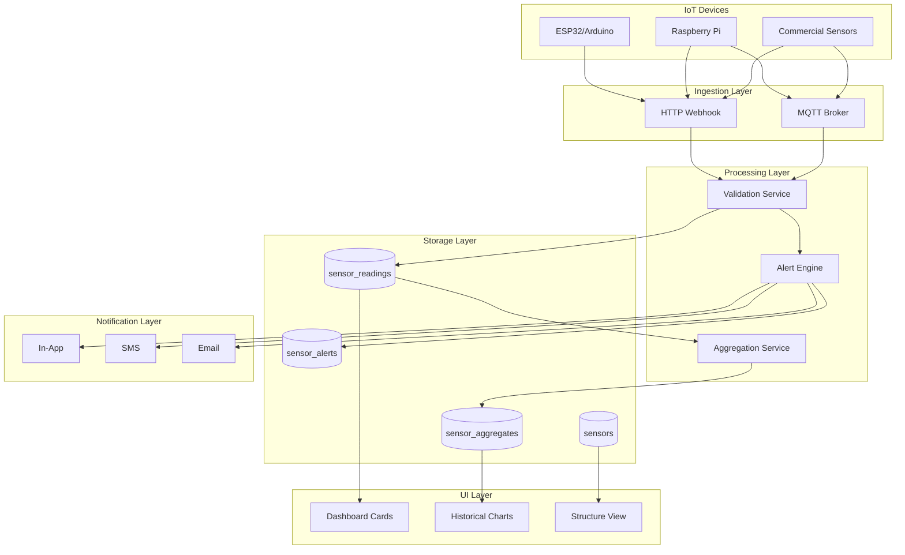
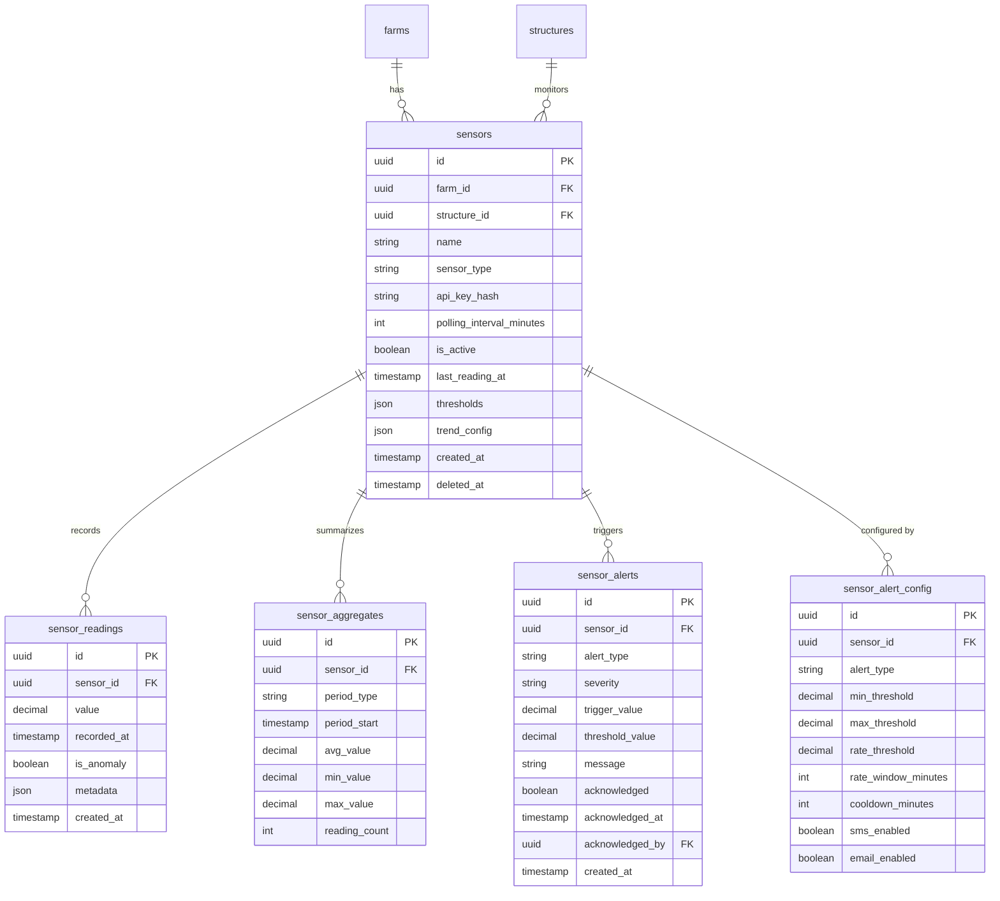

# Design Document: IoT Sensor Hub

## Overview

The IoT Sensor Hub provides real-time environmental monitoring for livestock structures through connected sensors. The system follows OpenLivestock's three-layer architecture (Server → Service → Repository) and integrates with existing notification, structure, and monitoring systems.

## Existing Codebase Context

**Key files to integrate with:**

- `app/features/structures/server.ts` - Structure management (sensors link to structures)
- `app/features/notifications/server.ts` - Notification creation system
- `app/features/monitoring/server.ts` - Existing alert system (extend for sensor alerts)
- `app/features/integrations/sms/index.ts` - SMS sending capability
- `app/features/integrations/email/index.ts` - Email sending capability
- `app/features/settings/hooks.ts` - Use `useFormatCurrency()` for any cost displays
- `app/lib/db/types.ts` - Database type definitions
- `app/lib/errors/index.ts` - Use `AppError` class for all errors

**Patterns to follow:**

- Server functions use `createServerFn` with Zod validation
- Dynamic imports for `getDb()` (Cloudflare Workers compatibility)
- `AppError` for structured error handling
- `verifyFarmAccess` for authorization checks
- Repository functions accept `Kysely<Database>` as first parameter

### Server Function Pattern (Three-Layer Architecture)

```typescript
// app/features/sensors/server.ts
import { createServerFn } from '@tanstack/react-start'
import { z } from 'zod'
import { AppError } from '~/lib/errors'

export const createSensorFn = createServerFn({ method: 'POST' })
  .inputValidator(
    z.object({
      farmId: z.string().uuid(),
      structureId: z.string().uuid().optional(),
      name: z.string().min(1).max(100),
      sensorType: z.enum([...SENSOR_TYPES]),
      pollingIntervalMinutes: z.number().int().min(5).max(60).default(15),
    }),
  )
  .handler(async ({ data }) => {
    try {
      // 1. Auth middleware (dynamic import for Cloudflare Workers)
      const { requireAuth } = await import('~/features/auth/server-middleware')
      const session = await requireAuth()

      // 2. Database access (MUST use getDb() for Cloudflare Workers)
      const { getDb } = await import('~/lib/db')
      const db = await getDb()

      // 3. Service layer for business logic
      const { generateApiKey, hashApiKey } = await import('./service')
      const apiKey = generateApiKey()
      const apiKeyHash = await hashApiKey(apiKey)

      // 4. Repository layer for database operations
      const { insertSensor } = await import('./repository')
      const sensorId = await insertSensor(db, {
        ...data,
        apiKeyHash,
      })

      // Return sensor with plain API key (only time it's shown)
      return { sensorId, apiKey }
    } catch (error) {
      if (error instanceof AppError) throw error
      throw new AppError('DATABASE_ERROR', {
        message: 'Failed to create sensor',
        cause: error,
      })
    }
  })
```

### Repository Layer Pattern

```typescript
// app/features/sensors/repository.ts
import type { Kysely } from 'kysely'
import type { Database } from '~/lib/db/types'

export async function insertSensor(
  db: Kysely<Database>,
  sensor: SensorInsert,
): Promise<string> {
  const result = await db
    .insertInto('sensors')
    .values(sensor)
    .returning('id')
    .executeTakeFirstOrThrow()
  return result.id
}

export async function getSensorByApiKeyHash(
  db: Kysely<Database>,
  apiKeyHash: string,
) {
  return db
    .selectFrom('sensors')
    .selectAll()
    .where('apiKeyHash', '=', apiKeyHash)
    .where('isActive', '=', true)
    .where('deletedAt', 'is', null)
    .executeTakeFirst()
}
```

## Architecture

### High-Level Data Flow



### Database Schema



## Components and Interfaces

### 1. Sensors Repository (`app/features/sensors/repository.ts`)

```typescript
// Sensor types supported
export type SensorType =
  | 'temperature'
  | 'humidity'
  | 'ammonia'
  | 'dissolved_oxygen'
  | 'ph'
  | 'water_level'
  | 'water_temperature'
  | 'hive_weight'
  | 'hive_temperature'
  | 'hive_humidity'

export interface Sensor {
  id: string
  farmId: string
  structureId: string | null
  name: string
  sensorType: SensorType
  apiKeyHash: string
  pollingIntervalMinutes: number
  isActive: boolean
  lastReadingAt: Date | null
  thresholds: SensorThresholds | null
  trendConfig: TrendConfig | null
  createdAt: Date
  deletedAt: Date | null
}

export interface SensorThresholds {
  minValue: number | null
  maxValue: number | null
  warningMinValue: number | null
  warningMaxValue: number | null
}

export interface TrendConfig {
  rateThreshold: number // e.g., 5 (degrees per hour)
  rateWindowMinutes: number // e.g., 60
}

// Repository functions
async function insertSensor(
  db: Kysely<Database>,
  data: SensorInsert,
): Promise<string>
async function getSensorById(
  db: Kysely<Database>,
  id: string,
): Promise<Sensor | null>
async function getSensorsByFarm(
  db: Kysely<Database>,
  farmId: string,
): Promise<Sensor[]>
async function getSensorsByStructure(
  db: Kysely<Database>,
  structureId: string,
): Promise<Sensor[]>
async function getSensorByApiKey(
  db: Kysely<Database>,
  apiKeyHash: string,
): Promise<Sensor | null>
async function updateSensor(
  db: Kysely<Database>,
  id: string,
  data: SensorUpdate,
): Promise<void>
async function softDeleteSensor(db: Kysely<Database>, id: string): Promise<void>
```

### 2. Sensor Readings Repository (`app/features/sensors/readings-repository.ts`)

```typescript
export interface SensorReading {
  id: string
  sensorId: string
  value: string // DECIMAL
  recordedAt: Date
  isAnomaly: boolean
  metadata: Record<string, any> | null
  createdAt: Date
}

// Repository functions
async function insertReading(
  db: Kysely<Database>,
  data: ReadingInsert,
): Promise<string>
async function insertReadingsBatch(
  db: Kysely<Database>,
  readings: ReadingInsert[],
): Promise<number>
async function getLatestReading(
  db: Kysely<Database>,
  sensorId: string,
): Promise<SensorReading | null>
async function getReadingsInRange(
  db: Kysely<Database>,
  sensorId: string,
  startDate: Date,
  endDate: Date,
  limit?: number,
): Promise<SensorReading[]>
async function getReadingsForChart(
  db: Kysely<Database>,
  sensorId: string,
  startDate: Date,
  endDate: Date,
  bucketMinutes: number, // For downsampling
): Promise<ChartDataPoint[]>
```

### 3. Alert Engine Service (`app/features/sensors/alert-service.ts`)

```typescript
export interface AlertCheckResult {
  shouldAlert: boolean
  alertType:
    | 'threshold_high'
    | 'threshold_low'
    | 'trend_rising'
    | 'trend_falling'
  severity: 'warning' | 'critical'
  message: string
  triggerValue: number
  thresholdValue: number
}

// Pure service functions (no DB access)
function checkThresholdAlert(
  value: number,
  thresholds: SensorThresholds,
  sensorType: SensorType,
): AlertCheckResult | null

function checkTrendAlert(
  readings: SensorReading[],
  trendConfig: TrendConfig,
  sensorType: SensorType,
): AlertCheckResult | null

function isInCooldown(
  lastAlertTime: Date | null,
  cooldownMinutes: number,
): boolean

function getSensorTypeDefaults(sensorType: SensorType): {
  thresholds: SensorThresholds
  trendConfig: TrendConfig
  unit: string
  displayName: string
}
```

### 4. Sensor Server Functions (`app/features/sensors/server.ts`)

```typescript
// Sensor management
export const createSensorFn = createServerFn({ method: 'POST' })
  .inputValidator(z.object({
    farmId: z.string().uuid(),
    structureId: z.string().uuid().optional(),
    name: z.string().min(1).max(100),
    sensorType: z.enum([...SENSOR_TYPES]),
    pollingIntervalMinutes: z.number().int().min(5).max(60).default(15),
    thresholds: z.object({...}).optional(),
  }))
  .handler(async ({ data }) => {
    // 1. Verify farm access
    // 2. Generate API key
    // 3. Hash API key (bcrypt)
    // 4. Insert sensor
    // 5. Return sensor with plain API key (only time it's shown)
  })

export const getSensorsFn = createServerFn({ method: 'GET' })
  .inputValidator(z.object({
    farmId: z.string().uuid(),
    structureId: z.string().uuid().optional(),
    status: z.enum(['online', 'stale', 'offline', 'all']).optional(),
  }))
  .handler(async ({ data }) => { /* ... */ })

export const regenerateApiKeyFn = createServerFn({ method: 'POST' })
  .inputValidator(z.object({ sensorId: z.string().uuid() }))
  .handler(async ({ data }) => { /* ... */ })
```

### 5. Ingestion Endpoint (`app/routes/api/sensors/readings.ts`)

```typescript
// POST /api/sensors/readings
// This is a special route that doesn't use session auth
// Instead, it uses API key authentication

export const Route = createAPIFileRoute('/api/sensors/readings')({
  POST: async ({ request }) => {
    const apiKey = request.headers.get('X-Sensor-Key')
    if (!apiKey) {
      return new Response(JSON.stringify({ error: 'Missing API key' }), {
        status: 401,
        headers: { 'Content-Type': 'application/json' },
      })
    }

    // 1. Hash the API key and look up sensor
    // 2. Validate payload (single reading or batch)
    // 3. Validate values against sensor type ranges
    // 4. Insert readings
    // 5. Check for alerts
    // 6. Return success

    const body = await request.json()
    // Handle single reading or array of readings
    const readings = Array.isArray(body) ? body : [body]

    // Process and return
  },
})
```

### 6. MQTT Integration (`app/features/sensors/mqtt-handler.ts`)

```typescript
// MQTT message handler (called by MQTT broker integration)
// Topic format: openlivestock/{farm_id}/sensors/{sensor_id}/readings

export async function handleMQTTMessage(
  topic: string,
  payload: Buffer,
  username: string, // sensor_id
  password: string, // api_key
): Promise<void> {
  // 1. Parse topic to extract farm_id and sensor_id
  // 2. Verify API key matches sensor
  // 3. Parse payload as JSON
  // 4. Insert reading
  // 5. Check for alerts
}
```

## Data Models

### Sensors Table Schema

```sql
CREATE TABLE sensors (
  id UUID PRIMARY KEY DEFAULT gen_random_uuid(),
  farm_id UUID NOT NULL REFERENCES farms(id) ON DELETE CASCADE,
  structure_id UUID REFERENCES structures(id) ON DELETE SET NULL,
  name VARCHAR(100) NOT NULL,
  sensor_type VARCHAR(30) NOT NULL,
  api_key_hash VARCHAR(255) NOT NULL,
  polling_interval_minutes INTEGER NOT NULL DEFAULT 15,
  is_active BOOLEAN NOT NULL DEFAULT true,
  last_reading_at TIMESTAMP WITH TIME ZONE,
  thresholds JSONB,
  trend_config JSONB,
  created_at TIMESTAMP WITH TIME ZONE DEFAULT NOW(),
  deleted_at TIMESTAMP WITH TIME ZONE,

  CONSTRAINT valid_sensor_type CHECK (sensor_type IN (
    'temperature', 'humidity', 'ammonia', 'dissolved_oxygen',
    'ph', 'water_level', 'water_temperature',
    'hive_weight', 'hive_temperature', 'hive_humidity'
  ))
);

CREATE INDEX idx_sensors_farm ON sensors(farm_id) WHERE deleted_at IS NULL;
CREATE INDEX idx_sensors_structure ON sensors(structure_id) WHERE deleted_at IS NULL;
CREATE INDEX idx_sensors_api_key ON sensors(api_key_hash);
CREATE INDEX idx_sensors_active ON sensors(is_active) WHERE is_active = true AND deleted_at IS NULL;
```

### Sensor Readings Table Schema (Time-Series Optimized)

```sql
CREATE TABLE sensor_readings (
  id UUID PRIMARY KEY DEFAULT gen_random_uuid(),
  sensor_id UUID NOT NULL REFERENCES sensors(id) ON DELETE CASCADE,
  value DECIMAL(12,4) NOT NULL,
  recorded_at TIMESTAMP WITH TIME ZONE NOT NULL,
  is_anomaly BOOLEAN NOT NULL DEFAULT false,
  metadata JSONB,
  created_at TIMESTAMP WITH TIME ZONE DEFAULT NOW(),

  -- Prevent duplicate readings
  UNIQUE(sensor_id, recorded_at)
);

-- Time-series optimized indexes
CREATE INDEX idx_readings_sensor_time ON sensor_readings(sensor_id, recorded_at DESC);
CREATE INDEX idx_readings_recent ON sensor_readings(recorded_at DESC) WHERE recorded_at > NOW() - INTERVAL '24 hours';
```

### Sensor Aggregates Table Schema

```sql
CREATE TABLE sensor_aggregates (
  id UUID PRIMARY KEY DEFAULT gen_random_uuid(),
  sensor_id UUID NOT NULL REFERENCES sensors(id) ON DELETE CASCADE,
  period_type VARCHAR(10) NOT NULL, -- 'hourly', 'daily'
  period_start TIMESTAMP WITH TIME ZONE NOT NULL,
  avg_value DECIMAL(12,4) NOT NULL,
  min_value DECIMAL(12,4) NOT NULL,
  max_value DECIMAL(12,4) NOT NULL,
  reading_count INTEGER NOT NULL,

  UNIQUE(sensor_id, period_type, period_start)
);

CREATE INDEX idx_aggregates_sensor_period ON sensor_aggregates(sensor_id, period_type, period_start DESC);
```

### Sensor Alerts Table Schema

```sql
CREATE TABLE sensor_alerts (
  id UUID PRIMARY KEY DEFAULT gen_random_uuid(),
  sensor_id UUID NOT NULL REFERENCES sensors(id) ON DELETE CASCADE,
  alert_type VARCHAR(30) NOT NULL, -- 'threshold_high', 'threshold_low', 'trend_rising', 'trend_falling'
  severity VARCHAR(10) NOT NULL, -- 'warning', 'critical'
  trigger_value DECIMAL(12,4) NOT NULL,
  threshold_value DECIMAL(12,4) NOT NULL,
  message TEXT NOT NULL,
  acknowledged BOOLEAN NOT NULL DEFAULT false,
  acknowledged_at TIMESTAMP WITH TIME ZONE,
  acknowledged_by UUID REFERENCES users(id),
  created_at TIMESTAMP WITH TIME ZONE DEFAULT NOW()
);

CREATE INDEX idx_alerts_sensor ON sensor_alerts(sensor_id, created_at DESC);
CREATE INDEX idx_alerts_unacknowledged ON sensor_alerts(acknowledged) WHERE acknowledged = false;
```

### Sensor Alert Config Table Schema

```sql
CREATE TABLE sensor_alert_config (
  id UUID PRIMARY KEY DEFAULT gen_random_uuid(),
  sensor_id UUID NOT NULL REFERENCES sensors(id) ON DELETE CASCADE,
  alert_type VARCHAR(30) NOT NULL,
  min_threshold DECIMAL(12,4),
  max_threshold DECIMAL(12,4),
  rate_threshold DECIMAL(12,4), -- Change per hour
  rate_window_minutes INTEGER DEFAULT 60,
  cooldown_minutes INTEGER NOT NULL DEFAULT 30,
  sms_enabled BOOLEAN NOT NULL DEFAULT false,
  email_enabled BOOLEAN NOT NULL DEFAULT true,

  UNIQUE(sensor_id, alert_type)
);
```

### TypeScript Types (`app/lib/db/types.ts` additions)

```typescript
// Add to Database interface
export interface Database {
  // ... existing tables ...
  sensors: SensorTable
  sensor_readings: SensorReadingTable
  sensor_aggregates: SensorAggregateTable
  sensor_alerts: SensorAlertTable
  sensor_alert_config: SensorAlertConfigTable
}

export interface SensorTable {
  id: Generated<string>
  farmId: string
  structureId: string | null
  name: string
  sensorType:
    | 'temperature'
    | 'humidity'
    | 'ammonia'
    | 'dissolved_oxygen'
    | 'ph'
    | 'water_level'
    | 'water_temperature'
    | 'hive_weight'
    | 'hive_temperature'
    | 'hive_humidity'
  apiKeyHash: string
  pollingIntervalMinutes: number
  isActive: Generated<boolean>
  lastReadingAt: Date | null
  thresholds: {
    minValue: number | null
    maxValue: number | null
    warningMinValue: number | null
    warningMaxValue: number | null
  } | null
  trendConfig: {
    rateThreshold: number
    rateWindowMinutes: number
  } | null
  createdAt: Generated<Date>
  deletedAt: Date | null
}

export interface SensorReadingTable {
  id: Generated<string>
  sensorId: string
  value: string // DECIMAL
  recordedAt: Date
  isAnomaly: Generated<boolean>
  metadata: Record<string, any> | null
  createdAt: Generated<Date>
}

export interface SensorAggregateTable {
  id: Generated<string>
  sensorId: string
  periodType: 'hourly' | 'daily'
  periodStart: Date
  avgValue: string // DECIMAL
  minValue: string // DECIMAL
  maxValue: string // DECIMAL
  readingCount: number
}

export interface SensorAlertTable {
  id: Generated<string>
  sensorId: string
  alertType:
    | 'threshold_high'
    | 'threshold_low'
    | 'trend_rising'
    | 'trend_falling'
  severity: 'warning' | 'critical'
  triggerValue: string // DECIMAL
  thresholdValue: string // DECIMAL
  message: string
  acknowledged: Generated<boolean>
  acknowledgedAt: Date | null
  acknowledgedBy: string | null
  createdAt: Generated<Date>
}

export interface SensorAlertConfigTable {
  id: Generated<string>
  sensorId: string
  alertType: string
  minThreshold: string | null // DECIMAL
  maxThreshold: string | null // DECIMAL
  rateThreshold: string | null // DECIMAL
  rateWindowMinutes: number
  cooldownMinutes: number
  smsEnabled: Generated<boolean>
  emailEnabled: Generated<boolean>
}
```

## Sensor Type Defaults

```typescript
// app/features/sensors/constants.ts

export const SENSOR_TYPE_DEFAULTS: Record<SensorType, SensorTypeConfig> = {
  temperature: {
    displayName: 'Temperature',
    unit: '°C',
    validRange: { min: -40, max: 100 },
    defaultThresholds: {
      // Poultry defaults
      minValue: 18,
      maxValue: 32,
      warningMinValue: 20,
      warningMaxValue: 30,
    },
    defaultTrendConfig: {
      rateThreshold: 5, // 5°C per hour is concerning
      rateWindowMinutes: 60,
    },
  },
  humidity: {
    displayName: 'Humidity',
    unit: '%',
    validRange: { min: 0, max: 100 },
    defaultThresholds: {
      minValue: 40,
      maxValue: 80,
      warningMinValue: 50,
      warningMaxValue: 70,
    },
    defaultTrendConfig: {
      rateThreshold: 20,
      rateWindowMinutes: 60,
    },
  },
  ammonia: {
    displayName: 'Ammonia',
    unit: 'ppm',
    validRange: { min: 0, max: 100 },
    defaultThresholds: {
      minValue: null,
      maxValue: 25, // Critical for poultry
      warningMinValue: null,
      warningMaxValue: 15,
    },
    defaultTrendConfig: {
      rateThreshold: 10,
      rateWindowMinutes: 60,
    },
  },
  dissolved_oxygen: {
    displayName: 'Dissolved Oxygen',
    unit: 'mg/L',
    validRange: { min: 0, max: 20 },
    defaultThresholds: {
      minValue: 4, // Critical for fish
      maxValue: null,
      warningMinValue: 5,
      warningMaxValue: null,
    },
    defaultTrendConfig: {
      rateThreshold: 2,
      rateWindowMinutes: 30, // Fish are sensitive - shorter window
    },
  },
  ph: {
    displayName: 'pH',
    unit: '',
    validRange: { min: 0, max: 14 },
    defaultThresholds: {
      minValue: 6.5,
      maxValue: 8.5,
      warningMinValue: 7.0,
      warningMaxValue: 8.0,
    },
    defaultTrendConfig: {
      rateThreshold: 0.5,
      rateWindowMinutes: 60,
    },
  },
  water_level: {
    displayName: 'Water Level',
    unit: 'cm',
    validRange: { min: 0, max: 500 },
    defaultThresholds: {
      minValue: 50, // Minimum safe level
      maxValue: null,
      warningMinValue: 75,
      warningMaxValue: null,
    },
    defaultTrendConfig: {
      rateThreshold: 20,
      rateWindowMinutes: 60,
    },
  },
  water_temperature: {
    displayName: 'Water Temperature',
    unit: '°C',
    validRange: { min: 0, max: 50 },
    defaultThresholds: {
      minValue: 24, // Catfish optimal range
      maxValue: 32,
      warningMinValue: 26,
      warningMaxValue: 30,
    },
    defaultTrendConfig: {
      rateThreshold: 3,
      rateWindowMinutes: 60,
    },
  },
  hive_weight: {
    displayName: 'Hive Weight',
    unit: 'kg',
    validRange: { min: 0, max: 200 },
    defaultThresholds: {
      minValue: 15, // Minimum healthy hive
      maxValue: null,
      warningMinValue: 20,
      warningMaxValue: null,
    },
    defaultTrendConfig: {
      rateThreshold: 5, // Sudden weight loss = swarm or robbing
      rateWindowMinutes: 1440, // Daily
    },
  },
  hive_temperature: {
    displayName: 'Hive Temperature',
    unit: '°C',
    validRange: { min: -10, max: 60 },
    defaultThresholds: {
      minValue: 32, // Brood nest temperature
      maxValue: 38,
      warningMinValue: 34,
      warningMaxValue: 36,
    },
    defaultTrendConfig: {
      rateThreshold: 5,
      rateWindowMinutes: 60,
    },
  },
  hive_humidity: {
    displayName: 'Hive Humidity',
    unit: '%',
    validRange: { min: 0, max: 100 },
    defaultThresholds: {
      minValue: 40,
      maxValue: 80,
      warningMinValue: 50,
      warningMaxValue: 70,
    },
    defaultTrendConfig: {
      rateThreshold: 15,
      rateWindowMinutes: 60,
    },
  },
}

// Species-specific threshold overrides
export const SPECIES_SENSOR_OVERRIDES: Record<
  string,
  Partial<Record<SensorType, Partial<SensorThresholds>>>
> = {
  Broiler: {
    temperature: {
      minValue: 20,
      maxValue: 30,
      warningMinValue: 22,
      warningMaxValue: 28,
    },
    humidity: { minValue: 50, maxValue: 70 },
    ammonia: { maxValue: 20, warningMaxValue: 10 },
  },
  Layer: {
    temperature: {
      minValue: 18,
      maxValue: 28,
      warningMinValue: 20,
      warningMaxValue: 26,
    },
    humidity: { minValue: 45, maxValue: 75 },
  },
  Catfish: {
    dissolved_oxygen: { minValue: 3, warningMinValue: 4 },
    water_temperature: {
      minValue: 25,
      maxValue: 32,
      warningMinValue: 27,
      warningMaxValue: 30,
    },
    ph: { minValue: 6.5, maxValue: 8.0 },
  },
  Tilapia: {
    dissolved_oxygen: { minValue: 4, warningMinValue: 5 },
    water_temperature: {
      minValue: 24,
      maxValue: 30,
      warningMinValue: 26,
      warningMaxValue: 28,
    },
    ph: { minValue: 6.5, maxValue: 9.0 },
  },
}
```

## API Endpoints

### HTTP Webhook Endpoint

```typescript
// POST /api/sensors/readings
// Authentication: X-Sensor-Key header

// Single reading payload
{
  "value": 28.5,
  "recorded_at": "2026-01-26T10:30:00Z", // Optional, defaults to now
  "metadata": { "battery": 85 } // Optional
}

// Batch payload (for backfill)
[
  { "value": 28.5, "recorded_at": "2026-01-26T10:30:00Z" },
  { "value": 28.7, "recorded_at": "2026-01-26T10:45:00Z" },
  { "value": 29.1, "recorded_at": "2026-01-26T11:00:00Z" }
]

// Success response (201)
{
  "success": true,
  "readings_accepted": 3,
  "readings_rejected": 0,
  "alerts_triggered": 1
}

// Error responses
// 401 - Invalid or missing API key
// 400 - Invalid payload format
// 429 - Rate limit exceeded
```

### MQTT Topics

```
# Publish readings
openlivestock/{farm_id}/sensors/{sensor_id}/readings

# Payload (JSON)
{
  "value": 28.5,
  "recorded_at": "2026-01-26T10:30:00Z"
}

# Subscribe to alerts (optional)
openlivestock/{farm_id}/sensors/{sensor_id}/alerts
```

## Alert Processing Flow

```typescript
// app/features/sensors/alert-processor.ts

export async function processReading(
  db: Kysely<Database>,
  sensor: Sensor,
  reading: SensorReading,
): Promise<void> {
  // 1. Get alert config for this sensor
  const config = await getAlertConfig(db, sensor.id)

  // 2. Check threshold alerts
  const thresholdAlert = checkThresholdAlert(
    parseFloat(reading.value),
    sensor.thresholds ||
      SENSOR_TYPE_DEFAULTS[sensor.sensorType].defaultThresholds,
    sensor.sensorType,
  )

  // 3. Check trend alerts (need recent readings)
  const recentReadings = await getReadingsInRange(
    db,
    sensor.id,
    subMinutes(new Date(), config?.rateWindowMinutes || 60),
    new Date(),
  )
  const trendAlert = checkTrendAlert(
    recentReadings,
    sensor.trendConfig ||
      SENSOR_TYPE_DEFAULTS[sensor.sensorType].defaultTrendConfig,
    sensor.sensorType,
  )

  // 4. Check cooldown
  const lastAlert = await getLastAlert(db, sensor.id)
  const cooldownMinutes = config?.cooldownMinutes || 30

  // 5. Create alerts if needed
  for (const alert of [thresholdAlert, trendAlert].filter(Boolean)) {
    if (!isInCooldown(lastAlert?.createdAt, cooldownMinutes)) {
      await createSensorAlert(db, sensor.id, alert)

      // 6. Send notifications
      await sendAlertNotifications(db, sensor, alert, config)
    }
  }
}

async function sendAlertNotifications(
  db: Kysely<Database>,
  sensor: Sensor,
  alert: AlertCheckResult,
  config: SensorAlertConfig | null,
): Promise<void> {
  // Get farm owner
  const farmOwner = await getFarmOwner(db, sensor.farmId)

  // Always create in-app notification
  await createNotification({
    userId: farmOwner.id,
    farmId: sensor.farmId,
    type: 'sensorAlert',
    title: `${alert.severity === 'critical' ? '🔴' : '🟡'} ${sensor.name} Alert`,
    message: alert.message,
    actionUrl: `/sensors/${sensor.id}`,
    metadata: {
      sensorId: sensor.id,
      sensorType: sensor.sensorType,
      alertType: alert.alertType,
      value: alert.triggerValue,
    },
  })

  // SMS for critical alerts (if enabled)
  if (alert.severity === 'critical' && config?.smsEnabled) {
    const { sendSMS } = await import('~/features/integrations/sms')
    const userPhone = await getUserPhone(db, farmOwner.id)
    if (userPhone) {
      await sendSMS({
        to: userPhone,
        message: `ALERT: ${sensor.name} - ${alert.message}`,
      })
    }
  }

  // Email (if enabled)
  if (config?.emailEnabled) {
    const { sendEmail } = await import('~/features/integrations/email')
    await sendEmail({
      to: farmOwner.email,
      subject: `${alert.severity === 'critical' ? '🔴 CRITICAL' : '🟡 Warning'}: ${sensor.name}`,
      html: generateAlertEmailHtml(sensor, alert),
    })
  }
}
```

## Data Aggregation

```typescript
// app/features/sensors/aggregation-service.ts
// Run as scheduled job (Cloudflare Cron Trigger)

export async function aggregateHourlyReadings(): Promise<void> {
  const { getDb } = await import('~/lib/db')
  const db = await getDb()

  // Find readings older than 90 days that haven't been aggregated
  const cutoffDate = subDays(new Date(), 90)

  // Group by sensor and hour, calculate aggregates
  const aggregates = await db
    .selectFrom('sensor_readings')
    .select([
      'sensorId',
      sql`date_trunc('hour', recorded_at)`.as('periodStart'),
      sql`avg(value)`.as('avgValue'),
      sql`min(value)`.as('minValue'),
      sql`max(value)`.as('maxValue'),
      sql`count(*)`.as('readingCount'),
    ])
    .where('recordedAt', '<', cutoffDate)
    .groupBy(['sensorId', sql`date_trunc('hour', recorded_at)`])
    .execute()

  // Insert aggregates
  for (const agg of aggregates) {
    await db
      .insertInto('sensor_aggregates')
      .values({
        sensorId: agg.sensorId,
        periodType: 'hourly',
        periodStart: agg.periodStart,
        avgValue: agg.avgValue,
        minValue: agg.minValue,
        maxValue: agg.maxValue,
        readingCount: agg.readingCount,
      })
      .onConflict((oc) =>
        oc.columns(['sensorId', 'periodType', 'periodStart']).doNothing(),
      )
      .execute()
  }

  // Delete aggregated raw readings
  await db
    .deleteFrom('sensor_readings')
    .where('recordedAt', '<', cutoffDate)
    .execute()
}

export async function aggregateDailyReadings(): Promise<void> {
  // Similar logic for hourly -> daily aggregation after 1 year
}
```

## UI Components

### Sensor Card Component

```typescript
// app/components/sensors/sensor-card.tsx

interface SensorCardProps {
  sensor: Sensor
  latestReading: SensorReading | null
  sparklineData: number[]
}

export function SensorCard({ sensor, latestReading, sparklineData }: SensorCardProps) {
  const config = SENSOR_TYPE_DEFAULTS[sensor.sensorType]
  const status = getSensorStatus(sensor, latestReading)

  return (
    <Card className={cn(
      'p-4',
      status === 'critical' && 'border-red-500 bg-red-50',
      status === 'warning' && 'border-amber-500 bg-amber-50',
    )}>
      <div className="flex justify-between items-start">
        <div>
          <h3 className="font-semibold">{sensor.name}</h3>
          <p className="text-sm text-muted-foreground">{config.displayName}</p>
        </div>
        <StatusIndicator status={status} />
      </div>

      <div className="mt-4">
        <span className="text-3xl font-bold">
          {latestReading ? formatValue(latestReading.value, sensor.sensorType) : '--'}
        </span>
        <span className="text-lg ml-1">{config.unit}</span>
      </div>

      <div className="mt-2 h-12">
        <Sparkline data={sparklineData} thresholds={sensor.thresholds} />
      </div>

      <p className="text-xs text-muted-foreground mt-2">
        {latestReading
          ? `Updated ${formatDistanceToNow(latestReading.recordedAt)} ago`
          : 'No data'}
      </p>
    </Card>
  )
}

function getSensorStatus(sensor: Sensor, reading: SensorReading | null): 'online' | 'stale' | 'offline' | 'critical' | 'warning' {
  if (!reading) return 'offline'

  const minutesSinceReading = differenceInMinutes(new Date(), reading.recordedAt)
  const interval = sensor.pollingIntervalMinutes

  // Check value status first
  if (sensor.thresholds) {
    const value = parseFloat(reading.value)
    if (value < sensor.thresholds.minValue || value > sensor.thresholds.maxValue) {
      return 'critical'
    }
    if (value < sensor.thresholds.warningMinValue || value > sensor.thresholds.warningMaxValue) {
      return 'warning'
    }
  }

  // Check connectivity status
  if (minutesSinceReading > interval * 4) return 'offline'
  if (minutesSinceReading > interval * 2) return 'stale'
  return 'online'
}
```

### Historical Chart Component

```typescript
// app/components/sensors/sensor-chart.tsx

interface SensorChartProps {
  sensorId: string
  sensorType: SensorType
  thresholds: SensorThresholds | null
  timeRange: '24h' | '7d' | '30d' | '90d'
}

export function SensorChart({ sensorId, sensorType, thresholds, timeRange }: SensorChartProps) {
  const { data, isLoading } = useQuery({
    queryKey: ['sensor-chart', sensorId, timeRange],
    queryFn: () => getSensorChartDataFn({ data: { sensorId, timeRange } }),
  })

  const config = SENSOR_TYPE_DEFAULTS[sensorType]

  return (
    <div className="h-64">
      {isLoading ? (
        <Skeleton className="h-full" />
      ) : (
        <ResponsiveContainer>
          <LineChart data={data}>
            <XAxis dataKey="time" tickFormatter={formatChartTime} />
            <YAxis unit={config.unit} />
            <Tooltip />

            {/* Threshold reference lines */}
            {thresholds?.maxValue && (
              <ReferenceLine y={thresholds.maxValue} stroke="red" strokeDasharray="3 3" />
            )}
            {thresholds?.minValue && (
              <ReferenceLine y={thresholds.minValue} stroke="red" strokeDasharray="3 3" />
            )}

            <Line type="monotone" dataKey="value" stroke="#10b981" dot={false} />
          </LineChart>
        </ResponsiveContainer>
      )}
    </div>
  )
}
```

## Correctness Properties

### Property 1: Reading Data Integrity

_For any_ valid sensor reading (with value within sensor type's valid range and timestamp within 7 days), inserting it via the HTTP endpoint and then retrieving it SHALL return an equivalent record with value, timestamp, and sensor_id preserved.

**Validates: Requirements 2.1, 2.3, 2.4**

### Property 2: Threshold Alert Triggering

_For any_ sensor with configured thresholds, when a reading value exceeds the max threshold OR falls below the min threshold, the system SHALL create an alert record with correct alert_type ('threshold_high' or 'threshold_low') and severity.

**Validates: Requirements 3.1**

### Property 3: Trend Alert Calculation

_For any_ sensor with trend configuration, when the rate of change over the configured window exceeds the rate threshold, the system SHALL create an alert with correct alert_type ('trend_rising' or 'trend_falling') and the calculated rate.

**Validates: Requirements 3.2**

### Property 4: Alert Cooldown Enforcement

_For any_ sensor that has triggered an alert, subsequent readings that would trigger the same alert type SHALL NOT create new alerts until the cooldown period has elapsed OR the value returns to normal range.

**Validates: Requirements 3.4**

### Property 5: API Key Authentication

_For any_ HTTP request to the readings endpoint, the system SHALL accept the request if and only if the X-Sensor-Key header contains a valid API key that matches an active sensor.

**Validates: Requirements 2.1, 8.2**

### Property 6: Sensor Status Calculation

_For any_ sensor, the status SHALL be 'online' if last reading is within 2x polling interval, 'stale' if within 2-4x interval, and 'offline' if beyond 4x interval.

**Validates: Requirements 1.2**

### Property 7: Data Aggregation Correctness

_For any_ set of raw readings for a sensor within an hour, the hourly aggregate SHALL have avg_value equal to the arithmetic mean, min_value equal to the minimum, max_value equal to the maximum, and reading_count equal to the count.

**Validates: Requirements 6.1**

### Property 8: Batch Upload Deduplication

_For any_ batch upload containing readings with duplicate (sensor_id, recorded_at) pairs, the system SHALL store only one reading per unique timestamp and report the correct count of accepted vs rejected readings.

**Validates: Requirements 2.3**

### Property 9: Anomaly Detection

_For any_ reading with a value outside the sensor type's valid range, the system SHALL store the reading with is_anomaly=true and NOT trigger threshold alerts for anomalous values.

**Validates: Requirements 2.4**

### Property 10: Structure Sensor Aggregation

_For any_ structure with multiple sensors, the structure status SHALL be the worst status among all its sensors (critical > warning > stale > offline > online).

**Validates: Requirements 5.1, 5.2**

## Error Handling

### Error Codes (add to `app/lib/errors/error-map.ts`)

```typescript
SENSOR_NOT_FOUND: {
  code: 40420,
  httpStatus: 404,
  category: 'NOT_FOUND',
  message: 'Sensor not found',
},
INVALID_API_KEY: {
  code: 40103,
  httpStatus: 401,
  category: 'AUTH',
  message: 'Invalid sensor API key',
},
SENSOR_INACTIVE: {
  code: 40303,
  httpStatus: 403,
  category: 'FORBIDDEN',
  message: 'Sensor is inactive',
},
READING_TOO_OLD: {
  code: 40003,
  httpStatus: 400,
  category: 'VALIDATION',
  message: 'Reading timestamp is older than 7 days',
},
RATE_LIMIT_EXCEEDED: {
  code: 42900,
  httpStatus: 429,
  category: 'RATE_LIMIT',
  message: 'Rate limit exceeded for this sensor',
},
```

## Testing Strategy

### Test File Structure

```
tests/features/sensors/
├── sensors.property.test.ts      # Property-based tests
├── sensors.test.ts               # Unit tests for service functions
├── alert-service.test.ts         # Alert engine unit tests
├── aggregation.test.ts           # Aggregation service tests
└── sensors.integration.test.ts   # Integration tests with database
```

### Property Test Examples

```typescript
describe('Alert Service', () => {
  it('Property 2: threshold alerts trigger correctly', () => {
    fc.assert(
      fc.property(
        fc.record({
          value: fc.float({ min: -50, max: 150 }),
          minThreshold: fc.float({ min: -40, max: 50 }),
          maxThreshold: fc.float({ min: 50, max: 100 }),
        }),
        ({ value, minThreshold, maxThreshold }) => {
          fc.pre(minThreshold < maxThreshold)

          const thresholds = { minValue: minThreshold, maxValue: maxThreshold }
          const result = checkThresholdAlert(value, thresholds, 'temperature')

          if (value > maxThreshold) {
            expect(result?.alertType).toBe('threshold_high')
          } else if (value < minThreshold) {
            expect(result?.alertType).toBe('threshold_low')
          } else {
            expect(result).toBeNull()
          }
        },
      ),
      { numRuns: 100 },
    )
  })
})
```

## ESP32 Firmware Example

```cpp
// examples/firmware/esp32-dht22/main.cpp

#include <WiFi.h>
#include <HTTPClient.h>
#include <DHT.h>
#include <SPIFFS.h>
#include <ArduinoJson.h>

#define DHT_PIN 4
#define DHT_TYPE DHT22
#define BUFFER_SIZE 100

DHT dht(DHT_PIN, DHT_TYPE);

const char* ssid = "YOUR_WIFI_SSID";
const char* password = "YOUR_WIFI_PASSWORD";
const char* serverUrl = "https://your-farm.openlivestock.app/api/sensors/readings";
const char* apiKey = "YOUR_SENSOR_API_KEY";

struct Reading {
  float value;
  unsigned long timestamp;
};

Reading buffer[BUFFER_SIZE];
int bufferIndex = 0;

void setup() {
  Serial.begin(115200);
  dht.begin();
  SPIFFS.begin(true);

  WiFi.begin(ssid, password);
  while (WiFi.status() != WL_CONNECTED) {
    delay(1000);
    Serial.println("Connecting to WiFi...");
  }

  loadBufferFromStorage();
}

void loop() {
  float temp = dht.readTemperature();

  if (!isnan(temp)) {
    if (WiFi.status() == WL_CONNECTED) {
      // Send current reading + any buffered readings
      sendReadings(temp);
    } else {
      // Buffer reading for later
      bufferReading(temp);
    }
  }

  delay(900000); // 15 minutes
}

void sendReadings(float currentTemp) {
  HTTPClient http;
  http.begin(serverUrl);
  http.addHeader("Content-Type", "application/json");
  http.addHeader("X-Sensor-Key", apiKey);

  // Build JSON array with buffered + current readings
  DynamicJsonDocument doc(4096);
  JsonArray arr = doc.to<JsonArray>();

  // Add buffered readings
  for (int i = 0; i < bufferIndex; i++) {
    JsonObject obj = arr.createNestedObject();
    obj["value"] = buffer[i].value;
    obj["recorded_at"] = formatTimestamp(buffer[i].timestamp);
  }

  // Add current reading
  JsonObject current = arr.createNestedObject();
  current["value"] = currentTemp;

  String payload;
  serializeJson(doc, payload);

  int httpCode = http.POST(payload);

  if (httpCode == 201) {
    // Clear buffer on success
    bufferIndex = 0;
    clearStoredBuffer();
  }

  http.end();
}

void bufferReading(float temp) {
  if (bufferIndex < BUFFER_SIZE) {
    buffer[bufferIndex].value = temp;
    buffer[bufferIndex].timestamp = millis();
    bufferIndex++;
    saveBufferToStorage();
  }
}
```
