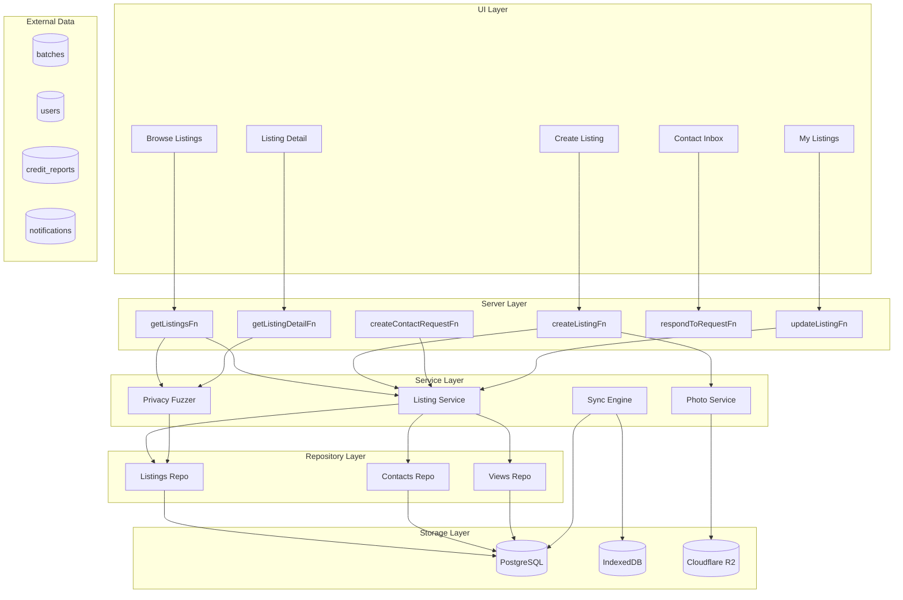
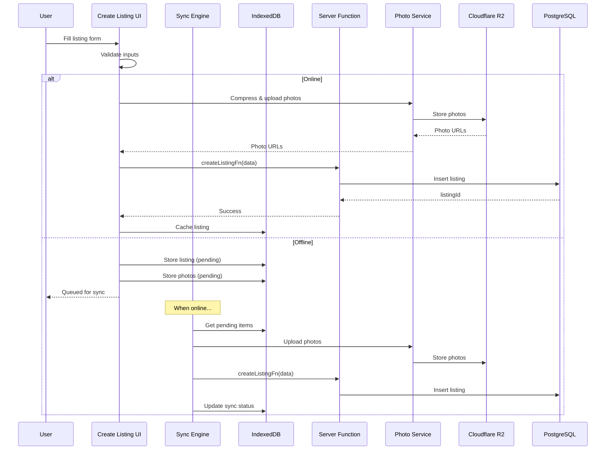
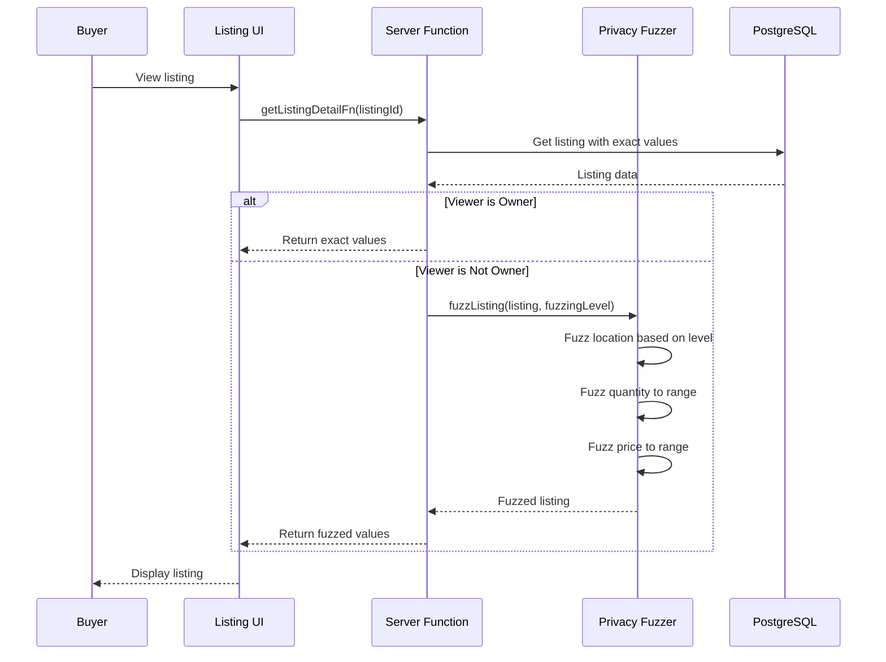

# Design Document: Offline Marketplace

## Overview

The Offline Marketplace transforms LivestockAI from a farm management tool into a livestock trading platform. By enabling farmers to list livestock for sale and discover nearby sellers—all while working offline—the feature addresses a critical gap in the farmer's workflow: finding buyers.

The system follows LivestockAI's three-layer architecture (Server → Service → Repository) and integrates with existing features (batches, notifications, Credit Passport). Privacy fuzzing is applied at display time, not storage, ensuring exact data is preserved for owners while protecting sensitive information from strangers.

Key design decisions:

- **Privacy fuzzing in service layer**: Pure functions for testability, applied at display time
- **Leverage offline-writes-v1**: Use TanStack Query's offline support instead of custom sync engine
- **Public browse, authenticated actions**: Anyone can browse, login required to contact/create
- **Last-write-wins sync**: Simple conflict resolution for non-critical marketplace data
- **Photo compression**: Client-side compression using `browser-image-compression` library
- **Distance calculation in JavaScript**: Haversine formula in service layer, not SQL (Neon compatibility)

## Implementation Notes

### Public Routes (New Pattern)

The marketplace introduces a new routing pattern - public pages outside the `/_auth` layout:

```
app/routes/
├── _auth/                          # Existing authenticated routes
│   └── marketplace/
│       ├── create.tsx              # Create listing (auth required)
│       ├── my-listings.tsx         # My listings (auth required)
│       └── inbox.tsx               # Contact requests (auth required)
└── marketplace/                    # NEW: Public routes
    ├── index.tsx                   # Browse listings (no auth)
    └── $listingId.tsx              # View listing detail (no auth)
```

This is a new pattern for LivestockAI. The public routes:

- Do NOT use the `_auth` layout
- Do NOT call `requireAuth()` in loaders
- Show login prompt when user tries to contact/create

### i18n Namespace

Add `marketplace` namespace to `app/lib/i18n/config.ts`:

```typescript
ns: [
  // ... existing namespaces
  'marketplace',
],
```

Required translation keys:

- `marketplace:browse.title` - "Marketplace"
- `marketplace:browse.empty` - "No listings found"
- `marketplace:browse.stale` - "Listings may be outdated"
- `marketplace:listing.contact` - "Contact Seller"
- `marketplace:listing.expired` - "This listing has expired"
- `marketplace:listing.verified` - "Verified Seller"
- `marketplace:create.title` - "Create Listing"
- `marketplace:myListings.title` - "My Listings"
- `marketplace:inbox.title` - "Contact Requests"
- `marketplace:filters.*` - Filter labels

### Distance Filtering (JavaScript, not SQL)

Distance filtering uses Haversine formula in the service layer rather than PostgreSQL's `earth_distance` extension (which may not be available on Neon):

```typescript
// app/features/marketplace/distance-service.ts
function calculateDistance(
  lat1: number,
  lon1: number,
  lat2: number,
  lon2: number,
): number {
  const R = 6371 // Earth's radius in km
  const dLat = toRad(lat2 - lat1)
  const dLon = toRad(lon2 - lon1)
  const a =
    Math.sin(dLat / 2) * Math.sin(dLat / 2) +
    Math.cos(toRad(lat1)) *
      Math.cos(toRad(lat2)) *
      Math.sin(dLon / 2) *
      Math.sin(dLon / 2)
  const c = 2 * Math.atan2(Math.sqrt(a), Math.sqrt(1 - a))
  return R * c
}

// Filter listings by distance in memory after fetching from DB
function filterByDistance(
  listings: Listing[],
  viewerLat: number,
  viewerLon: number,
  radiusKm: number,
): Listing[] {
  return listings.filter((listing) => {
    const distance = calculateDistance(
      viewerLat,
      viewerLon,
      listing.latitude,
      listing.longitude,
    )
    return distance <= radiusKm
  })
}
```

**Scalability Optimization:** To avoid fetching thousands of listings, use a bounding box pre-filter in SQL:

```typescript
// Calculate bounding box for radius (approximate)
function getBoundingBox(lat: number, lon: number, radiusKm: number) {
  const latDelta = radiusKm / 111 // ~111km per degree latitude
  const lonDelta = radiusKm / (111 * Math.cos((lat * Math.PI) / 180))
  return {
    minLat: lat - latDelta,
    maxLat: lat + latDelta,
    minLon: lon - lonDelta,
    maxLon: lon + lonDelta,
  }
}

// In repository - pre-filter with bounding box
async function getListingsNearLocation(
  db: Kysely<Database>,
  lat: number,
  lon: number,
  radiusKm: number,
) {
  const box = getBoundingBox(lat, lon, radiusKm * 1.2) // 20% buffer

  return db
    .selectFrom('marketplace_listings')
    .selectAll()
    .where('latitude', '>=', box.minLat)
    .where('latitude', '<=', box.maxLat)
    .where('longitude', '>=', box.minLon)
    .where('longitude', '<=', box.maxLon)
    .where('status', '=', 'active')
    .execute()
}
```

This two-step approach:

1. SQL bounding box filter reduces dataset to ~100-1000 listings
2. JavaScript Haversine filter gives exact distance results

## Dependencies

### Required: offline-writes-v1 Spec

This feature **depends on offline-writes-v1** being implemented first. The offline-writes-v1 spec provides:

| Component           | Location                         | Usage in Marketplace                           |
| ------------------- | -------------------------------- | ---------------------------------------------- |
| Query Client Config | `app/lib/query-client.ts`        | `networkMode: 'offlineFirst'` for mutations    |
| Optimistic Utils    | `app/lib/optimistic-utils.ts`    | `createOptimisticUpdate()`, `generateTempId()` |
| Temp ID Resolver    | `app/lib/temp-id-resolver.ts`    | Resolve temp listing IDs after sync            |
| Storage Monitor     | `app/lib/storage-monitor.ts`     | Monitor IndexedDB quota for cached listings    |
| Sync Status         | `app/components/sync-status.tsx` | Show pending listing/contact sync status       |

**If offline-writes-v1 is not implemented**, this feature will work in online-only mode with degraded UX (no offline listing creation, no cached browsing).

### Existing Infrastructure to Leverage

**No new dependencies needed!** The codebase already has:

1. **Photo compression**: Canvas-based compression in `app/features/digital-foreman/photo-storage.ts`
2. **Storage provider**: `app/features/integrations/storage/` with R2/S3/Local support
3. **R2 buckets**: Already configured in `wrangler.jsonc` (`PUBLIC_STORAGE_BUCKET`, `PRIVATE_STORAGE_BUCKET`)

### Species Naming Convention

**IMPORTANT:** The codebase has an inconsistency in species naming:

- `batches.species` uses **lowercase**: `'broiler'`, `'catfish'`, `'layer'`
- `growth_standards.species` uses **Title Case**: `'Broiler'`, `'Catfish'`, `'Layer'`
- `breeds.speciesKey` uses **Title Case** to match `growth_standards`

For marketplace listings, use **lowercase** to match `batches.species` since listings are created from batches. When linking to `growth_standards` or `breeds` tables for price suggestions, convert to Title Case as needed.

### Market Prices Limitation

The `market_prices` table may not have comprehensive data for all species. The batch pre-fill feature (`generateListingFromBatch`) should:

1. Check if market prices exist for the species
2. If not found, leave price fields empty for user input
3. Show a helpful message: "No market price data available for this species"

This graceful degradation ensures the feature works even with incomplete reference data.

## Codebase Integration Points

### Existing Systems to Leverage

| System                 | Location                                 | Integration                                   |
| ---------------------- | ---------------------------------------- | --------------------------------------------- |
| Currency formatting    | `app/features/settings/hooks.ts`         | Use `useFormatCurrency()` for price displays  |
| Batches                | `app/features/batches/server.ts`         | Link listings to batches                      |
| Notifications          | `app/features/notifications/server.ts`   | Create notifications for contact requests     |
| Credit Passport        | `app/features/credit-passport/server.ts` | Check seller verification status              |
| Error handling         | `app/lib/errors/index.ts`                | Use `AppError` class for all errors           |
| Database types         | `app/lib/db/types.ts`                    | Add new table interfaces                      |
| Auth middleware        | `app/features/auth/server-middleware.ts` | Use `requireAuth()` for authenticated actions |
| Offline infrastructure | `app/lib/optimistic-utils.ts`            | Use optimistic updates from offline-writes-v1 |
| i18n                   | `app/lib/i18n/`                          | Use existing translation infrastructure       |

### Server Function Pattern (Three-Layer Architecture)

```typescript
// app/features/marketplace/server.ts
import { createServerFn } from '@tanstack/react-start'
import { z } from 'zod'
import { AppError } from '~/lib/errors'

export const createListingFn = createServerFn({ method: 'POST' })
  .inputValidator(
    z.object({
      livestockType: z.enum([
        'poultry',
        'fish',
        'cattle',
        'goats',
        'sheep',
        'bees',
      ]),
      species: z.string().min(1).max(100),
      quantity: z.number().int().positive(),
      minPrice: z.number().nonnegative(),
      maxPrice: z.number().nonnegative(),
      // ... other fields
    }),
  )
  .handler(async ({ data }) => {
    try {
      // 1. Auth middleware (dynamic import for Cloudflare Workers)
      const { requireAuth } = await import('~/features/auth/server-middleware')
      const session = await requireAuth()

      // 2. Database access (MUST use getDb() for Cloudflare Workers)
      const { getDb } = await import('~/lib/db')
      const db = await getDb()

      // 3. Repository layer for database operations
      const { insertListing } = await import('./repository')

      // 4. Service layer for business logic
      const { validateListingInput, calculateExpirationDate } =
        await import('./listing-service')

      // ... implementation
    } catch (error) {
      if (error instanceof AppError) throw error
      throw new AppError('DATABASE_ERROR', {
        message: 'Failed to create listing',
        cause: error,
      })
    }
  })

// Public endpoint - no auth required
export const getListingsFn = createServerFn({ method: 'GET' })
  .inputValidator(
    z.object({
      page: z.number().int().positive().default(1),
      pageSize: z.number().int().positive().max(50).default(20),
      livestockType: z
        .enum(['poultry', 'fish', 'cattle', 'goats', 'sheep', 'bees'])
        .optional(),
    }),
  )
  .handler(async ({ data }) => {
    // No auth required - public access
    const { getDb } = await import('~/lib/db')
    const db = await getDb()

    const { getListings } = await import('./repository')
    const { fuzzListing } = await import('./privacy-fuzzer')

    // ... implementation with fuzzing applied
  })
```

### Repository Layer Pattern

```typescript
// app/features/marketplace/repository.ts
import type { Kysely } from 'kysely'
import type { Database } from '~/lib/db/types'

export async function insertListing(
  db: Kysely<Database>,
  listing: ListingInsert,
): Promise<string> {
  const result = await db
    .insertInto('marketplace_listings')
    .values(listing)
    .returning('id')
    .executeTakeFirstOrThrow()
  return result.id
}

export async function getListings(
  db: Kysely<Database>,
  filters: ListingFilters,
  pagination: { page: number; pageSize: number },
) {
  let query = db
    .selectFrom('marketplace_listings')
    .selectAll()
    .where('status', '=', 'active')
    .where('deletedAt', 'is', null)

  if (filters.livestockType) {
    query = query.where('livestockType', '=', filters.livestockType)
  }

  // ... more filters

  return query
    .orderBy('createdAt', 'desc')
    .limit(pagination.pageSize)
    .offset((pagination.page - 1) * pagination.pageSize)
    .execute()
}
```

### UI Component Pattern with Currency Formatting

```typescript
// app/components/marketplace/listing-card.tsx
import { useFormatCurrency } from '~/features/settings'

interface ListingCardProps {
  listing: FuzzedListing
}

export function ListingCard({ listing }: ListingCardProps) {
  const { format } = useFormatCurrency()

  // Parse fuzzed price range for display
  const priceDisplay = listing.priceRange // Already formatted by fuzzer

  return (
    <Card className="p-4">
      <h3 className="font-semibold">{listing.species}</h3>
      <p className="text-muted-foreground">{listing.quantityRange}</p>
      <p className="text-lg font-bold">{priceDisplay}</p>
      <p className="text-sm text-muted-foreground">{listing.locationDisplay}</p>
      {listing.isVerifiedSeller && (
        <Badge variant="success">Verified Seller</Badge>
      )}
    </Card>
  )
}
```

### Error Codes to Add to `app/lib/errors/error-map.ts`

```typescript
// Offline Marketplace error codes (starting at 40432 to avoid conflicts)
// Note: 40427-40431 are used by Digital Foreman and IoT Sensor Hub
LISTING_NOT_FOUND: {
  code: 40432,
  httpStatus: 404,
  category: 'NOT_FOUND',
  message: 'Listing not found',
},
CONTACT_REQUEST_NOT_FOUND: {
  code: 40433,
  httpStatus: 404,
  category: 'NOT_FOUND',
  message: 'Contact request not found',
},
LISTING_EXPIRED: {
  code: 40009,
  httpStatus: 400,
  category: 'VALIDATION',
  message: 'Listing has expired',
},
INVALID_PRICE_RANGE: {
  code: 40010,
  httpStatus: 400,
  category: 'VALIDATION',
  message: 'Minimum price cannot exceed maximum price',
},
CONTACT_OWN_LISTING: {
  code: 40011,
  httpStatus: 400,
  category: 'VALIDATION',
  message: 'Cannot contact yourself about your own listing',
},
DUPLICATE_CONTACT_REQUEST: {
  code: 40904,
  httpStatus: 409,
  category: 'VALIDATION',
  message: 'Contact request already submitted for this listing',
},
REQUEST_ALREADY_RESPONDED: {
  code: 40905,
  httpStatus: 409,
  category: 'VALIDATION',
  message: 'Contact request has already been responded to',
},
NOT_LISTING_OWNER: {
  code: 40304,
  httpStatus: 403,
  category: 'FORBIDDEN',
  message: 'Only the listing owner can perform this action',
},
```

### Notification Types to Add to `app/features/notifications/types.ts`

```typescript
// Add to NotificationType union:
| 'contactRequest'      // Buyer submitted contact request
| 'contactApproved'     // Seller approved contact request
| 'contactDenied'       // Seller denied contact request
| 'listingExpiring'     // Listing expires in 3 days
| 'listingSold'         // Listing marked as sold (notify pending requesters)
```

## Architecture

### High-Level System Architecture



### Listing Creation Flow



### Privacy Fuzzing Flow



## Components and Interfaces

### 1. Listing Service (`app/features/marketplace/listing-service.ts`)

Pure functions for listing business logic.

```typescript
// Listing creation and validation
interface CreateListingInput {
  sellerId: string
  livestockType: LivestockType
  species: string
  quantity: number
  minPrice: number
  maxPrice: number
  location: ListingLocation
  description?: string
  photoUrls?: string[]
  batchId?: string // Link to existing batch
  expirationDays: 7 | 14 | 30 | 60
  fuzzingLevel: 'low' | 'medium' | 'high'
  contactPreference: 'app' | 'phone' | 'both'
}

interface ListingLocation {
  latitude: number
  longitude: number
  country: string
  region: string // State/Province
  locality: string // City/District/LGA
  formattedAddress: string
}

// Service functions
function validateListingInput(input: CreateListingInput): ValidationResult

function calculateExpirationDate(createdAt: Date, expirationDays: number): Date

function isListingExpired(expiresAt: Date): boolean

function shouldNotifyExpiration(expiresAt: Date): boolean // 3 days before

function generateListingFromBatch(
  batch: BatchRecord,
  marketPrices: MarketPrice[],
): Partial<CreateListingInput>
```

### 2. Privacy Fuzzer (`app/features/marketplace/privacy-fuzzer.ts`)

Pure functions for applying privacy fuzzing at display time.

```typescript
type FuzzingLevel = 'low' | 'medium' | 'high'

interface FuzzedListing {
  id: string
  sellerId: string
  livestockType: string
  species: string
  quantityRange: string // "50-100 birds"
  priceRange: string // "₦4,500-5,500/bird"
  locationDisplay: string // "Kano State" or "Within 50km of Lagos"
  distanceKm?: number // If buyer location known
  description?: string
  photoUrls: string[]
  expiresAt: Date
  createdAt: Date
  isVerifiedSeller: boolean
  viewCount: number
  contactCount: number
}

// Fuzzing functions
function fuzzQuantity(exactQuantity: number): string
// Returns ranges: 1-10, 10-25, 25-50, 50-100, 100-250, 250-500, 500+

function fuzzPrice(minPrice: number, maxPrice: number, currency: string): string
// Rounds to nearest significant figure and adds buffer

function fuzzLocation(location: ListingLocation, level: FuzzingLevel): string
// low: locality (district), medium: region (state), high: distance from reference

function calculateDistance(
  lat1: number,
  lon1: number,
  lat2: number,
  lon2: number,
): number
// Haversine formula for distance in km

function fuzzListing(
  listing: ListingRecord,
  fuzzingLevel: FuzzingLevel,
  viewerLocation?: { lat: number; lon: number },
  currency?: CurrencySettings,
): FuzzedListing
```

### 3. Offline Support (`app/features/marketplace/use-marketplace-mutations.ts`)

**NOTE:** This leverages the offline-writes-v1 infrastructure rather than a custom sync engine.

```typescript
import { useMutation, useQueryClient } from '@tanstack/react-query'
import { generateTempId, createOptimisticUpdate } from '~/lib/optimistic-utils'

/**
 * Marketplace mutations with offline support
 * Uses TanStack Query's built-in offline capabilities from offline-writes-v1
 */
export function useMarketplaceMutations() {
  const queryClient = useQueryClient()

  const createListing = useMutation({
    mutationFn: createListingFn,
    // Optimistic update - add listing immediately with temp ID
    onMutate: async (newListing) => {
      await queryClient.cancelQueries({ queryKey: ['my-listings'] })
      const previousListings = queryClient.getQueryData(['my-listings'])
      const tempId = generateTempId('listing')

      queryClient.setQueryData(['my-listings'], (old: Listing[] = []) => [
        {
          ...newListing,
          id: tempId,
          _isOptimistic: true,
          status: 'active',
        },
        ...old,
      ])

      return { previousListings, tempId }
    },
    onError: (err, newListing, context) => {
      // Rollback on error
      queryClient.setQueryData(['my-listings'], context?.previousListings)
    },
    onSuccess: (data, variables, context) => {
      // Replace temp data with server data
      queryClient.setQueryData(['my-listings'], (old: Listing[] = []) =>
        old.map((l) => (l.id === context?.tempId ? data : l)),
      )
    },
    onSettled: () => {
      queryClient.invalidateQueries({ queryKey: ['my-listings'] })
    },
  })

  const createContactRequest = useMutation({
    mutationFn: createContactRequestFn,
    onMutate: async (request) => {
      // Optimistic: show request as pending immediately
      await queryClient.cancelQueries({
        queryKey: ['my-contact-requests'],
      })
      const previous = queryClient.getQueryData(['my-contact-requests'])
      const tempId = generateTempId('contact')

      queryClient.setQueryData(
        ['my-contact-requests'],
        (old: ContactRequest[] = []) => [
          {
            ...request,
            id: tempId,
            status: 'pending',
            _isOptimistic: true,
          },
          ...old,
        ],
      )

      return { previous, tempId }
    },
    onError: (err, request, context) => {
      queryClient.setQueryData(['my-contact-requests'], context?.previous)
    },
    onSettled: () => {
      queryClient.invalidateQueries({ queryKey: ['my-contact-requests'] })
    },
  })

  // ... similar patterns for updateListing, respondToRequest, etc.

  return { createListing, createContactRequest /* ... */ }
}

/**
 * Listing cache management for offline browsing
 * Listings are cached via TanStack Query's persistence (idb-keyval)
 */
export function useListingCache() {
  const queryClient = useQueryClient()

  // Check if cached listings are stale (> 24 hours)
  const isCacheStale = (queryKey: QueryKey): boolean => {
    const state = queryClient.getQueryState(queryKey)
    if (!state?.dataUpdatedAt) return true
    const hoursSinceUpdate =
      (Date.now() - state.dataUpdatedAt) / (1000 * 60 * 60)
    return hoursSinceUpdate > 24
  }

  return { isCacheStale }
}
```

### 4. Photo Service (`app/features/marketplace/photo-service.ts`)

**IMPORTANT:** Use the existing pattern from `app/features/digital-foreman/photo-storage.ts`:

- Base64 encoding (NOT FormData - TanStack Start doesn't support it)
- Canvas-based compression (no external library needed)
- Existing storage provider system (`~/features/integrations/storage`)

```typescript
/**
 * Photo storage utilities for Marketplace listing photos.
 * Uses the existing storage provider system (R2/S3/Local).
 * Pattern copied from app/features/digital-foreman/photo-storage.ts
 */

import {
  deleteFile,
  isStorageConfigured,
  uploadFile,
} from '~/features/integrations/storage'

/**
 * Upload a listing photo to storage
 *
 * @param listingId - Listing ID
 * @param base64Data - Base64 encoded image data
 * @param photoIndex - Photo index (0-4)
 * @returns URL of uploaded photo or base64 fallback if storage not configured
 */
export async function uploadListingPhoto(
  listingId: string,
  base64Data: string,
  photoIndex: number,
): Promise<string> {
  if (!isStorageConfigured()) {
    // Return base64 data as fallback when storage not configured
    return base64Data
  }

  // Remove data URL prefix if present
  const base64Content = base64Data.replace(/^data:image\/\w+;base64,/, '')

  // Convert base64 to ArrayBuffer
  const binaryString = atob(base64Content)
  const bytes = new Uint8Array(binaryString.length)
  for (let i = 0; i < binaryString.length; i++) {
    bytes[i] = binaryString.charCodeAt(i)
  }

  // Detect content type from base64 prefix or default to jpeg
  let contentType = 'image/jpeg'
  if (base64Data.startsWith('data:image/png')) {
    contentType = 'image/png'
  } else if (base64Data.startsWith('data:image/webp')) {
    contentType = 'image/webp'
  }

  // Generate unique filename
  const timestamp = Date.now()
  const extension = contentType.split('/')[1]
  const key = `private/marketplace-photos/${listingId}/${photoIndex}-${timestamp}.${extension}`

  const result = await uploadFile(key, bytes, contentType, {
    access: 'private',
  })

  if (result.success && result.url) {
    return result.url
  }

  // Fallback to base64 if upload fails
  console.error('Failed to upload listing photo:', result.error)
  return base64Data
}

/**
 * Delete listing photos from storage
 */
export async function deleteListingPhotos(photoUrls: string[]): Promise<void> {
  if (!isStorageConfigured()) return

  for (const url of photoUrls) {
    if (url.startsWith('data:')) continue // Skip base64 URLs

    try {
      const key = extractKeyFromUrl(url)
      if (key) await deleteFile(key)
    } catch (error) {
      console.error('Failed to delete photo:', error)
    }
  }
}

/**
 * Compress image on client side before upload (canvas-based, no external library)
 * Call this in the browser before sending to server function
 */
export async function compressImageForUpload(
  file: File,
  maxSizeMB: number = 1,
  maxWidthOrHeight: number = 1920,
): Promise<string> {
  return new Promise((resolve, reject) => {
    const reader = new FileReader()
    reader.onload = (e) => {
      const img = new Image()
      img.onload = () => {
        const canvas = document.createElement('canvas')
        let { width, height } = img

        // Scale down if needed
        if (width > maxWidthOrHeight || height > maxWidthOrHeight) {
          if (width > height) {
            height = (height / width) * maxWidthOrHeight
            width = maxWidthOrHeight
          } else {
            width = (width / height) * maxWidthOrHeight
            height = maxWidthOrHeight
          }
        }

        canvas.width = width
        canvas.height = height

        const ctx = canvas.getContext('2d')
        if (!ctx) {
          reject(new Error('Failed to get canvas context'))
          return
        }

        ctx.drawImage(img, 0, 0, width, height)

        // Start with high quality and reduce if needed
        let quality = 0.9
        let result = canvas.toDataURL('image/jpeg', quality)

        // Reduce quality until under size limit
        while (
          result.length > maxSizeMB * 1024 * 1024 * 1.37 &&
          quality > 0.1
        ) {
          quality -= 0.1
          result = canvas.toDataURL('image/jpeg', quality)
        }

        resolve(result)
      }
      img.onerror = () => reject(new Error('Failed to load image'))
      img.src = e.target?.result as string
    }
    reader.onerror = () => reject(new Error('Failed to read file'))
    reader.readAsDataURL(file)
  })
}

function validatePhotoFile(file: File): { valid: boolean; error?: string } {
  const ALLOWED_TYPES = ['image/jpeg', 'image/png', 'image/webp']
  const MAX_SIZE_MB = 5

  if (!ALLOWED_TYPES.includes(file.type)) {
    return { valid: false, error: 'File must be JPEG, PNG, or WebP' }
  }

  if (file.size > MAX_SIZE_MB * 1024 * 1024) {
    return { valid: false, error: `File must be under ${MAX_SIZE_MB}MB` }
  }

  return { valid: true }
}

function extractKeyFromUrl(url: string): string | null {
  try {
    const urlObj = new URL(url)
    return urlObj.pathname.replace(/^\//, '')
  } catch {
    return null
  }
}
```

### 5. Server Functions (`app/features/marketplace/server.ts`)

Server functions following the three-layer architecture.

```typescript
// Create a new listing
export const createListingFn = createServerFn({ method: 'POST' })
  .inputValidator(
    z.object({
      livestockType: z.enum([
        'poultry',
        'fish',
        'cattle',
        'goats',
        'sheep',
        'bees',
      ]),
      species: z.string().min(1).max(100),
      quantity: z.number().int().positive(),
      minPrice: z.number().nonnegative(),
      maxPrice: z.number().nonnegative(),
      location: z.object({
        latitude: z.number().min(-90).max(90),
        longitude: z.number().min(-180).max(180),
        country: z.string().min(1),
        region: z.string().min(1),
        locality: z.string().min(1),
        formattedAddress: z.string().min(1),
      }),
      description: z.string().max(2000).optional(),
      photoUrls: z.array(z.string().url()).max(5).optional(),
      batchId: z.string().uuid().optional(),
      expirationDays: z.enum(['7', '14', '30', '60']).default('30'),
      fuzzingLevel: z.enum(['low', 'medium', 'high']).default('medium'),
      contactPreference: z.enum(['app', 'phone', 'both']).default('app'),
    }),
  )
  .handler(async ({ data }) => {
    const { requireAuth } = await import('../auth/server-middleware')
    const session = await requireAuth()
    // ... implementation
  })

// Get listings (public, no auth required)
export const getListingsFn = createServerFn({ method: 'GET' })
  .inputValidator(
    z.object({
      page: z.number().int().positive().default(1),
      pageSize: z.number().int().positive().max(50).default(20),
      livestockType: z
        .enum(['poultry', 'fish', 'cattle', 'goats', 'sheep', 'bees'])
        .optional(),
      species: z.string().optional(),
      minPrice: z.number().nonnegative().optional(),
      maxPrice: z.number().nonnegative().optional(),
      radiusKm: z.enum(['25', '50', '100', '200']).optional(),
      latitude: z.number().min(-90).max(90).optional(),
      longitude: z.number().min(-180).max(180).optional(),
      sortBy: z.enum(['distance', 'price', 'recency']).default('recency'),
    }),
  )
  .handler(async ({ data }) => {
    // No auth required - public access
    // ... implementation
  })

// Get listing detail (public, no auth required)
export const getListingDetailFn = createServerFn({ method: 'GET' })
  .inputValidator(
    z.object({
      listingId: z.string().uuid(),
      viewerLatitude: z.number().min(-90).max(90).optional(),
      viewerLongitude: z.number().min(-180).max(180).optional(),
    }),
  )
  .handler(async ({ data }) => {
    // No auth required - public access
    // Apply fuzzing based on viewer (owner sees exact, others see fuzzed)
    // ... implementation
  })

// Submit contact request (auth required)
export const createContactRequestFn = createServerFn({ method: 'POST' })
  .inputValidator(
    z.object({
      listingId: z.string().uuid(),
      message: z.string().min(10).max(1000),
      contactMethod: z.enum(['app', 'phone', 'email']),
      phoneNumber: z.string().optional(),
      email: z.string().email().optional(),
    }),
  )
  .handler(async ({ data }) => {
    const { requireAuth } = await import('../auth/server-middleware')
    const session = await requireAuth()
    // ... implementation
  })

// Respond to contact request (auth required)
export const respondToRequestFn = createServerFn({ method: 'POST' })
  .inputValidator(
    z.object({
      requestId: z.string().uuid(),
      approved: z.boolean(),
      responseMessage: z.string().max(500).optional(),
    }),
  )
  .handler(async ({ data }) => {
    const { requireAuth } = await import('../auth/server-middleware')
    const session = await requireAuth()
    // ... implementation
  })

// Update listing (auth required, owner only)
export const updateListingFn = createServerFn({ method: 'POST' })
  .inputValidator(
    z.object({
      listingId: z.string().uuid(),
      quantity: z.number().int().positive().optional(),
      minPrice: z.number().nonnegative().optional(),
      maxPrice: z.number().nonnegative().optional(),
      description: z.string().max(2000).optional(),
      status: z.enum(['active', 'paused', 'sold', 'expired']).optional(),
      expirationDays: z.enum(['7', '14', '30', '60']).optional(),
    }),
  )
  .handler(async ({ data }) => {
    const { requireAuth } = await import('../auth/server-middleware')
    const session = await requireAuth()
    // ... implementation
  })

// Get my listings (auth required)
export const getMyListingsFn = createServerFn({ method: 'GET' })
  .inputValidator(
    z.object({
      status: z
        .enum(['active', 'paused', 'sold', 'expired', 'all'])
        .default('all'),
      page: z.number().int().positive().default(1),
      pageSize: z.number().int().positive().max(50).default(20),
    }),
  )
  .handler(async ({ data }) => {
    const { requireAuth } = await import('../auth/server-middleware')
    const session = await requireAuth()
    // ... implementation
  })

// Get contact requests (auth required)
export const getContactRequestsFn = createServerFn({ method: 'GET' })
  .inputValidator(
    z.object({
      status: z
        .enum(['pending', 'approved', 'denied', 'all'])
        .default('pending'),
      page: z.number().int().positive().default(1),
      pageSize: z.number().int().positive().max(50).default(20),
    }),
  )
  .handler(async ({ data }) => {
    const { requireAuth } = await import('../auth/server-middleware')
    const session = await requireAuth()
    // ... implementation
  })

// Record listing view (public)
export const recordListingViewFn = createServerFn({ method: 'POST' })
  .inputValidator(
    z.object({
      listingId: z.string().uuid(),
    }),
  )
  .handler(async ({ data }) => {
    // No auth required - track anonymous views
    // ... implementation
  })
```

### 6. Repository Layer (`app/features/marketplace/repository.ts`)

Database operations for marketplace data.

```typescript
import type { Kysely } from 'kysely'
import type { Database } from '~/lib/db/types'

// Listings
async function insertListing(
  db: Kysely<Database>,
  listing: ListingInsert,
): Promise<string>

async function getListingById(
  db: Kysely<Database>,
  listingId: string,
): Promise<ListingRecord | null>

async function getListings(
  db: Kysely<Database>,
  filters: ListingFilters,
  pagination: PaginationOptions,
): Promise<PaginatedResult<ListingRecord>>

// Bounding box pre-filter for distance queries (scalability fix)
async function getListingsInBoundingBox(
  db: Kysely<Database>,
  minLat: number,
  maxLat: number,
  minLon: number,
  maxLon: number,
  filters: ListingFilters,
): Promise<ListingRecord[]>

async function getListingsBySeller(
  db: Kysely<Database>,
  sellerId: string,
  filters: SellerListingFilters,
): Promise<PaginatedResult<ListingRecord>>

async function updateListing(
  db: Kysely<Database>,
  listingId: string,
  updates: ListingUpdate,
): Promise<void>

async function softDeleteListing(
  db: Kysely<Database>,
  listingId: string,
): Promise<void>

// Lazy expiration - mark expired listings on read
async function markExpiredListings(db: Kysely<Database>): Promise<number> // Returns count of newly expired listings

// Contact Requests
async function insertContactRequest(
  db: Kysely<Database>,
  request: ContactRequestInsert,
): Promise<string>

// Check for duplicate contact request (UNIQUE constraint will also enforce this)
async function hasExistingContactRequest(
  db: Kysely<Database>,
  listingId: string,
  buyerId: string,
): Promise<boolean>

async function getContactRequestById(
  db: Kysely<Database>,
  requestId: string,
): Promise<ContactRequest | null>

async function getContactRequestsForSeller(
  db: Kysely<Database>,
  sellerId: string,
  status?: ContactRequestStatus,
): Promise<ContactRequest[]>

async function getContactRequestsForBuyer(
  db: Kysely<Database>,
  buyerId: string,
): Promise<ContactRequest[]>

async function updateContactRequestStatus(
  db: Kysely<Database>,
  requestId: string,
  status: 'approved' | 'denied',
  responseMessage?: string,
): Promise<void>

// Views & Analytics (with deduplication)
async function recordListingView(
  db: Kysely<Database>,
  listingId: string,
  viewerId: string | null,
  viewerIp: string | null,
): Promise<boolean> // Returns false if duplicate view (already viewed today)

async function getListingAnalytics(
  db: Kysely<Database>,
  listingId: string,
): Promise<ListingAnalytics>

// Verification
async function getSellerVerificationStatus(
  db: Kysely<Database>,
  sellerId: string,
): Promise<{ isVerified: boolean; verifiedAt: Date | null }>
```

## Data Models

### New Database Tables

#### marketplace_listings

```sql
CREATE TABLE marketplace_listings (
  id UUID PRIMARY KEY DEFAULT gen_random_uuid(),
  seller_id UUID NOT NULL REFERENCES users(id),

  -- Livestock info
  livestock_type VARCHAR(20) NOT NULL,
  species VARCHAR(100) NOT NULL,
  quantity INTEGER NOT NULL,
  min_price DECIMAL(19,2) NOT NULL,
  max_price DECIMAL(19,2) NOT NULL,
  currency VARCHAR(3) NOT NULL DEFAULT 'NGN', -- Store seller's currency at listing time

  -- Location (exact, fuzzing applied at display time)
  latitude DECIMAL(10,8) NOT NULL,
  longitude DECIMAL(11,8) NOT NULL,
  country VARCHAR(100) NOT NULL,
  region VARCHAR(100) NOT NULL,
  locality VARCHAR(100) NOT NULL,
  formatted_address TEXT NOT NULL,

  -- Content
  description TEXT,
  photo_urls TEXT[], -- Array of R2 URLs or base64 fallback

  -- Settings
  fuzzing_level VARCHAR(10) NOT NULL DEFAULT 'medium',
  contact_preference VARCHAR(10) NOT NULL DEFAULT 'app',

  -- Batch link (optional) - SET NULL if batch deleted
  batch_id UUID REFERENCES batches(id) ON DELETE SET NULL,

  -- Status and expiration
  status VARCHAR(20) NOT NULL DEFAULT 'active',
  expires_at TIMESTAMP WITH TIME ZONE NOT NULL,

  -- Analytics
  view_count INTEGER NOT NULL DEFAULT 0,
  contact_count INTEGER NOT NULL DEFAULT 0,

  -- Timestamps (updatedAt for conflict detection)
  created_at TIMESTAMP WITH TIME ZONE DEFAULT NOW(),
  updated_at TIMESTAMP WITH TIME ZONE DEFAULT NOW(),
  deleted_at TIMESTAMP WITH TIME ZONE
);

CREATE INDEX idx_marketplace_listings_seller ON marketplace_listings(seller_id);
CREATE INDEX idx_marketplace_listings_status ON marketplace_listings(status);
CREATE INDEX idx_marketplace_listings_expires ON marketplace_listings(expires_at);
CREATE INDEX idx_marketplace_listings_type ON marketplace_listings(livestock_type);
CREATE INDEX idx_marketplace_listings_location ON marketplace_listings(latitude, longitude);
-- Bounding box queries for distance filtering
CREATE INDEX idx_marketplace_listings_lat ON marketplace_listings(latitude);
CREATE INDEX idx_marketplace_listings_lon ON marketplace_listings(longitude);
```

#### listing_contact_requests

```sql
CREATE TABLE listing_contact_requests (
  id UUID PRIMARY KEY DEFAULT gen_random_uuid(),
  listing_id UUID NOT NULL REFERENCES marketplace_listings(id) ON DELETE CASCADE,
  buyer_id UUID NOT NULL REFERENCES users(id),

  -- Request details
  message TEXT NOT NULL,
  contact_method VARCHAR(10) NOT NULL,
  phone_number VARCHAR(20),
  email VARCHAR(255),

  -- Response
  status VARCHAR(20) NOT NULL DEFAULT 'pending',
  response_message TEXT,
  responded_at TIMESTAMP WITH TIME ZONE,

  -- Timestamps
  created_at TIMESTAMP WITH TIME ZONE DEFAULT NOW(),

  -- Prevent duplicate requests from same buyer
  UNIQUE(listing_id, buyer_id)
);

CREATE INDEX idx_contact_requests_listing ON listing_contact_requests(listing_id);
CREATE INDEX idx_contact_requests_buyer ON listing_contact_requests(buyer_id);
CREATE INDEX idx_contact_requests_status ON listing_contact_requests(status);
```

#### listing_views

```sql
CREATE TABLE listing_views (
  id UUID PRIMARY KEY DEFAULT gen_random_uuid(),
  listing_id UUID NOT NULL REFERENCES marketplace_listings(id) ON DELETE CASCADE,
  viewer_id UUID REFERENCES users(id), -- NULL for anonymous
  viewer_ip VARCHAR(45),
  viewed_at TIMESTAMP WITH TIME ZONE DEFAULT NOW(),

  -- Deduplicate views: one view per user/IP per day
  UNIQUE(listing_id, viewer_id, (viewed_at::date))
);

CREATE INDEX idx_listing_views_listing ON listing_views(listing_id);
CREATE INDEX idx_listing_views_date ON listing_views(viewed_at);
```

### TypeScript Types

```typescript
// Marketplace Listing
interface MarketplaceListingTable {
  id: Generated<string>
  sellerId: string
  livestockType: 'poultry' | 'fish' | 'cattle' | 'goats' | 'sheep' | 'bees'
  species: string
  quantity: number
  minPrice: string // DECIMAL
  maxPrice: string // DECIMAL
  currency: string // Store seller's currency at listing time (e.g., 'NGN', 'USD')
  latitude: string // DECIMAL
  longitude: string // DECIMAL
  country: string
  region: string
  locality: string
  formattedAddress: string
  description: string | null
  photoUrls: string[] | null // R2 URLs or base64 fallback
  fuzzingLevel: 'low' | 'medium' | 'high'
  contactPreference: 'app' | 'phone' | 'both'
  batchId: string | null // NULL if linked batch was deleted
  status: 'active' | 'paused' | 'sold' | 'expired'
  expiresAt: Date
  viewCount: Generated<number>
  contactCount: Generated<number>
  createdAt: Generated<Date>
  updatedAt: Generated<Date> // For conflict detection
  deletedAt: Date | null
}

// Contact Request
interface ListingContactRequestTable {
  id: Generated<string>
  listingId: string
  buyerId: string
  message: string
  contactMethod: 'app' | 'phone' | 'email'
  phoneNumber: string | null
  email: string | null
  status: 'pending' | 'approved' | 'denied'
  responseMessage: string | null
  respondedAt: Date | null
  createdAt: Generated<Date>
  // Note: UNIQUE(listing_id, buyer_id) prevents duplicate requests
}

// Listing View
interface ListingViewTable {
  id: Generated<string>
  listingId: string
  viewerId: string | null
  viewerIp: string | null
  viewedAt: Generated<Date>
  // Note: UNIQUE constraint prevents spam views (one per user/IP per day)
}
```

## Correctness Properties

_A property is a characteristic or behavior that should hold true across all valid executions of a system—essentially, a formal statement about what the system should do. Properties serve as the bridge between human-readable specifications and machine-verifiable correctness guarantees._

### Property 1: Required Fields Validation

_For any_ listing creation input missing species, quantity, price range, or location, the validation function SHALL return an error. _For any_ input with all required fields present and valid, the validation function SHALL return success.

**Validates: Requirements 1.1, 1.2**

### Property 2: Expiration Date Calculation

_For any_ listing creation date and expiration period (7, 14, 30, or 60 days), the calculated expiration date SHALL equal the creation date plus exactly that many days.

**Validates: Requirements 1.4, 8.1**

### Property 3: Quantity Fuzzing Produces Valid Ranges

_For any_ positive integer quantity, the fuzzed quantity string SHALL be a valid range (e.g., "50-100") where the exact quantity falls within the range bounds.

**Validates: Requirements 2.5**

### Property 4: Price Fuzzing Produces Valid Ranges

_For any_ min/max price pair where min <= max, the fuzzed price range SHALL contain both the min and max values within its bounds.

**Validates: Requirements 2.6**

### Property 5: Location Fuzzing by Level

_For any_ listing location and fuzzing level:

- Low level: output SHALL contain locality name but NOT exact coordinates
- Medium level: output SHALL contain region name but NOT locality
- High level: output SHALL be a distance string (e.g., "Within Xkm of Y")

**Validates: Requirements 2.2, 2.3, 2.4**

### Property 6: Owner Sees Exact Values

_For any_ listing viewed by its owner, the returned data SHALL contain exact quantity, exact price, and exact location coordinates (no fuzzing applied).

**Validates: Requirements 2.8**

### Property 7: Non-Owner Sees Fuzzed Values

_For any_ listing viewed by a non-owner, the returned data SHALL contain fuzzed quantity range, fuzzed price range, and fuzzed location (based on fuzzing level).

**Validates: Requirements 2.1**

### Property 8: Species Filter Correctness

_For any_ search with a species filter, all returned listings SHALL have a species field matching the filter value.

**Validates: Requirements 3.2**

### Property 9: Livestock Type Filter Correctness

_For any_ search with a livestock type filter, all returned listings SHALL have a livestockType field matching the filter value.

**Validates: Requirements 3.5**

### Property 10: Price Range Overlap Filter

_For any_ search with min/max price filter, all returned listings SHALL have price ranges that overlap with the filter range. Two ranges [a,b] and [c,d] overlap if a <= d AND c <= b.

**Validates: Requirements 3.3**

### Property 11: Distance Filter Correctness

_For any_ search with a distance filter and viewer location, all returned listings SHALL have a calculated distance less than or equal to the filter radius.

**Validates: Requirements 3.4, 11.1, 11.2**

### Property 12: Distance Calculation (Haversine)

_For any_ two geographic coordinates, the calculated distance SHALL be symmetric (distance(A,B) = distance(B,A)) and satisfy the triangle inequality.

**Validates: Requirements 11.1**

### Property 13: Staleness Detection

_For any_ last sync timestamp, the cache is stale if and only if the current time minus the last sync time exceeds 24 hours.

**Validates: Requirements 3.7**

### Property 14: Pagination Boundaries

_For any_ page number P and page size S, the returned results SHALL contain at most S items, and the offset SHALL equal (P-1) \* S.

**Validates: Requirements 3.8**

### Property 15: Last-Write-Wins Conflict Resolution

_For any_ two versions of a listing with different updatedAt timestamps, the conflict resolver SHALL return the version with the more recent timestamp.

**Validates: Requirements 7.2, 7.3**

### Property 16: Expiration Status Transition

_For any_ listing with expiresAt in the past, the isExpired function SHALL return true. _For any_ listing with expiresAt in the future, isExpired SHALL return false.

**Validates: Requirements 8.2**

### Property 17: Expiration Warning Detection

_For any_ listing, the shouldNotifyExpiration function SHALL return true if and only if the expiration date is within 3 days from now and the listing is still active.

**Validates: Requirements 8.3**

### Property 18: Batch Pre-fill Generation

_For any_ active batch with species and quantity, the generated listing pre-fill SHALL contain the same species and a quantity equal to the batch's current quantity.

**Validates: Requirements 1.3, 10.2**

### Property 19: View Count Increment

_For any_ listing, recording a view SHALL increment the view count by exactly 1.

**Validates: Requirements 12.1**

### Property 20: Contact Count Increment

_For any_ listing, creating a contact request SHALL increment the contact count by exactly 1.

**Validates: Requirements 12.2**

### Property 21: Photo Validation

_For any_ file, the photo validator SHALL accept only JPEG, PNG, and WebP files under 5MB, and reject all others.

**Validates: Requirements 15.5**

### Property 22: Contact Request State Transitions

_For any_ contact request, the only valid state transitions are: pending → approved, pending → denied. No other transitions are allowed.

**Validates: Requirements 5.5, 5.6**

### Property 23: Listing Status Transitions

_For any_ listing, valid status transitions are: active → paused, active → sold, active → expired, paused → active, paused → sold, expired → active (renewal). Invalid transitions SHALL be rejected.

**Validates: Requirements 6.2, 6.3, 6.4, 6.6**

### Property 24: Duplicate Contact Request Rejection

_For any_ buyer who has already submitted a contact request for a listing, attempting to submit another request for the same listing SHALL be rejected with DUPLICATE_CONTACT_REQUEST error.

**Validates: Requirements 5.1 (implicit uniqueness)**

### Property 25: View Deduplication

_For any_ viewer (identified by user ID or IP), recording multiple views for the same listing on the same day SHALL only increment the view count once.

**Validates: Requirements 12.1 (implicit spam prevention)**

### Property 26: Bounding Box Contains Distance Results

_For any_ distance filter with center point and radius, all listings returned by the bounding box pre-filter SHALL include all listings that would pass the exact Haversine distance check (no false negatives).

**Validates: Requirements 3.4, 11.1**

## Error Handling

### Validation Errors

| Error Scenario                      | Handling Strategy                                   |
| ----------------------------------- | --------------------------------------------------- |
| Missing required fields             | Return validation error with list of missing fields |
| Invalid price range (min > max)     | Return validation error with specific message       |
| Invalid coordinates (out of bounds) | Return validation error with valid ranges           |
| Invalid expiration period           | Return validation error with valid options          |
| Photo file too large (> 5MB)        | Return validation error with size limit             |
| Invalid photo type                  | Return validation error with accepted types         |
| Empty contact message               | Return validation error requiring message           |

### Authorization Errors

| Error Scenario                        | Handling Strategy            |
| ------------------------------------- | ---------------------------- |
| Unauthenticated user creating listing | Return 401 with login prompt |
| Unauthenticated user sending contact  | Return 401 with login prompt |
| Non-owner updating listing            | Return 403 Forbidden         |
| Non-owner deleting listing            | Return 403 Forbidden         |
| Non-seller responding to request      | Return 403 Forbidden         |

### Business Logic Errors

| Error Scenario                    | Handling Strategy                        |
| --------------------------------- | ---------------------------------------- |
| Listing not found                 | Return 404 Not Found                     |
| Contact request not found         | Return 404 Not Found                     |
| Listing already expired           | Return error with option to renew        |
| Duplicate contact request         | Return error indicating existing request |
| Contact request already responded | Return 409 Conflict                      |

### Sync Errors

| Error Scenario           | Handling Strategy                           |
| ------------------------ | ------------------------------------------- |
| Network unavailable      | Queue for later sync, show pending status   |
| Sync conflict            | Apply last-write-wins, log conflict         |
| Server error during sync | Retry with exponential backoff (max 3)      |
| Photo upload failed      | Retry upload, keep listing in pending state |

### Storage Errors

| Error Scenario           | Handling Strategy                       |
| ------------------------ | --------------------------------------- |
| IndexedDB quota exceeded | Evict oldest cached listings, warn user |
| R2 upload failed         | Retry 3 times, then fail with error     |
| Database insert failed   | Rollback transaction, return error      |

## Testing Strategy

### Dual Testing Approach

This feature requires both unit tests and property-based tests:

- **Property tests**: Verify universal properties across randomly generated inputs (fuzzing, filtering, distance calculation)
- **Unit tests**: Verify specific examples, edge cases, and integration points

### Property-Based Testing Configuration

- **Library**: fast-check (already in project dependencies)
- **Minimum iterations**: 100 per property test
- **Tag format**: `Feature: offline-marketplace, Property {number}: {property_text}`

### Test File Structure

```
tests/features/marketplace/
├── privacy-fuzzer.property.test.ts    # Property tests for fuzzing logic
├── privacy-fuzzer.test.ts             # Unit tests for edge cases
├── listing-service.property.test.ts   # Property tests for listing logic
├── listing-service.test.ts            # Unit tests for validation
├── sync-engine.property.test.ts       # Property tests for conflict resolution
├── distance-calculator.property.test.ts # Property tests for Haversine
├── marketplace.integration.test.ts    # Integration tests with database
└── photo-service.test.ts              # Unit tests for photo handling
```

### Property Test Examples

```typescript
// Property 3: Quantity Fuzzing
describe('Quantity Fuzzing', () => {
  it('Property 3: Fuzzed quantity range contains exact value', () => {
    fc.assert(
      fc.property(fc.integer({ min: 1, max: 10000 }), (quantity) => {
        const fuzzed = fuzzQuantity(quantity)
        const [min, max] = parseRange(fuzzed)
        expect(quantity).toBeGreaterThanOrEqual(min)
        expect(quantity).toBeLessThanOrEqual(max)
      }),
      { numRuns: 100 },
    )
  })
})

// Property 11: Distance Filter
describe('Distance Filter', () => {
  it('Property 11: All results within radius', () => {
    fc.assert(
      fc.property(
        fc.float({ min: -90, max: 90 }), // viewer lat
        fc.float({ min: -180, max: 180 }), // viewer lon
        fc.integer({ min: 25, max: 200 }), // radius km
        fc.array(
          fc.record({
            lat: fc.float({ min: -90, max: 90 }),
            lon: fc.float({ min: -180, max: 180 }),
          }),
          { minLength: 1, maxLength: 50 },
        ),
        (viewerLat, viewerLon, radius, listings) => {
          const filtered = filterByDistance(
            listings,
            viewerLat,
            viewerLon,
            radius,
          )
          filtered.forEach((listing) => {
            const distance = calculateDistance(
              viewerLat,
              viewerLon,
              listing.lat,
              listing.lon,
            )
            expect(distance).toBeLessThanOrEqual(radius)
          })
        },
      ),
      { numRuns: 100 },
    )
  })
})

// Property 15: Last-Write-Wins
describe('Conflict Resolution', () => {
  it('Property 15: More recent update wins', () => {
    fc.assert(
      fc.property(fc.date(), fc.date(), (date1, date2) => {
        const local = { ...baseListing, updatedAt: date1 }
        const remote = { ...baseListing, updatedAt: date2 }
        const resolved = resolveConflict(local, remote)
        const expected = date1 > date2 ? local : remote
        expect(resolved.updatedAt).toEqual(expected.updatedAt)
      }),
      { numRuns: 100 },
    )
  })
})

// Property 12: Distance Symmetry
describe('Distance Calculation', () => {
  it('Property 12: Distance is symmetric', () => {
    fc.assert(
      fc.property(
        fc.float({ min: -90, max: 90 }),
        fc.float({ min: -180, max: 180 }),
        fc.float({ min: -90, max: 90 }),
        fc.float({ min: -180, max: 180 }),
        (lat1, lon1, lat2, lon2) => {
          const d1 = calculateDistance(lat1, lon1, lat2, lon2)
          const d2 = calculateDistance(lat2, lon2, lat1, lon1)
          expect(d1).toBeCloseTo(d2, 5)
        },
      ),
      { numRuns: 100 },
    )
  })
})
```

### Unit Test Coverage

| Component        | Test Focus                                                |
| ---------------- | --------------------------------------------------------- |
| Privacy Fuzzer   | Edge cases (0 quantity, negative prices), boundary values |
| Listing Service  | Validation rules, status transitions, expiration logic    |
| Sync Engine      | Conflict scenarios, retry logic, queue management         |
| Photo Service    | File type validation, size limits, compression            |
| Repository       | Query correctness, pagination, soft delete                |
| Server Functions | Authorization, input validation, error responses          |

### Integration Test Coverage

| Test Scenario               | Database Required |
| --------------------------- | ----------------- |
| Full listing creation flow  | Yes               |
| Contact request workflow    | Yes               |
| Listing search with filters | Yes               |
| Expiration handling         | Yes               |
| Analytics tracking          | Yes               |

### Edge Cases to Test

1. Listing with quantity = 1 (smallest valid)
2. Listing with quantity = 10000 (large quantity)
3. Price range where min = max (single price)
4. Location at extreme coordinates (poles, date line)
5. Distance calculation across date line (180° longitude)
6. Expired listing renewal
7. Contact request to own listing (should fail)
8. Duplicate contact request from same buyer
9. Listing with no photos vs max photos (5)
10. Search with no results
11. Pagination beyond available results
12. Sync with empty pending queue
13. Conflict resolution with identical timestamps
