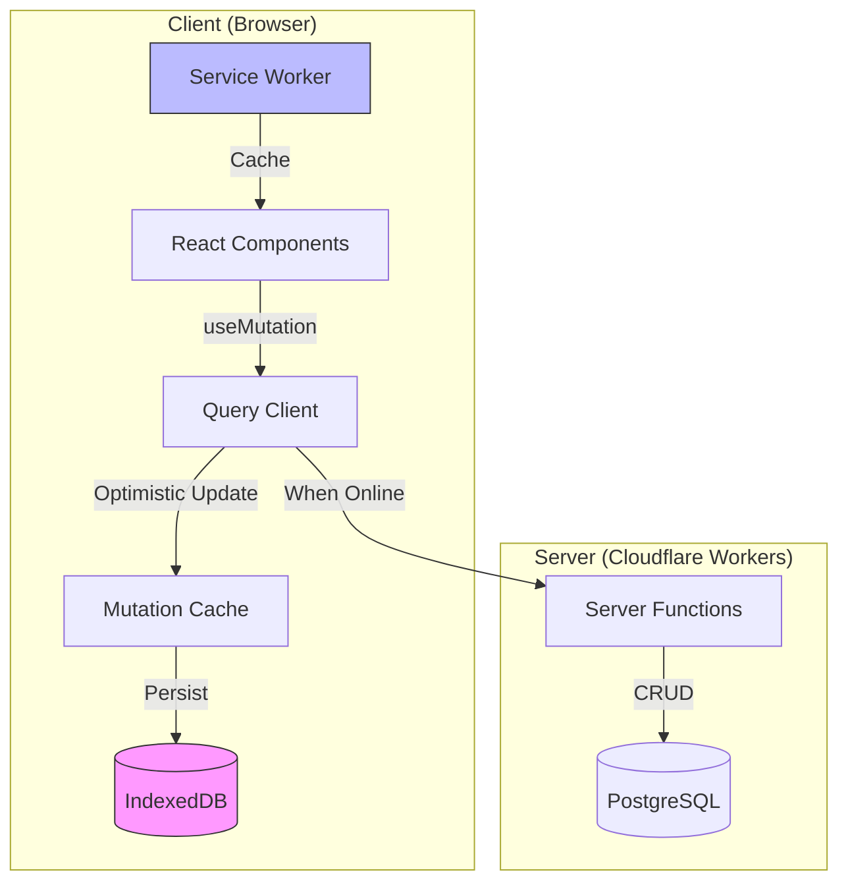
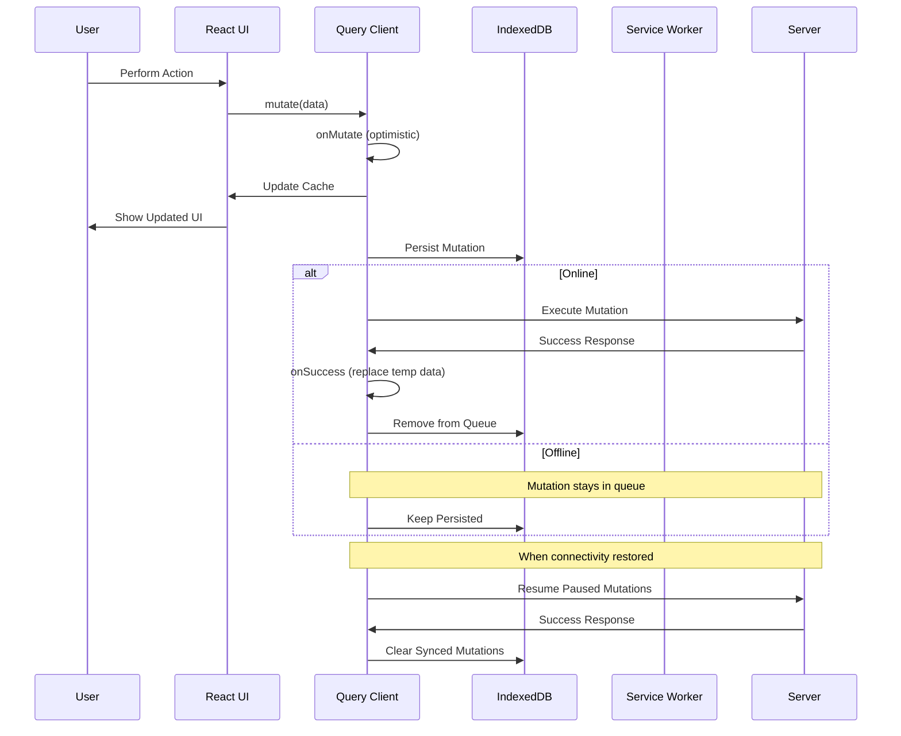
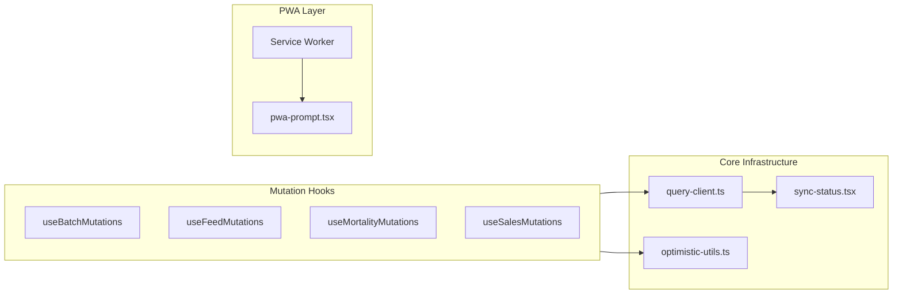

# Design Document: Offline Writes V1

## Overview

Offline Writes V1 transforms LivestockAI into a fully offline-capable application by leveraging TanStack Query's built-in offline support. The implementation focuses on three key areas:

1. **Network Mode Configuration** - Changing from `networkMode: 'online'` to `'offlineFirst'` to allow mutations to execute regardless of connectivity
2. **Optimistic Updates** - Adding `onMutate` handlers to all mutation hooks for immediate UI feedback
3. **Service Worker Activation** - Fixing the mocked service worker registration to enable proper PWA functionality

The design prioritizes simplicity by using TanStack Query's existing persistence infrastructure (already configured with IndexedDB via `idb-keyval`) rather than introducing additional libraries like Dexie or RxDB.

## Architecture

### High-Level Architecture



### Mutation Flow (Offline-First)



### Component Architecture



## Components and Interfaces

### 1. Query Client Configuration

**File:** `app/lib/query-client.ts`

The query client configuration needs to be updated to enable offline-first mutations:

```typescript
interface QueryClientConfig {
  defaultOptions: {
    queries: {
      gcTime: number // 24 hours cache retention
      staleTime: number // 1 minute before refetch
      retry: RetryFunction // Custom retry logic
    }
    mutations: {
      networkMode: 'offlineFirst' // Changed from 'online'
      retry: number // 3 retries on failure
      retryDelay: RetryDelayFunction // Exponential backoff
    }
  }
}
```

### 2. Optimistic Update Utilities

**File:** `app/lib/optimistic-utils.ts`

Shared utilities for optimistic updates across all mutation hooks:

```typescript
interface OptimisticContext<T> {
  previousData: T | undefined
  tempId?: string
}

interface OptimisticUpdateOptions<TData, TVariables> {
  queryKey: QueryKey
  updater: (old: TData | undefined, variables: TVariables) => TData
  generateTempId?: () => string
}

// Generate temporary IDs for offline-created records
function generateTempId(): string

// Create optimistic update handler
function createOptimisticUpdate<TData, TVariables>(
  queryClient: QueryClient,
  options: OptimisticUpdateOptions<TData, TVariables>,
): MutationOptions<TData, Error, TVariables>['onMutate']

// Create rollback handler
function createRollback<TData>(
  queryClient: QueryClient,
  queryKey: QueryKey,
): (context: OptimisticContext<TData>) => void

// Create success handler that replaces temp data
function createSuccessHandler<TData>(
  queryClient: QueryClient,
  queryKey: QueryKey,
  tempIdField?: string,
): (data: TData, variables: unknown, context: OptimisticContext<TData>) => void
```

### 3. Mutation Hook Pattern

**Pattern for all feature mutation hooks:**

```typescript
interface MutationHookResult<TCreate, TUpdate, TDelete> {
  create: UseMutationResult<TCreate, Error, CreateInput>
  update: UseMutationResult<TUpdate, Error, UpdateInput>
  delete: UseMutationResult<TDelete, Error, string>
  isPending: boolean
}

// Example: useBatchMutations
function useBatchMutations(): MutationHookResult<Batch, Batch, void> {
  const queryClient = useQueryClient()

  const create = useMutation({
    mutationFn: createBatchFn,
    onMutate: async (newBatch) => {
      // Cancel outgoing refetches
      await queryClient.cancelQueries({ queryKey: ['batches'] })

      // Snapshot previous value
      const previousBatches = queryClient.getQueryData(['batches'])

      // Optimistically add new batch with temp ID
      const tempId = generateTempId()
      queryClient.setQueryData(['batches'], (old) => [
        ...(old || []),
        { ...newBatch, id: tempId, _isOptimistic: true },
      ])

      return { previousBatches, tempId }
    },
    onError: (err, newBatch, context) => {
      // Rollback on error
      queryClient.setQueryData(['batches'], context?.previousBatches)
    },
    onSuccess: (data, variables, context) => {
      // Replace temp data with server data
      queryClient.setQueryData(['batches'], (old) =>
        old?.map((b) => (b.id === context?.tempId ? data : b)),
      )
    },
    onSettled: () => {
      queryClient.invalidateQueries({ queryKey: ['batches'] })
    },
  })

  // Similar patterns for update and delete...
}
```

### 4. Sync Status Component Enhancement

**File:** `app/components/sync-status.tsx`

Enhanced to show actual pending mutation count and provide retry functionality:

```typescript
interface SyncStatusProps {
  className?: string
  showLabel?: boolean
  size?: 'sm' | 'default'
  showRetry?: boolean
}

interface SyncState {
  status: 'synced' | 'syncing' | 'pending' | 'offline' | 'error'
  pendingCount: number
  failedCount: number
  lastSyncTime?: Date
}

function useSyncState(): SyncState {
  const queryClient = useQueryClient()
  const isOnline = useOnlineStatus()

  // Subscribe to mutation cache changes
  const mutationCache = queryClient.getMutationCache()
  const mutations = mutationCache.getAll()

  const pendingCount = mutations.filter(
    (m) => m.state.status === 'pending' || m.state.isPaused,
  ).length

  const failedCount = mutations.filter((m) => m.state.status === 'error').length

  // Determine overall state
  // ...
}
```

### 5. Service Worker Registration

**File:** `app/components/pwa-prompt.tsx`

Replace mocked implementation with actual `vite-plugin-pwa` registration:

```typescript
import { useRegisterSW } from 'virtual:pwa-register/react'

function usePWARegistration() {
  const {
    needRefresh: [needRefresh, setNeedRefresh],
    offlineReady: [offlineReady, setOfflineReady],
    updateServiceWorker,
  } = useRegisterSW({
    onRegistered(registration) {
      console.log('SW Registered:', registration)
    },
    onRegisterError(error) {
      console.error('SW Registration error:', error)
    },
    onOfflineReady() {
      console.log('App ready for offline use')
    },
  })

  return { needRefresh, offlineReady, updateServiceWorker, setNeedRefresh }
}
```

### 6. Offline-Only Feature Guard

**File:** `app/components/online-required.tsx`

Component to wrap features that require online connectivity:

```typescript
interface OnlineRequiredProps {
  children: ReactNode
  feature: 'auth' | 'shared-formulation' | 'credit-passport' | 'iot-sensors'
  fallback?: ReactNode
}

function OnlineRequired({ children, feature, fallback }: OnlineRequiredProps) {
  const isOnline = useOnlineStatus()

  if (!isOnline) {
    return fallback || <OfflineFeatureMessage feature={feature} />
  }

  return children
}
```

### 7. Temp ID Resolution Manager

**File:** `app/lib/temp-id-resolver.ts`

Manages temp ID → server ID mappings and updates pending mutations:

```typescript
interface TempIdMapping {
  tempId: string
  serverId: string
  entityType:
    | 'batch'
    | 'sale'
    | 'expense'
    | 'customer'
    | 'supplier'
    | 'feed'
    | 'mortality'
    | 'weight'
    | 'invoice'
  resolvedAt: Date
}

interface TempIdResolver {
  // Register a resolved temp ID
  register(tempId: string, serverId: string, entityType: string): void

  // Get server ID for a temp ID (returns undefined if not resolved)
  resolve(tempId: string): string | undefined

  // Check if an ID is a temp ID
  isTempId(id: string): boolean

  // Update all pending mutations with resolved IDs
  updatePendingMutations(queryClient: QueryClient): void

  // Clear mappings (after successful full sync)
  clear(): void
}

// Temp ID format: "temp-{entity}-{uuid}"
const TEMP_ID_PREFIX = 'temp-'

function generateTempId(entityType: string): string {
  return `${TEMP_ID_PREFIX}${entityType}-${crypto.randomUUID()}`
}

function isTempId(id: string): boolean {
  return id.startsWith(TEMP_ID_PREFIX)
}

// Singleton instance for app-wide temp ID tracking
const tempIdResolver = createTempIdResolver()
```

### 8. Mutation Deduplicator

**File:** `app/lib/mutation-deduplicator.ts`

Optimizes the mutation queue by collapsing redundant operations:

```typescript
interface DeduplicationResult {
  removed: number
  merged: number
  mutations: MutationMeta[]
}

interface MutationMeta {
  id: string
  type: 'create' | 'update' | 'delete'
  entityType: string
  entityId: string // Can be temp ID or server ID
  data: unknown
  timestamp: number
}

// Deduplicate mutations for a specific entity
function deduplicateMutations(mutations: MutationMeta[]): DeduplicationResult {
  // Group by entityId
  // Apply rules:
  // 1. create + delete (same tempId) → remove both
  // 2. create + update* + delete → remove all
  // 3. update + update → merge into single update
  // 4. update + delete → keep only delete
}

// Hook to run deduplication before sync
function useDeduplicatedSync() {
  const queryClient = useQueryClient()

  const deduplicate = useCallback(() => {
    const mutationCache = queryClient.getMutationCache()
    const mutations = mutationCache.getAll()

    // Extract mutation metadata
    // Run deduplication
    // Remove/update mutations in cache
  }, [queryClient])

  return { deduplicate }
}
```

### 9. Storage Quota Monitor

**File:** `app/lib/storage-monitor.ts`

Monitors IndexedDB usage and provides warnings:

```typescript
interface StorageStatus {
  used: number // Bytes used
  quota: number // Total quota in bytes
  percentage: number // 0-100
  level: 'ok' | 'warning' | 'critical' | 'blocked'
}

interface StorageMonitorOptions {
  warningThreshold: number // Default: 0.70 (70%)
  criticalThreshold: number // Default: 0.85 (85%)
  blockedThreshold: number // Default: 0.95 (95%)
  pollInterval: number // Default: 30000 (30 seconds)
}

function useStorageMonitor(
  options?: Partial<StorageMonitorOptions>,
): StorageStatus {
  const [status, setStatus] = useState<StorageStatus>({
    used: 0,
    quota: 0,
    percentage: 0,
    level: 'ok',
  })

  useEffect(() => {
    const checkStorage = async () => {
      if (!navigator.storage?.estimate) {
        // Graceful degradation - assume OK
        return
      }

      const estimate = await navigator.storage.estimate()
      const used = estimate.usage || 0
      const quota = estimate.quota || 0
      const percentage = quota > 0 ? (used / quota) * 100 : 0

      let level: StorageStatus['level'] = 'ok'
      if (percentage >= options?.blockedThreshold ?? 95) level = 'blocked'
      else if (percentage >= options?.criticalThreshold ?? 85)
        level = 'critical'
      else if (percentage >= options?.warningThreshold ?? 70) level = 'warning'

      setStatus({ used, quota, percentage, level })
    }

    checkStorage()
    const interval = setInterval(checkStorage, options?.pollInterval ?? 30000)
    return () => clearInterval(interval)
  }, [options])

  return status
}

// Format bytes for display
function formatBytes(bytes: number): string {
  if (bytes < 1024) return `${bytes} B`
  if (bytes < 1024 * 1024) return `${(bytes / 1024).toFixed(1)} KB`
  return `${(bytes / (1024 * 1024)).toFixed(1)} MB`
}
```

## Data Models

### Mutation Queue Entry (Internal to TanStack Query)

TanStack Query manages the mutation queue internally. Each mutation in the cache has this structure:

```typescript
interface MutationState<TData, TError, TVariables, TContext> {
  context: TContext | undefined
  data: TData | undefined
  error: TError | null
  failureCount: number
  failureReason: TError | null
  isPaused: boolean
  status: 'idle' | 'pending' | 'success' | 'error'
  variables: TVariables | undefined
  submittedAt: number
}
```

### Optimistic Record Marker

Records created optimistically are marked with a flag:

```typescript
interface OptimisticRecord {
  _isOptimistic?: boolean // True for records not yet confirmed by server
  _tempId?: string // Temporary ID before server assigns real ID
}

// Example: Batch with optimistic marker
interface OptimisticBatch extends Batch, OptimisticRecord {}
```

### Conflict Resolution Metadata

All mutable records include timestamps for conflict resolution:

```typescript
interface TimestampedRecord {
  createdAt: Date
  updatedAt: Date
}

// Server-side conflict check
interface ConflictCheckResult {
  hasConflict: boolean
  serverVersion: TimestampedRecord
  clientVersion: TimestampedRecord
  resolution: 'client-wins' | 'server-wins'
}
```

### Sync Status State

```typescript
interface SyncStatusState {
  isOnline: boolean
  pendingMutations: number
  failedMutations: number
  lastSyncAttempt: Date | null
  lastSuccessfulSync: Date | null
  syncErrors: SyncError[]
}

interface SyncError {
  mutationKey: string
  error: string
  timestamp: Date
  retryCount: number
}
```

### PWA Registration State

```typescript
interface PWAState {
  isRegistered: boolean
  isOfflineReady: boolean
  needsRefresh: boolean
  registration: ServiceWorkerRegistration | null
}
```

## Correctness Properties

_A property is a characteristic or behavior that should hold true across all valid executions of a system—essentially, a formal statement about what the system should do. Properties serve as the bridge between human-readable specifications and machine-verifiable correctness guarantees._

### Property 1: Offline Mutation Queuing

_For any_ mutation (create, update, or delete) performed while the device is offline, the mutation SHALL be added to the mutation cache and remain there until network connectivity is restored.

**Validates: Requirements 1.1, 4.1, 4.2, 4.3, 4.4, 5.1-5.6, 6.1-6.5, 7.1-7.5**

### Property 2: Mutation Persistence Round-Trip

_For any_ mutation queued while offline, if the mutation is persisted to IndexedDB and the application is restarted, the mutation SHALL be restored to the mutation cache with identical data.

**Validates: Requirements 1.2, 1.3**

### Property 3: Mutation Order Preservation

_For any_ sequence of mutations queued while offline, when network connectivity is restored, the mutations SHALL be executed in the same order they were originally queued (FIFO).

**Validates: Requirements 1.4**

### Property 4: Optimistic Updates

_For any_ mutation (create, update, or delete), the local query cache SHALL immediately reflect the change before server confirmation:

- Creates add a new record with a temporary ID
- Updates modify the existing record in place
- Deletes remove the record from the cache

**Validates: Requirements 2.1, 2.2, 2.3**

### Property 5: Rollback on Failure

_For any_ mutation that fails after an optimistic update has been applied, the query cache SHALL be restored to its exact state before the optimistic update was applied.

**Validates: Requirements 2.4**

### Property 6: Temporary ID Replacement

_For any_ record created with a temporary ID, when the server confirms the creation with a permanent ID, the temporary ID in the cache SHALL be replaced with the server-assigned ID.

**Validates: Requirements 2.5, 4.5**

### Property 7: Pending Count Accuracy

_For any_ state of the mutation cache, the pending count displayed by the Sync_Status component SHALL equal the actual number of mutations with status 'pending' or 'isPaused' in the mutation cache.

**Validates: Requirements 3.2**

### Property 8: Conflict Resolution

_For any_ record that exists on both client and server with different `updatedAt` timestamps, when syncing, the record with the later `updatedAt` timestamp SHALL be preserved (last-write-wins).

**Validates: Requirements 8.1, 8.2**

### Property 9: Mutation Preservation Invariant

_For any_ mutation in the queue, the mutation SHALL remain in the queue until one of the following conditions is met:

1. The mutation is successfully synced to the server
2. The mutation is explicitly discarded by the user
3. The mutation references a record that no longer exists (orphaned)

**Validates: Requirements 8.5**

### Property 10: Offline Asset Serving

_For any_ application route, when the device is offline and the route has been previously visited, the Service Worker SHALL serve the cached static assets for that route.

**Validates: Requirements 9.4**

### Property 11: Temp ID Resolution Propagation

_For any_ mutation that succeeds and replaces a temp ID with a server ID, all pending mutations in the queue that reference that temp ID SHALL be updated to use the server ID before they are executed.

**Validates: Requirements 11.1, 11.2, 11.4**

### Property 12: Temp ID Mapping Completeness

_For any_ temp ID that is resolved to a server ID, the mapping SHALL be stored and retrievable until all dependent mutations have been successfully synced.

**Validates: Requirements 11.3**

### Property 13: Create-Delete Cancellation

_For any_ record that is created offline (with temp ID) and then deleted offline (before sync), both the create and delete mutations SHALL be removed from the queue, resulting in no server operations.

**Validates: Requirements 12.1**

### Property 14: Update Merge Correctness

_For any_ sequence of update mutations to the same record queued offline, the merged mutation SHALL contain the final values from the last update for each field.

**Validates: Requirements 12.3, 12.4**

### Property 15: Storage Threshold Accuracy

_For any_ storage usage level, the reported percentage SHALL be within 1% of the actual IndexedDB usage as reported by navigator.storage.estimate().

**Validates: Requirements 13.1, 13.5**

### Property 16: Storage Block Enforcement

_For any_ attempt to queue a new mutation when storage usage exceeds 95%, the mutation SHALL be rejected and the user SHALL be notified to sync.

**Validates: Requirements 13.4**

## Error Handling

### Network Errors

| Error Type         | Handling Strategy                 |
| ------------------ | --------------------------------- |
| Network timeout    | Pause mutation, retry when online |
| Connection refused | Pause mutation, retry when online |
| DNS failure        | Pause mutation, retry when online |

### Server Errors

| Error Type       | Handling Strategy                                |
| ---------------- | ------------------------------------------------ |
| 400 Bad Request  | Do not retry, notify user with validation errors |
| 401 Unauthorized | Pause all mutations, redirect to login           |
| 403 Forbidden    | Do not retry, notify user                        |
| 404 Not Found    | Remove mutation from queue, log error            |
| 409 Conflict     | Apply last-write-wins, retry with resolved data  |
| 500 Server Error | Retry up to 3 times with exponential backoff     |

### Retry Strategy

```typescript
const retryConfig = {
  maxRetries: 3,
  baseDelay: 1000, // 1 second
  maxDelay: 30000, // 30 seconds
  backoffMultiplier: 2,

  // Calculate delay: min(baseDelay * 2^attempt, maxDelay)
  getDelay: (attempt: number) => Math.min(1000 * Math.pow(2, attempt), 30000),
}
```

### Optimistic Update Rollback

When a mutation fails after optimistic update:

1. Restore previous cache state from context
2. Show toast notification with error message
3. Keep mutation in queue for retry (unless validation error)
4. Log error for debugging

### Orphaned Mutation Handling

When a mutation references a deleted record:

1. Detect 404 response from server
2. Remove mutation from queue
3. Log warning with mutation details
4. Do not show error to user (silent cleanup)

## Testing Strategy

### Unit Tests

Unit tests focus on pure functions and utilities:

- `generateTempId()` - Verify UUID format and uniqueness
- `createOptimisticUpdate()` - Verify cache update logic
- `createRollback()` - Verify cache restoration logic
- Retry delay calculation
- Conflict resolution logic

### Property-Based Tests

Property tests use `fast-check` to verify correctness properties:

**Test Configuration:**

- Minimum 100 iterations per property test
- Tag format: **Feature: offline-writes-v1, Property {number}: {property_text}**

**Property Test Files:**

- `tests/features/offline/mutation-queue.property.test.ts`
- `tests/features/offline/optimistic-updates.property.test.ts`
- `tests/features/offline/sync-status.property.test.ts`
- `tests/features/offline/conflict-resolution.property.test.ts`

### Integration Tests

Integration tests verify end-to-end behavior:

- Mutation queuing when offline (mock navigator.onLine)
- Mutation persistence to IndexedDB
- Mutation restoration on app restart
- Sync execution when online
- Service worker registration and caching

### Component Tests

Component tests verify UI behavior:

- SyncStatus displays correct state for each scenario
- OfflineIndicator shows/hides based on connectivity
- PWAPrompt shows update notification
- OnlineRequired blocks offline access to protected features

### Test Utilities

```typescript
// Mock online/offline state
function mockOnlineStatus(isOnline: boolean): void

// Create test mutation cache with pending mutations
function createTestMutationCache(mutations: TestMutation[]): MutationCache

// Simulate IndexedDB for persistence tests
function createMockIndexedDB(): IDBKeyval

// Wait for mutations to sync
async function waitForSync(queryClient: QueryClient): Promise<void>
```

### Coverage Requirements

| Area                        | Minimum Coverage |
| --------------------------- | ---------------- |
| Optimistic update utilities | 100%             |
| Conflict resolution logic   | 100%             |
| Sync status calculation     | 90%              |
| Mutation hooks              | 80%              |
| UI components               | 70%              |
