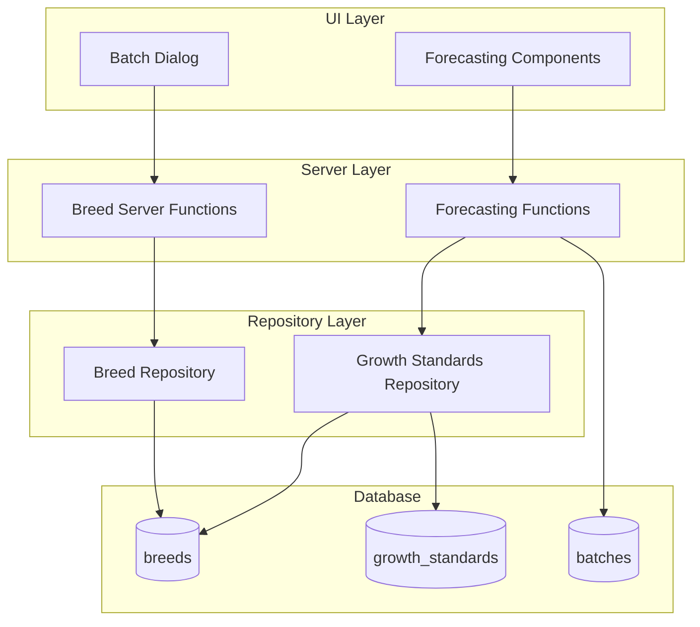
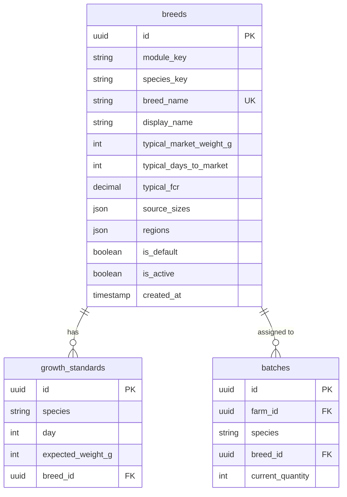

# Design Document: Reference Data Foundation

## Overview

The Reference Data Foundation feature introduces a database-driven breed management system that replaces hardcoded species/breed data with dynamic, queryable reference data. This enables breed-specific growth forecasting, supports future AI-powered features, and provides a foundation for regional customization.

The design follows OpenLivestock's three-layer architecture (Server → Service → Repository) and maintains backward compatibility with existing batches that don't have breed assignments.

## Existing Codebase Context

**Key files to be aware of:**

- `app/features/modules/constants.ts` - Contains `MODULE_METADATA` with hardcoded `speciesOptions` and `sourceSizeOptions` per module. These will remain as fallbacks when database is unavailable.
- `app/lib/db/seeds/production.ts` - Contains growth standards seeder. Species use Title Case (e.g., `'Broiler'`, `'Catfish'`). **New breed seeds must match this casing.**
- `app/lib/db/types.ts` - Database type definitions. `GrowthStandardTable` and `BatchTable` need `breedId` column added.
- `app/components/dialogs/batch-dialog.tsx` - Uses `SOURCE_SIZE_OPTIONS` from server. Will need to fetch breeds dynamically.
- `app/features/batches/forecasting.ts` - Existing `calculateBatchProjection()` function. Will be extended to use breed-specific growth curves.

## Architecture

### High-Level Data Flow



### Database Schema Changes



### Verified Species Key Casing

**Confirmed from `app/lib/db/seeds/production.ts`:**

| Module      | Species Key | growth_standards.species |
| ----------- | ----------- | ------------------------ |
| poultry     | Broiler     | Broiler                  |
| poultry     | Layer       | Layer                    |
| aquaculture | Catfish     | Catfish                  |
| aquaculture | Tilapia     | Tilapia                  |
| cattle      | Cattle      | Cattle                   |
| goats       | Goat        | Goat                     |
| sheep       | Sheep       | Sheep                    |

> **Note:** Bees don't have growth standards (colony strength measured by frame count, not weight)

## Components and Interfaces

### 1. Breeds Repository (`app/features/breeds/repository.ts`)

```typescript
interface Breed {
    id: string
    moduleKey: ModuleKey
    speciesKey: string
    breedName: string
    displayName: string
    typicalMarketWeightG: number
    typicalDaysToMarket: number
    typicalFcr: string // DECIMAL as string
    sourceSizes: string[] // JSON array
    regions: string[] // JSON array
    isDefault: boolean
    isActive: boolean
    createdAt: Date
}

// Repository functions
async function getAllBreeds(db: Kysely<Database>): Promise<Breed[]>
async function getBreedsByModule(
    db: Kysely<Database>,
    moduleKey: ModuleKey,
): Promise<Breed[]>
async function getBreedsBySpecies(
    db: Kysely<Database>,
    speciesKey: string,
): Promise<Breed[]>
async function getBreedById(
    db: Kysely<Database>,
    id: string,
): Promise<Breed | undefined>
async function getDefaultBreedForSpecies(
    db: Kysely<Database>,
    speciesKey: string,
): Promise<Breed | undefined>
```

### 2. Breeds Server Functions (`app/features/breeds/server.ts`)

```typescript
// Server function signatures
export const getBreedsForModuleFn = createServerFn({ method: 'GET' })
    .validator(
        z.object({
            moduleKey: z.enum([
                'poultry',
                'aquaculture',
                'cattle',
                'goats',
                'sheep',
                'bees',
            ]),
        }),
    )
    .handler(async ({ data }) => {
        /* ... */
    })

export const getBreedsForSpeciesFn = createServerFn({ method: 'GET' })
    .validator(z.object({ speciesKey: z.string().min(1) }))
    .handler(async ({ data }) => {
        /* ... */
    })

export const getBreedByIdFn = createServerFn({ method: 'GET' })
    .validator(z.object({ breedId: z.string().uuid() }))
    .handler(async ({ data }) => {
        /* ... */
    })
```

### 3. Growth Standards Repository Updates (`app/features/batches/repository.ts`)

**NEW FUNCTION TO ADD:**

```typescript
/**
 * Get growth standards for a species, with optional breed-specific override
 *
 * @param db - Kysely database instance
 * @param species - Species key (e.g., 'Broiler', 'Catfish')
 * @param breedId - Optional breed ID for breed-specific standards
 * @returns Array of growth standards ordered by day ascending
 *
 * Logic:
 * 1. If breedId provided, query for breed-specific standards first
 * 2. If no breed-specific standards found (or no breedId), fall back to species-level (breed_id IS NULL)
 * 3. Return standards ordered by day ascending
 */
export async function getGrowthStandards(
    db: Kysely<Database>,
    species: string,
    breedId?: string | null,
): Promise<
    Array<{
        id: string
        species: string
        day: number
        expected_weight_g: number
        breedId: string | null
    }>
> {
    // Try breed-specific standards first if breedId provided
    if (breedId) {
        const breedStandards = await db
            .selectFrom('growth_standards')
            .select(['id', 'species', 'day', 'expected_weight_g', 'breedId'])
            .where('species', '=', species)
            .where('breedId', '=', breedId)
            .orderBy('day', 'asc')
            .execute()

        if (breedStandards.length > 0) {
            return breedStandards
        }
    }

    // Fall back to species-level standards (breedId IS NULL)
    return db
        .selectFrom('growth_standards')
        .select(['id', 'species', 'day', 'expected_weight_g', 'breedId'])
        .where('species', '=', species)
        .where('breedId', 'is', null)
        .orderBy('day', 'asc')
        .execute()
}
```

### 4. Forecasting Service Updates (`app/features/batches/forecasting.ts`)

**CURRENT CODE (lines 20-42) - batch query missing breedId:**

```typescript
const batch = await db
    .selectFrom('batches')
    .select([
        'id',
        'farmId',
        'batchName',
        'livestockType',
        'species',
        'sourceSize',
        'initialQuantity',
        'currentQuantity',
        'acquisitionDate',
        'costPerUnit',
        'totalCost',
        'status',
        'supplierId',
        'structureId',
        'targetHarvestDate',
        'target_weight_g',
        'targetPricePerUnit',
        'notes',
        'createdAt',
        'updatedAt',
    ])
// ... missing 'breedId' in select!
```

**UPDATED CODE - add breedId to select:**

```typescript
const batch = await db.selectFrom('batches').select([
    'id',
    'farmId',
    'batchName',
    'livestockType',
    'species',
    'sourceSize',
    'initialQuantity',
    'currentQuantity',
    'acquisitionDate',
    'costPerUnit',
    'totalCost',
    'status',
    'supplierId',
    'structureId',
    'targetHarvestDate',
    'target_weight_g',
    'targetPricePerUnit',
    'notes',
    'createdAt',
    'updatedAt',
    'breedId', // ADD THIS
])
```

**CURRENT CODE (lines 55-60) - growth standards query without breed support:**

```typescript
const growthStandard = await db
    .selectFrom('growth_standards')
    .select(['id', 'species', 'day', 'expected_weight_g'])
    .where('species', '=', batch.species)
    .orderBy('day', 'asc')
    .execute()
```

**UPDATED CODE - use repository function with breed fallback:**

```typescript
import { getGrowthStandards, getBreedById } from './repository'

// Replace inline query with repository function
const growthStandard = await getGrowthStandards(
    db,
    batch.species,
    batch.breedId,
)
```

**CURRENT CODE (line 109) - hardcoded FCR:**

```typescript
const feedNeededKg = totalWeightToGain * 1.6 // FCR 1.6 conserv
```

**UPDATED CODE - use breed-specific FCR when available:**

```typescript
// Get breed-specific FCR if available
let fcr = 1.6 // Default FCR
if (batch.breedId) {
    const { getBreedById } = await import('~/features/breeds/repository')
    const breed = await getBreedById(db, batch.breedId)
    if (breed?.typicalFcr) {
        fcr = parseFloat(breed.typicalFcr)
    }
}
const feedNeededKg = totalWeightToGain * fcr
```

**COMPLETE UPDATED FUNCTION:**

```typescript
export async function calculateBatchProjection(
    batchId: string,
): Promise<ProjectionResult | null> {
    const { getDb } = await import('~/lib/db')
    const db = await getDb()

    // 1. Fetch batch WITH breedId
    const batch = await db
        .selectFrom('batches')
        .select([
            'id',
            'farmId',
            'batchName',
            'livestockType',
            'species',
            'sourceSize',
            'initialQuantity',
            'currentQuantity',
            'acquisitionDate',
            'costPerUnit',
            'totalCost',
            'status',
            'supplierId',
            'structureId',
            'targetHarvestDate',
            'target_weight_g',
            'targetPricePerUnit',
            'notes',
            'createdAt',
            'updatedAt',
            'breedId', // NEW: include breedId
        ])
        .where('id', '=', batchId)
        .executeTakeFirst()

    if (!batch || !batch.target_weight_g || batch.status === 'sold') return null

    // 2. Get growth standards (breed-specific with species fallback)
    const { getGrowthStandards } = await import('./repository')
    const growthStandard = await getGrowthStandards(
        db,
        batch.species,
        batch.breedId,
    )

    if (growthStandard.length === 0) return null

    // ... rest of calculation logic ...

    // 3. Get breed-specific FCR if available
    let fcr = 1.6 // Default FCR
    if (batch.breedId) {
        const { getBreedById } = await import('~/features/breeds/repository')
        const breed = await getBreedById(db, batch.breedId)
        if (breed?.typicalFcr) {
            fcr = parseFloat(breed.typicalFcr)
        }
    }

    // Use fcr in feed cost calculation
    const feedNeededKg = totalWeightToGain * fcr

    // ... rest of function ...
}
```

### 5. Batch Dialog Updates (`app/components/dialogs/batch-dialog.tsx`)

```typescript
// New state for breed selection
const [breeds, setBreeds] = useState<Breed[]>([])
const [selectedBreed, setSelectedBreed] = useState<Breed | null>(null)

// Fetch breeds when species changes
useEffect(() => {
    if (formData.species) {
        getBreedsForSpeciesFn({ data: { speciesKey: formData.species } }).then(
            setBreeds,
        )
    }
}, [formData.species])

// Update source sizes based on selected breed
const sourceSizeOptions =
    selectedBreed?.sourceSizes || SOURCE_SIZE_OPTIONS[formData.livestockType]
```

## Data Models

### Breeds Table Schema

```typescript
// Migration: app/lib/db/migrations/2026-01-26-001-breeds-table.ts
import { sql } from 'kysely'
import type { Kysely } from 'kysely'

export async function up(db: Kysely<any>): Promise<void> {
    // Create breeds table
    await db.schema
        .createTable('breeds')
        .addColumn('id', 'uuid', (col) =>
            col.primaryKey().defaultTo(sql`gen_random_uuid()`),
        )
        .addColumn('moduleKey', 'varchar(20)', (col) => col.notNull())
        .addColumn('speciesKey', 'varchar(50)', (col) => col.notNull())
        .addColumn('breedName', 'varchar(100)', (col) => col.notNull())
        .addColumn('displayName', 'varchar(100)', (col) => col.notNull())
        .addColumn('typicalMarketWeightG', 'integer', (col) => col.notNull())
        .addColumn('typicalDaysToMarket', 'integer', (col) => col.notNull())
        .addColumn('typicalFcr', 'decimal(4,2)', (col) => col.notNull())
        .addColumn('sourceSizes', 'jsonb', (col) =>
            col.notNull().defaultTo(sql`'[]'`),
        )
        .addColumn('regions', 'jsonb', (col) =>
            col.notNull().defaultTo(sql`'[]'`),
        )
        .addColumn('isDefault', 'boolean', (col) =>
            col.notNull().defaultTo(false),
        )
        .addColumn('isActive', 'boolean', (col) =>
            col.notNull().defaultTo(true),
        )
        .addColumn('createdAt', 'timestamptz', (col) =>
            col.notNull().defaultTo(sql`now()`),
        )
        .execute()

    // Add unique constraint
    await db.schema
        .createIndex('breeds_module_species_name_unique')
        .on('breeds')
        .columns(['moduleKey', 'speciesKey', 'breedName'])
        .unique()
        .execute()

    // Create indexes (Kysely pattern - runs in transaction)
    await db.schema
        .createIndex('idx_breeds_module')
        .on('breeds')
        .column('moduleKey')
        .execute()

    await db.schema
        .createIndex('idx_breeds_species')
        .on('breeds')
        .column('speciesKey')
        .execute()

    await db.schema
        .createIndex('idx_breeds_active')
        .on('breeds')
        .column('isActive')
        .where('isActive', '=', true)
        .execute()
}

export async function down(db: Kysely<any>): Promise<void> {
    await db.schema.dropTable('breeds').ifExists().execute()
}
```

### Growth Standards Table Update

```typescript
// Add to migration: 2026-01-26-001-breeds-table.ts
export async function up(db: Kysely<any>): Promise<void> {
    // ... breeds table creation above ...

    // Add breed_id to growth_standards
    await db.schema
        .alterTable('growth_standards')
        .addColumn('breedId', 'uuid', (col) =>
            col.references('breeds.id').onDelete('set null'),
        )
        .execute()

    await db.schema
        .createIndex('idx_growth_standards_breed')
        .on('growth_standards')
        .column('breedId')
        .execute()
}

export async function down(db: Kysely<any>): Promise<void> {
    // Drop indexes first
    await db.schema.dropIndex('idx_growth_standards_breed').ifExists().execute()

    // Drop column
    await db.schema
        .alterTable('growth_standards')
        .dropColumn('breedId')
        .ifExists()
        .execute()

    // Drop breeds table
    await db.schema.dropTable('breeds').ifExists().execute()
}
```

### Batches Table Update

```typescript
// Already included in migration above - add breed_id to batches
await db.schema
    .alterTable('batches')
    .addColumn('breedId', 'uuid', (col) =>
        col.references('breeds.id').onDelete('set null'),
    )
    .execute()

await db.schema
    .createIndex('idx_batches_breed')
    .on('batches')
    .column('breedId')
    .execute()
```

### Complete Migration with Rollback

```typescript
// app/lib/db/migrations/2026-01-26-001-breeds-table.ts
import { sql } from 'kysely'
import type { Kysely } from 'kysely'

export async function up(db: Kysely<any>): Promise<void> {
    // 1. Create breeds table
    await db.schema
        .createTable('breeds')
        .addColumn('id', 'uuid', (col) =>
            col.primaryKey().defaultTo(sql`gen_random_uuid()`),
        )
        .addColumn('moduleKey', 'varchar(20)', (col) => col.notNull())
        .addColumn('speciesKey', 'varchar(50)', (col) => col.notNull())
        .addColumn('breedName', 'varchar(100)', (col) => col.notNull())
        .addColumn('displayName', 'varchar(100)', (col) => col.notNull())
        .addColumn('typicalMarketWeightG', 'integer', (col) => col.notNull())
        .addColumn('typicalDaysToMarket', 'integer', (col) => col.notNull())
        .addColumn('typicalFcr', 'decimal(4,2)', (col) => col.notNull())
        .addColumn('sourceSizes', 'jsonb', (col) =>
            col.notNull().defaultTo(sql`'[]'`),
        )
        .addColumn('regions', 'jsonb', (col) =>
            col.notNull().defaultTo(sql`'[]'`),
        )
        .addColumn('isDefault', 'boolean', (col) =>
            col.notNull().defaultTo(false),
        )
        .addColumn('isActive', 'boolean', (col) =>
            col.notNull().defaultTo(true),
        )
        .addColumn('createdAt', 'timestamptz', (col) =>
            col.notNull().defaultTo(sql`now()`),
        )
        .execute()

    // 2. Add unique constraint
    await db.schema
        .createIndex('breeds_module_species_name_unique')
        .on('breeds')
        .columns(['moduleKey', 'speciesKey', 'breedName'])
        .unique()
        .execute()

    // 3. Create indexes
    await db.schema
        .createIndex('idx_breeds_module')
        .on('breeds')
        .column('moduleKey')
        .execute()

    await db.schema
        .createIndex('idx_breeds_species')
        .on('breeds')
        .column('speciesKey')
        .execute()

    await db.schema
        .createIndex('idx_breeds_active')
        .on('breeds')
        .column('isActive')
        .where('isActive', '=', true)
        .execute()

    // 4. Add breed_id to growth_standards
    await db.schema
        .alterTable('growth_standards')
        .addColumn('breedId', 'uuid', (col) =>
            col.references('breeds.id').onDelete('set null'),
        )
        .execute()

    await db.schema
        .createIndex('idx_growth_standards_breed')
        .on('growth_standards')
        .column('breedId')
        .execute()

    // 5. Add breed_id to batches
    await db.schema
        .alterTable('batches')
        .addColumn('breedId', 'uuid', (col) =>
            col.references('breeds.id').onDelete('set null'),
        )
        .execute()

    await db.schema
        .createIndex('idx_batches_breed')
        .on('batches')
        .column('breedId')
        .execute()
}

export async function down(db: Kysely<any>): Promise<void> {
    // Drop in reverse order

    // 1. Drop batches breed_id
    await db.schema.dropIndex('idx_batches_breed').ifExists().execute()
    await db.schema
        .alterTable('batches')
        .dropColumn('breedId')
        .ifExists()
        .execute()

    // 2. Drop growth_standards breed_id
    await db.schema.dropIndex('idx_growth_standards_breed').ifExists().execute()
    await db.schema
        .alterTable('growth_standards')
        .dropColumn('breedId')
        .ifExists()
        .execute()

    // 3. Drop breeds table (cascades to indexes and constraints)
    await db.schema.dropTable('breeds').ifExists().execute()
}
```

### Migration Rollback

export async function down(db: Kysely<any>): Promise<void> {
// Drop indexes first
await sql`DROP INDEX IF EXISTS idx_batches_breed`.execute(db)
await sql`DROP INDEX IF EXISTS idx_growth_standards_breed`.execute(db)

// Drop foreign key columns
await db.schema.alterTable('batches').dropColumn('breedId').execute()
await db.schema
.alterTable('growth_standards')
.dropColumn('breedId')
.execute()

// Drop breeds table indexes
await sql`DROP INDEX IF EXISTS idx_breeds_active`.execute(db)
await sql`DROP INDEX IF EXISTS idx_breeds_species`.execute(db)
await sql`DROP INDEX IF EXISTS idx_breeds_module`.execute(db)

// Drop breeds table
await db.schema.dropTable('breeds').execute()
}

````

### TypeScript Types

```typescript
// app/lib/db/types.ts additions
export interface BreedTable {
  id: Generated<string>
  moduleKey: 'poultry' | 'aquaculture' | 'cattle' | 'goats' | 'sheep' | 'bees'
  speciesKey: string
  breedName: string
  displayName: string
  typicalMarketWeightG: number
  typicalDaysToMarket: number
  typicalFcr: string // DECIMAL(4,2)
  sourceSizes: string[] // JSONB
  regions: string[] // JSONB
  isDefault: Generated<boolean>
  isActive: Generated<boolean>
  createdAt: Generated<Date>
}

// Update GrowthStandardTable
export interface GrowthStandardTable {
  id: Generated<string>
  species: string
  day: number
  expected_weight_g: number
  breedId: string | null // NEW: nullable FK to breeds
}

// Update BatchTable
export interface BatchTable {
  // ... existing fields ...
  breedId: string | null // NEW: nullable FK to breeds
}
````

### Seed Data Structure

**IMPORTANT: Species keys must match existing growth_standards table casing (Title Case) - verified from `app/lib/db/seeds/production.ts`.**

```typescript
// Breed seed data example - note species uses Title Case to match growth_standards
const POULTRY_BREEDS: BreedSeedData[] = [
    {
        moduleKey: 'poultry',
        speciesKey: 'Broiler', // Title Case - matches growth_standards.species
        breedName: 'cobb_500',
        displayName: 'Cobb 500',
        typicalMarketWeightG: 2800,
        typicalDaysToMarket: 42,
        typicalFcr: '1.65',
        sourceSizes: ['day-old', 'grower'], // lowercase - matches SOURCE_SIZE_OPTIONS values
        regions: ['global'],
        isDefault: true,
    },
    {
        moduleKey: 'poultry',
        speciesKey: 'Broiler',
        breedName: 'ross_308',
        displayName: 'Ross 308',
        typicalMarketWeightG: 2900,
        typicalDaysToMarket: 42,
        typicalFcr: '1.60',
        sourceSizes: ['day-old', 'grower'],
        regions: ['global'],
        isDefault: false,
    },
    // ... more breeds
]
```

**CRITICAL: Species Casing Validation**

All `speciesKey` values MUST use **Title Case** to match `growth_standards.species` column:

- ✅ Correct: `'Broiler'`, `'Layer'`, `'Catfish'`, `'Tilapia'`
- ❌ Wrong: `'broiler'`, `'layer'`, `'catfish'`, `'tilapia'`

**Validation Required**: Before implementing, verify actual casing in database:

```sql
SELECT DISTINCT species FROM growth_standards ORDER BY species;
```

If casing differs from Title Case, update all seed data to match database values.

## Correctness Properties

_A property is a characteristic or behavior that should hold true across all valid executions of a system—essentially, a formal statement about what the system should do. Properties serve as the bridge between human-readable specifications and machine-verifiable correctness guarantees._

### Property 1: Breed Data Round-Trip

_For any_ valid breed data (with module_key, species_key, breed_name, display_name, numeric fields, JSON arrays, and boolean flags), inserting it into the breeds table and then retrieving it by ID SHALL return an equivalent record with all fields preserved.

**Validates: Requirements 1.1, 1.2, 1.3, 1.4, 1.5, 1.6**

### Property 2: Growth Standards Breed Priority

_For any_ species that has both breed-specific growth standards (with breed_id) and species-level standards (with breed_id=null), querying growth standards for a specific breed SHALL return only the breed-specific standards, while querying for the species without a breed SHALL return the species-level standards.

**Validates: Requirements 2.2, 2.3, 2.5**

### Property 3: Breed Query Filtering

_For any_ set of breeds in the database, calling getBreedsForModule(moduleKey) SHALL return exactly the breeds where module_key matches AND is_active=true, and calling getBreedsForSpecies(speciesKey) SHALL return exactly the breeds where species_key matches AND is_active=true.

**Validates: Requirements 4.1, 4.2, 4.3**

### Property 4: Forecasting Growth Curve Selection

_For any_ batch with a breed*id that has breed-specific growth standards, the forecasting system SHALL use those breed-specific standards. \_For any* batch without breed_id OR with a breed_id that has no specific standards, the forecasting system SHALL use species-level growth standards.

**Validates: Requirements 6.1, 6.2, 6.3**

### Property 5: Forecasting FCR Usage

_For any_ batch with a breed_id where the breed has a typical_fcr value, the forecasting system's feed cost projection SHALL use that breed's FCR value instead of the default FCR.

**Validates: Requirements 6.4**

### Property 6: Batch Breed Compatibility

_For any_ batch, the system SHALL allow creation and full functionality (forecasting, mortality tracking, feed recording) regardless of whether breed_id is null or references a valid breed.

**Validates: Requirements 5.4, 5.5, 7.4**

## Error Handling

Uses the existing `AppError` system from `app/lib/errors/`. Error codes added to `app/lib/errors/error-map.ts`:

### Database Errors

| Error Scenario                                        | Error Code      | HTTP Status | Handling Strategy                                    |
| ----------------------------------------------------- | --------------- | ----------- | ---------------------------------------------------- |
| Duplicate breed (module_key, species_key, breed_name) | DUPLICATE_BREED | 409         | Return structured error with code 'DUPLICATE_BREED'  |
| Invalid breed_id reference                            | BREED_NOT_FOUND | 404         | Return structured error with code 'BREED_NOT_FOUND'  |
| Database connection failure                           | DATABASE_ERROR  | 500         | Log error, return generic 'DATABASE_ERROR' to client |

### Query Errors

| Error Scenario                   | Handling Strategy                     |
| -------------------------------- | ------------------------------------- |
| Invalid module_key               | Zod validation rejects before handler |
| Empty species_key                | Zod validation rejects before handler |
| Invalid UUID format for breed_id | Zod validation rejects before handler |
| No breeds found                  | Return empty array (not an error)     |

### Forecasting Errors

| Error Scenario                       | Handling Strategy                             |
| ------------------------------------ | --------------------------------------------- |
| No growth standards for species      | Return null projection (graceful degradation) |
| Batch not found                      | Return null projection                        |
| Invalid batch status (sold/depleted) | Return null projection                        |

### Migration Errors

| Error Scenario                   | Handling Strategy                          |
| -------------------------------- | ------------------------------------------ |
| Column already exists            | Migration should use IF NOT EXISTS         |
| Foreign key constraint violation | Migration adds FK after data is consistent |

### UI Error Handling

**Batch Dialog Breed Selection:**

- Loading state: Show skeleton while fetching breeds
- Empty state: "No breeds available for this species"
- Error state: "Failed to load breeds. Using default options."
- Fallback: Use hardcoded `SOURCE_SIZE_OPTIONS` if fetch fails

## Testing Strategy

### Dual Testing Approach

This feature requires both unit tests and property-based tests:

- **Property tests**: Verify universal properties across randomly generated inputs
- **Unit tests**: Verify specific examples, edge cases, and integration points

### Property-Based Testing Configuration

- **Library**: fast-check (already in project dependencies)
- **Minimum iterations**: 100 per property test
- **Tag format**: `Feature: reference-data-foundation, Property {number}: {property_text}`

### Test File Structure

```
tests/features/breeds/
├── breeds.property.test.ts    # Property-based tests for breed operations
├── breeds.test.ts             # Unit tests for breed service functions
└── breeds.integration.test.ts # Integration tests with database
```

### Property Test Examples

```typescript
// Property 1: Breed Data Round-Trip
describe('Breed Repository', () => {
    it('Property 1: breed data round-trip preserves all fields', () => {
        fc.assert(
            fc.property(
                fc.record({
                    moduleKey: fc.constantFrom(
                        'poultry',
                        'aquaculture',
                        'cattle',
                        'goats',
                        'sheep',
                        'bees',
                    ),
                    speciesKey: fc.string({ minLength: 1, maxLength: 50 }),
                    breedName: fc.string({ minLength: 1, maxLength: 100 }),
                    displayName: fc.string({ minLength: 1, maxLength: 100 }),
                    typicalMarketWeightG: fc.integer({ min: 1, max: 1000000 }),
                    typicalDaysToMarket: fc.integer({ min: 1, max: 1000 }),
                    typicalFcr: fc
                        .float({ min: 0.1, max: 10 })
                        .map((n) => n.toFixed(2)),
                    sourceSizes: fc.array(fc.string(), { maxLength: 10 }),
                    regions: fc.array(fc.string(), { maxLength: 10 }),
                    isDefault: fc.boolean(),
                    isActive: fc.boolean(),
                }),
                async (breedData) => {
                    const id = await insertBreed(db, breedData)
                    const retrieved = await getBreedById(db, id)
                    expect(retrieved).toMatchObject(breedData)
                },
            ),
            { numRuns: 100 },
        )
    })
})
```

### Unit Test Coverage

| Component                   | Test Focus                              |
| --------------------------- | --------------------------------------- |
| Breed Repository            | CRUD operations, query filtering        |
| Breed Server Functions      | Input validation, auth checks           |
| Growth Standards Repository | Breed priority logic, fallback behavior |
| Forecasting Service         | Growth curve selection, FCR usage       |
| Batch Dialog                | Breed selection state management        |

### Integration Test Coverage

| Test Scenario                       | Database Required |
| ----------------------------------- | ----------------- |
| Breed unique constraint enforcement | Yes               |
| Foreign key cascade behavior        | Yes               |
| Migration idempotency               | Yes               |
| Seed data completeness              | Yes               |

### Edge Cases to Test

1. Empty breeds table (no breeds seeded)
2. Species with no default breed
3. Breed with empty source_sizes array
4. Batch created before breeds feature (null breed_id)
5. Breed deactivated after batch assignment
6. Growth standards only at species level (no breed-specific)
7. Multiple breeds marked as default for same species
