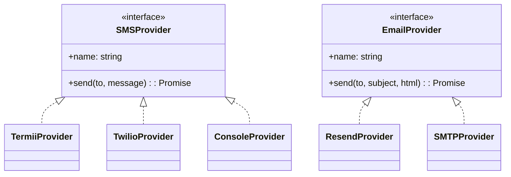
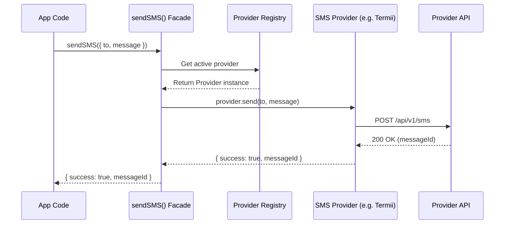
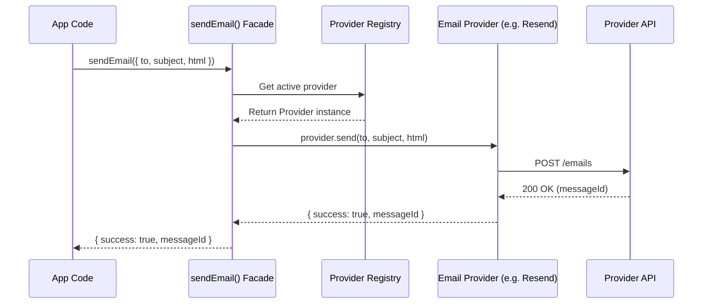
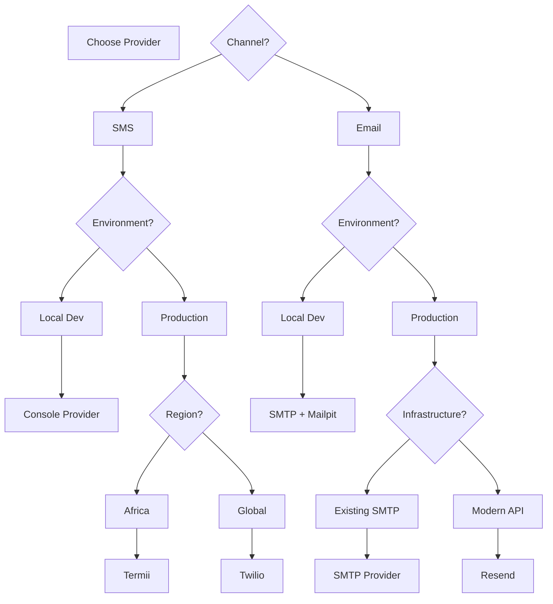
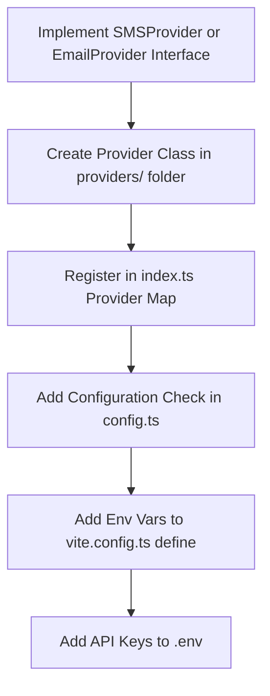

# Integrations Guide

OpenLivestock Manager uses a provider-agnostic integration system for SMS and Email notifications. This allows you to choose your preferred service provider or implement custom integrations without modifying core application code.

---

## Table of Contents

- [Overview](#overview)
- [Built-in Providers](#built-in-providers)
- [Configuration](#configuration)
- [For Users: Choosing a Provider](#for-users-choosing-a-provider)
- [For Developers: Creating Custom Providers](#for-developers-creating-custom-providers)
- [Interactive Examples (`examples/`)](#interactive-examples-examples)
- [For AI Agents: Implementation Guide](#for-ai-agents-implementation-guide)

---

## Overview

The integration system uses a **Laravel-style provider pattern** with three key components:

1. **Contracts** - Interfaces that define what every provider must implement
2. **Provider Registry** - Maps provider names to implementations
3. **Facade Functions** - `sendSMS()` and `sendEmail()` abstract provider selection

**Benefits:**

- Switch providers by changing environment variables
- No code changes needed to swap services
- Add custom providers by implementing simple interfaces
- Test locally without external services (console/SMTP providers)



### How it Works

When the application needs to send a notification, it goes through a unified facade that handles provider lookup and execution.

**SMS Sending Flow:**



**Email Sending Flow:**



---

## Built-in Providers

### SMS Providers

| Provider    | Region | Use Case               | Env Var                |
| ----------- | ------ | ---------------------- | ---------------------- |
| **Console** | Local  | Development/Testing    | `SMS_PROVIDER=console` |
| **Termii**  | Africa | Nigeria, Kenya, Ghana  | `SMS_PROVIDER=termii`  |
| **Twilio**  | Global | International coverage | `SMS_PROVIDER=twilio`  |

### Email Providers

| Provider   | Region    | Use Case                               | Env Var                 |
| ---------- | --------- | -------------------------------------- | ----------------------- |
| **SMTP**   | Universal | Any SMTP server (Mailpit, Gmail, etc.) | `EMAIL_PROVIDER=smtp`   |
| **Resend** | Global    | Modern API, great DX                   | `EMAIL_PROVIDER=resend` |

---

## Configuration

### Environment Variables

Set these in your `.env` file:

```bash
# SMS Configuration
SMS_PROVIDER=termii
TERMII_API_KEY=your_api_key
TERMII_SENDER_ID=YourBrand

# Email Configuration
EMAIL_PROVIDER=resend
RESEND_API_KEY=your_api_key
EMAIL_FROM=noreply@yourdomain.com
```

### Local Development Setup

For local testing without external services:

```bash
# SMS - logs to console
SMS_PROVIDER=console

# Email - use Mailpit (localhost SMTP)
EMAIL_PROVIDER=smtp
SMTP_HOST=127.0.0.1
SMTP_PORT=1025
SMTP_SECURE=false
EMAIL_FROM=dev@localhost

# Start Mailpit
docker run -d --name mailpit -p 8025:8025 -p 1025:1025 axllent/mailpit
# View emails at http://localhost:8025
```

### Provider-Specific Configuration

**Termii (SMS):**

```bash
SMS_PROVIDER=termii
TERMII_API_KEY=your_api_key
TERMII_SENDER_ID=YourBrand  # 11 chars max
```

**Twilio (SMS):**

```bash
SMS_PROVIDER=twilio
TWILIO_ACCOUNT_SID=your_account_sid
TWILIO_AUTH_TOKEN=your_auth_token
TWILIO_PHONE_NUMBER=+1234567890
```

**Resend (Email):**

```bash
EMAIL_PROVIDER=resend
RESEND_API_KEY=re_your_api_key
EMAIL_FROM=noreply@yourdomain.com
```

**SMTP (Email):**

```bash
EMAIL_PROVIDER=smtp
SMTP_HOST=smtp.gmail.com
SMTP_PORT=587
SMTP_SECURE=true
SMTP_USER=your_email@gmail.com
SMTP_PASS=your_app_password
EMAIL_FROM=your_email@gmail.com
```

---

## For Users: Choosing a Provider

### Decision Matrix



**SMS Provider Selection:**

| Scenario                    | Recommended Provider | Why                                    |
| --------------------------- | -------------------- | -------------------------------------- |
| Farm in Nigeria/Kenya/Ghana | Termii               | Regional coverage, competitive pricing |
| Farm outside Africa         | Twilio               | Global coverage, reliable              |
| Local development           | Console              | No API keys needed, instant testing    |

**Email Provider Selection:**

| Scenario              | Recommended Provider | Why                                        |
| --------------------- | -------------------- | ------------------------------------------ |
| Production deployment | Resend               | Modern API, excellent deliverability       |
| Existing SMTP server  | SMTP                 | Use your current email infrastructure      |
| Local development     | SMTP + Mailpit       | See emails in browser, no external service |

### Cost Considerations

**SMS Pricing (approximate):**

- Termii: ~$0.02-0.04 per SMS (Nigeria)
- Twilio: ~$0.04-0.08 per SMS (varies by country)
- Console: Free (development only)

**Email Pricing:**

- Resend: 3,000 emails/month free, then $20/month
- SMTP: Depends on your email provider
- Mailpit: Free (development only)

---

## For Developers: Creating Custom Providers

### SMS Provider Example

Let's create a custom SMS provider for **Africa's Talking**:

**Step 1: Create the provider class**

Create `app/features/integrations/sms/providers/africastalking.ts`:

```typescript
import type { ProviderResult, SMSProvider } from '../../contracts'

export class AfricasTalkingProvider implements SMSProvider {
  readonly name = 'africastalking'

  async send(to: string, message: string): Promise<ProviderResult> {
    // 1. Check required environment variables
    const apiKey = process.env.AFRICASTALKING_API_KEY
    const username = process.env.AFRICASTALKING_USERNAME

    if (!apiKey || !username) {
      return {
        success: false,
        error: 'AFRICASTALKING_API_KEY and AFRICASTALKING_USERNAME required',
      }
    }

    try {
      // 2. Make API call to provider
      const response = await fetch(
        'https://api.africastalking.com/version1/messaging',
        {
          method: 'POST',
          headers: {
            'Content-Type': 'application/x-www-form-urlencoded',
            apiKey: apiKey,
          },
          body: new URLSearchParams({
            username,
            to,
            message,
          }),
        },
      )

      const data = await response.json()

      // 3. Return standardized result
      if (data.SMSMessageData?.Recipients?.[0]?.status === 'Success') {
        return {
          success: true,
          messageId: data.SMSMessageData.Recipients[0].messageId,
        }
      }

      return {
        success: false,
        error: data.SMSMessageData?.Message || 'SMS send failed',
      }
    } catch (error) {
      // 4. Handle errors gracefully
      return {
        success: false,
        error: error instanceof Error ? error.message : 'Unknown error',
      }
    }
  }
}
```

**Step 2: Register the provider**

Update `app/features/integrations/sms/index.ts`:

```typescript
const providers = new Map<string, ProviderFactory>([
  [
    'console',
    async () => new (await import('./providers/console')).ConsoleProvider(),
  ],
  [
    'termii',
    async () => new (await import('./providers/termii')).TermiiProvider(),
  ],
  [
    'twilio',
    async () => new (await import('./providers/twilio')).TwilioProvider(),
  ],
  // Add your custom provider
  [
    'africastalking',
    async () =>
      new (await import('./providers/africastalking')).AfricasTalkingProvider(),
  ],
])
```

**Step 3: Update configuration**

Add to `app/features/integrations/config.ts`:

```typescript
export function isSMSConfigured(): boolean {
  const provider = process.env.SMS_PROVIDER

  switch (provider) {
    case 'console':
      return true
    case 'termii':
      return !!process.env.TERMII_API_KEY
    case 'twilio':
      return !!(process.env.TWILIO_ACCOUNT_SID && process.env.TWILIO_AUTH_TOKEN)
    case 'africastalking':
      return !!(
        process.env.AFRICASTALKING_API_KEY &&
        process.env.AFRICASTALKING_USERNAME
      )
    default:
      return false
  }
}
```

**Step 4: Configure environment**

Add to `.env`:

```bash
SMS_PROVIDER=africastalking
AFRICASTALKING_API_KEY=your_api_key
AFRICASTALKING_USERNAME=your_username
```

**Step 5: Test**



```typescript
import { sendSMS } from '~/features/integrations'

const result = await sendSMS({
  to: '+254712345678',
  message: 'Test message from OpenLivestock',
})

console.log(result) // { success: true, messageId: '...' }
```

---

## Interactive Examples (`examples/`)

For a faster start, check out the [examples/](../examples/) directory. It contains standalone, working implementations that you can copy, test, and learn from:

- [Africa's Talking SMS Provider](../examples/sms/africas-talking.ts)
- [AWS SES Email Provider](../examples/email/aws-ses.ts)
- [Custom SMS Template](../examples/templates/custom-sms-provider.ts)
- [Custom Email Template](../examples/templates/custom-email-provider.ts)

See the [Examples README](../examples/README.md) for quick start instructions.

---

### Email Provider Example

Creating a custom email provider follows the same pattern. Here's an example for **AWS SES**:

**Step 1: Create the provider**

Create `app/features/integrations/email/providers/ses.ts`:

```typescript
import type { EmailProvider, ProviderResult } from '../../contracts'

export class SESProvider implements EmailProvider {
  readonly name = 'ses'

  async send(
    to: string,
    subject: string,
    html: string,
  ): Promise<ProviderResult> {
    const region = process.env.AWS_REGION
    const accessKeyId = process.env.AWS_ACCESS_KEY_ID
    const secretAccessKey = process.env.AWS_SECRET_ACCESS_KEY

    if (!region || !accessKeyId || !secretAccessKey) {
      return {
        success: false,
        error: 'AWS credentials not configured',
      }
    }

    try {
      // Use AWS SDK v3
      const { SESClient, SendEmailCommand } =
        await import('@aws-sdk/client-ses')

      const client = new SESClient({ region })
      const command = new SendEmailCommand({
        Source: process.env.EMAIL_FROM || 'noreply@openlivestock.app',
        Destination: { ToAddresses: [to] },
        Message: {
          Subject: { Data: subject },
          Body: { Html: { Data: html } },
        },
      })

      const response = await client.send(command)

      return {
        success: true,
        messageId: response.MessageId,
      }
    } catch (error) {
      return {
        success: false,
        error: error instanceof Error ? error.message : 'Unknown error',
      }
    }
  }
}
```

**Step 2: Register and configure** (same pattern as SMS)

### Provider Contract Requirements

All providers MUST implement these interfaces:

**SMS Provider:**

```typescript
interface SMSProvider {
  readonly name: string
  send(to: string, message: string): Promise<ProviderResult>
}
```

**Email Provider:**

```typescript
interface EmailProvider {
  readonly name: string
  send(to: string, subject: string, html: string): Promise<ProviderResult>
}
```

**Result Format:**

```typescript
interface ProviderResult {
  success: boolean
  messageId?: string // Provider's message ID for tracking
  error?: string // Error message if success is false
}
```

### Best Practices

1. **Environment Variables** - Always check for required env vars first
2. **Error Handling** - Wrap API calls in try-catch, return structured errors
3. **Dynamic Imports** - Use `await import()` for Cloudflare Workers compatibility
4. **Message IDs** - Return provider's message ID for tracking/debugging
5. **Graceful Degradation** - Return clear error messages, don't throw exceptions

---

## For AI Agents: Implementation Guide

### Context

**Location**: `app/features/integrations/`

**Architecture**:

- Contracts: `contracts.ts` - Provider interfaces
- SMS: `sms/index.ts` (facade), `sms/providers/*.ts` (implementations)
- Email: `email/index.ts` (facade), `email/providers/*.ts` (implementations)
- Config: `config.ts` - Provider detection logic

**Pattern**: Dynamic imports for Cloudflare Workers compatibility

### Adding a New SMS Provider

**Required Files**:

1. `app/features/integrations/sms/providers/{name}.ts` - Provider implementation
2. Update `app/features/integrations/sms/index.ts` - Register in Map
3. Update `app/features/integrations/config.ts` - Add to `isSMSConfigured()`
4. Update `vite.config.ts` - Add env vars to `define` object

**Template**:

```typescript
// app/features/integrations/sms/providers/{name}.ts
import type { ProviderResult, SMSProvider } from '../../contracts'

export class {Name}Provider implements SMSProvider {
  readonly name = '{name}'

  async send(to: string, message: string): Promise<ProviderResult> {
    const apiKey = process.env.{NAME}_API_KEY
    if (!apiKey) {
      return { success: false, error: '{NAME}_API_KEY not configured' }
    }

    try {
      // API call here
      const response = await fetch('{api_url}', {
        method: 'POST',
        headers: { 'Content-Type': 'application/json' },
        body: JSON.stringify({ /* provider-specific payload */ }),
      })

      const data = await response.json()

      if (/* success condition */) {
        return { success: true, messageId: data.messageId }
      }

      return { success: false, error: data.error || 'SMS send failed' }
    } catch (error) {
      return {
        success: false,
        error: error instanceof Error ? error.message : 'Unknown error',
      }
    }
  }
}
```

**Registration**:

```typescript
// app/features/integrations/sms/index.ts
const providers = new Map<string, ProviderFactory>([
  // ... existing providers
  ['{name}', async () => new (await import('./providers/{name}')).{Name}Provider()],
])
```

**Configuration Check**:

```typescript
// app/features/integrations/config.ts
export function isSMSConfigured(): boolean {
  const provider = process.env.SMS_PROVIDER

  switch (provider) {
    // ... existing cases
    case '{name}':
      return !!process.env.{NAME}_API_KEY
    default:
      return false
  }
}
```

**Vite Config**:

```typescript
// vite.config.ts
define: {
  'process.env.SMS_PROVIDER': JSON.stringify(process.env.SMS_PROVIDER),
  'process.env.{NAME}_API_KEY': JSON.stringify(process.env.{NAME}_API_KEY),
}
```

### Adding a New Email Provider

Follow the same pattern as SMS, but use `EmailProvider` interface:

```typescript
interface EmailProvider {
  readonly name: string
  send(to: string, subject: string, html: string): Promise<ProviderResult>
}
```

**Files to modify**:

1. `app/features/integrations/email/providers/{name}.ts`
2. `app/features/integrations/email/index.ts`
3. `app/features/integrations/config.ts` - `isEmailConfigured()`
4. `vite.config.ts`

### Validation Commands

After implementing a provider:

```bash
# Type check
bun run check

# Lint
bun run lint

# Test the provider
bun -e "
const { sendSMS } = require('./app/features/integrations');
sendSMS({ to: '+1234567890', message: 'Test' }).then(console.log);
"
```

### Common Gotchas

1. **Dynamic Imports Required** - Static imports break Cloudflare Workers
2. **Environment Variables** - Must be added to `vite.config.ts` define object
3. **Error Handling** - Always return `ProviderResult`, never throw
4. **Message IDs** - Extract from provider response for tracking
5. **Null Checks** - Check env vars before making API calls

---

## Testing

### Unit Testing

Test your provider implementation:

```typescript
import { describe, it, expect, beforeEach, afterEach } from 'vitest'
import { AfricasTalkingProvider } from './africastalking'

describe('AfricasTalkingProvider', () => {
  const originalEnv = process.env

  beforeEach(() => {
    process.env = {
      ...originalEnv,
      AFRICASTALKING_API_KEY: 'test_key',
      AFRICASTALKING_USERNAME: 'test_user',
    }
  })

  afterEach(() => {
    process.env = originalEnv
  })

  it('should return error when credentials missing', async () => {
    delete process.env.AFRICASTALKING_API_KEY

    const provider = new AfricasTalkingProvider()
    const result = await provider.send('+254712345678', 'Test')

    expect(result.success).toBe(false)
    expect(result.error).toContain('API_KEY')
  })

  it('should send SMS successfully', async () => {
    // Mock fetch or use actual API in integration tests
    const provider = new AfricasTalkingProvider()
    const result = await provider.send('+254712345678', 'Test message')

    expect(result.success).toBe(true)
    expect(result.messageId).toBeDefined()
  })
})
```

### Integration Testing

Test the full integration flow:

```typescript
import { sendSMS } from '~/features/integrations'

// Set SMS_PROVIDER=africastalking in test environment
const result = await sendSMS({
  to: '+254712345678',
  message: 'Integration test message',
})

expect(result.success).toBe(true)
```

---

## Troubleshooting

### Provider Not Found

**Error**: `SMS provider not configured`

**Solution**: Check that `SMS_PROVIDER` env var matches a registered provider name exactly.

### API Key Errors

**Error**: `{PROVIDER}_API_KEY not configured`

**Solution**:

1. Add API key to `.env` file
2. Restart dev server to reload environment variables
3. Verify env var is added to `vite.config.ts` define object

### Dynamic Import Errors

**Error**: `Cannot find module` in production

**Solution**: Ensure you're using `await import()` not static `import` statements. This is required for Cloudflare Workers compatibility.

### Type Errors

**Error**: `Type 'X' is not assignable to type 'ProviderResult'`

**Solution**: Ensure your provider's `send()` method returns exactly `Promise<ProviderResult>` with `success`, optional `messageId`, and optional `error` fields.

---

## Contributing

When adding a new provider to OpenLivestock:

1. **Create the provider** following the patterns above
2. **Add tests** for success and error cases
3. **Update documentation** - Add to this file's provider tables
4. **Update `.env.example`** with configuration example
5. **Submit PR** with provider implementation and docs

See [CONTRIBUTING.md](../CONTRIBUTING.md) for full guidelines.

---

## Related Documentation

- [ARCHITECTURE.md](./ARCHITECTURE.md) - System architecture overview
- [AGENTS.md](../AGENTS.md) - AI agent development guide
- [README.md](../README.md) - Project overview and setup
- [.env.example](../.env.example) - Environment variable examples
