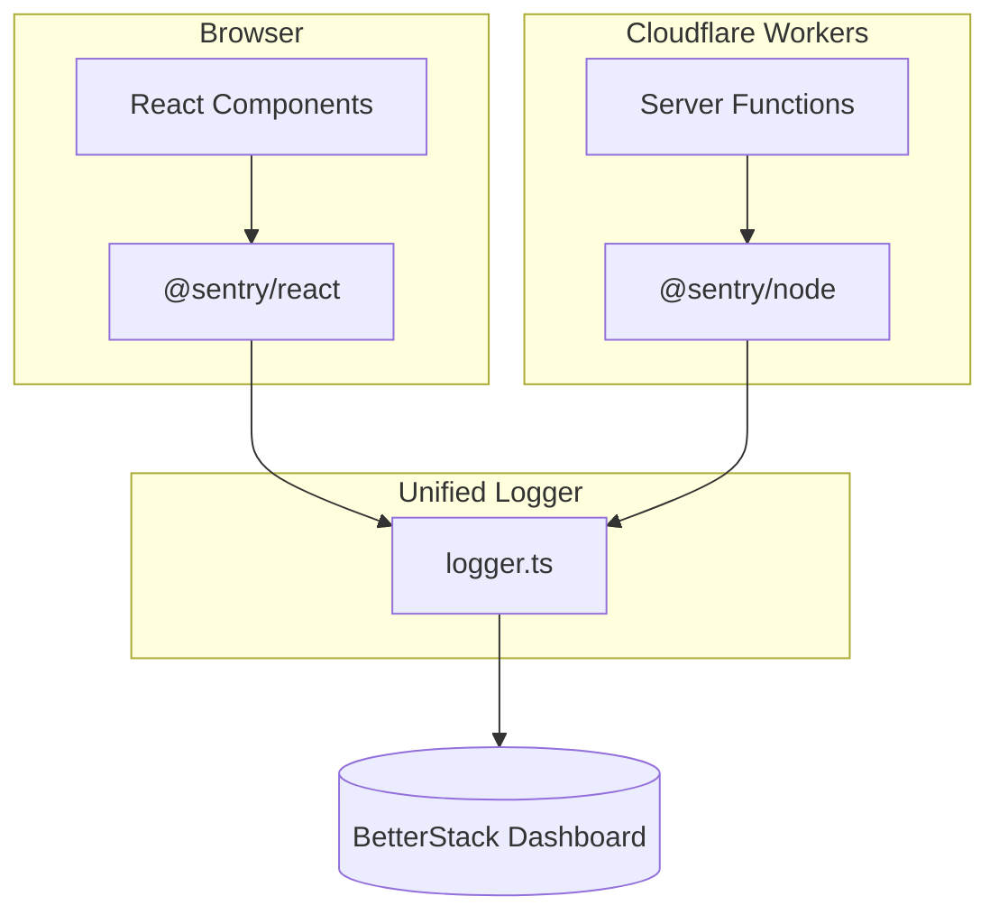

# Observability & Error Tracking

LivestockAI uses **BetterStack** via the **Sentry SDK** for comprehensive error tracking on both client and server.

---

## Overview

### What is BetterStack?

BetterStack is a modern error tracking and monitoring service optimized for Cloudflare Workers. We use the Sentry SDK to capture errors and send them to BetterStack's ingestion endpoint.

### Architecture



**Key Files:**

- `app/lib/sentry.ts` - Client-side tracking
- `app/lib/sentry-server.ts` - Server-side tracking
- `app/lib/logger.ts` - Unified logger (auto-detects context)

---

## Configuration

### Environment Variables

```bash
# Required in .env and .dev.vars
BETTERSTACK_SOURCE_TOKEN=your_token_here
```

### DSN Configuration

The DSN is hardcoded in the Sentry files:

```
https://<token>@s1707120.eu-fsn-3.betterstackdata.com/1707120
```

### Environment Behavior

| Environment | Client       | Server       | Why               |
| ----------- | ------------ | ------------ | ----------------- |
| Development | Console only | Console only | Avoid noise       |
| Production  | Full Sentry  | Full Sentry  | Track real errors |

---

## Usage

### Primary Method: Unified Logger

The logger automatically detects browser vs server context:

```typescript
import { logger } from '~/lib/logger'

// In React components or server functions
try {
  await someAction()
} catch (error) {
  logger.error('Action failed', error, {
    component: 'MyComponent',
    userId: session.userId,
  })
}
```

**Log Levels:**

- `logger.error()` - Errors needing immediate attention (tracked in production)
- `logger.warn()` - Warnings to monitor (tracked in production)
- `logger.info()` - Informational (console only)
- `logger.debug()` - Debugging (development only)

### Manual Client-Side Tracking

```typescript
import {
  captureError,
  captureMessage,
  setUser,
  addBreadcrumb,
} from '~/lib/sentry'

// Capture error with context
captureError(new Error('Payment failed'), { orderId: '123' })

// Capture message
captureMessage('User completed onboarding', 'info')

// Set user context (after login)
setUser('user-123', 'user@example.com', 'John Doe')

// Add breadcrumb for debugging
addBreadcrumb('User clicked checkout', { cartTotal: 100 })
```

### Manual Server-Side Tracking

```typescript
import {
  captureServerError,
  setServerUser,
  withServerErrorTracking,
} from '~/lib/sentry-server'

// Capture error
captureServerError(new Error('Database timeout'), { query: 'SELECT...' })

// Wrap function with automatic error tracking
const safeFn = withServerErrorTracking(
  async () => {
    /* your code */
  },
  { context: 'batch-creation' },
)
```

---

## Features

### Client-Side

| Feature               | Description                                            |
| --------------------- | ------------------------------------------------------ |
| **Automatic Capture** | Unhandled exceptions, promise rejections, React errors |
| **Performance**       | Page load times, API durations, render times           |
| **Session Replay**    | 10% normal sessions, 100% error sessions               |
| **User Context**      | User ID, email, farm ID attached to errors             |
| **Breadcrumbs**       | User actions, navigation, API calls                    |

### Server-Side

| Feature               | Description                                         |
| --------------------- | --------------------------------------------------- |
| **Automatic Capture** | Server function errors, API errors, database errors |
| **Performance**       | HTTP duration, query times, function execution      |
| **HTTP Integration**  | Request/response tracking, headers, status codes    |
| **Context**           | Cloudflare Workers runtime info, custom context     |

---

## Best Practices

### 1. Use Logger for Consistency

```typescript
// ✅ Good - unified logger
logger.error('Failed to create batch', error, { batchId })

// ❌ Avoid - direct Sentry calls
captureError(error)
```

### 2. Add Context to Errors

```typescript
// ✅ Good - includes context
logger.error('Database query failed', error, {
  query: 'SELECT * FROM batches',
  farmId: 'abc-123',
})

// ❌ Avoid - no context
logger.error('Error', error)
```

### 3. Set User Context Early

```typescript
// After successful login
setUser(session.userId, session.email, session.name)

// On logout
clearUser()
```

### 4. Add Breadcrumbs for Complex Flows

```typescript
addBreadcrumb('User started batch creation')
addBreadcrumb('Selected farm', { farmId })
addBreadcrumb('Entered batch details', { species: 'broiler' })
// When error occurs, breadcrumbs help trace the path
```

---

## Troubleshooting

### Errors Not Appearing in BetterStack

1. **Check environment** - Sentry only tracks in production (`NODE_ENV=production`)
2. **Check initialization** - Look for console messages:
   - Client: "✅ Sentry initialized for error tracking"
   - Server: "✅ Sentry Server initialized for error tracking"
3. **Check DSN** - Verify DSN in `sentry.ts` and `sentry-server.ts`

### SSR Errors ("action is not a function")

This was caused by calling Sentry client functions during SSR. **Fixed by:**

- Adding `isBrowser()` checks to all client Sentry functions
- Separating client and server Sentry implementations
- Logger automatically detects context

### Browser Bundling Error ("util.inherits is not a function")

This was caused by `@sentry/node` being bundled for the browser. **Fixed by:**

- Using dynamic imports for server Sentry in logger
- Adding `@sentry/node` to Vite `optimizeDeps.exclude`
- Adding `@sentry/node` to Rollup `external` packages

### Performance Impact

- **Client**: ~50KB gzipped (Sentry SDK + integrations)
- **Server**: ~100KB (Sentry Node SDK)
- **Runtime**: Minimal (<1ms per error)

---

## Testing

### Test Client-Side

1. Open browser console
2. Navigate to any page
3. Trigger an error
4. Check BetterStack dashboard

### Test Server-Side

```bash
bun run test-server-sentry.ts
```

### Test HTML File

Use `test-sentry.html` in the project root for isolated client-side testing.

---

## BetterStack Dashboard

**Access**: https://betterstack.com/

**What You'll See:**

- Error frequency and trends
- Stack traces with source maps
- User context (ID, email, farm)
- Breadcrumbs leading to errors
- Session replays (for client errors)
- Performance metrics

---

## BetterStack Source Setup

When creating a new source in BetterStack:

1. Go to https://betterstack.com/logs
2. Click "Add Source"
3. Choose **JavaScript** (under "Programming languages")
4. Configure:
   - **Name**: LivestockAI Production
   - **Data Region**: EU or US (closest to users)
   - **Platform**: Cloudflare Workers
5. Copy the Source Token to your environment variables

### Multiple Environments (Optional)

Create separate sources for dev/staging/production with different tokens:

```bash
# Development
BETTERSTACK_SOURCE_TOKEN=dev_token

# Staging
wrangler secret put BETTERSTACK_SOURCE_TOKEN --env staging

# Production
wrangler secret put BETTERSTACK_SOURCE_TOKEN --env production
```

---

## Reference

### File Locations

| File                       | Purpose                            |
| -------------------------- | ---------------------------------- |
| `app/lib/sentry.ts`        | Client-side Sentry (browser)       |
| `app/lib/sentry-server.ts` | Server-side Sentry (Node/Workers)  |
| `app/lib/logger.ts`        | Unified logger with auto-detection |
| `app/routes/__root.tsx`    | Client Sentry initialization       |
| `app/server.ts`            | Server Sentry initialization       |
| `vite.config.ts`           | Build configuration for externals  |

### Initialization Points

- **Client**: `useEffect` in `__root.tsx`
- **Server**: Top-level in `server.ts` at startup
