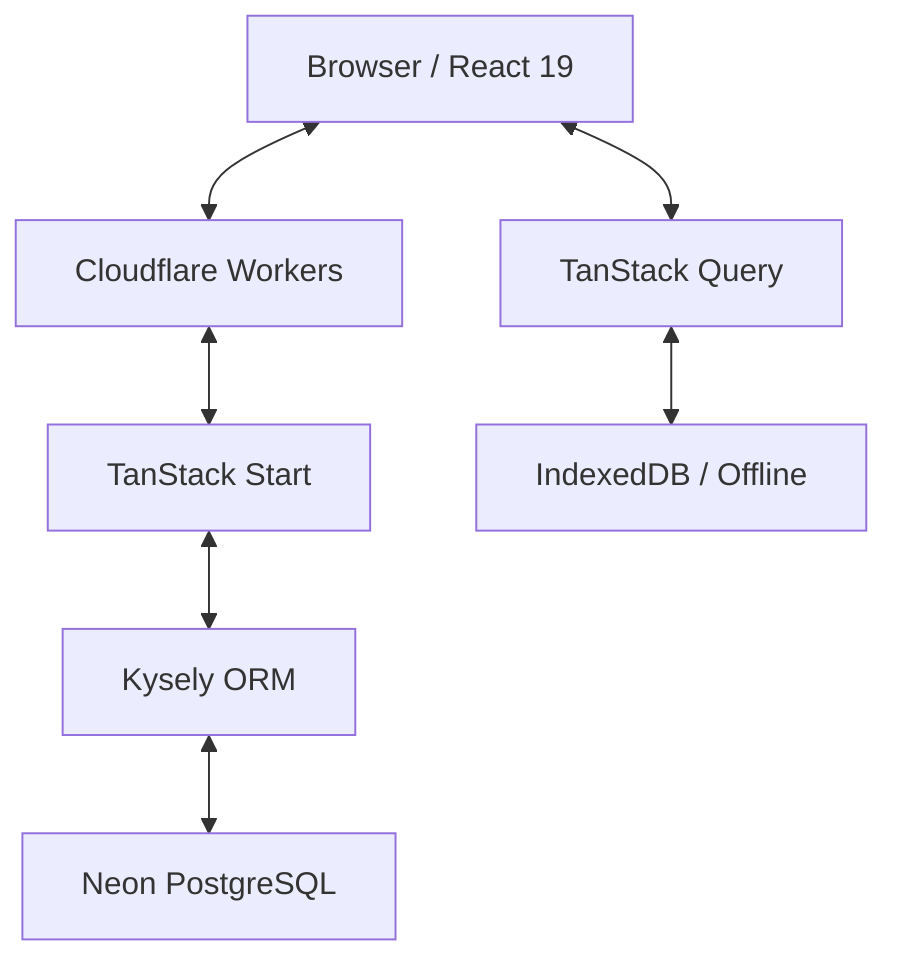
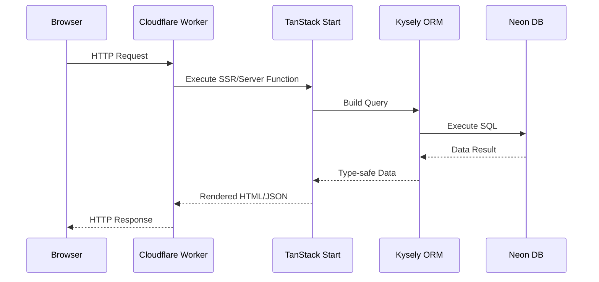
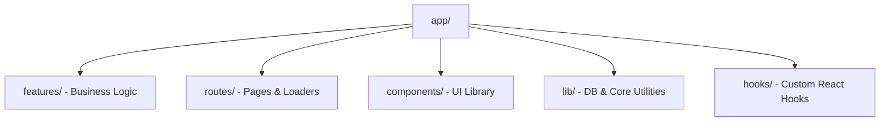
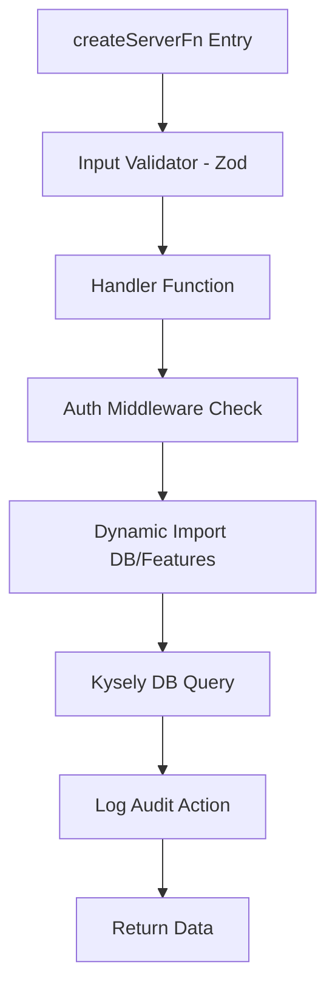
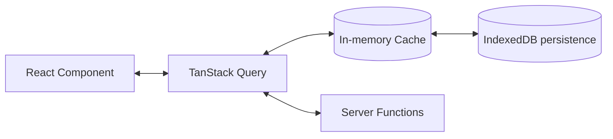

# OpenLivestock Manager - System Architecture

## Overview

OpenLivestock Manager is a full-stack livestock management platform built with TypeScript across the entire stack. It supports 6 livestock types (poultry, fish, cattle, goats, sheep, bees) with offline-first capabilities.



## Technology Stack

| Layer      | Technology                 | Purpose                          |
| ---------- | -------------------------- | -------------------------------- |
| Frontend   | React 19 + TanStack Router | UI and client-side routing       |
| State      | TanStack Query + IndexedDB | Caching, offline persistence     |
| Backend    | TanStack Start             | SSR, server functions            |
| Database   | Neon PostgreSQL + Kysely   | Serverless DB with type-safe ORM |
| Deployment | Cloudflare Workers         | Edge computing                   |
| Auth       | Better Auth                | Session-based authentication     |

## Request Flow



1. **Browser** sends HTTP request
2. **Cloudflare Worker** executes at edge (global)
3. **TanStack Start** handles SSR and routes to server functions
4. **Kysely** builds type-safe SQL queries
5. **Neon** executes queries (serverless PostgreSQL)

## Directory Structure



```
app/
├── features/              # Business logic (server functions)
│   ├── auth/              # Authentication
│   ├── batches/           # Batch management
│   ├── sales/             # Sales & revenue
│   ├── feed/              # Feed records
│   ├── mortality/         # Death tracking
│   ├── settings/          # User preferences
│   ├── modules/           # Feature module system
│   ├── notifications/     # In-app alerts
│   └── ...
├── routes/                # Pages (UI + loaders)
│   └── _auth/             # Protected routes
│       ├── batches/
│       ├── dashboard/
│       ├── sales/
│       └── ...
├── components/            # Reusable UI
│   ├── dialogs/           # Create/edit modals
│   ├── ui/                # Base components
│   └── ...
├── hooks/                 # Custom React hooks
└── lib/
    └── db/                # Database connection, types, migrations
        ├── index.ts       # Kysely connection
        ├── types.ts       # TypeScript interfaces
        ├── migrations/    # Schema migrations
        └── seeds/         # Demo data

tests/
└── features/              # Property-based tests by feature
```

## Data Model

```
USER
 │
 ├── SETTINGS (currency, units, preferences)
 │
 └── FARMS (1 or more)
      │
      ├── MODULES (poultry, fish, cattle, goats, sheep, bees)
      │
      ├── STRUCTURES (houses, ponds, barns, pastures, hives)
      │
      └── BATCHES (livestock groups)
           │
           ├── MORTALITY_RECORDS
           ├── FEED_RECORDS
           ├── WEIGHT_SAMPLES
           ├── SALES
           ├── EGG_RECORDS (layers only)
           ├── WATER_QUALITY (fish only)
           └── VACCINATIONS
```

### Key Tables

| Table               | Purpose                                 |
| ------------------- | --------------------------------------- |
| `users`             | User accounts (Better Auth)             |
| `user_settings`     | Preferences (currency, units, language) |
| `farms`             | Farm entities                           |
| `farm_modules`      | Enabled livestock types per farm        |
| `batches`           | Livestock batches                       |
| `mortality_records` | Death tracking with causes              |
| `feed_records`      | Feed consumption                        |
| `sales`             | Revenue records                         |
| `expenses`          | Cost tracking                           |
| `notifications`     | In-app alerts                           |
| `audit_logs`        | Activity history                        |

## Server Function Pattern



**Critical**: All database operations use dynamic imports for Cloudflare Workers compatibility.

```typescript
// app/features/batches/server.ts
export const createBatchFn = createServerFn({ method: 'POST' })
  .inputValidator((data) => data)
  .handler(async ({ data }) => {
    // 1. Auth check
    const { requireAuth } = await import('../auth/server-middleware')
    const session = await requireAuth()

    // 2. Dynamic import (REQUIRED for Cloudflare)
    const { db } = await import('~/lib/db')

    // 3. Database operation
    const result = await db
      .insertInto('batches')
      .values({ ...data.batch, farmId: data.farmId })
      .returning('id')
      .executeTakeFirstOrThrow()

    // 4. Audit log
    const { logAudit } = await import('../logging/audit')
    await logAudit({ userId: session.user.id, action: 'create', ... })

    return result.id
  })
```

## State Management



```

### When to Use What

| State Type     | Use For                                          |
| -------------- | ------------------------------------------------ |
| `useState`     | Form inputs, dialog open/close, UI toggles       |
| Context        | Global app state (selected farm, settings, auth) |
| TanStack Query | Server data (batches, sales, etc.)               |

## Feature Module System

Users enable livestock types per farm:

```

Farm: "Sunrise Poultry" Farm: "Blue Waters Fish"
┌─────────────────────┐ ┌─────────────────────┐
│ ✅ Poultry │ │ ❌ Poultry │
│ ❌ Aquaculture │ │ ✅ Aquaculture │
│ ❌ Cattle │ │ ❌ Cattle │
└─────────────────────┘ └─────────────────────┘
│ │
▼ ▼
Navigation shows: Navigation shows:
• Batches (poultry) • Batches (fish)
• Eggs • Water Quality
• Vaccinations • Weight Samples

```

## Automatic Behaviors

| User Action                    | System Response                                   |
| ------------------------------ | ------------------------------------------------- |
| Record mortality               | Batch `currentQuantity` decreases (transactional) |
| Record sale                    | Batch `currentQuantity` decreases (transactional) |
| Record feed (with inventoryId) | Feed inventory auto-deducts                       |
| High mortality detected        | Notification created (if enabled)                 |
| Low inventory                  | Notification created (if enabled)                 |
| Any CRUD operation             | Audit log entry with userName                     |

## Settings System

User settings affect the entire application:

| Setting           | Impact                                      |
| ----------------- | ------------------------------------------- |
| `currency`        | All monetary displays (USD, EUR, NGN, etc.) |
| `weightUnit`      | All weight values (kg ↔ lbs)                |
| `dateFormat`      | All date displays (MM/DD ↔ DD/MM)           |
| `temperatureUnit` | Water quality readings (°C ↔ °F)            |
| `dashboardCards`  | Which cards appear on dashboard             |
| `notifications`   | Which alerts are created                    |

## Authentication Flow

```

┌─────────────┐ ┌─────────────┐ ┌─────────────────────────────────┐
│ Login Page │───▶│ Better Auth │───▶│ Session Created (cookie) │
│ email/pass │ │ Verify │ │ Stored in sessions table │
└─────────────┘ └─────────────┘ └─────────────────────────────────┘
│
▼
┌─────────────────────────────────┐
│ Onboarding Check │
│ if (!completed) → 6-step wizard │
└─────────────────────────────────┘

````

### Better Auth Tables

- `users` - Profile data (name, email, role) - NO password
- `account` - Credentials (password hash, providerId)
- `sessions` - Active sessions

## Offline Support

1. **TanStack Query** caches server data
2. **IndexedDB** persists cache across sessions
3. **Service Worker** enables PWA installation
4. **Sync** happens automatically when online

## Error Handling

```typescript
// Server functions throw structured errors
.handler(async ({ data }) => {
  const batch = await getBatchById(userId, batchId)
  if (!batch) {
    throw new Error('Batch not found')  // 404-like
  }

  const hasAccess = await checkFarmAccess(userId, batch.farmId)
  if (!hasAccess) {
    throw new Error('Access denied')  // 403-like
  }

  // ... operation
})
````

## Testing Strategy

- **Property-based tests** (fast-check) for business logic
- **Unit tests** (vitest) for utilities
- **302 tests** across 37 files
- **60,000+ assertions**

```bash
bun run test                    # Run all tests
bun run check               # TypeScript + ESLint
```

## Deployment

```bash
bun run build              # Build for production
bun run deploy             # Deploy to Cloudflare Workers
```

Environment variables set via `wrangler secret put KEY`.

## Key Files Reference

| File                           | Purpose                        |
| ------------------------------ | ------------------------------ |
| `app/lib/db/types.ts`          | Database TypeScript interfaces |
| `app/lib/db/migrations/`       | Schema migrations              |
| `app/features/*/server.ts`     | Server functions               |
| `app/routes/_auth/*/index.tsx` | Protected pages                |
| `app/components/dialogs/`      | Create/edit modals             |
| `wrangler.jsonc`               | Cloudflare config              |
